:lang: fr
:toc:

= Le tutoriel de HAL

[[cha:Tutoriel-HAL]] (((Tutoriel de HAL)))

[[sec:Intro-tutoriel]]
== Introduction
(((Introduction)))

Halrun peut être utilisé pour créer un système complet et fonctionnel.
Il s'agit d'un outil de configuration et de mise au point très puissant, en
ligne de commande ou en fichier texte. Les exemples suivants illustrent son
installation et son fonctionnement.

[[sec:Tutoriel-Halcmd]]
== Halcmd
(((Tutoriel Halcmd)))

Halcmd est un outil en ligne de commande pour manipuler HAL. Il existe
une man page plus complète pour halcmd, elle sera installée en même
temps qu' LinuxCNC depuis ses sources ou depuis un paquet. Si LinuxCNC a été
compilé en _run-in-place_, la man page n'est pas installée, mais elle
est accessible, dans le répertoire principal de LinuxCNC, taper:
----
$ man -M docs/man halcmd 
----

=== Tab-complétion

Votre version de halcmd peut inclure la complétion avec la touche tab.
Au lieu de compléter les noms de fichiers comme le fait un shell, il
complète les commandes avec les identifiants HAL. Essayez de presser la
touche tab après le début d'une commande HAL:
----
halcmd: loa<TAB> 

halcmd: load 

halcmd: loadrt 

halcmd: loadrt deb<TAB> 

halcmd: loadrt debounce
---- 

=== L'environnement RTAPI

RTAPI est le sigle de Real Time Application Programming Interface. De
nombreux composants HAL travaillent en temps réel et tous les
composants de HAL stockent leurs données dans la mémoire partagée, de
sorte que les composants temps réel puissent y accéder. Normalement,
Linux ne prend pas en charge les programmes temps réel ni le type de
mémoire partagée dont HAL a besoin. Heureusement, il existe des
systèmes d'exploitation temps réel RTOS qui fournissent les extensions
nécessaires à Linux. Malheureusement, chaque RTOS fait les choses
différemment des autres.

Pour remédier à ces différences, l'équipe de LinuxCNC a proposé RTAPI, qui
fournit une manière cohérente aux programmes de parler au RTOS. Si vous
êtes un programmeur qui veut travailler à l'intérieur de LinuxCNC, vous
pouvez étudier _linuxcnc/src/rtapi/rtapi.h_ pour comprendre l'API. Mais si
vous êtes une personne normale, tout
ce que vous avez besoin de savoir à propos de RTAPI est qu'il doit être
(avec le RTOS) chargé dans la mémoire de votre ordinateur avant de
pouvoir faire n'importe quoi avec HAL.

[[sec:Tutoriel-Exemple-Simple]]
== Tutoriel simple
(((Tutoriel simple)))

=== Charger un composant temps réel

Pour ce tutoriel, nous allons supposer que vous avez installé avec
succès le CD-Live ou que vous avez compilé correctement l'arborescence
linuxcnc/src. Si nécessaire, invoquez le script _rip-environment_ pour
préparer votre shell. Dans ce cas, tout ce que vous avez à faire
est de charger le RTOS requis et les modules RTAPI dans la mémoire.
Tapez juste les commandes suivantes dans une console:
----
$cd linuxcnc
 
$linuxcnc halrun 

$halcmd: 
----

Avec l'OS temps réel et RTAPI chargés, vous pouvez passer au premier
exemple. Notez que le prompt a changé, il est passé de _+$+_ à _halcmd:_.
La raison en est que les commandes ultérieures seront interprétées
comme des commandes HAL et non plus comme des commandes shell.

Pour le premier exemple, nous allons utiliser un composant HAL appelé
_siggen_, qui est un simple générateur de signaux. Une description
complète de ce composant est disponible à la <<sec:Siggen, section siggen>> 
de ce document. 
Il s'agit d'un composant temps réel, mis en œuvre comme un module du 
noyau Linux. Pour charger siggen utiliser la commande de HAL, _loadrt_:
----
halcmd: loadrt siggen
----

=== Examiner HAL

Maintenant que le module est chargé, il faut introduire _halcmd_,
l'outil en ligne de commande utilisé pour configurer HAL. Pour une description 
plus complète essayez: _man halcmd_, ou consultez la
section <<sec:Tutoriel-Halcmd, halcmd au début de ce document>>. La 
première commande de halcmd et _show_, qui affichera les informations 
concernant l'état actuel de HAL. Pour afficher tout ce qui est 
installé tapez:
----
halcmd: show comp

    Loaded HAL Components:  
    ID     Type  Name          PID   State  
    3      RT    siggen              ready  
    2      User  halcmd2177    2177  ready  
----

Puisque halcmd lui même est un composant HAL, il sera toujours
présent dans la liste. 
Le nombre après halcmd dans la liste des composants est le
Process ID. Il est toujours possible de lancer plus d'une instance de
halcmd en même temps (dans différentes fenêtres par exemple), le numéro
PID est ajouté à la fin du nom pour rendre celui-ci unique. La liste
 montre aussi le composant _siggen_  que nous avions installé à l'étape
précédente. Le _RT_ sous _Type_ indique que siggen est un composant temps réel.

Ensuite, voyons quelles pins siggen rend disponibles:
----
halcmd: show pin 

    Component Pins: 
    Owner   Type  Dir         Value  Name 
        3  float   IN             1  siggen.0.amplitude 
        3  float  OUT             0  siggen.0.cosine 
        3  float   IN             1  siggen.0.frequency 
        3  float   IN             0  siggen.0.offset 
        3  float  OUT             0  siggen.0.sawtooth 
        3  float  OUT             0  siggen.0.sine 
        3  float  OUT             0  siggen.0.square 
        3  float  OUT             0  siggen.0.triangle 
----

Cette commande affiche toutes les pins présentes dans HAL. Un
système complexe peut avoir plusieurs dizaines ou centaines de pins.
Mais pour le moment il y a seulement huit pins. Toutes ces huit pins
sont des flottants, elles transportent toutes des données en provenance
du composant siggen. Puisque nous n'avons pas encore exécuté le code
contenu dans le composant, certaines pins ont une valeur de zéro.

L'étape suivante consiste à examiner les paramètres:
----
halcmd: show param

    Parameters: 
    Owner   Type  Dir        Value   Name 
        3    s32   RO            0   siggen.0.update.time 
        3    s32   RW            0   siggen.0.update.tmax 
----

La commande _show param_ affiche tous les paramètres de HAL. Pour le
moment chaque paramètre à la valeur par défaut attribuée quand le
composant a été chargé. Notez dans la colonne _Dir_, les paramètres
marqués _-W_ sont en écriture possible, pour ceux qui ne sont jamais
modifiés par
le composant lui-même, mais qui sont modifiables par l'utilisateur pour
contrôler le composant. Nous verrons comment plus tard. Les paramètres
 marqués _R-_ sont en lecture seule. Il ne peuvent être modifiés que
par le composant. Finalement, les paramètres marqués _RW_ sont en
lecture/écriture. Ils peuvent être modifiés par le composant
 et aussi par l'utilisateur. Nota: les paramètres
_siggen.0.update.time_ et _siggen.0.update.tmax_ existent dans un but
de débogage, ils ne sont pas couverts par cette documentation. 
Les paramètres thread.time et thread.tmax sont associés avec le thread
créé quand le composant a été chargé. Quand la réécriture de HAL sera
terminée, le thread ne sera plus créé à ce stade, de sorte que ces
paramètres ne seront plus visibles.

Il n'y a pas de thread créé ici, mais il y a quand même les paramètres
_siggen.0.update.time_ et _siggen.0.update.tmax_.

Les paramètres de thread sont ceux du composant 02, le module siggen.
C'est incorrect, ils devraient être ceux du module hal_lib, parce que
le thread lui même n'est plus la propriété de siggen, et si
siggen est retiré, les paramètres devraient rester.

Et bien finalement, _fixer_ les paramètres de thread aura pris plus de
temps que je ne pensais. Donc, je les ai éliminés pour l'instant. Quand
la réécriture de HAL sera terminée, je les remettrai.

La plupart des composants temps réel exportent une ou plusieurs
fonctions pour que le code qu'elles contiennent soit exécuté en temps
réel. Voyons ce que la fonction siggen exporte:
----
halcmd: show funct

    Exported Functions: 
    Owner  CodeAddr  Arg       FP   Users  Name 
    00003  f801b000  fae820b8  YES      0   siggen.0.update 
----

Le composant siggen exporte une seule fonction. Il nécessite un
flottant (Floating Point). Il n'est lié à aucun thread, puisque _users_ 
est à zéro. footnote:[Les champs CodeAddr et Arg ont été utilisés
pendant le développement et devraient probablement disparaître.]

=== Exécuter le code temps réel

Pour faire tourner le code actuellement contenu dans la fonction
_siggen.0.update_, nous avons besoin d'un thread temps réel. C'est le
composant appelé _threads_ qui est utilisé pour créer le nouveau
thread. Créons un thread appelé _test-thread_ avec une période de 1 ms
(1000 µs ou 1000000 ns):
----
halcmd: loadrt threads name1=test-thread period1=1000000 
----

Voyons si il fonctionne:
----
halcmd: show thread

    Realtime Threads: 
         Period  FP     Name               (     Time, Max-Time ) 
         999855  YES           test-thread (        0,        0 ) 
----

Il fonctionne. La période n'est pas exactement de 1000000 ns à cause
des limitations dues au matériel, mais nous avons bien un thread qui
tourne à une période approximativement correcte et qui peut manipuler
des fonctions en virgule flottante. La prochaine étape sera de
connecter la fonction au thread:
----
halcmd: addf siggen.0.update test-thread 
----

Pour le moment nous avions utilisé halcmd seulement pour regarder
HAL. Mais cette fois-ci, nous avons
 utilisé la commande _addf_ (add function) pour changer quelque chose
dans HAL. Nous avons dit
 à halcmd d'ajouter la fonction _siggen.0.update_ au thread
_test-thread_ et la commande suivante indique qu'il a réussi:
----
halcmd: show thread 

    Realtime Threads: 
         Period  FP     Name          (     Time, Max-Time ) 
         999855  YES    test-thread   (        0,        0 ) 
                    1 siggen.0.update 
----

Il y a une étape de plus avant que le composant siggen ne commence
à générer des signaux. Quand HAL est démarré pour la
première fois, les threads ne sont pas en marche. C'est pour vous
permettre de compléter la configuration du système avant que le code
temps réel ne démarre. Une fois que vous êtes satisfait de la
configuration, vous pouvez lancer le code temps réel comme ceci:
----
halcmd: start
----

Maintenant le générateur de signal est en marche. Regardons ses pins
de sortie:
----
halcmd: show pin

    Component Pins: 
    Owner   Type  Dir         Value  Name 
         3  float IN              1  siggen.0.amplitude 
         3  float OUT    -0.1640929  siggen.0.cosine 
         3  float IN              1  siggen.0.frequency 
         3  float IN              0  siggen.0.offset 
         3  float OUT    -0.4475303  siggen.0.sawtooth 
         3  float OUT     0.9864449  siggen.0.sine 
         3  float OUT            -1  siggen.0.square 
         3  float OUT    -0.1049393  siggen.0.triangle 
----

Regardons encore une fois: 
----
halcmd: show pin 

    Component Pins: 
    Owner   Type  Dir         Value  Name 
         3  float IN              1  siggen.0.amplitude 
         3  float OUT     0.0507619  siggen.0.cosine 
         3  float IN              1  siggen.0.frequency 
         3  float IN              0  siggen.0.offset 
         3  float OUT     -0.516165  siggen.0.sawtooth 
         3  float OUT     0.9987108  siggen.0.sine 
         3  float OUT            -1  siggen.0.square  
         3  float OUT    0.03232994  siggen.0.triangle 
----

Nous avons fait, très rapidement, deux commandes _show pin_ et vous
pouvez voir que les sorties ne sont plus à zéro. Les sorties
sinus, cosinus, dents de scie et triangle changent constamment. La
sortie carrée fonctionne également, mais elle passe simplement de +1.0
à -1.0 à chaque cycle.

=== Modifier des paramètres

La réelle puissance de HAL est de permettre de modifier les choses.
Par exemple, on peut utiliser la commande _setp_ pour ajuster la
valeur d'un paramètre. Modifions l'amplitude du
signal de sortie du générateur de 1.0 à 5.0:
----
halcmd: setp siggen.0.amplitude 5 
----

Voyons encore une fois les paramètres et les pins:
----
halcmd: show param 

    Parameters: 
    Owner   Type  Dir         Value  Name 
         3  s32   RO           1754  siggen.0.update.time 
         3  s32   RW          16997  siggen.0.update.tmax 

halcmd: show pin 

    Component Pins: 
    Owner   Type  Dir         Value  Name 
         3  float IN              5  siggen.0.amplitude 
         3  float OUT     0.8515425  siggen.0.cosine 
         3  float IN              1  siggen.0.frequency 
         3  float IN              0  siggen.0.offset 
         3  float OUT      2.772382  siggen.0.sawtooth 
         3  float OUT     -4.926954  siggen.0.sine 
         3  float OUT             5  siggen.0.square 
         3  float OUT      0.544764  siggen.0.triangle 

----

Notez que la valeur du paramètre _siggen.0.amplitude_ est bien passée
à 5.000 et que les pins ont maintenant des valeurs
plus grandes.

=== Enregistrer la configuration de HAL 

La plupart de ce que nous avons fait jusqu'ici avec halcmd a été de
simplement regarder les choses avec la commande show . Toutefois,
deux commandes ont réellement modifié des valeurs. Au fur
et à mesure que nous concevons des systèmes plus complexes avec HAL,
nous allons utiliser de nombreuses commandes pour le configurer comme
nous le souhaitons. HAL a une mémoire d'éléphant et peut retenir sa
configuration jusqu'à ce qu'il s'arrête. Mais qu'en est-il de la
prochaine fois ? Nous ne voulons pas entrer une série de commande à
chaque fois que l'on veut utiliser le système. Nous pouvons enregistrer
la configuration de l'ensemble de HAL en une seule commande:
----
halcmd: save 

    # components 
    loadrt threads name1=test-thread period1=1000000 
    loadrt siggen 
    # pin aliases 
    # signals 
    # nets 
    # parameter values 
    setp siggen.0.update.tmax 14687 
    # realtime thread/function links 
    addf siggen.0.update test-thread 
----

La sortie de la commande _save_ est une séquence de commandes HAL. Si
vous commencez par un HAL _vide_ et que vous tapez toute la séquence de 
commandes HAL, vous aurez la configuration qui existait lors de l'exécution de 
la commande save. Pour sauver ces commandes pour une utilisation ultérieure,
nous allons simplement rediriger la sortie vers un fichier:
----
halcmd: save all saved.hal 
----

=== Quitter halrun

Pour quitter halrun, ne pas fermez simplement la fenêtre de terminal sans avoir 
arrêté la session de HAL, pour l'arrêter correctement tapez:
----
halcmd: exit 

~/linuxcnc$
----

=== Restaurer la configuration de HAL 

Pour restaurer la configuration de HAL enregistrée dans _saved.hal_, nous
avons besoin d'exécuter toutes les commandes enregistrées. Pour ce
faire, nous utiliserons la commande _-f <filename>_ qui lit les
commandes à partir d'un fichier, le _-I_ affichera le prompt halcmd
après l'exécution des commandes:
----
~/linuxcnc$ halrun -I -f saved.hal 
----

Noter qu'il n'y a pas de commande _start_ dans le fichier saved.hal.
Il est nécessaire de la retaper (ou d'éditer saved.hal pour l'ajouter):
----
halcmd: start 

halcmd: exit 

~/linuxcnc$ 
----

=== Suppression de la mémoire de HAL

Si un arrêt inattendu d'une session de HAL survient, il sera peut être 
nécessaire de décharger HAL de la mémoire avant de pouvoir lancer une autre 
session. Pour cela, taper la commande suivante dans une fenêtre de terminal:
----
~/linuxcnc$ halrun -U
---- 

[[sec:Tutoriel-halmeter]]
== Visualiser HAL avec halmeter
(((Tutoriel halmeter)))

Il est possible de construire des systèmes HAL vraiment complexes sans
utiliser d'interface graphique. Mais il y a quelque chose de rassurant
à visualiser le résultat du travail. Le premier et le plus simple des
outils graphiques pour HAL, est _halmeter_. C'est un programme très
simple qui s'utilise comme un multimètre. Il permet d'observer les pins,
signaux ou paramètres en affichant la valeur courante de ces items. Il
est très simple à utiliser. Dans une console taper _halmeter_. 
halmeter est une application pour environnement graphique. Deux
fenêtres vont apparaître, la fenêtre de sélection est la plus grande.
Elle comprend trois onglets. Un onglet liste toutes les pins
actuellement définies dans HAL. Le suivant, liste tous les signaux et
le dernier onglet, liste tous les paramètres. Cliquer sur un onglet,
puis cliquer sur un des items pour le sélectionner. La petite fenêtre affichera 
le nom et la valeur de l'item sélectionné.
L'affichage est mis à jour environ 10 fois par seconde. Pour libérer de
la place sur l'écran, la fenêtre de sélection peut être fermée avec le
bouton _Fermer_. Sur la petite fenêtre, cachée sous la grande à
l'ouverture, le bouton _Sélectionner_, ré-ouvre la fenêtre de sélection et le
bouton _Quitter_ arrête le programme et ferme les fenêtres.

Il est possible d'ouvrir et de faire fonctionner simultanément
plusieurs halmeter, ce qui permet de visualiser plusieurs items en
même temps. Pour ouvrir un halmeter en libérant la console, taper
_halmeter &_ pour le lancer en tâche de fond. Il est possible de
lancer halmeter en lui faisant afficher immédiatement un item, pour cela, 
ajouter les arguments sur la ligne de commande _pin|sig|par[am] nom_. Il 
affichera le signal, la pin, ou le paramètre _nom_ dès qu'il
démarrera. Si l'item indiqué n'existe pas, il démarrera normalement.
Finalement, si un item est spécifié pour l'affichage, il est possible
d'ajouter _-s_ devant pin|sig|param pour indiquer à halmeter d'utiliser
une fenêtre encore plus réduite. Le nom de l'item sera affiché dans la
barre de titre au lieu de sous la valeur et il n'y aura pas de bouton.
Utile pour afficher beaucoup de halmeter dans un petit espace de
l'écran.

Nous allons utiliser de nouveaux éléments du composant siggen pour
vérifier halmeter. Si vous avez fini l'exemple précédent, alors siggen
est déjà chargé. Sinon, on peut charger tout comme nous l'avons fait
précédemment:
----
~/linuxcnc$ halrun 

halcmd: loadrt siggen 

halcmd: loadrt threads name1=test-thread period1=1000000 

halcmd: addf siggen.0.update test-thread 

halcmd: start 

halcmd: setp siggen.0.amplitude 5 
----

=== Lancement de halmeter

À ce stade, nous avons chargé le composant siggen, il est en cours
d'exécution. Nous pouvons lancer halmeter. Puisque halmeter est une
application graphique, X doit être actif.
----
halcmd: loadusr halmeter 
----

Dans le même temps, une fenêtre s'ouvre sur votre écran, demandant de
sélectionner l'item à observer.

[[cap:halmeter-Fenetre-selection]]
.Fenêtre de sélection de halmeter
(((Fenêtre de sélection)))

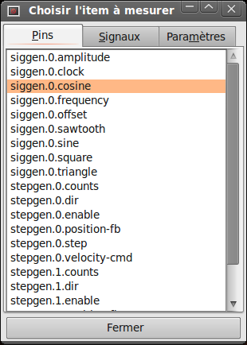

Ce dialogue contient trois onglets. Le premier onglet affiche toutes
les HAL pins du système. La seconde affiche tous les signaux et le
troisième affiche tous les paramètres. Si nous voulons analyser la pin
_siggen.0.cosine_ en premier, il suffit de cliquer sur elle puis sur
le bouton _Fermer_. Le dialogue de sélection se ferme et la mesure s'affiche
dans une fenêtre semblable à la figure ci-dessous.

[[sec:halmeter-valeur]]
.Affichage de la valeur
(((Affichage de la valeur)))

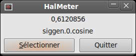

Pour modifier ce qui est affiché sur halmeter pressez le bouton
_Sélectionner_ qui vous ramènera à la fenêtre de sélection précédente.

Vous devriez voir la valeur évoluer puisque siggen génère une onde
cosinusoïdale. halmeter rafraîchi son affichage environ 5 fois par
seconde.

Pour éteindre halmeter, cliquer sur le bouton _Quitter_.

Pour visualiser plusieurs pins, signaux ou paramètres en même temps,
il est possible d'ouvrir plusieurs halmeter. La fenêtre de halmeter
est intentionnellement petite justement pour permettre d'en ouvrir un
grand nombre sur le même écran.[[sec:Tutoriel-Plus-Complexe]]

== Tutoriel plus complexe avec stepgen

Jusqu'à maintenant, nous avons chargé un composant HAL. Mais l'idée
générale de HAL est de vous permettre de charger et de relier un grand
nombre de composants pour en faire un système complexe. L'exemple suivant
va utiliser deux composants.

Avant de mettre en place ce nouvel exemple, nous allons commencer par
un petit nettoyage. Si vous avez fini l'un des exemples précédents, il
faut supprimer tous les composants et ensuite recharger la RTAPI et les
librairies de HAL en faisant:
----
halcmd: exit 

~/linuxcnc$ halrun 
----

=== Installation des composants

Maintenant, nous allons charger le composant générateur d'impulsions.
Pour l'instant, nous pouvons nous passer des détails et exécuter les
commandes suivantes:footnote:[Le signe _\_ à la fin d'une longue ligne
indique que la ligne est tronquée (c'est nécessaire pour formater ce document). 
Quand vous entrez la commande en ligne dans la console, sautez simplement le _\_ 
(ne pressez pas Entrée) et continuez à taper la ligne suivante.]

Dans cet exemple nous utiliserons le type de contrôle _velocity_ du
composant stepgen.
----
halrun: loadrt stepgen step_type=0,0 ctrl_type=v,v 

halcmd: loadrt siggen 

halcmd: loadrt threads name1=fast fp1=0 period1=50000 name2=slow period2=1000000
----

La première commande charge deux générateurs d'impulsions, configurés
pour générer des impulsions de type 0. La seconde commande charge notre
vieil ami siggen et la troisième crée deux threads, un rapide (fast)
avec une période de 50 µs et un lent avec une période de 1ms. Le thread
rapide ne prend pas en charge les fonctions à virgule flottante
(fp1=0).

Comme précédemment, on peut utiliser _halcmd show_ pour jeter un coup
d'oeil à HAL. Cette fois, nous aurons beaucoup
plus de pins et de paramètres que précédemment:
----
halcmd: show pin 

    Component Pins: 
    Owner   Type  Dir         Value  Name 
         4  float IN              1  siggen.0.amplitude 
         4  float OUT             0  siggen.0.cosine 
         4  float IN              1  siggen.0.frequency 
         4  float IN              0  siggen.0.offset 
         4  float OUT             0  siggen.0.sawtooth 
         4  float OUT             0  siggen.0.sine 
         4  float OUT             0  siggen.0.square 
         4  float OUT             0  siggen.0.triangle 
         3  s32   OUT             0  stepgen.0.counts 
         3  bit   OUT         FALSE  stepgen.0.dir 
         3  bit   IN          FALSE  stepgen.0.enable 
         3  float OUT             0  stepgen.0.position-fb 
         3  bit   OUT         FALSE  stepgen.0.step 
         3  float IN              0  stepgen.0.velocity-cmd 
         3  s32   OUT             0  stepgen.1.counts 
         3  bit   OUT         FALSE  stepgen.1.dir 
         3  bit   IN          FALSE  stepgen.1.enable 
         3  float OUT             0  stepgen.1.position-fb 
         3  bit   OUT         FALSE  stepgen.1.step 
         3  float IN              0  stepgen.1.velocity-cmd 

halcmd: show param 

    Parameters: 
    Owner   Type  Dir         Value  Name 
         4  s32   RO              0  siggen.0.update.time 
         4  s32   RW              0  siggen.0.update.tmax 
         3  u32   RW     0x00000001  stepgen.0.dirhold 
         3  u32   RW     0x00000001  stepgen.0.dirsetup 
         3  float RO              0  stepgen.0.frequency 
         3  float RW              0  stepgen.0.maxaccel 
         3  float RW              0  stepgen.0.maxvel 
         3  float RW              1  stepgen.0.position-scale 
         3  s32   RO              0  stepgen.0.rawcounts 
         3  u32   RW     0x00000001  stepgen.0.steplen 
         3  u32   RW     0x00000001  stepgen.0.stepspace 
         3  u32   RW     0x00000001  stepgen.1.dirhold 
         3  u32   RW     0x00000001  stepgen.1.dirsetup 
         3  float RO              0  stepgen.1.frequency 
         3  float RW              0  stepgen.1.maxaccel 
         3  float RW              0  stepgen.1.maxvel 
         3  float RW              1  stepgen.1.position-scale 
         3  s32   RO              0  stepgen.1.rawcounts 
         3  u32   RW     0x00000001  stepgen.1.steplen 
         3  u32   RW     0x00000001  stepgen.1.stepspace 
         3  s32   RO              0  stepgen.capture-position.time 
         3  s32   RW              0  stepgen.capture-position.tmax 
         3  s32   RO              0  stepgen.make-pulses.time 
         3  s32   RW              0  stepgen.make-pulses.tmax 
         3  s32   RO              0  stepgen.update-freq.time 
         3  s32   RW              0  stepgen.update-freq.tmax 
----

=== Connexion des pins avec les signaux

Nous avons donc deux générateurs d'impulsions de pas et un générateur
de signaux. Maintenant, nous allons créer des signaux HAL pour
connecter ces trois composants. Nous allons faire comme si nous
pilotions les axes X et Y d'une machine avec nos générateurs
d'impulsions de pas. Nous voulons déplacer la table en ronds. Pour ce
faire, nous allons envoyer un signal cosinusoïdal à l'axe des X et un
signal sinusoïdal à l'axe des Y. Le module siggen créera le sinus et le
cosinus, mais nous aurons besoin de _fils_ pour connecter les modules
ensemble. Dans HAL, les _fils_ sont appelés signaux. Nous devons en
créer deux. Nous pouvons les appeler comme on veut, dans cet exemple il
y aura _X-vel_ et _Y-vel_. Le signal _X-vel_ partira de la sortie
cosinus du générateur de signaux et arrivera sur
l'entrée _velocity_ du premier générateur d'impulsions de pas. La
première étape consiste à connecter le signal à la sortie du générateur
de signaux. Pour connecter un signal à une pin, nous utilisons la
commande _net_:
----
halcmd: net X-vel <= siggen.0.cosine
---- 

Pour voir l'effet de la commande _net_, regardons les signaux:
----
halcmd: show sig 

    Signals: 
    Type          Value  Name     (linked to) 
    float             0  X-vel <== siggen.0.cosine 
----

Quand un signal est connecté à une ou plusieurs pins, la commande
_show_ liste les pins immédiatement suivies par le nom du signal.
Les flèches donnent la direction du flux de données, dans ce cas, le flux
 va de la pin _siggen.0.cosine_ vers le signal _X-vel_. Maintenant,
connectons _X-vel_ à l'entrée _velocity_ du générateur d'impulsions de
pas:
----
halcmd: net X-vel => stepgen.0.velocity-cmd 
----

Nous pouvons aussi connecter l'axe Y au signal _Y-vel_. Il doit partir de 
la sortie sinus du générateur de signaux pour arriver sur l'entrée du second 
générateur d'impulsions de pas. La commande suivante fait, en une ligne, la 
même chose que les deux commandes _net_ précédentes ont fait pour _X-vel_:
----
halcmd: net Y-vel siggen.0.sine => stepgen.1.velocity-cmd
---- 

Pour voir l'effet de la commande net, regardons encore les signaux et
les pins:
----
halcmd: show sig 

    Signals: 
    Type          Value  Name     (linked to) 
    float             0  X-vel <== siggen.0.cosine 
                               ==> stepgen.0.velocity-cmd 
    float             0  Y-vel <== siggen.0.sine 
                               ==> stepgen.1.velocity-cmd 
----

La commande _show sig_ montre clairement comment les flux de
données circulent dans HAL. Par exemple, le signal _X-vel_ 
provient de la pin _siggen.0.cosine_ et va vers la pin 
_stepgen.0.velocity-cmd_. 

=== Exécuter les réglages du temps réel - threads et functions

Penser à ce qui circule dans les _fils_ rend les pins et les signaux
assez faciles à comprendre. Les threads et les fonctions sont un peu
plus délicates à appréhender. Les fonctions contiennent des instructions pour
l'ordinateur. Les threads sont les méthodes utilisées pour faire
exécuter ces instructions quand c'est nécessaire. Premièrement,
regardons les fonctions dont nous disposons:
----
halcmd: show funct 

    Exported Functions: 
    Owner   CodeAddr  Arg       FP   Users  Name 
     00004  f9992000  fc731278  YES      0   siggen.0.update 
     00003  f998b20f  fc7310b8  YES      0   stepgen.capture-position 
     00003  f998b000  fc7310b8  NO       0   stepgen.make-pulses 
     00003  f998b307  fc7310b8  YES      0   stepgen.update-freq 
----

En règle générale, vous devez vous référer à la documentation de
chaque composant pour voir ce que font ses fonctions. Dans notre
exemple, la fonction _siggen.0.update_ est utilisée pour mettre à jour
les sorties du générateur de signaux. 
Chaque fois qu'elle est exécutée, le générateur recalcule les valeurs
de ses sorties sinus, cosinus, dent de scie, triangle, carrée. Pour générer 
un signal régulier, il doit fonctionner à des intervalles très précis.

Les trois autres fonctions sont relatives au générateur d'impulsions de pas: 

La première, _stepgen.capture-position_, est utilisée pour un retour 
de position. Elle capture la valeur d'un 
compteur interne comptant les impulsions qui sont générées. S'il n'y 
a pas de perte de pas, ce compteur indique la position du moteur. 

La fonction principale du générateur d'impulsions est
_stepgen.make-pulses_. Chaque fois que _make-pulses_ démarre, elle
décide qu'il est temps de faire un pas, si oui elle fixe
les sorties en conséquence. Pour des pas plus doux, elle doit fonctionner
le plus souvent possible. Parce qu'elle a besoin de fonctionner de
 manière rapide, _make-pulses_ est hautement optimisée et n'effectue
que quelques calculs.
Contrairement aux autres, elle n'a pas besoin de virgule flottante pour
ses calculs.

La dernière fonction, _stepgen.update-freq_, est responsable de 
l'échelle et de quelques autres calculs qui ne doivent être effectués 
que lors d'une commande de changement de fréquence.

Pour notre exemple nous allons faire tourner _siggen.0.update_ à une
vitesse modérée pour le calcul des valeurs sinus et cosinus.
 Immédiatement après avoir lancé siggen.0.update, nous lançons 
_stepgen.0.update_freq_ pour charger les nouvelles valeurs dans le générateur 
d'impulsions. Finalement nous lancerons _stepgen.make_pulses_ aussi vite que 
possible pour des pas plus doux. 
Comme nous n'utilisons pas de retour de position, nous n'avons pas besoin de
lancer _stepgen.capture_position_.

Nous lançons les fonctions en les ajoutant aux threads. Chaque thread
va à une vitesse précise. Regardons de quels threads nous disposons:
----
halcmd: show thread 

    Realtime Threads: 
         Period  FP     Name               (     Time, Max-Time ) 
         996980  YES                  slow (        0,        0 ) 
          49849  NO                   fast (        0,        0 ) 
----

Les deux _threads_ ont été créés lorsque nous les avons chargés. Le
premier, _slow_ , tourne toutes les millisecondes, il est capable
d'exécuter des fonctions en virgule flottante (FP). Nous l'utilisons pour
_siggen.0.update_ et _stepgen.update_freq_. Le deuxième thread est
_fast_, il tourne toutes les 50 microsecondes, il ne prend pas en
charge les calculs en virgule flottante. Nous l'utilisons pour
_stepgen.make_pulses_. Pour connecter des fonctions au bon thread,
nous utilisons la commande _addf_. Nous spécifions la fonction en 
premier, suivie par le thread:
----
halcmd: addf siggen.0.update slow 

halcmd: addf stepgen.update-freq slow 

halcmd: addf stepgen.make-pulses fast 
----

Après avoir lancé ces commandes, nous pouvons exécuter la commande _show
thread_ une nouvelle fois pour voir ce qui ce passe:
----
halcmd: show thread 

    Realtime Threads: 
         Period  FP     Name               (     Time, Max-Time ) 
         996980  YES                  slow (        0,        0 ) 
                      1 siggen.0.update 
                      2 stepgen.update-freq 
          49849  NO                   fast (        0,        0 ) 
                      1 stepgen.make-pulses 
----

Maintenant, chaque thread est suivi par les noms des fonctions, dans
l'ordre dans lequel les fonctions seront exécutées.

=== Réglage des paramètres

Nous sommes presque prêts à démarrer notre système HAL. Mais il faut
auparavant régler quelques paramètres. Par défaut le composant siggen
génère des signaux qui varient entre +1 et -1. Pour notre exemple,
c'est très bien, nous voulons que la vitesse de la table varie de +1 à
-1 pouce par seconde. Toutefois, l'échelle du générateur d'impulsions
de pas n'est pas bonne. Par défaut, il génère une fréquence de sortie
de 1 pas par seconde avec une capacité de 1000. Il est fort improbable
qu'un pas par seconde nous donne une vitesse de déplacement de la table
d'un pouce par seconde. Supposons que notre vis fasse 5 tours par
pouce, couplée à un moteur pas à pas de 200 pas par tour et une
interface qui fournit 10 micropas par pas. Il faut donc 2000 pas pour
faire un tour de vis et 5 tours pour faire un pouce. Ce qui signifie
que notre montage utilisera 10000 pas par pouce. Nous avons besoin de
multiplier la vitesse d'entrée à l'étape générateur d'impulsions par
10000 pour obtenir la bonne valeur. C'est exactement pour cela
qu'existe le paramètre _stepgen.n.velocity-scale_ . Dans notre cas, les
axes X et Y ont la même échelle et nous pouvons
passer les deux paramètres à 10000:
----
halcmd: setp stepgen.0.position-scale 10000 

halcmd: setp stepgen.1.position-scale 10000 

halcmd: setp stepgen.0.enable 1 

halcmd: setp stepgen.1.enable 1 
----

Cela signifie que, avec la pin _stepgen.0.velocity-cmd_ à 1.000 et le
générateur réglé pour 10000 impulsions par seconde
(10kHz), avec le moteur et la vis décrits précédemment, nos axes auront
une vitesse de déplacement de exactement 1.000 pouce par seconde. Cela
illustre une notion clé du concept de HAL, des éléments comme les
échelles étant au plus bas niveau possible, dans notre exemple le
 générateur d'impulsions de pas, le signal interne _X-vel_ est celui
de la vitesse de déplacement de la table en pouces par
 seconde. Les autres composants comme _siggen_ ne savent rien du tout
à propos de l'échelle des autres. Si on change
de vis, ou de moteur, il n'y a qu'un seul paramètre à changer,
l'échelle du générateur d'impulsions de pas.

=== Lançons le!

Nous avons maintenant tout configuré et sommes prêts à démarrer. Tout
comme dans le premier exemple, nous utilisons la commande _start_:
----
halcmd: start 
----

Bien que rien ne semble se produire, à l'intérieur de l'ordinateur les
impulsions de pas sont présentes sur la sortie du générateur, variant
entre 10kHz dans un sens et 10kHz dans l'autre à chaque seconde. Dans
la suite de ce tutoriel, nous allons voir comment convertir ces signaux
internes des moteurs dans le monde réel, mais nous allons d'abord les
examiner pour voir ce qui se passe.

[[sec:Tutoriel-halscope]]
== Voyons-y de plus près avec halscope
(((Tutoriel halscope)))

L'exemple précédent génère certains signaux très intéressants. Mais
beaucoup de ce qui se passe est beaucoup trop rapide pour être vu avec
halmeter. Pour examiner de plus près ce qui se passe à l'intérieur de
HAL, il faudrait un oscilloscope. Heureusement HAL en offre un, appelé
_halscope_. Il permet de capturer la valeur des pins, des signaux et des
paramètres en fonction du temps. 

=== Démarrer halscope

halscope comporte deux parties, une partie en temps réel qui est
chargée comme un module de noyau et une partie utilisateur qui fournit
l'interface graphique et l'affichage. Cependant, vous n'avez pas à vous
inquiéter à ce sujet car l'interface demandera automatiquement que la
partie temps réel soit chargée:
----
halcmd: loadusr halscope 
----

La fenêtre graphique du scope s'ouvre, immédiatement suivie par un
dialogue _Fonction temps réel non liée_ visible sur la figure ci-dessous:

[[fig:fonction-non-liee]]
.Dialogue _Fonction temps réel non liée_
(((Fonction non liée)))

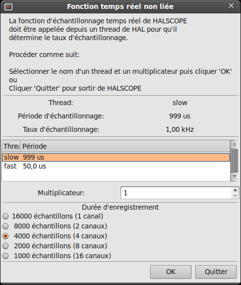

C'est dans ce dialogue que vous définissez le taux d'échantillonnage
de l'oscilloscope. Pour le moment nous voulons un échantillon par
milliseconde, alors cliquez sur le thread _slow_ et laissez le
multiplicateur à 1. Nous allons aussi passer la longueur
d'enregistrement à 4000 échantillons, de sorte que nous
puissions utiliser jusqu'à 4 canaux simultanément. Quand vous
sélectionnez un thread puis que vous cliquez sur le bouton _OK_, le
dialogue disparaît et la fenêtre initiale du scope s'ouvre, comme ci-dessous.

[[fig:Fenetre-initiale-halscope]]
.Fenêtre initiale du scope
(((Fenêtre initiale)))

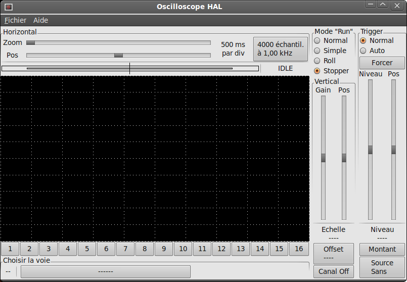

=== Branchement des sondes du scope

À ce stade, halscope est prêt à l'emploi. Nous avons déjà choisi le
taux d'échantillonnage et la longueur d'enregistrement, de sorte que la
prochaine étape consiste à décider de ce qu'il faut mesurer. C'est
équivalent à brancher les _sondes virtuelles du scope_ à HAL. halscope
dispose de 16 canaux, mais le nombre de canaux utilisables à un moment
donné dépend de la longueur d'enregistrement, plus il y a de canaux,
plus les enregistrements seront courts, car la mémoire disponible
pour l'enregistrement est fixée à environ 16000 échantillons.

Les boutons des canaux se situent en dessous de l'écran du scope.
Cliquez le bouton _1_ et vous verrez apparaître le dialogue de
sélection des sources dans lequel vous devrez choisir _la source qui 
devra s'afficher sur le canal 1, comme sur la figure ci-dessous. 
Ce dialogue est très similaire à celui utilisé par halmeter.

[[fig:Selection-sources-halscope]]
.Dialogue de sélection des sources
(((Sélection de la source)))

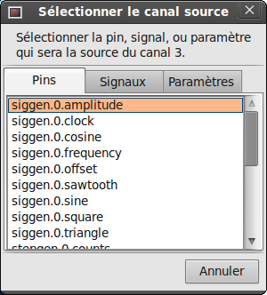

Nous aimerions bien regarder les signaux que nous avons défini
précédemment, pour cela, cliquons sur l'onglet _Signaux_ et le dialogue
affichera tous les signaux existants dans HAL, dans notre exemple nous
avons seulement les deux signaux X-vel et Y-vel, comme ci-dessous.

Pour choisir un signal, il suffit de cliquer dessus. Dans notre cas,
nous voulons utiliser le canal 1 pour afficher le signal _X-vel_.
Lorsque l'on clique sur _X-vel_, la fenêtre se ferme et le canal a
été sélectionné.

[[cap:Select-Signal]]
.Sélection du signal
(((Sélection du signal)))

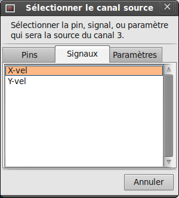

Le bouton du canal _1_ est pressé, le numéro du canal 1 et le nom 
_X-vel_ apparaissent sous la rangée de boutons. L'affichage indique
toujours le canal sélectionné, vous pouvez avoir beaucoup de canaux sur
l'écran, mais celui qui est actif sera en surbrillance.

[[cap:halscope]]
.halscope
(((halscope)))

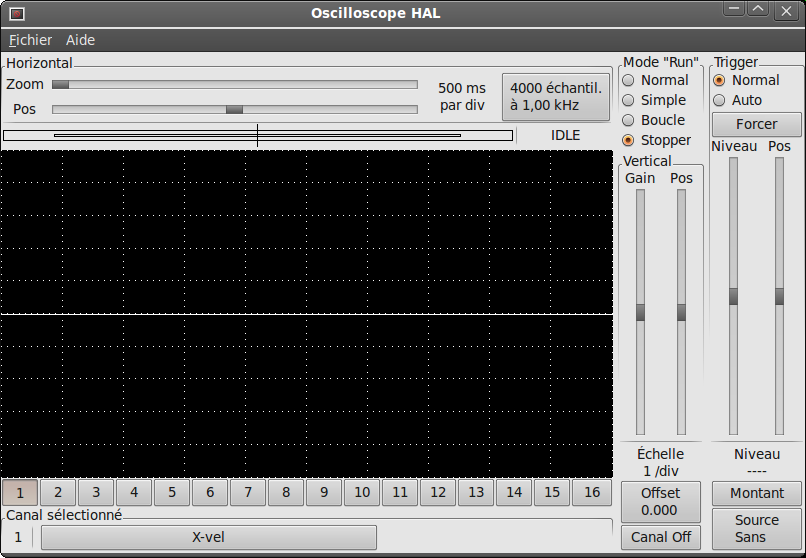

Les différents contrôles comme la position verticale et l'amplitude
sont toujours relatifs au canal 1. Pour ajouter un signal sur le canal
2, cliquer sur le bouton _2_. Dans la fenêtre de dialogue, cliquer sur
l'onglet _Signaux_, puis cliquer sur _Y-vel_.

Nous voulons aussi voir les signaux carrés et triangles produits. Il
n'existe pas de signaux connectés à ces pins, nous utilisons donc
l'onglet _Pins_. Pour le canal _3_, sélectionnez _siggen.0.triangle_ 
et pour le canal _4_, choisissez _siggen.0.square_.

=== Capturer notre première forme d'onde

Maintenant que nous avons plusieurs sondes branchées sur HAL, nous 
pouvons capturer quelques formes d'ondes. Pour démarrer le scope,
cochez la case _Normal_ du groupe _Mode "Run"_ (en haut à droite).
Puisque nous avons une longueur d'enregistrement de 4000 échantillons
et une acquisition de 1000 échantillons par seconde, il faudra à
halscope environ 2 secondes pour remplir la moitié de son tampon.
Pendant ce temps, une barre de progression juste au-dessus de l'écran
principal affichera le remplissage du tampon. Une fois que le tampon
est à moitié plein, scope attend un déclencheur (Trigger). Puisque nous n'en
avons pas encore configuré, il attendra toujours. Pour déclencher
manuellement, cliquez sur le bouton _Forcer_ du groupe _Trigger_ en
haut à droite. Vous devriez voir le reste de la zone tampon se remplir,
puis l'écran afficher les ondes capturées. Le résultat ressemble à la
figure ci-dessous.

[[fig:Capture-onde-halscope]]
.Capture d'ondes
(((Capture d'onde)))

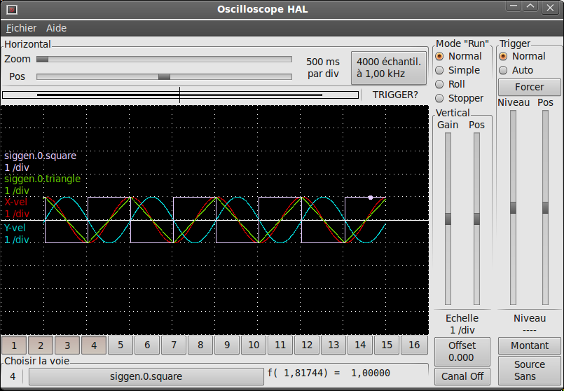

=== Ajustement vertical

Les traces sont assez difficiles à distinguer car toutes les quatre
sont les unes sur les autres. Pour résoudre ce problème, nous utilisons
les curseurs du groupe _Vertical_ situé à droite de l'écran. 
Ces deux curseurs agissent sur le canal actuellement sélectionné. En ajustant 
le _Gain_, notez qu'il couvre une large échelle (contrairement aux 
oscilloscopes réels), celle-ci permet d'afficher des signaux très petits 
(pico unités) à très grands (Tera - unités). Le curseur _Pos_ déplace la 
trace affichée de haut en bas sur toute la hauteur de l'écran. Pour de plus 
grands ajustements le bouton _Offset_ peut être utilisé.

[[cap:Ajustement-vertical-halscope]]
.Ajustement vertical
(((Ajustement vertical)))

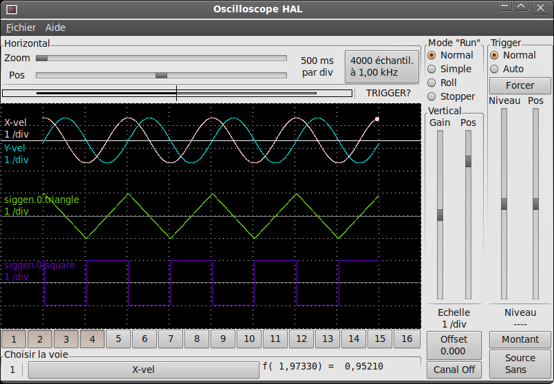

Le grand bouton _Canal sélectionné_ en bas, indique que le canal 1 est
actuellement le canal sélectionné et qu'il correspond au signal
_X-vel_. Essayez de cliquer sur les autres canaux pour mettre
leurs traces en évidence et pouvoir les déplacer avec le curseur _Pos_.

=== Déclenchement (Triggering)

L'utilisation du bouton _Forcer_ n'est parfois pas satisfaisante pour
déclencher le scope. Pour régler un déclenchement réel,
cliquer sur le bouton _Source_ situé en bas à droite. Il ouvre alors le
dialogue _Trigger Source_, qui est simplement la liste de toutes les
sondes actuellement branchées, voir la figure ci-dessous.
Sélectionner la sonde à utiliser pour déclencher en cliquant dessus.
Pour notre exemple nous utilisons 3 canaux, essayons l'onde triangle.
Quand le dialogue ce referme, après le choix, le bouton affiche _Source Canal n_
où n est le numéro du canal venant d'être choisi comme déclencheur.

[[fig:halscope-demo-5]]
.Dialogue des sources de déclenchement
(((Dialogue des sources de déclenchement)))

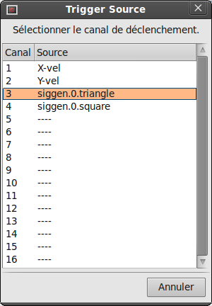

Après avoir défini la source de déclenchement, il est possible
d'ajuster le niveau de déclenchement avec les curseurs du groupe 
_Trigger_ le long du bord droit. Le niveau peut être modifié à partir
du haut vers le bas de l'écran, il est affiché sous les curseurs. La
position est l'emplacement du point de déclenchement dans
l'enregistrement complet. Avec le curseur tout en bas, le point de
déclenchement est à la fin de l'enregistrement et halscope affiche ce
qui s'est passé avant le déclenchement. Lorsque le curseur est
tout en haut, le point de déclenchement est au début de
l'enregistrement, l'affichage représente ce qui s'est passé après le
déclenchement. Le point de déclenchement est visible comme une petite
ligne verticale dans la barre de progression située juste au dessus de
l'écran. La polarité du signal de déclenchement peut être inversée en
cliquant sur le bouton _Montant_ situé juste sous l'affichage du niveau de
déclenchement, il deviendra alors _descendant_. Notez que la modification 
de la position de déclenchement arrête le scope une fois la position ajustée, 
vous relancez le scope en cliquant sur le bouton _Normal_ du groupe 
_Mode "Run"_. 

Maintenant que nous avons réglé la position verticale et le
déclenchement, l'écran doit ressembler à la figure ci-dessous.

[[fig:halscope-demo-6]]
.Formes d'ondes avec déclenchement
(((Formes d'onde)))

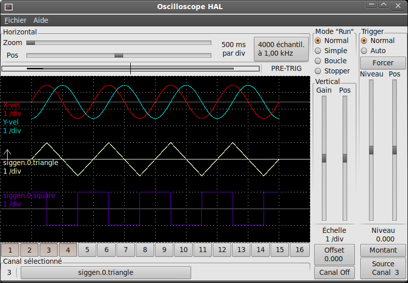

=== Ajustement horizontal

Pour examiner de près une partie d'une forme d'onde, vous pouvez
utiliser le _zoom_ au dessus de l'écran pour étendre la trace
horizontalement et le curseur de position horizontale, _Pos_ du 
groupe _Horizontal_, pour déterminer quelle partie de l'onde zoomée est visible. 
Parfois simplement élargir l'onde n'est pas suffisant et il faut augmenter 
la fréquence d'échantillonnage. Par exemple, nous aimerions voir les impulsions 
de pas qui sont générés dans notre exemple. Mais les impulsions de pas font 
seulement 50 us de long, l'échantillonnage à 1kHz n'est pas assez rapide. 
Pour changer le taux d'échantillonnage, cliquer sur le bouton qui affiche le 
nombre d'échantillons pour avoir le dialogue _Sélectionner un taux 
d'échantillonnage_, figure ci-dessous. 
Pour notre exemple, nous cliquerons sur le thread _fast_, qui fournira un 
échantillonnage à environ 20kHz. Maintenant au lieu d'afficher environ 4 
secondes de données, un enregistrement sera de 4000 échantillons à 20kHz, soit
environ 0.20 seconde.

[[fig:halscope-demo-7]]
.Dialogue de choix d'échantillonnage
(((Choix d'échantillonnage)))

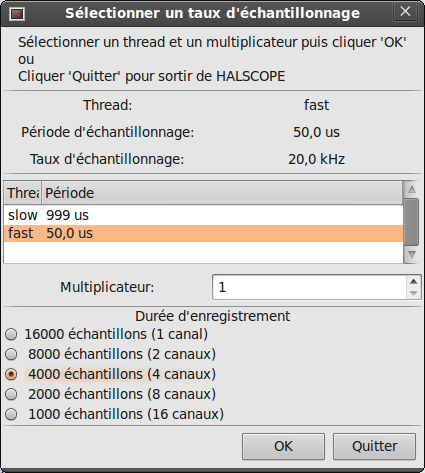

=== Plus de canaux

Maintenant regardons les impulsions de pas. halscope dispose de 16
canaux, mais pour cet exemple, nous en utilisons seulement 4 à la fois.
Avant de sélectionner tout autre canal, nous avons besoin d'en éteindre
certains. Cliquer sur le canal _2_, puis sur le bouton _Canal Off_ sous le
groupe _vertical_. Ensuite, cliquez sur le canal 3, le mettre Off et
faire de même pour le canal 4. Même si les circuits sont éteints, ils
sont encore en mémoire et restent connectés, en fait, nous
continuerons a utiliser le canal 3 comme source de déclenchement. Pour
ajouter de nouveaux canaux, sélectionner le canal _5_, choisir la pin 
_stepgen.0.dir_, puis le canal _6_ et sélectionner _stepgen.0.step_. 
Ensuite, cliquer sur _mode Normal_ pour lancer le scope, ajustez le
zoom horizontal à 10 ms par division. Vous devriez voir les impulsions de
pas ralentir à la vitesse commandée approcher de zéro, puis la
pin de direction changer d'état et les impulsions de pas se resserrer de 
nouveau en même temps que la vitesse augmente. Vous aurez peut être besoin 
d'ajuster le gain sur le canal 1 afin de mieux voir l'action de la vitesse sur 
l'évolution des impulsions de pas. Le résultat devrait être proche de celui de 
la figure ci-dessous. Ce type de mesure est délicate car il y a un énorme écart 
d'échelle entre la fréquence des pas et l'action sur la vitesse, d'ou la courbe 
X-vel assez plate et les impulsions de pas très resserrées.

[[fig:halscope-demo-8]]
.Observer les impulsions de pas
(((Observer les impulsions)))

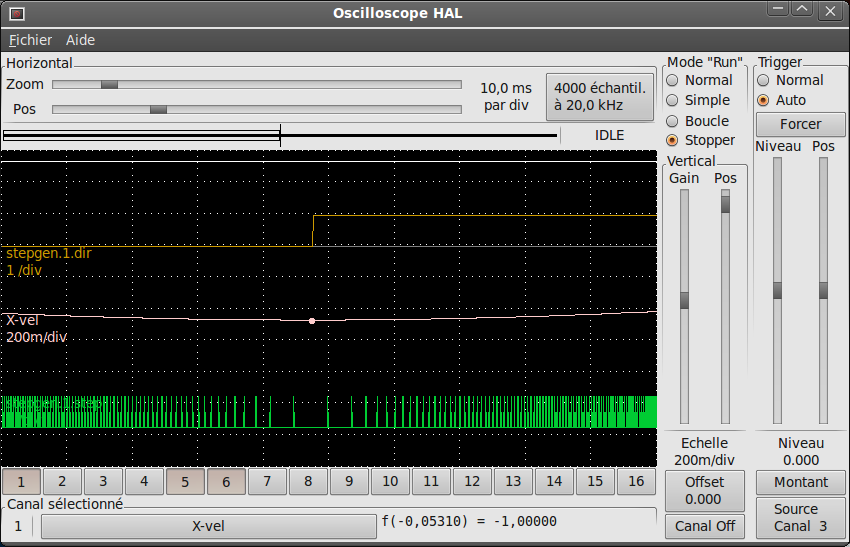

=== Plus d'échantillons

Si vous souhaitez enregistrer plus d'échantillons à la fois,
redémarrez le temps réel et chargez halscope avec un argument numérique
qui indique le nombre d'échantillons que vous voulez capturer, comme:
----
halcmd: loadusr halscope 80000 
----

Si le composant _scope_rt_ n'est pas déjà chargé, halscope va le
charger et lui demander un total de 80000 échantillons, de sorte 
que lorsque l'échantillonnage se fera sur 4 canaux à la fois, 
il y aura 20000 échantillons par canal. (Si _scope_rt_ est déjà 
chargé, l'argument numérique passé à halscope sera sans effet)

