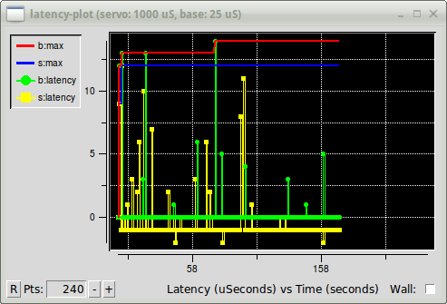

:lang: en
:toc:

[[cha:latency-testing]]
= Latency Testing(((Latency Testing)))

[[sec:what-is-latency]]
== What is latency?

Latency is how long it takes the PC to stop what it is doing and respond
to an external request, such as running one of LinuxCNC's periodic realtime threads.
The lower the latency, the faster you can run the realtime threads,
and the smoother motion will be (and potentially faster, in the case of software stepping).

Latency is far more important than CPU speed.
A lowly Pentium II that responds to interrupts within 10 microseconds
each and every time can give better results
than the latest and fastest P4 Hyperthreading beast.

The CPU isn't the only factor in determining latency.
Motherboards, video cards, USB ports, and a number of other things can hurt the latency.
The best way to find out what you are dealing with is to run the latency test.

Generating step pulses in software has one very big advantage - it's free.
Just about every PC has a parallel port that is
capable of outputting step pulses that are generated by the software.
However, software step pulses also have some disadvantages:

- limited maximum step rate
- jitter in the generated pulses
- loads the CPU

[[sec:latency-tests]]
== Latency Tests(((Latency Tests)))

LinuxCNC includes several latency tests.  They all produce equivalent information.
Running these tests will help determine if a computers is suitable for driving a CNC machine.

[NOTE]
Do not run LinuxCNC or StepConf while the latency test is running.

[[sec:latency-test]]
=== Latency Test(((Latency Test)))

To run the test, open a terminal window
(in Ubuntu, from Applications → Accessories → Terminal)
and run the following command:

----
latency-test
----

This will start the latency test with a base-thread period of 25uS and a
servo-thread period of 1mS. The period times may be specified on the command
line:

----
latency-test 50000 1000000
----

This will start the latency test with a base-thread period of 50uS and a
servo-thread period of 1mS.

For available options, on the command line enter:

----
latency-test -h
----

After starting a latency test you should see something like this:

.HAL Latency Test
image::../config/images/latency-test_en.png["HAL Latency Test",align="center"]

While the test is running, you should 'abuse' the computer.
Move windows around on the screen. Surf the web. Copy some large files
around on the disk. Play some music.
Run an OpenGL program such as glxgears.
The idea is to put the PC through its paces while
the latency test checks to see what the worst case numbers are.

The important number for software stepping is the 'max jitter' of the base thread.
In the example above, that is 6693 nanoseconds (ns), or 6.693 microseconds (µs).
Record this number, and enter it in StepConf when it is requested.

In the example above, latency-test only ran for a few seconds.
You should run the test for at least several minutes; sometimes
the worst case latency doesn't happen very often, or only happens
when you do some particular action. For instance, one Intel
motherboard worked pretty well most of the time, but every 64
seconds it had a very bad 300 us latency. Fortunately that was
fixable, see https://wiki.linuxcnc.org/cgi-bin/wiki.pl?FixingSMIIssues

So, what do the results mean? If your Max Jitter number is less
than about 15-20 microseconds (15000-20000 nanoseconds), the
computer should give very nice results with software stepping. If
the max latency is more like 30-50 microseconds, you can still
get good results, but your maximum step rate might be a little
disappointing, especially if you use microstepping or have very
fine pitch leadscrews. If the numbers are 100 us or more (100,000
nanoseconds), then the PC is not a good candidate for software
stepping. Numbers over 1 millisecond (1,000,000 nanoseconds) mean
the PC is not a good candidate for LinuxCNC, regardless of whether you
use software stepping or not.

[NOTE]
If you get high numbers, there may be ways to improve them.
Another PC had very bad latency (several milliseconds) when
using the onboard video. But a $5 used video card solved the problem.
LinuxCNC does not require bleeding edge hardware.

For more information on stepper tuning see the
<<cha:stepper-tuning,Stepper Tuning>> Chapter.

*Additional command line tools are available for examining latency
when LinuxCNC is not running.*

=== Latency Plot

latency-plot makes a strip chart recording for a base and a servo thread.
It may be useful to see spikes in latency when other
applications are started or used. Usage:

----
latency-plot --help

Usage:
      latency-plot --help | -?
      latency-plot --hal [Options]

Options:
      --base nS  (base  thread interval, default:   25000)
      --servo nS (servo thread interval, default: 1000000)
      --time mS  (report interval, default: 1000)
      --relative (relative clock time (default))
      --actual   (actual clock time)
----

.`latency-plot` Window

=== Latency Histogram

latency-histogram displays a histogram of latency (jitter) for
a base and servo thread.

----
Usage:
   latency-histogram --help | -?
   latency-histogram [Options]

Options:
  --base      nS   (base  thread interval, default:   25000, min:  5000)
  --servo     nS   (servo thread interval, default: 1000000, min: 25000)
  --bbinsize  nS   (base  bin size,  default: 100
  --sbinsize  nS   (servo bin size, default: 100
  --bbins     n    (base  bins, default: 200
  --sbins     n    (servo bins, default: 200
  --logscale  0|1  (y axis log scale, default: 1)
  --text      note (additional note, default: "" )
  --show           (show count of undisplayed bins)
  --nobase         (servo thread only)
  --verbose        (progress and debug)
  --nox            (no gui, display elapsed,min,max,sdev for each thread)

Notes:
  Linuxcnc and Hal should not be running, stop with halrun -U.
  Large number of bins and/or small binsizes will slow updates.
  For single thread, specify --nobase (and options for servo thread).
  Measured latencies outside of the +/- bin range are reported
  with special end bars.  Use --show to show count for
  the off-chart [pos|neg] bin
----

.`latency-histogram` Window
image::../config/images/latency-histogram.png["latency-histogram Window"]

== Latency tuning

LinuxCNC can run on many different hardware platforms and with many
different realtime kernels, and they all may benefit from tuning for
optimal latency.

A primary goal in tuning the system for LinuxCNC is to reserve a CPU for the exclusive use of LinuxCNC's realtime tasks, so that other tasks (both user programs and kernel threads) do not interfere with LinuxCNC's access to that CPU.

When specific tuning options are believed to be universally helpful
LinuxCNC does this tuning automatically at startup, but many tuning
options are machine-specific and cannot be done automatically.  The person
installing LinuxCNC will need to experimentally determine the optimal
tuning for their system.

=== Tuning the BIOS for latency

PC BIOSes vary wildly in their latency behavior.

Tuning the BIOS is tedious because you have to reboot the computer,
make one small tweak in the BIOS, boot Linux, and run the latency test
(potentially for a long time) to see what effects your BIOS change had.
Then repeat for all the other BIOS settings you want to try.

Because BIOSes are all different and non-standard, providing a detailed
BIOS tuning guide is not practical.  In general, some things to try
tuning in the BIOS are:

* Disable ACPI, APM, and any other power-saving features.  This includes
  anything related to power saving, suspending, CPU sleep states, CPU
  frequency scaling, etc.

* Disable CPU "turbo" mode.

* Disable CPU hyperthreading.

* Disable (or otherwise control) System Management Interrupt (SMI).

* Disable any hardware you do not intend to use.

=== Tuning Preempt-RT for latency

The Preempt-RT kernel may benefit from tuning in order to provide the
best latency for LinuxCNC.  Tuning may be done via the kernel command
line, sysctl, and via files in `/proc` and `/sys`.

Some tuning parameters to look into:

Kernel command line::

    Details here: <https://www.kernel.org/doc/Documentation/admin-guide/kernel-parameters.txt>

    * `isolcpus`: Prevent most non-LinuxCNC processes from using these
      CPUs, leaving more CPU time available for LinuxCNC.

    * `irqaffinity`: Select which CPUs service interrupts, so that the
      CPUs reserved for LinuxCNC realtime don't have to perform this task.

    * `rcu_nocbs`: Prevent RCU callbacks from running on these CPUs.

    * `rcu_nocb_poll`: Poll for RCU callbacks instead of using sleep/wake.

    * `nohz_full`: Disable clock tick on these CPUs.

Sysctl::

    Details here: <https://www.kernel.org/doc/html/latest/scheduler/sched-rt-group.html>

    * `sysctl.kernel.sched_rt_runtime_us`: Set to -1 to remove the limit
      on how much time realtime tasks may use.

// vim: set syntax=asciidoc:
