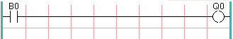
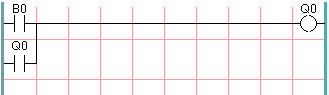
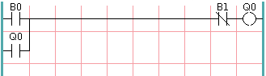

:lang: fr
:toc:

[[cha:classicladder-introduction]]
= La programmation en Ladder

== History

Classic Ladder is a free implementation of a ladder interpreter,
released under the LGPL. It was written by Marc Le Douarain.

He describes the beginning of the project on his website:

[quote,Marc Le Douarain, from "Genesis" at the Classic Ladder website]
_____________________________________________________________________
I decided to program a ladder language only for test purposes at the
start, in February 2001. It was planned, that I would have to
participate to a new product after leaving the enterprise in which I
was working at that time. And I was thinking that to have a ladder
language in those products could be a nice option to considerate. And
so I started to code the first lines for calculating a rung with
minimal elements and displaying dynamically it under Gtk, to see if my
first idea to realize all this works.

And as quickly I've found that it advanced quite well, I've continued
with more complex elements: timer, multiples rungs, etc...

Voila, here is this work... and more: I've continued to add features
since then.
_____________________________________________________________________

Classic Ladder has been adapted to work with LinuxCNC's HAL, and is
currently being distributed along with LinuxCNC. If there are
issues/problems/bugs please report them to the Enhanced Machine
Controller project.

== Introduction

La logique Ladder ou langage de programmation Ladder est une méthode pour tracer les schémas en logique électrique. Il s'agit maintenant
d'un langage graphique vraiment populaire pour la programmation des
automates programmables industriels (API). Il a été à l'origine inventé
pour décrire la logique à relais. Son nom est fondé sur la constatation
que les programmes dans cette langue ressemblent à une échelle
(ladder), avec deux «rails» verticaux et, entre eux, une série
«d'échelons». En Allemagne et ailleurs en Europe, le style consiste à
placer les rails horizontaux, un en haut de la page et l'autre en bas
avec les échelons verticaux dessinés séquentiellement de la gauche vers la droite.

Un programme en logique Ladder, également appelé schéma Ladder, est ressemblant au schéma d'un ensemble de circuits électriques à relais.
C'est l'intérêt majeur du schéma Ladder de permettre à une large
variété de personnels techniques, ingénieurs, techniciens électriciens,
etc de le comprendre et de l'utiliser sans formation complémentaire grâce à cette ressemblance.

La logique Ladder est largement utilisée pour programmer les API, avec lesquels le contrôle séquentiel des processus de fabrication est
requis. Le Ladder est utile pour les systèmes de contrôle simples mais
critiques, ou pour reprendre d'anciens circuits à relais câblés. Comme
les contrôleurs à logique programmable sont devenus plus sophistiqués,
ils ont aussi été utilisés avec succès dans des systèmes d'automatisation très complexes.

Le langage Ladder peut être considéré comme un langage basé sur les
règles, plutôt que comme un langage procédural. Un «échelon» en Ladder
représente une règle. Quand elles sont mises en application avec des
éléments électromécaniques, les diverses règles «s'exécutent» toutes
simultanément et immédiatement. Quand elle sont mises en application
dans la logique d'un automate programmable, les règles sont exécutées
séquentiellement par le logiciel, dans une boucle. En exécutant la
boucle assez rapidement, typiquement plusieurs fois par seconde, l'effet d'une exécution simultanée et immédiate est obtenu.

Ladder logic follows these general steps for operation.

* Read Inputs
* Solve Logic
* Update Outputs

== Exemple

Les composants les plus communs du Ladder sont les contacts (entrées),
ceux-ci sont habituellement NC (normalement clos) ou NO (normalement
ouvert) et les bobines (sorties).

- Le contact NO image::images/ladder_action_load.png[]
- Le contact NC image::images/ladder_action_loadbar.png[]
- La bobine (sortie) image::images/ladder_action_out.png[]

Bien sûr, il y a beaucoup plus de composants dans le langage Ladder
complet, mais la compréhension de ceux-ci aidera à appréhender le concept global du langage.

L'échelle se compose d'un ou plusieurs échelons. Ces échelons sont
tracés horizontalement, avec les composants placés sur eux (entrées,
sorties et autres), les composants sont évalués de la gauche vers la droite.

Cet exemple est un simple échelon:

L'entrée B0 sur la gauche et un contact normalement ouvert, il est
connecté sur la sortie Q0 sur la droite. Imaginez maintenant qu'une
tension soit appliquée à l'extrême gauche, dès que B0 devient vraie
(par exemple: l'entrée est activée, ou l'utilisateur a pressé le
contact NO), la tension atteint l'extrême droite en traversant la
bobine Q0. Avec comme conséquence que la sortie Q0 passe
de 0 à 1.
If the user releases B0, the Q0 output quickly returns to 0/off/false.

== Basic Latching On-Off Circuit

Building on the above example, suppose we add a switch that closes
whenever the coil Q0 is active. This would be the case in a relay,
where the coil can activate the switch contacts; or in a contactor,
where there are often several small auxiliary contacts
in addition to the large 3-phase contacts that are the
primary feature of the contactor.

Since this auxiliary switch is driven from coil Q0 in our earlier
example, we will give it the same number as the coil that drives it.
This is the standard practice followed in all ladder programming,
although it may seem strange at first to see a switch labeled the
same as a coil. So let's call this auxiliary contact Q0 and
connect it across the B0 'pushbutton' contact from our earlier example.

Let's take a look at it:

As before, when the user presses pushbutton B0, coil Q0 comes on.
And when coil Q0 comes on, switch Q0 comes on. Now the interesting
part happens. When the user releases pushbutton B0, coil Q0
does not stop as it did before. This is because switch Q0
of this circuit is effectively holding the user's pushbutton
pressed. So we see that switch Q0 is still holding coil Q0 on
after the 'start' pushbutton has been released.

This type of contact on a coil or relay, used in this way, is
often called a 'holding contact', because it 'holds on' the
coil that it is associated with. It is also occasionally called
a 'seal' contact, and when it is active it is said that the
circuit is 'sealed'.

Unfortunately, our circuit so far has little practical use,
because, although we have an 'on' or 'start' button in the form of
pushbutton B0, we have no way to shut this circuit off once
it is started. But that's easy to fix. All we need is a way to
interrupt the power to coil Q0. So let's add a normally-closed
(NC) pushbutton just ahead of coil Q0.

Here's how that would look:

Now we have added 'off' or 'stop' pushbutton B1. If the user
pushes it, contact from the rung to the coil is broken.
When coil Q0 loses power, it drops to 0/off/false. When
coil Q0 goes off, so does switch Q0, so the 'holding contact'
is broken, or the circuit is 'unsealed'. When the user releases
the 'stop' pushbutton, contact is restored from the rung to
coil Q0, but the rung has gone dead, so the coil doesn't
come back on.

This circuit has been used for decades on virtually every
machine that has a three-phase motor controlled by
a contactor, so it was inevitable that it would be
adopted by ladder/PLC programmers. It is also a very safe
circuit, in that if 'start' and 'stop' are both pressed at
the same time, the 'stop' function always wins.

This is the basic building block of much of ladder programming,
so if you are new to it, you would do well to make sure that
you understand how this circuit operates.

// vim: set syntax=asciidoc:
