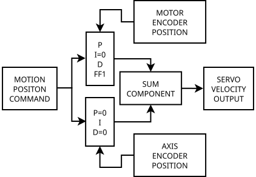

= Dual Feedback PID

== Introduction
A dual feedback machine axis typically consists of a rotary encoder on the motor 
and a linear encoder on the axis. The motor encoder is used for the bulk movement 
using P, D and FF1 parameters and the linear encoder on the axis is used to 
remove the last small steady state error using the I parameter. The two velocity 
commands are added (summed) together before being sent to the servo amplifier.

== Flow Chart Diagram

.Dual PID Flow Chart

== Example HAL Code
Here we have a snippet of example code for an imaginary Z axis.
The setting of the P, I, D and FF1 etc must be tuned for best result.
These parameters are typically found in the INI file (in this case) 
under the [JOINT_2] heading.
The loading of the PID and sum components are not shown.
The encoder and analog pins are typical Mesa card pins (7i92/7i77 in this case).

[source,hal]
----

#**************************
#  EXAMPLE AXIS Z / JOINT 2
#**************************

# Inner loop: motor encoder PID (P + D + feedforwards, I=0 to avoid fighting)

setp   pid.z.Pgain     [JOINT_2]P
setp   pid.z.Igain     0
setp   pid.z.Dgain     [JOINT_2]D
setp   pid.z.bias      [JOINT_2]BIAS
setp   pid.z.FF0       [JOINT_2]FF0
setp   pid.z.FF1       [JOINT_2]FF1
setp   pid.z.FF2       [JOINT_2]FF2
setp   pid.z.deadband  [JOINT_2]DEADBAND
setp   pid.z.maxoutput [JOINT_2]MAX_OUTPUT
setp   pid.z.error-previous-target true

# Outer loop: linear scale PID (only I, others 0)

setp pid.z2.Pgain       0
setp pid.z2.Igain       [JOINT_2]I
setp pid.z2.Dgain       0
setp pid.z2.bias        0
setp pid.z2.FF0         0
setp pid.z2.FF1         0
setp pid.z2.FF2         0
setp pid.z2.deadband    [JOINT_2]DEADBAND
setp pid.z2.maxoutput   [JOINT_2]MAX_OUTPUT

# Command from trajectory planner to both PIDs
net z-pos-cmd    <=  joint.2.motor-pos-cmd
net z-pos-cmd    =>  pid.z.command
net z-pos-cmd    =>  pid.z2.command

# Enable both loops together
net z-enable     <=  joint.2.amp-enable-out
net z-enable     =>  pid.z.enable
net z-enable     =>  pid.z2.enable

# connect index feedback to compensate during index
# motor encoder
net z2-index-enable  <=> pid.z.index-enable
# linear encoder
net z2-index-enable  <=> pid.z2.index-enable

# connect separate feedback signals
# motor encoder
net z-pos-fb     =>  pid.z.feedback
# linear encoder
net z2-pos-fb    =>  pid.z2.feedback

# Connect the two PID outputs to a Sum component
net Zoutput-motor   pid.z.output   =>  sum2.0.in0
net Zoutput-linear  pid.z2.output   =>  sum2.0.in1

# Summed output goes to Mesa analog out (velocity command to servo drive)
net Zoutput-summed   <= sum2.0.out
net Zoutput-summed   => hm2_7i92.0.7i77.0.1.analogout2

# ---Motor Encoder Z feedback signals/setup---

setp    hm2_7i92.0.encoder.02.counter-mode 0
setp    hm2_7i92.0.encoder.02.filter 1
setp    hm2_7i92.0.encoder.02.index-invert 0
setp    hm2_7i92.0.encoder.02.index-mask 0
setp    hm2_7i92.0.encoder.02.index-mask-invert 0
setp    hm2_7i92.0.encoder.02.scale  [JOINT_2]ENCODER_SCALE

# position feedback to PID Z
net z-pos-fb               <=  hm2_7i92.0.encoder.02.position

# index enable handshake for Motion and encoder
net z2-index-enable   <=>  hm2_7i92.0.encoder.02.index-enable

# ---Linear Encoder Z2 feedback signals/setup---

setp    hm2_7i92.0.encoder.03.counter-mode 0
setp    hm2_7i92.0.encoder.03.filter 1
setp    hm2_7i92.0.encoder.03.index-invert 0
setp    hm2_7i92.0.encoder.03.index-mask 0
setp    hm2_7i92.0.encoder.03.index-mask-invert 0
setp    hm2_7i92.0.encoder.03.scale  [JOINT_2]LINEAR_ENCODER_SCALE

# position feedback to PID Z2 and Motions's joint motor position
net z2-pos-fb               <=  hm2_7i92.0.encoder.03.position
net z2-pos-fb               =>  joint.2.motor-pos-fb

# index enable handshake for Motion and encoder
net z2-index-enable    <=>  joint.2.index-enable
net z2-index-enable    <=>  hm2_7i92.0.encoder.03.index-enable
----

== Other Details

In this example the index enable pins are connected to both encoders.
In practice only one encoder will be used for indexing - the one that 
resets the enable first.

You may be able to remove the sum component and feed the output of one PID 
into the bias pin of the other. This was not confirmed at time of writing.

Forum reference: https://forum.linuxcnc.org/10-advanced-configuration/37353-dual-pid-loops-and-appropriate-pins-for-feedback-to-the-trajectory-planner-et-al

wiki reference: http://wiki.linuxcnc.org/cgi-bin/wiki.pl?Combining_Two_Feedback_Devices_On_One_Axis

  
