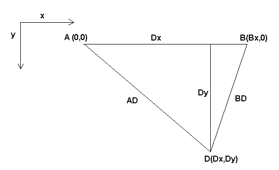
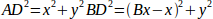
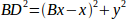
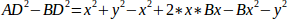
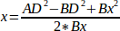
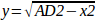
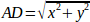
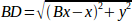

:lang: en
:toc:

[[cha:kinematics]]
= Kinematics

(((kinematics)))

== Introduction

When we talk about CNC machines, we usually think about machines that
are commanded to move to certain locations and perform various tasks.
In order to have an unified view of the machine space, and to make it
fit the human point of view over 3D space, most of the machines (if not
all) use a common coordinate system called the Cartesian Coordinate
System.

The Cartesian Coordinate system is composed of three axes (X, Y, Z) each
perpendicular to the other two footnote:[The word "axes" is also
commonly (and wrongly) used when talking about
CNC machines, and referring to the moving directions of the machine.].

When we talk about a G-code program (RS274/NGC) we talk about a number
of commands (G0, G1, etc.) which have positions as parameters (X- Y-
Z-). These positions refer exactly to Cartesian positions. Part of the
LinuxCNC motion controller is responsible for translating those positions
into positions which correspond to the machine
(((kinematics)))kinematics footnote:[Kinematics: a two way function to
transform from Cartesian space to joint space.].

=== Joints vs Axes

A joint of a CNC machine is a one of the physical degrees of freedom
of the machine. This might be linear (leadscrews) or rotary (rotary
tables, robot arm joints). There can be any number of joints on a
given machine. For example, one popular robot has 6 joints, and a
typical simple milling machine has only 3.

There are certain machines where the joints are laid out to match
kinematics axes (joint 0 along axis X, joint 1 along axis Y, joint 2
along axis Z), and these machines are called (((Cartesian machines)))
Cartesian machines (or machines with (((Trivial Kinematics)))Trivial Kinematics).
These are the most common machines used in milling,
but are not very common in other domains of machine control (e.g. welding: puma-typed robots).

LinuxCNC supports axes with names: X Y Z A B C U V W.  The X Y Z axes
typically refer to the usual Cartesian coordinates. The A B C axes refer to
rotational coordinates about the X Y Z axes respectively.  The U V W axes refer to
additional coordinates that are commonly made colinear to the X Y Z axes respectively.

== Trivial Kinematics

The simplest machines are those in which which each joint is placed
along one of the Cartesian axes. On these machines the mapping from
Cartesian space (the G-code program) to the joint space (the actual
actuators of the machine) is trivial. It is a simple 1:1 mapping:

----
pos->tran.x = joints[0];
pos->tran.y = joints[1];
pos->tran.z = joints[2];
----

In the above code snippet one can see how the mapping is done: the X
position is identical with the joint 0, the Y position with
joint 1, etc. The above refers to the direct kinematics (one
direction of the transformation).
The next code snippet refers to the inverse kinematics (or the
inverse direction of the transformation):

----
joints[0] = pos->tran.x;
joints[1] = pos->tran.y;
joints[2] = pos->tran.z;
----

In LinuxCNC, the identity kinematics are implemented with the
'trivkins' kinematics module and extended to 9 axes.  The default
relationships between axis coordinates and joint numbers are:
footnote:[If the machine (for example a lathe) is mounted with
only the X, Z and A axes and the INI file of LinuxCNC contains
only the definition of these 3 joints, then the previous assertion is false.
Because we currently have (joint0=X, joint1=Z, joint2=A) which
assumes that joint1=Y.
To make this work in LinuxCNC just define all the axes (XYZA),
LinuxCNC will then use a simple loop in HAL for unused Y axis.]
footnote:[Another way to make it work is to change the corresponding code and recompile the software.]

----
pos->tran.x = joints[0];
pos->tran.y = joints[1];
pos->tran.z = joints[2];
pos->a      = joints[3];
pos->b      = joints[4];
pos->c      = joints[5];
pos->u      = joints[6];
pos->v      = joints[7];
pos->w      = joints[8];
----

Similarly, the default relationships for inverse kinematics for trivkins are:

----
joints[0] = pos->tran.x;
joints[1] = pos->tran.y;
joints[2] = pos->tran.z;
joints[3] = pos->a;
joints[4] = pos->b;
joints[5] = pos->c;
joints[6] = pos->u;
joints[7] = pos->v;
joints[8] = pos->w;
----

It is straightforward to do the transformation for a trivial "kins" ('trivkins'
kinematics) or Cartesian machine provided that there are no omissions in the
axis letters used.

It gets a bit more complicated if the machine is missing one or more of the
axis letters.  The problems of omitted axis letters is addressed by using the
'coordinates=' module parameter with the trivkins module. Joint numbers are
assigned consecutively to each coordinate specified.  A lathe can be described
with 'coordinates=xz' The joint assignments will then be:

----
joints[0] = pos->tran.x
joints[1] = pos->tran.z
----

Use of the 'coordinates=' parameter is recommended for configurations that omit
axis letters. footnote:[ Historically, the trivkins module did not support the
'coordinates=' parameter so lathe configs were often configured as XYZ
machines.  The unused Y axis was configured to 1) home immediately, 2) use a
simple loopback to connect its position command HAL pin to its position
feedback HAL pin, and 3) hidden in gui displays. Numerous sim configs use
these methods in order to share common HAL files.]

The 'trivkins' kinematics module also allows the same coordinate to be specified
for more than one joint.  This feature can be useful on machines like a gantry
having two independent motors for the y coordinate.  Such a machine could use
'coordinates=xyyz' resulting in joint assignments:

----
joints[0] = pos->tran.x
joints[1] = pos->tran.y
joints[2] = pos->tran.y
joints[3] = pos->tran.z
----

See the trivkins man pages for more information.

== Non-trivial kinematics

There can be quite a few types of machine setups (robots: puma, scara;
hexapods etc.). Each of them is set up using linear and rotary joints.
These joints don't usually match with the Cartesian coordinates,
therefore we need a kinematics function which does the
conversion (actually 2 functions: forward and inverse kinematics
function).

To illustrate the above, we will analyze a simple kinematics called
bipod (a simplified version of the tripod, which is a simplified
version of the hexapod).

.Bipod setup

The Bipod we are talking about is a device that consists of 2 motors
placed on a wall, from which a device is hung using some wire. The
joints in this case are the distances from the motors to the device
(named AD and BD in the figure).

The position of the motors is fixed by convention. Motor A is in
(0,0), which means that its X coordinate is 0, and its Y coordinate is
also 0. Motor B is placed in (Bx, 0), which means that its X coordinate
is Bx.

Our tooltip will be in point D which gets defined by the distances AD
and BD, and by the Cartesian coordinates Dx, Dy.

The job of the kinematics is to transform from joint lengths (AD, BD)
to Cartesian coordinates (Dx, Dy) and vice-versa.

[[sec:Forward-transformation]]
=== Forward transformation

To transform from joint space into Cartesian space we will use some
trigonometry rules (the right triangles determined by the points (0,0),
(Dx,0), (Dx,Dy) and the triangle (Dx,0), (Bx,0) and (Dx,Dy)).

We can easily see that:

likewise:

If we subtract one from the other we will get:

and therefore:

From there we calculate:

////////////////////////////////////////////////////////////////////
we can easily see that latexmath:[$AD^{2}=x^{2}+y^{2}$], likewise
latexmath:[$BD^{2}=(Bx-x)^{2}+y^{2}$].

If we subtract one from the other we will get:

latexmath::[\[AD^{2}-BD^{2}=x^{2}+y^{2}-x^{2}+2*x*Bx-Bx^{2}-y^{2}\]]

and therefore:

latexmath::[\[x=\frac{AD^{2}-BD^{2}+Bx^{2}}{2*Bx}\]]

From there we calculate:

latexmath::[\[y=\sqrt{AD^{2}-x^{2}}\]]
////////////////////////////////////////////////////////////////////

Note that the calculation for y involves the square root of a
difference, which may not result in a real number. If there is no
single Cartesian coordinate for this joint position, then the position
is said to be a singularity. In this case, the forward kinematics
return -1.

Translated to actual code:

----
double AD2 = joints[0] * joints[0];
double BD2 = joints[1] * joints[1];
double x = (AD2 - BD2 + Bx * Bx) / (2 * Bx);
double y2 = AD2 - x * x;
if(y2 < 0) return -1;
pos->tran.x = x;
pos->tran.y = sqrt(y2);
return 0;
----

=== Inverse transformation

The inverse kinematics is much easier in our example, as we can write
it directly:

/////////////////////////////////////////////////
latexmath::[\[AD=\sqrt{x^{2}+y^{2}}\]]

latexmath::[\[BD=\sqrt{(Bx-x)^{2}+y^{2}}\]]
/////////////////////////////////////////////////

or translated to actual code:

----
double x2 = pos->tran.x * pos->tran.x;
double y2 = pos->tran.y * pos->tran.y;
joints[0] = sqrt(x2 + y2);
joints[1] = sqrt((Bx - pos->tran.x)*(Bx - pos->tran.x) + y2);
return 0;
----

== Implementation details

A kinematics module is implemented as a HAL component, and is
permitted to export pins and parameters. It consists of several "C"
functions (as opposed to HAL functions):

----
int kinematicsForward(const double *joint, EmcPose *world,
const KINEMATICS_FORWARD_FLAGS *fflags,
KINEMATICS_INVERSE_FLAGS *iflags)
----

Implements the <<sec:Forward-transformation,forward kinematics function>>.

----
int kinematicsInverse(const EmcPose * world, double *joints,
const KINEMATICS_INVERSE_FLAGS *iflags,
KINEMATICS_FORWARD_FLAGS *fflags)
----

Implements the inverse kinematics function.

----
KINEMATICS_TYPE kinematicsType(void)
----

Returns the kinematics type identifier, typically 'KINEMATICS_BOTH':

. KINEMATICS_IDENTITY  (each joint number corresponds to an axis letter)
. KINEMATICS_BOTH      (forward and inverse kinematics functions are provided)
. KINEMATICS_FORWARD_ONLY
. KINEMATICS_INVERSE_ONLY

[NOTE]
GUIs may interpret KINEMATICS_IDENTITY to hide the distinctions
between joint numbers and axis letters when in joint mode
(typically prior to homing).

----
int kinematicsSwitchable(void)
int kinematicsSwitch(int switchkins_type)
KINS_NOT_SWITCHABLE
----

The function kinematicsSwitchable() returns 1 if multiple
kinematics types are supported.  The function kinematicsSwitch()
selects the kinematics type.
See <<cha:switchable-kinematics,Switchable Kinematitcs>>.

[NOTE]
The majority of provided kinematics modules support a single
kinematics type and use the directive "*KINS_NOT_SWITCHABLE*" to
supply defaults for the required kinematicsSwitchable() and
kinematicsSwitch() functions.

----
int kinematicsHome(EmcPose *world, double *joint,
KINEMATICS_FORWARD_FLAGS *fflags,
KINEMATICS_INVERSE_FLAGS *iflags)
----

The home kinematics function sets all its arguments to their proper
values at the known home position. When called, these should be set,
when known, to initial values, e.g., from an INI file. If the home
kinematics can accept arbitrary starting points, these initial values
should be used.

----
int rtapi_app_main(void)
void rtapi_app_exit(void)
----

These are the standard setup and tear-down functions of RTAPI modules.

When they are contained in a single source file, kinematics modules
may be compiled and installed by 'halcompile'. See the 'halcompile(1)' manpage or
the HAL manual for more information.

=== Kinematics module using the userkins.comp template

Another way to create a custom kinematics module is to adapt the
HAL component 'userkins'. This template component can be modified
locally by a user and can be built using halcompile.

See the userkins man pages for more information.

Note that to create switchable kinematic modules the required
modifications are somewhat more complicated.

See 'millturn.comp' as an example of a switchable kinematic
module that was created using the 'userkins.comp' template.

[[sec:writing-custom-kinematics]]
== Writing a Custom Kinematics Module

This section provides a complete guide to writing a kinematics module
that works with both the real-time motion controller and the userspace
trajectory planner (planner type 2).

=== Architecture overview

A kinematics module in LinuxCNC serves two consumers:

. The *real-time motion controller* (motmod) -- runs the kinematics
  every servo cycle to convert between joint and Cartesian space.
  This code has access to HAL pins and runs in the RTAPI environment.
. The *userspace trajectory planner* (milltask, planner type 2) --
  calls kinematics during path planning to compute blending, velocity
  limits, and look-ahead.  This code runs in normal userspace and
  cannot access HAL pins directly.

Both sets of functions live in the *same `.c` source file* and are
compiled into the *same RT `.so` module*.  The userspace planner loads
the RT `.so` via `dlopen()` and resolves the non-RT entry point via
`dlsym()`.

The math is shared: forward and inverse kinematics are written as
static helper functions that take plain parameters (doubles, structs),
then called from both the RT interface (which reads HAL pins) and the
non-RT interface (which reads from a `kinematics_params_t` structure
mapped from HAL shared memory).

=== Required functions

Every kinematics module must export *two sets* of functions:

==== RT functions (for motmod)

These are the standard LinuxCNC kinematics functions documented above:
`kinematicsForward()`, `kinematicsInverse()`, `kinematicsType()`,
and either `KINS_NOT_SWITCHABLE` or the switchkins functions.
Additionally, `rtapi_app_main()` and `rtapi_app_exit()` handle
module initialization and cleanup.

The RT `kinematicsForward()` function (or `XxxKinematicsForward()` for
switchkins modules) also *pushes* the current HAL pin values into a
`kinematics_params_t` structure allocated in HAL shared memory.
This is done using the split-read protocol -- increment `head` before
any write, set `tail = head` after all writes:

----
if (uspace_params) {
    uspace_params->head++;
    uspace_params->params.mykins.arm_length = *(haldata->arm_length);
    /* ... push all other params ... */
    uspace_params->tail = uspace_params->head;
}
----

The userspace planner maps the same memory read-only and reads it
directly every time it calls kinematics -- no callbacks, no polling,
no per-call overhead.

==== Non-RT entry point (for the userspace planner)

The userspace planner resolves a single symbol from the RT `.so`:

----
void nonrt_attach(nonrt_ops_t *ops);
----

`nonrt_attach` is called once at planner startup.  It calls
`hal_struct_attach()` to map the module's `kinematics_params_t`
from HAL shared memory, then registers the forward and inverse
functions that the planner will call:

----
void nonrt_attach(nonrt_ops_t *ops)
{
    hal_struct_attach("mykins.params", (void **)&uspace_params);
    ops->forward  = myKinematicsForward;  /* same function as RT */
    ops->inverse  = myKinematicsInverse;
}

EXPORT_SYMBOL(nonrt_attach);
----

The `nonrt_ops_t` forward and inverse function pointers have the same
signature as the standard RT kinematics functions:

----
typedef int (*nonrt_forward_fn)(const double *joints, EmcPose *pos,
                                const KINEMATICS_FORWARD_FLAGS *,
                                KINEMATICS_INVERSE_FLAGS *);
typedef int (*nonrt_inverse_fn)(const EmcPose *pos, double *joints,
                                const KINEMATICS_INVERSE_FLAGS *,
                                KINEMATICS_FORWARD_FLAGS *);
----

When the planner calls these functions, they detect the userspace
context (HAL pins are unavailable) by checking `if (!haldata)`,
then read parameters from `uspace_params` via `KINS_SHMEM_READ`:

----
if (!haldata) {
    kinematics_params_t local;
    KINS_SHMEM_READ(uspace_params, local);
    return mykins_forward(local.params.mykins.arm_length, joints, pos);
}
/* RT path: read from HAL pins */
----

`KINS_SHMEM_READ(ptr, local)` retries up to 100 times until `head ==
tail`, guaranteeing a consistent snapshot even if the RT thread is
mid-write.

For modules with no HAL-configurable parameters (pure geometric
transforms), `nonrt_attach` registers the RT functions directly without
any `!haldata` guard -- there are no HAL pins to dereference.

==== Shared memory setup (required for planner 2)

`rtapi_app_main()` (or `XxxKinematicsSetup()` for switchkins modules)
registers the `kinematics_params_t` in HAL shmem using
`hal_struct_newf()`, then attaches to it with `hal_struct_attach()`:

----
if (hal_struct_newf(comp_id, sizeof(kinematics_params_t), NULL,
                    "%s.params", modname) < 0) goto error;
if (hal_struct_attach("mykins.params", (void **)&uspace_params) < 0)
    goto error;
uspace_params->num_joints  = num_joints;
uspace_params->is_identity = 0;  /* 1 for trivial/identity kinematics */
/* fill initial parameter values */
uspace_params->valid = 1;
uspace_params->head  = 1;
uspace_params->tail  = 1;
----

`hal_struct_newf()` allocates the blob inside HAL's existing shared
memory segment and registers a `HAL_RO hal_s32` parameter named
`"<module>.params"` whose value is the shmem byte offset.  The
userspace planner calls `hal_struct_attach()` with the same name to
obtain a direct pointer -- no `hal_priv.h`, no raw offsets.

If the `<module>.params` struct is absent (old external module),
the userspace planner detects this at init time and disables planner 2
with a logged warning.  Planner 0 and 1 continue to work normally.

=== The `kinematics_params_t` structure

The non-RT functions receive their parameters through a
`kinematics_params_t` structure defined in
`src/emc/motion/kinematics_params.h`.  This structure contains:

- *`module_name`* -- the module name string (e.g., "maxkins")
- *`coordinates`* -- the coordinates string (e.g., "XYZBC")
- *`num_joints`* -- number of configured joints
- *`joint_to_axis[]`* -- maps joint number to axis index (0=X through 8=W)
- *`axis_to_joint[]`* -- maps axis index to its principal joint number
- *`params`* -- a union of module-specific parameter structs

The `params` union has a member for each built-in kinematics module.
When writing a custom module, add a new struct typedef and a
corresponding member to this union.

==== Adding parameters for a custom module

. Define a parameter struct in `kinematics_params.h`:
+
----
/* Parameters for mykins */
typedef struct {
    double my_param_a;
    double my_param_b;
    int    my_flag;
} kins_mykins_params_t;
----

. Add the struct to the `params` union inside `kinematics_params_t`:
+
----
union {
    kins_5axis_params_t fiveaxis;
    kins_trt_params_t trt;
    /* ... existing members ... */
    kins_mykins_params_t mykins;  /* <-- add this */
    double raw[128];
} params;
----

=== Complete example: a parametric 2-axis kinematics module

The following example implements a kinematics module for a machine
with an arm length parameter.  It demonstrates all three layers:
the math, the RT interface (with shmem push), and the non-RT interface.

[source,c]
----
/********************************************************************
 * mykins.c -- Example custom kinematics module
 * License: GPL Version 2
 ********************************************************************/

/* ---- RT headers ---- */
#include "kinematics.h"
#include <hal.h>                /* hal_struct_newf/attach, hal_malloc */
#include "kinematics_params.h"  /* for kinematics_params_t */
#include "rtapi.h"
#include "rtapi_app.h"
#include "rtapi_math.h"

/* ================================================================
 * Layer 1: Pure math (shared by RT and non-RT)
 *
 * These functions take plain parameters, no HAL, no globals.
 * ================================================================ */

static int mykins_forward(double arm_length,
                          const double *joints,
                          EmcPose *pos)
{
    /* Example: polar-to-cartesian with joint[0]=angle, joint[1]=radius */
    double angle_rad = joints[0] * (PM_PI / 180.0);
    double r = joints[1] + arm_length;
    pos->tran.x = r * cos(angle_rad);
    pos->tran.y = r * sin(angle_rad);
    pos->tran.z = joints[2];
    pos->a = pos->b = pos->c = 0;
    pos->u = pos->v = pos->w = 0;
    return 0;
}

static int mykins_inverse(double arm_length,
                          const EmcPose *pos,
                          double *joints)
{
    double r = sqrt(pos->tran.x * pos->tran.x
                  + pos->tran.y * pos->tran.y);
    if (r < 1e-10) return -1;  /* singularity at origin */
    joints[0] = atan2(pos->tran.y, pos->tran.x) * (180.0 / PM_PI);
    joints[1] = r - arm_length;
    joints[2] = pos->tran.z;
    return 0;
}

/* ================================================================
 * Layer 2: RT interface (reads HAL pins, pushes to shmem)
 * ================================================================ */

static struct haldata {
    hal_float_t *arm_length;
} *haldata;

static kinematics_params_t *uspace_params;

int kinematicsForward(const double *joints, EmcPose *pos,
                      const KINEMATICS_FORWARD_FLAGS *fflags,
                      KINEMATICS_INVERSE_FLAGS *iflags)
{
    (void)fflags; (void)iflags;
    if (!haldata) {
        /* Userspace path: read params from shmem */
        kinematics_params_t local;
        KINS_SHMEM_READ(uspace_params, local);
        return mykins_forward(local.params.mykins.arm_length, joints, pos);
    }
    /* RT path: push current HAL pin values to shmem */
    if (uspace_params) {
        uspace_params->head++;
        uspace_params->params.mykins.arm_length = *(haldata->arm_length);
        uspace_params->tail = uspace_params->head;
    }
    return mykins_forward(*(haldata->arm_length), joints, pos);
}

int kinematicsInverse(const EmcPose *pos, double *joints,
                      const KINEMATICS_INVERSE_FLAGS *iflags,
                      KINEMATICS_FORWARD_FLAGS *fflags)
{
    (void)iflags; (void)fflags;
    if (!haldata) {
        kinematics_params_t local;
        KINS_SHMEM_READ(uspace_params, local);
        return mykins_inverse(local.params.mykins.arm_length, pos, joints);
    }
    return mykins_inverse(*(haldata->arm_length), pos, joints);
}

KINEMATICS_TYPE kinematicsType() { return KINEMATICS_BOTH; }

const char *kinematicsGetName(void) { return "mykins"; }

KINS_NOT_SWITCHABLE
EXPORT_SYMBOL(kinematicsType);
EXPORT_SYMBOL(kinematicsForward);
EXPORT_SYMBOL(kinematicsInverse);
EXPORT_SYMBOL(kinematicsGetName);
MODULE_LICENSE("GPL");

static int comp_id;

int rtapi_app_main(void)
{
    comp_id = hal_init("mykins");
    if (comp_id < 0) return comp_id;

    haldata = hal_malloc(sizeof(struct haldata));
    if (hal_pin_float_new("mykins.arm-length", HAL_IO,
                          &(haldata->arm_length), comp_id) < 0)
        goto error;
    *(haldata->arm_length) = 100.0;  /* default value */

    /* Register kinematics parameters in HAL shmem via hal_struct_newf() */
    if (hal_struct_newf(comp_id, sizeof(kinematics_params_t), NULL,
                        "mykins.params") < 0) goto error;
    if (hal_struct_attach("mykins.params", (void **)&uspace_params) < 0)
        goto error;
    uspace_params->num_joints             = 3;
    uspace_params->is_identity            = 0;
    uspace_params->params.mykins.arm_length = 100.0;
    uspace_params->valid = 1;
    uspace_params->head  = 1;
    uspace_params->tail  = 1;

    hal_ready(comp_id);
    return 0;
error:
    hal_exit(comp_id);
    return -1;
}

void rtapi_app_exit(void) { hal_exit(comp_id); }

/* ================================================================
 * Layer 3: Non-RT entry point (for userspace trajectory planner)
 *
 * nonrt_attach is called once at planner startup.  It attaches to
 * the kinematics_params_t registered by rtapi_app_main() via
 * hal_struct_newf() and registers the forward/inverse functions.
 * The same kinematicsForward/Inverse functions are used -- they
 * detect the userspace context via !haldata and read from shmem.
 * ================================================================ */

void nonrt_attach(nonrt_ops_t *ops)
{
    hal_struct_attach("mykins.params", (void **)&uspace_params);
    ops->forward  = kinematicsForward;
    ops->inverse  = kinematicsInverse;
}

EXPORT_SYMBOL(nonrt_attach);
----

=== Structure of the code

The example above shows the three-layer pattern that all built-in
kinematics modules follow:

. **Layer 1 -- Pure math**: Static functions that take plain C
  parameters (doubles, arrays) and compute the kinematics.  These
  functions have no dependencies on HAL, RTAPI, or any global state.
  Both the RT and non-RT interfaces call them.

. **Layer 2 -- RT interface**: The standard `kinematicsForward()` /
  `kinematicsInverse()` functions.  They check `haldata` to distinguish
  the RT context (read HAL pins, push to shmem) from the userspace
  context (read from shmem via `KINS_SHMEM_READ`).
  `rtapi_app_main()` creates the HAL component, pins, and the shmem
  structure; in userspace `haldata` is NULL because `rtapi_app_main()`
  is never called.

. **Layer 3 -- Non-RT entry point**: The `nonrt_attach()` function,
  called once at planner startup.  It calls `hal_struct_attach()` to
  map the module's `kinematics_params_t` from HAL shmem, then
  registers the forward/inverse function pointers.  No separate
  non-RT math functions are needed -- the same RT functions handle
  both contexts via the `!haldata` guard.

This pattern ensures:

- The math is written once and tested once
- The RT module works identically whether or not planner 2 is in use
- The userspace planner gets the same kinematics results as the
  real-time controller
- Parameter updates (HAL pin changes) are reflected in the planner
  within one servo cycle

=== Adding the module to the build system

For an in-tree kinematics module, add a build rule in
`src/Makefile`.  For a standalone module named `mykins`:

----
obj-m += mykins.so
mykins-objs := emc/kinematics/mykins.o
----

The module will be compiled to `rtlib/mykins.so`.

For an out-of-tree module, the standard `halcompile --install`
method works for the RT side.  However, to support the non-RT
interface, the module must be compiled as a shared library (`.so`)
and placed in the `rtlib/` directory where the planner can find it.

=== INI file configuration

Configure your kinematics module in the INI file:

----
[KINS]
KINEMATICS = mykins
JOINTS = 3
----

For planner type 2, also set:

----
[TRAJ]
PLANNER_TYPE = 2
----

The userspace planner reads `[KINS]KINEMATICS` to determine which
RT `.so` to load and resolves `nonrt_attach` from it at startup.

=== Tips

- Keep the math functions *pure*: no global state, no HAL access,
  no RTAPI calls.  This makes them testable and reusable.
- Use `rtapi_math.h` (not `math.h`) for math functions throughout;
  it works in both RT and userspace contexts.
- Use `rtapi_snprintf()` instead of `snprintf()` in RT code.
  Standard C library functions are not available in the RT
  environment.
- Include `<hal.h>` (angle brackets — it is a public header) and
  `"kinematics_params.h"` in modules that set up `uspace_params`.
- For modules with no runtime parameters (pure geometric transforms),
  register the RT functions directly in `nonrt_attach` with no
  `!haldata` guard -- there are no HAL pin pointers to dereference.
  Set `head = tail = 1` once in `rtapi_app_main()`.
- For switchkins modules that link with `switchkins.o`, do *not*
  include `rtapi_app.h` in your kinematics source -- `switchkins.c`
  already provides `rtapi_app_main()` and `rtapi_app_exit()`.
  Allocate `uspace_params` in `XxxKinematicsSetup()` and push in
  `XxxKinematicsForward()`.
- The shmem push uses `head`/`tail` guards to protect against torn
  reads: increment `head` before any write, set `tail = head` after
  all writes.  The userspace side retries the read when `head != tail`.
- Modules without the `<module>.params` HAL struct fall back
  gracefully: planner 0 and 1 work normally, planner 2 is disabled
  with a logged warning.
- Look at the existing modules in `src/emc/kinematics/` for
  real-world examples: `trivkins.c` (identity, static params),
  `maxkins.c` (dynamic params, not switchkins), `5axiskins.c`
  (switchkins with dynamic params).

[[sec:comp-kins-planner2]]
=== Adding planner type 2 support to .comp kinematics

Kinematics modules written as `.comp` files (compiled by `halcompile`)
can be made compatible with the userspace planner (planner type 2) by
using the `comp_kins_uspace.h` glue header.  This avoids converting the
module to a hand-written `.c` file while still providing the
`nonrt_attach()` entry point and shared-memory parameter bridge that
the planner requires.

==== How it works

In the RT module, `kinematicsForward()` and `kinematicsInverse()` read
parameters from HAL pins via `*(haldata->pin)`.  When the userspace
planner loads the same `.so` via `dlopen()`, the `haldata` pointer is
`NULL` because the HAL pin infrastructure only exists in the RT instance.

The glue header solves this with a dual-path approach:

- *RT path* (`haldata` is set): reads HAL pins as normal, and mirrors
  each value into a `params.raw[]` slot in HAL shared memory so the
  userspace side can see it.
- *Userspace path* (`haldata` is `NULL`): reads a consistent snapshot
  from the shared-memory `params.raw[]` array instead of touching HAL pins.

The `KINS_READ()` macro handles the switching automatically -- the
ternary short-circuits so that the HAL pin expression is never evaluated
when `haldata` is `NULL`.

==== Conversion recipe

Five mechanical steps turn any `.comp` kinematics into a planner-2-aware
module:

===== Step 1: Include the glue header

Add one include after the `;;` line, alongside the existing kinematics
headers:

[source,c]
----
#include <rtapi_math.h>
#include <kinematics.h>
#include "comp_kins_uspace.h"    // planner 2 glue
----

===== Step 2: Register shared memory in setup

After `hal_ready()` in your setup function, call:

[source,c]
----
comp_kins_uspace_setup(comp_id, "mykins", num_joints, "XYZAB");
----

Arguments: the HAL component ID, the module name (must match
`[KINS]KINEMATICS` in the INI), the number of joints, and the
coordinate letters.

===== Step 3: Assign parameter indices

Create a parameter index map.  Each HAL pin that is read inside
`kinematicsForward()` or `kinematicsInverse()` gets a unique integer
index into `params.raw[]` (up to 127 slots).  For switchable kinematics,
index 0 is reserved for the switch type.

[source,c]
----
/*
 * Parameter index map for params.raw[]:
 *   0 = switchkins_type (reserved for switchable modules)
 *   1 = tool_offset_z
 *   2 = x_offset
 *   3 = z_offset
 *   4 = x_rot_point
 *   5 = y_rot_point
 *   6 = z_rot_point
 */
----

===== Step 4: Modify kinematicsForward / kinematicsInverse

Replace each `*(haldata->pin)` read with `KINS_READ(haldata->pin, IDX)`
and bracket the function body with `COMP_KINS_BEGIN` / `COMP_KINS_END`:

[source,c]
----
int kinematicsForward(const double *j,
                      EmcPose *pos,
                      const KINEMATICS_FORWARD_FLAGS *fflags,
                      KINEMATICS_INVERSE_FLAGS *iflags)
{
    (void)fflags;
    (void)iflags;
    COMP_KINS_BEGIN(haldata);   // <1>

    double x_rot = KINS_READ(haldata->x_rot_point, 4);   // <2>
    double y_rot = KINS_READ(haldata->y_rot_point, 5);
    double z_rot = KINS_READ(haldata->z_rot_point, 6);
    double dz    = KINS_READ(haldata->z_offset, 3);
    double dt    = KINS_READ(haldata->tool_offset_z, 1);

    // ... kinematics math (unchanged) ...

    COMP_KINS_END();            // <3>
    return 0;
}
----
<1> Snapshots shared memory in userspace; opens a write batch in RT.
<2> Reads the HAL pin in RT (and pushes to shmem); reads from shmem in
    userspace.  The index (second argument) must match the parameter map.
<3> Closes the shmem write batch (sets `tail = head` in RT).

For switchable kinematics, replace `switch (switchkins_type)` with:

[source,c]
----
int sw = _comp_uspace_loaded ? COMP_KINS_GET_SWITCH_TYPE()
                             : (int)switchkins_type;
switch (sw) {
----

And in `kinematicsSwitch()`, add:

[source,c]
----
COMP_KINS_SET_SWITCH_TYPE(switchkins_type);
----

===== Step 5: Add the nonrt_attach entry point

At the very end of the file, add one line:

[source,c]
----
COMP_KINS_NONRT_ATTACH("mykins")
----

This generates the `nonrt_attach()` function and its `EXPORT_SYMBOL`.
The module name must match the string used in `comp_kins_uspace_setup()`.

==== Additional macros

For non-float HAL pin types, use `KINS_READ_S32()` and `KINS_READ_BIT()`
instead of `KINS_READ()`.  They store integer values as doubles in
`params.raw[]` and cast back on read.

==== Reference example

See `src/hal/components/xyzab_tdr_kins.comp` for a complete working
example of a switchable `.comp` kinematics module converted using this
approach.  The lines marked with `+++` comments show all the additions
relative to the original module.

// vim: set syntax=asciidoc:
