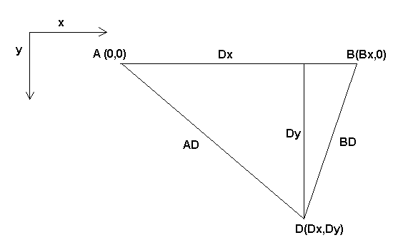
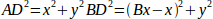
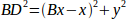
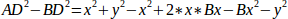
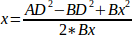
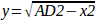
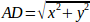
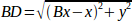

:lang: fr
:toc:

[[cha:kinematics]]
= La cinématique dans LinuxCNC(((cinematiques)))

== Introduction

Habituellement quand nous parlons de machines (((Machines CNC)))CNC,
nous pensons à des machines programmées pour effectuer certains
mouvements et effectuer diverses tâches. Pour avoir une représentation
unifiée dans l'espace de ces machines, nous la faisons correspondre à
la vision humaine de l'espace en 3D, la plupart des machines (sinon
toutes) utilisent un système de coordonnées courant, le système Cartésien.

Le système de coordonnées Cartésiennes est composé de 3 axes (X, Y, Z)
chacun perpendiculaire aux 2 autres. footnote:[Le mot _axes_ est aussi
communément (et incorrectement) utilisé à
propos des machines CNC, il fait référence aux directions des mouvements de la machine.]

Quand nous parlons d'un programme G-code (RS274/NGC) nous parlons d'un
certain nombre de commandes (G0, G1, etc.) qui ont comme paramètres (X-
Y- Z-). Ces positions se référent exactement à des positions
Cartésiennes. Une partie du contrôleur de mouvements de LinuxCNC est
responsable de la translation entre ces positions et les positions
correspondantes de la cinématique (((cinematique))) de la
machinefootnote:[Cinématique: une fonction à deux voies pour transformer un espace Cartésien en espace à articulations].

=== Les articulations par rapport aux axes

Une articulation, pour une machine CNC est un des degrés physiques de
liberté de la machine. Elle peut être linéaire (vis à billes) ou
rotative (table tournante, articulations d'un bras robotisé). Il peut y
avoir n'importe quel nombre d'articulations sur une machine. Par exemple,
un robot classique dispose de 6 articulations et une fraiseuse classique n'en a que 3.

Sur certaines machines, les articulations sont placées de manière à correspondre aux axes cinématiques (articulation 0 le long de l'axe X,
articulation 1 le long de l'axe Y et articulation 2 le long de l'axe Z), ces
machines sont appelées machines Cartésiennes (((Machines
Cartesiennes))) (ou encore machines à cinématiques triviales
(((Cinematique triviale)))). Ce sont les machines les plus courantes
parmi les machines-outils mais elles ne sont pas courantes dans
d'autres domaines comme les machines de soudage (ex: robots de soudage de type puma).

LinuxCNC supports axes with names: X Y Z A B C U V W.  The X Y Z axes
typically refer to the usual Cartesian coordinates. The A B C axes refer to
rotational coordinates about the X Y Z axes respectively.  The U V W axes refer to
additional coordinates that are commonly made colinear to the X Y Z axes respectively.

== Cinématiques triviales

Comme nous l'avons vu, il y a un groupe de machines sur lesquelles
chacun des axes est placé le long d'un des axes Cartésiens. Sur ces
machines le passage, du plan de l'espace Cartésien (le programme
G-code) au plan de l'espace articulation (l'actuateur actuel de la machine), est trivial. C'est un simple plan 1:1:

----
pos->tran.x = joints[0];
pos->tran.y = joints[1];
pos->tran.z = joints[2];
----

Dans l'extrait de code ci-dessus, nous pouvons voir comment le plan
est fait: la position X est identique avec la articulation 0, Y avec la
articulation 1 etc. Nous nous référons dans ce cas à une cinématique
directe (une transformation avant), tandis que dans l'extrait de code
suivant il est fait référence à une cinématique inverse (ou une
transformation inverse):

----
joints[0] = pos->tran.x;
joints[1] = pos->tran.y;
joints[2] = pos->tran.z;
----

Comme on peut le voir, c'est assez simple de faire la transformation
d'une machine à cinématique banale (ou Cartésienne). Cela devient un
peu plus compliqué si il manque un axe à la machine.
footnote:[Si la machine (par exemple un tour) est montée avec seulement les axes
X, Z et A et que le fichier d'init de LinuxCNC contient uniquement la
définition de ces 3 articulations, alors l'assertion précédente est fausse.
Parce-que nous avons actuellement (joint0=x, joint1=Z, joint2=A) ce qui
suppose que joint1=Y. Pour faire en sorte que cela fonctionne dans LinuxCNC
il suffit de définir tous les axes (XYZA), LinuxCNC utilisera alors une
simple boucle dans HAL pour l'axe Y inutilisé.]
footnote:[Une autre façon de le faire fonctionner, est de changer le code correspondant et recompiler le logiciel.]

----
pos->tran.x = joints[0];
pos->tran.y = joints[1];
pos->tran.z = joints[2];
pos->a      = joints[3];
pos->b      = joints[4];
pos->c      = joints[5];
pos->u      = joints[6];
pos->v      = joints[7];
pos->w      = joints[8];
----

Similarly, the default relationships for inverse kinematics for trivkins
are:

----
joints[0] = pos->tran.x;
joints[1] = pos->tran.y;
joints[2] = pos->tran.z;
joints[3] = pos->a;
joints[4] = pos->b;
joints[5] = pos->c;
joints[6] = pos->u;
joints[7] = pos->v;
joints[8] = pos->w;
----

It is straightforward to do the transformation for a trivial "kins" ('trivkins'
kinematics) or Cartesian machine provided that there are no omissions in the
axis letters used.

It gets a bit more complicated if the machine is missing one or more of the
axis letters.  The problems of omitted axis letters is addressed by using the
'coordinates=' module parameter with the trivkins module. Joint numbers are
assigned consecutively to each coordinate specified.  A lathe can be described
with 'coordinates=xz' The joint assignments will then be:

----
joints[0] = pos->tran.x
joints[1] = pos->tran.z
----

Use of the 'coordinates=' parameter is recommended for configurations that omit
axis letters. footnote:[ Historically, the trivkins module did not support the
'coordinates=' parameter so lathe configs were often configured as XYZ
machines.  The unused Y axis was configured to 1) home immediately, 2) use a
simple loopback to connect its position command hal pin to its position
feedback hal pin, and 3) hidden in gui displays. Numerous sim configs use
these methods in order to share common hal files.]

The 'trivkins' kinematics module also allows the same coordinate to be specified
for more than one joint.  This feature can be useful on machines like a gantry
having two independent motors for the y coordinate.  Such a machine could use
'coordinates=xyyz' resulting in joint assignments:

----
joints[0] = pos->tran.x
joints[1] = pos->tran.y
joints[2] = pos->tran.y
joints[3] = pos->tran.z
----

See the trivkins man pages for more information.

== Cinématiques non triviales

Il peut y avoir un certain nombre de types de configurations de
machine (robots: puma, scara; hexapodes etc.) Chacun d'eux est mis en
place en utilisant des articulations linéaires et rotatives. Ces articulations
ne correspondent pas habituellement avec les coordonnées Cartésiennes,
cela nécessite une fonction cinématique qui fasse la conversion (en
fait 2 fonctions: fonction en avant et inverse de la cinématique).

Pour illustrer ce qui précède, nous analyserons une simple cinématique
appelée bipode (une version simplifiée du tripode, qui est déjà une
version simplifiée de l'hexapode).

.Définir un bipode

Le bipode dont nous parlons est un appareil, composé de deux moteurs
placés sur un mur, à cet appareil un mobile est suspendu par des fils.
Les articulations dans ce cas sont les distances entre le mobile et les
moteurs de l'appareil (nommées AD et BD sur la figure ci-dessus).

La position des moteurs est fixée par convention. Le moteur A est en
(0,0), qui signifie que sa coordonnée X est 0 et sa coordonnée Y
également 0. Le moteur B est placé en (Bx, 0), se qui veut dire que sa
coordonnée X est Bx.

Notre pointe mobile se trouvera au point D défini par les distances AD
et BD, et par les coordonnées Cartésiennes Dx, Dy.

La tâche de la cinématique consistera à transformer les longueurs des
articulations en (AD, BD) en coordonnées Cartésiennes (Dx, Dy) et vice-versa.

[[sec:Forward-transformation]]
=== Transformation avant

Pour effectuer la transformation de l'espace articulation en espace
Cartésien nous allons utiliser quelques règles de trigonomètrie (le
triangle rectangle déterminé par les points (0,0), (Dx,0), (Dx,Dy) et le triangle rectangle (Dx,0), (Bx,0) et (Dx,Dy)).

Nous pouvons voir aisément que *AD^2^=x^2^+y^2^*, de même que *BD^2^=(Bx-x)^2^+y^2^*.

likewise:

Si nous soustrayons l'un de l'autre nous aurons: *AD^2^-BD^2^=x^2^+y^2^-x^2^+2*x*Bx-Bx^2^-y^2^*

et par conséquent: *x=(AD^2^-BD^2^+Bx^2^)/(2*Bx)*

De là nous calculons: *y=sqrt(AD^2^-x^2^)*

////////////////////////////////////////////////////////////////////
we can easily see that latexmath:[$AD^{2}=x^{2}+y^{2}$], likewise
latexmath:[$BD^{2}=(Bx-x)^{2}+y^{2}$].

If we subtract one from the other we will get:

latexmath::[\[AD^{2}-BD^{2}=x^{2}+y^{2}-x^{2}+2*x*Bx-Bx^{2}-y^{2}\]]

and therefore:

latexmath::[\[x=\frac{AD^{2}-BD^{2}+Bx^{2}}{2*Bx}\]]

From there we calculate:

latexmath::[\[y=\sqrt{AD^{2}-x^{2}}\]]
////////////////////////////////////////////////////////////////////

Noter que le calcul inclus la racine carrée de la différence, mais
qu'il n'en résulte pas un nombre réel. Si il n'y a aucune coordonnée
Cartésienne pour la position de cette articulation, alors la position est
dite singulière. Dans ce cas, la cinématique inverse
retourne -1.

Traduction en code:

----
double AD2 = joints[0] * joints[0];
double BD2 = joints[1] * joints[1];
double x = (AD2 - BD2 + Bx * Bx) / (2 * Bx);
double y2 = AD2 - x * x;
if(y2 < 0) return -1;
pos->tran.x = x;
pos->tran.y = sqrt(y2);
return 0;
----

=== Transformation inverse

La cinématique inverse est beaucoup plus simple dans notre exemple, de
sorte que nous pouvons l'écrire directement:

/////////////////////////////////////////////////
latexmath::[\[AD=\sqrt{x^{2}+y^{2}}\]]

latexmath::[\[BD=\sqrt{(Bx-x)^{2}+y^{2}}\]]
/////////////////////////////////////////////////

ou traduite en code:

----
double x2 = pos->tran.x * pos->tran.x;
double y2 = pos->tran.y * pos->tran.y;
joints[0] = sqrt(x2 + y2);
joints[1] = sqrt((Bx - pos->tran.x)*(Bx - pos->tran.x) + y2);
return 0;
----

== Détails d'implémentation

Un module cinématique est implémenté comme un composant de HAL, et il
est permis d'exporter ses pins et ses paramètres. Il consiste en
quelques fonctions “C” (par opposition au fonctions de HAL):

----
int kinematicsForward(const double *joint, EmcPose *world,
const KINEMATICS_FORWARD_FLAGS *fflags,
KINEMATICS_INVERSE_FLAGS *iflags)
----

Implémente <<sec:Forward-transformation,la fonction cinématique avant>>.

----
int kinematicsInverse(const EmcPose * world, double *joints,
const KINEMATICS_INVERSE_FLAGS *iflags,
KINEMATICS_FORWARD_FLAGS *fflags)
----

Implements the inverse kinematics function.

----
KINEMATICS_TYPE kinematicsType(void)
----

Returns the kinematics type identifier:

. KINEMATICS_IDENTITY  (each joint number corresponds to an axis letter)
. KINEMATICS_BOTH      (forward and inverse kinematics functions are provided)
. KINEMATICS_FORWARD_ONLY
. KINEMATICS_INVERSE_ONLY

[NOTE]
Guis may interpret KINEMATICS_IDENTITY to hide the distinctions
between joint numbers and axis letters when in joint mode
(typically prior to homing).

----
int kinematicsSwitchable(void)
int kinematicsSwitch(int switchkins_type)
KINS_NOT_SWITCHABLE
----

The function kinematicsSwitchable() returns 1 if multiple
kinematics types are supported.  The function kinematicsSwitch()
selects the kinematics type.
See <<cha:switchable-kinematics,Switchable Kinematitcs>>.

[NOTE]
The majority of provided kinematics modules support a single
kinematics type and use the directive "*KINS_NOT_SWITCHABLE*" to
supply defaults for the required kinematicsSwitchable() and
kinematicsSwitch() functions.

----
int kinematicsHome(EmcPose *world, double *joint,
KINEMATICS_FORWARD_FLAGS *fflags,
KINEMATICS_INVERSE_FLAGS *iflags)
----

The home kinematics function sets all its arguments to their proper
values at the known home position. When called, these should be set,
when known, to initial values, e.g., from an INI file. If the home
kinematics can accept arbitrary starting points, these initial values
should be used.

----
int rtapi_app_main(void)
void rtapi_app_exit(void)
----

These are the standard setup and tear-down functions of RTAPI modules.

When they are contained in a single source file, kinematics modules
may be compiled and installed by 'halcompile'. See the 'halcompile(1)' manpage or
the HAL manual for more information.

=== Kinematics module using the userkins.comp template

Another way to create a custom kinematics module is to adapt the
hal component 'userkins'. This template component can be modified
locally by a user and can be built using halcompile.

See the userkins man pages for more information.

Note that to create switchable kinematic modules the required
modifications are somewhat more complicated.

See 'millturn.comp' as an example of a switchable kinematic
module that was created using the 'userkins.comp' template.

// vim: set syntax=asciidoc:
