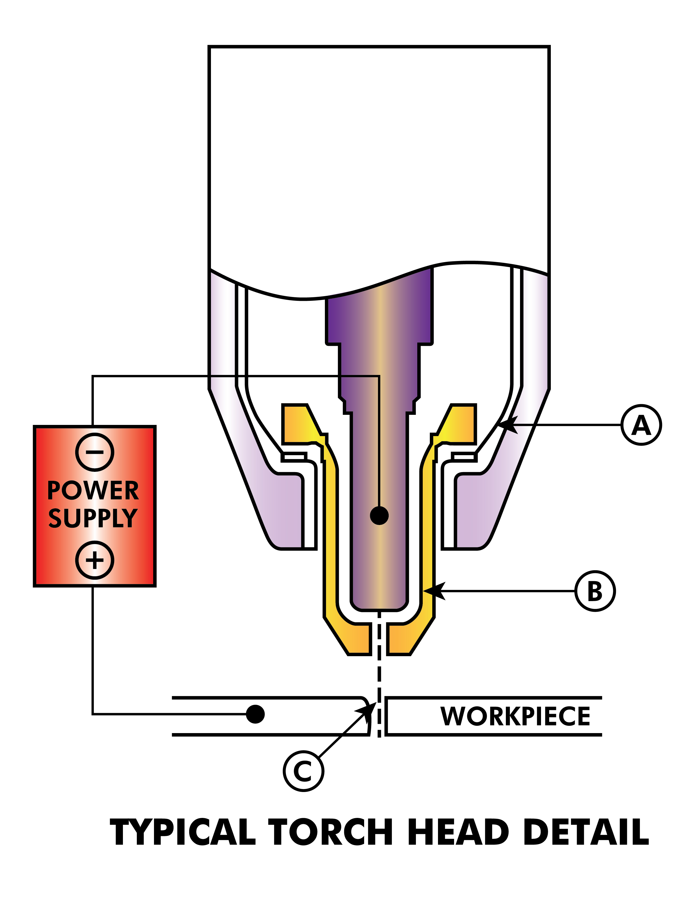
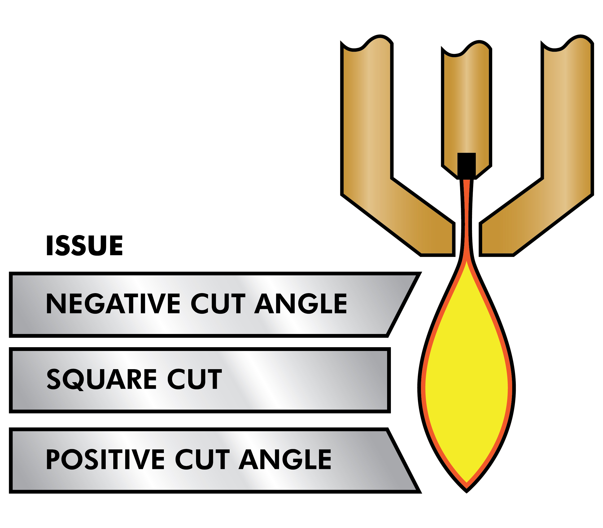
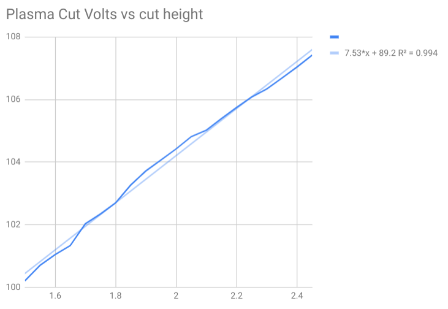
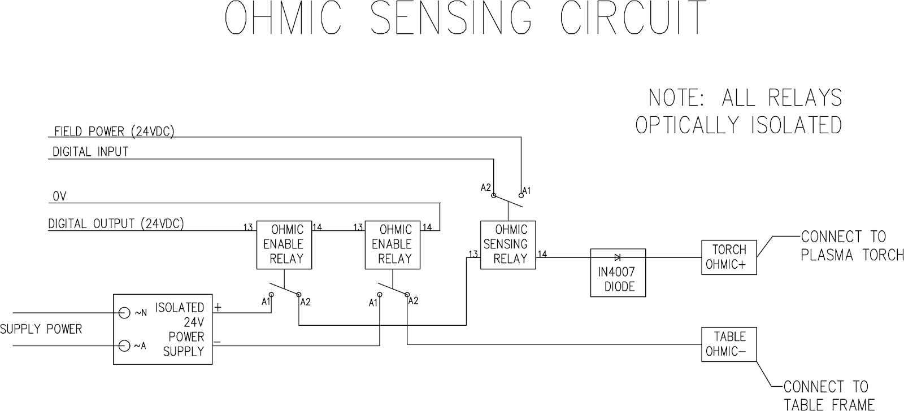
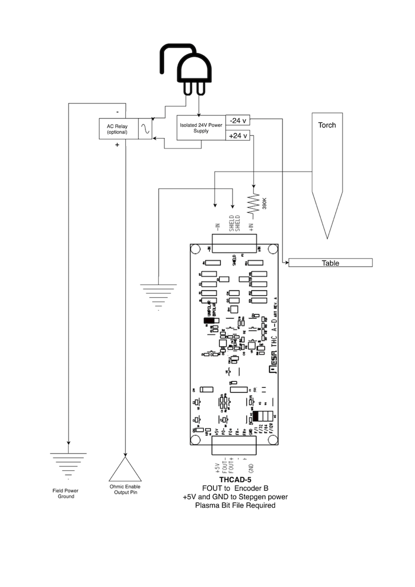
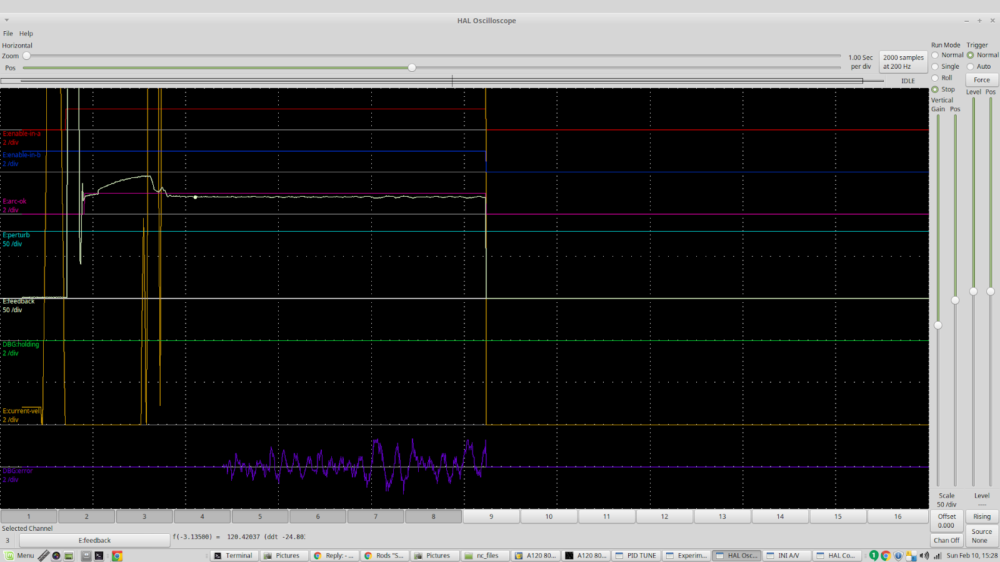
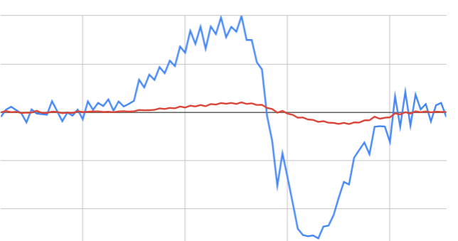

:lang: en
:toc:

[[cha:plasma-primer]]
= Plasma Cutting Primer for LinuxCNC Users(((Plasma Cutting Primer)))

// Custom lang highlight
// must come after the doc title, to work around a bug in asciidoc 8.6.6
:ini: {basebackend@docbook:'':ini}
:hal: {basebackend@docbook:'':hal}
:ngc: {basebackend@docbook:'':ngc}

== What Is Plasma?

Plasma is a fourth state of matter, an ionised gas which has been heated to an extremely high temperature and ionised so that it becomes electrically conductive.
The plasma arc cutting and gouging processes use this plasma to transfer an electrical arc to the workpiece.
The metal to be cut or removed is melted by the heat of the arc and then blown away.
While the goal of plasma arc cutting is the separation of the material, plasma arc gouging is used to remove metals to a controlled depth and width.

Plasma torches are similar in design to the automotive spark plug.
They consist of negative and positive sections separated by a center insulator.
Inside the torch, the pilot arc starts in the gap between the negatively charged electrode and the positively charged tip.
Once the pilot arc has ionised the plasma gas, the superheated column of gas flows through the small orifice in the torch tip, which is focused on the metal to be cut.

In a Plasma Cutting Torch a cool gas enters Zone B, where a pilot arc between the electrode and the torch tip heats and ionises the gas.
The main cutting arc then transfers to the workpiece through the column of plasma gas in Zone C.
By forcing the plasma gas and electric arc through a small orifice, the torch delivers a high concentration of heat to a small area.
The stiff, constricted plasma arc is shown in Zone C.
Direct current (DC) straight polarity is used for plasma cutting, as shown in the illustration.
Zone A channels a secondary gas that cools the torch.
This gas also assists the high velocity plasma gas in blowing the molten metal out of the cut allowing for a fast, slag - free cut.

== Arc Initialisation

There are two main methods for arc initialisation for plasma cutters that are designed for CNC operation.
Whilst other methods are used on some machines (such as scratch start where physical contact with the material is required), they are unsuited for CNC applications..

=== High Frequency Start

This start type is widely employed, and has been around the longest.
Although it is older technology, it works well, and starts quickly.
But, because of the high frequency high voltage power that is required generated to ionise the air, it has some drawbacks.
It often interferes with surrounding electronic circuitry, and can even damage components.
Also a special circuit is needed to create a Pilot arc.
Inexpensive models will not have a pilot arc, and require touching the consumable to the work to start.
Employing a HF circuit also can increase maintenance issues, as there are usually adjustable points that must be cleaned and readjusted from time to time.

=== Blowback Start

This start type uses air pressure supplied to the cutter to force a small piston or cartridge inside the torch head back to create a small spark between the inside surface of the consumable, ionising the air, and creating a small plasma flame.
This also creates a "pilot arc" that provides a plasma flame that stays on, whether in contact with the metal or not.
This is a very good start type that is now used by several manufacturers.
It's advantage is that it requires somewhat less circuitry, is a fairly reliable and generates far less electrical noise.

For entry level air plasma CNC systems, the blowback style is much preferred to minimise electrical interference with electronics and standard PCs,
but the High frequency start still rules supreme in larger machines from 200 A and up.
These require industrial level PCs and electronics,
and even commercial manufacturers have had issues with faults because they have failed to account for electrical noise in their designs.

== CNC Plasma

Plasma operations on CNC machines is quite unique in comparison to milling or turning and is a bit of an orphan process.
Uneven heating of the material from the plasma arc will cause the sheet to bend and buckle.
Most sheets of metal do not come out of the mill or press in a very even or flat state.
Thick sheets (30 mm plus) can be out of plane as much as 50 mm to 100 mm.
Most other CNC G-code operations will start from a known reference or a piece of stock that has a known size and shape
and the G-code is written to rough the excess off and then finally cut the finished part.
With plasma the unknown state of the sheet makes it impossible to generate G-code that will cater for these variances in the material.

A plasma Arc is oval in shape and the cutting height needs to be controlled to minimise bevelled edges.
If the torch is too high or too low then the edges can become excessively bevelled.
It is also critical that the torch is held perpendicular to the surface.

* *Torch to work distance can impact edge bevel*

* *Negative cut angle:* torch too low, increase torch to work distance.
* *Positive cut angle:* torch too high, decrease torch to work distance.

[NOTE]
A slight variation in cut angles may be normal, as long as it is within tolerance.

The ability to precisely control the cutting height in such a hostile and ever changing environment is a very difficult challenge.
Fortunately there is a very linear relationship between Torch height (Arc length) and arc voltage as this graph shows.

This graph was prepared from a sample of about 16,000 readings at varying cut height and the regression analysis shows 7.53 V/mm with 99.4% confidence.
In this particular instance this sample was taken from an Everlast 50 A machine being controlled by LinuxCNC.

Torch voltage then becomes an ideal process control variable to use to adjust the cut height.
Let's assume for simplicity that voltage changes by 10 V/mm.
This can be restated to be 1 Volt per 0.1 mm (0.004").
Major plasma machine manufacturers (eg Hypertherm, Thermal Dynamics and ESAB),
produce cut charts that specify the recommended cut height and estimated arc voltage at this height as well as some additional data.
So if the arc voltage is 1 V higher than the manufacturers specification, the controller simply needs to lower the torch by 0.1 mm (0.004") to move back to the desired cut height.
A torch height control unit (THC) is traditionally used to manage this process.

== Choosing a Plasma Machine for CNC operations

There are a plethora of plasma machines available on the market today and not all of them are suited for CNC use.
CNC Plasma cutting is a complex operation and it is recommended that integrators choose a suitable plasma machine.
Failure to do this is likely to cause hours and hours of fruitless trouble shooting trying to work around the lack of what many would consider to be mandatory features.

Whilst rules are made to be broken if you fully understand the reasons the rule apply, we consider a new plasma table builder should select a machine with the following features:

- Blowback start to minimise electrical noise to simplify construction
- A Machine torch is preferred but many have used hand torches.
- A fully shielded torch tip to allow ohmic sensing

If you have the budget, a higher end machines will supply:

- Manufacturer provided cut charts which will save many hours and material waste calibrating cut parameters
- Dry Contacts for ArcOK
- Terminals for Arc On switch
- Raw arc voltage or divided arc voltage output
- Optionally a RS485 interface if using a Hypertherm plasma cutter and want to control it from the LinuxCNC console.
- Higher duty cycles

In recent times, another class of machine which includes some of these features has become available at around USD $550.
One example is the Herocut55i available on Amazon but there is yet no feedback from users.
This Machine features a blowback torch, ArcOK output, torch start contacts and raw arc voltage.

== Types Of Torch Height Control

Most THC units are external devices and many have a fairly crude “bit bang" adjustment method.
They provide two signals back to the LinuxCNC controller.
One turns on if the Z axis should move up and the other turns on if the Z axis should move down.
Neither signal is true if the torch is at the correct height.
The popular Proma 150 THC is one example of this type of THC.
The LinuxCNC THCUD component is designed to work with this type of THC.

With the release of the Mesa THCAD voltage to frequency interface, LinuxCNC was able to decode the actual torch voltage via an encoder input.
This allowed LinuxCNC to control the Z axis and eliminate external hardware.
Early implementations utilising the THCAD replicated the “bit bang" approach.
The LinuxCNC THC component is an example of this approach.

Jim Colt of Hypertherm is on record saying that the best THC controllers were fully integrated into the CNC controller itself.
Of course he was referring to high end systems manufactured by Hypertherm, Esab, Thermal Dynamics and others such as Advanced Robotic Technology in Australia, little dreaming that open source could produce systems using this approach that rival high end systems.

The inclusion of external offsets in LinuxCNC V2.8 allowed plasma control in LinuxCNC to rise to a whole new level.
External Offsets refers to the ability to apply an offset to the axis commanded position external to the motion controller.
This is perfect for plasma THC control as a method to adjust the torch height in real time based on our chosen process control methodology.
Following a number of experimental builds, the Plasmac configuration was incorporated into LinuxCNC 2.8.
link:./qtplasmac.html[QtPlasmaC] has superceded Plasmac in LinuxCNC 2.9.
This has been an extremely ambitious project and many people around the globe have been involved in testing and improving the feature set.
QtPlasmaC is unique in that its design goal was to support all THCs including the simple bit bang ones through to sophisticated torch voltage control,
if the voltage is made available to LinuxCNC via a THCAD or some other voltage sensor.
What's more, QtPlasmaC is designed to be a stand alone system that does not need any additional G-code subroutines
and allows the user to define their own cut charts that are stored in the system and accessible by a drop-down.

== Arc OK Signal

Plasma machines that have a CNC interface contain a set of dry contacts (eg a relay) that close when a valid arc is established and each side of these contacts are bought out onto pins on the CNC interface.
A plasma table builder should connect one side of these pins to field power and the other to an input pin.
This then allows the CNC controller to know when a valid arc is established and also when an arc is lost unexpectedly.
There is a potential trap here when the input is a high impedance circuit such as a Mesa card.
If the dry contacts are a simple relay, there is a high probability that the current passing through the relay is less than the minimum current specification.
Under these conditions, the relay contacts can suffer from a buildup of oxide which over time can result in intermittent contact operation.
To prevent this from happening, a pull down resistor should be installed on the controller input pin.
Care should be taken to ensure that this resistor is selected to ensure the minimum current passes through the relay and is of sufficient wattage to handle the power in the circuit.
Finally, the resistor should be mounted in such a way that the generated heat does not damage anything whilst in operation.

If you have an ArcOK signal, it is recommended it is used over and above any synthesised signal to eliminate potential build issues.
A synthesised signal available from an external THC or QtPlasmaC's Mode 0 can't fully replace the ArcOK circuitry in a plasma inverter.
Some build issues have been observed where misconfiguration or incompatibility with the plasma inverter has occurred from a synthesised ArcOK signal.
By and large however, a correctly configured synthesised ArcOK signal is fine.

A simple and effective ArcOK signal can be achieved with a simple reed relay.
Wrap 3 turns of one of the plasma cutter's thick cables, e.g. the material clamp cable, around it.
Place the relay in an old pen tube for protection and  connect one side of the relay to field power and the other end to your ArcOK input pin.

== Initial Height Sensing

Because the cutting height is such a critical system parameter and the material surface is inherently uneven, a Z axis mechanism needs a method to sense the material surface.
There are three methods this can be achieved:

. Current sensing to detect increased motor torque,
. a “float" switch and an electrical or
. an “ohmic" sensing circuit that is closed when the torch shield contacts the material.

Current sensing is not a viable technique for DIY tables but float switches and ohmic sensing are discussed below:

=== Float Switches

The torch is mounted on a sliding stage that can move up when the torch tip contacts the material surface and trigger a switch or sensor.
Often this is achieved under G-code control using the G38 commands.
If this is the case, then after initial probing, it is recommended to probe away from the surface until the probe signal is lost at a slower speed.
Also, ensure the switch hysteresis is accounted for.

Regardless of the probing method used, it is strongly recommended that float switch is implemented so that there is a fallback or secondary signal to avoid damage to the torch from a crash.

[[ohmic-sensing]]
=== Ohmic Sensing

Ohmic sensing relies on contact between the torch and the material acting as a switch to activate an electrical signal that is sensed by the CNC controller.
Provided the material is clean, this can be a much more accurate method of sensing the material than a float switch which can cause deflection of the material surface.
This ohmic sensing circuit is operating in an extremely hostile environment so a number of failsafes need to be implemented to ensure safety of both the CNC electronics and the operator.
In plasma cutting, the earth clamp attached to the material is positive and the torch is negative.
It is recommended that:

. Ohmic sensing only be implemented where the torch has a shield that is isolated from the torch tip that conveys the cutting arc.
. The ohmic circuit uses a totally separate isolated power supply that activates an opto-isolated relay to enable the probing signal to be transmitted to the CNC controller.
. The positive side of the circuit should be at the torch
. Both sides of the circuit needs to be isolated by opto-isolated relays until probing is being undertaken
. Blocking diodes be used to prevent arc voltage entering the ohmic sensing circuit.

The following is an example circuit that has been proven to work and is compatible with the LinuxCNC QtPlasmaC configuration.

=== Hypersensing with a MESA THCAD-5

A more sophisticated method of material sensing that eliminates the relays and diodes is to use another THCAD-5 to monitor the material sensing circuit voltage from an isolated power supply.
The advantage this has is the THCAD is designed for the hostile plasma electrical environment and totally and safely isolates the logic side from the high voltage side.

To implement this method, a second encoder input is required.

If using a mesa card, different firmware is available to provide 2 additional Encoder A inputs on the Encoder B and Encoder Index pins.
This firmware is available for download for the 7I76E and 7I96 boards from the Mesa web site on the product pages.

The THCAD is sensitive enough to see the ramp up in  circuit voltage as contact pressure increases.
The ohmic.comp component included in LinuxCNC can monitor the sensing voltage and set a voltage threshold above which it is deemed contact is made and an output is enabled.
By monitoring the voltage, a lower “break circuit"  threshold can be set to build in strong switch hysteresis.
This minimises false triggering.
In our testing, we found the material sensing using this method was more sensitive and robust as well as being simpler to implement the wiring.
One further advantage is using software outputs instead of physical I/O pins is that it frees up pins to use for other purposes.
This advantage is helpful to get the most out of the Mesa 7I96 which has limited I/O pins.

The following circuit diagram shows how to implement a hypersensing circuit.

We used a 15 W Mean Well HDR-15 Ultra Slim DIN Rail Supply 24 V DIN rail based isolated power supply.
This is a double insulated Isolation Class II device that will withstand any arc voltage that might be applied to the terminals.

=== Example HAL Code for Hypersensing

The following HAL code can be pasted into your QtPlasmaC's custom.hal to enable Ohmic sensing on Encoder 2 of a 7I76E.
Install the correct bit file and connect the THCAD to IDX+ and IDX-.
Be sure to change the calibration settings to agree with your THCAD-5.

[source,{hal}]
----
# --- Load the Component ---
loadrt ohmic names=ohmicsense
addf ohmicsense servo-thread

# --- 7I76E ENCODER 2 SETUP FOR OHMIC SENSING---
setp hm2_7i76e.0.encoder.02.scale -1
setp hm2_7i76e.0.encoder.02.counter-mode 1

# --- Configure the component ---
setp ohmicsense.thcad-0-volt-freq    140200
setp ohmicsense.thcad-max-volt-freq  988300
setp ohmicsense.thcad-divide         32
setp ohmicsense.thcad-fullscale      5
setp ohmicsense.volt-divider         4.9
setp ohmicsense.ohmic-threshold      22.0
setp ohmicsense.ohmic-low            1.0
net ohmic-vel ohmicsense.velocity-in <= hm2_7i76e.0.encoder.02.velocity

# --- Replace QtPlasmaC's Ohmic sensing signal ---
unlinkp db_ohmic.in
net ohmic-true ohmicsense.ohmic-on => db_ohmic.in
net plasmac:ohmic-enable    =>  ohmicsense.is-probing
----

== THC Delay

When an arc is established, arc voltage peaks significantly and then settles back to a stable voltage at cut height.
As shown by the green line in the image below.

It is important for the plasma controller to “wait it out" before auto sampling the torch voltage and commencing THC control.
If enabled too early, the voltage will be above the desired cut Volts and the torch will be driven down in an attempt to address a perceived over-height condition.

In our testing this varies between machines and material from 0.5 to 1.5 seconds.
Therefore a delay of 1.5 s after a valid ArcOK signal is received before enabling THC control is a safe initial setting.
If you want to shorten this for a given material,
LinuxCNC's Halscope will allow you to plot the torch voltage and make informed decisions about the shortest safe delay is used.

[NOTE]
If the cut velocity is not near the desired cut speed at the end of this delay, the controller should wait until this is achieved before enabling the THC.

== Torch Voltage Sampling

Rather than relying on the manufacturer's cut charts to set the desired torch voltage, many people (the writer included) prefer to sample the voltage as the THC is enabled and use that as a set point.

== Torch Breakaway

It is recommended that a mechanism is provided to allow the torch to “break away" or fall off in the case of impact with the material or a cut part that has tipped up.
A sensor should be installed to allow the CNC controller to detect if this has occurred and pause the running program.
Usually a break away is implemented using magnets to secure the torch to the Z axis stage.

== Corner Lock / Velocity Anti-Dive

The LinuxCNC trajectory planner is responsible for translating velocity and acceleration commands into motion that obey the laws of physics.
For example, motion will slow when negotiating a corner.
Whilst this is not a problem with milling machines or routers, this poses a particular problem for plasma cutting as the arc voltage increases as motion slows.
This will cause the THC to drive the torch down.
One of the enormous advantages of a THC control embedded within the LinuxCNC motion controller is that it knows what is going on at all times.
So it becomes a trivial matter to monitor the current velocity (`motion.current-velocity`) and to hold THC operation if it falls below a set threshold (e.g., 10% below the desired feedrate).

== Void / Kerf Crossing

If the plasma torch passes over a void while cutting,
arc voltage rapidly rises and the THC responds by violent downward motion which can smash the torch into the material possibly damaging it.
This is a situation that is difficult to detect and handle.
To a certain extent it can be mitigated by good nesting techniques but can still occur on thicker material when a slug falls away.
This is the one problem that has yet to be solved within the LinuxCNC open source movement.

One suggested technique is to monitor the rate of change in torch Volts over time (dv/dt)
because this parameter is orders of magnitude higher when crossing a void than what occurs due to normal warpage of the material.
The following graph shows a low resolution plot of dv/dt (in blue) while crossing a void.
The red curve is a moving average of torch Volts.

So it should be possible to compare the moving average with the dv/dt and halt THC operation once the dv/dt exceeds the normal range expected due to warpage.
More work needs to be done in this area to come up with a working solution in LinuxCNC.

== Hole And Small Shape Cutting

It is recommended that you slow down cutting when cutting holes and small shapes.

John Moore says: “If you want details on cutting accurate small holes look up the sales sheets on Hypertherm's 'True Hole Technology' also look on PlasmaSpider, user seanp has posted extensively on his work using simple air plasma.

The generally accepted method to get good holes from 37mm dia. and down to material thickness with minimal taper using an air plasma is:

. Use recommended cutting current for consumables.
. Use fixed (no THC) recommended cutting height for consumables.
. Cut from 60% to 70% of the recommended feed rate of consumables and materials.
. Start lead in at or near center of hole.
. Use perpendicular lead in.
. No lead out, either a slight over burn or early torch off depending on what works best for you.

You will need to experiment to get exact hole size because the kerf with this method will be wider than your usual straight cut."

This slow down can be achieved by manipulating the feed rate directly in your post processor or by using adaptive feed and an analog pin as input.
This lets you use M67/M68 to set the percentage of desired feed to cut at.

- Knowing The Feedrate

From the preceding discussion it is evident that the plasma controller needs to know the feed rate set by the user.
This poses a problem with LinuxCNC because the Feedrate is not saved by LinuxCNC after the G-code is buffered and parsed.
There are two approaches to work around this:

. Remap the F command and save the commanded feedrate set in G-code via an M67/M68 command.
. Storing the cut charts in the plasma controller and allow the current feedrate be queried by the G-code program (as QtPlasmaC does).

A feature newly added to LinuxCNC 2.9 that is useful for plasma cutting are the state tags.
This adds a “tag" that is available to motion containing the current feed and speed rates for all active motion commands.

== I/O Pins For Plasma Controllers

Plasma cutters require several additional pins.
In LinuxCNC, there are no hard and fast rules about which pin does what.
In this discussion we will assume the plasma inverter has a CNC interface and the controller card has active high inputs are in use (e.g., Mesa 7I76E).

Plasma tables can be large machines and we recommend that you take the time to install separate max/min limit switches and homing switches for each joint.
The exception might be the Z axis lower limit.
When a homing switch is triggered the joint decelerates fairly slowly for maximum accuracy.
This means that if you wish to use homing velocities that are commensurate with table size, you can overshoot the initial trigger point by 50-100 mm.
If you use a shared home/limit switch, you have to move the sensor off the trigger point with the final HOME_OFFSET or you will trigger a limit switch fault as the machine comes out of homing.
This means you could lose 50 mm or more of axis travel with shared home/limit switches.
This does not happen if separate home and limit switches are used.

The following pins are usually required (note that suggested connections may not be appropriate for a QtPlasmaC configuration):

=== Arc OK (input)

* Inverter closes dry contacts when a valid arc is established
* Connect Field power to one Inverter ArcOK terminal.
* Connect other Inverter Ok Terminal to input pin.
* Usually connected to one of the ``motion.digital-``_<nn>_ pins for use from G-code with M66

=== Torch On (output)

* Triggers a relay to close the torch on switch in the inverter.
* Connect the torch on terminals on the inverter to the relay output terminals.
* Connect one side of the coil to the output pin.
* Connect the other side of the coil to Field Power ground.
* If a mechanical relay is used, connect a flyback diode (e.g., IN400x series) across the coil terminals with the band on the diode pointing towards the output pin.
* If a Solid State Relay is used, polarity may need to be observed on the outputs.
* In some circumstances, the onboard spindle relay on a Mesa card can be used instead of an external relay.
* Usually connected to `spindle.0.on`.

WARNING: It is strongly recommended that the torch cannot be enabled while this pin is false otherwise the torch will not be extinguished when estop is pressed.

=== Float switch (input)

* Used for surface probing. A sensor or switch that is activated if the torch slides up when it hits the material.
* Connect proximity sensor output to chosen input pin. If mechanical switches are used. Connect one side of the switch to field power and the other side of the switch to input.
* Usually connected to `motion.probe-input`.

=== Ohmic Sensor enable (output)

* See the <<ohmic-sensing,ohmic sensing>> schematic.
* Connect output pin to one side of the isolation relays and the other side to field power ground.
* In a non-QtPlasmaC configuration, usually triggered by a ``motion.digital-out-``_<nn>_ so it can be controlled in G-code by `M62`/`M63`/`M64`/`M65`.

=== Ohmic Sensing (input)

* Take care to follow the <<ohmic-sensing,ohmic sensing>> schematic shown previously.
* An isolated power supply triggers a relay when the torch shield contacts the material.
* Connect field power to one output terminal and the other to the input.
* Take care to observe relay polarity if opto-coupled solid State relays are used.
* Usually connected to `motion.probe-input` and may be or'd with the float switch.

As can be seen, plasma tables are pin intensive and we have already consumed about 15 inputs before the normal estops are added.
Others have other views but it is the writer's opinion that the Mesa 7I76E is preferred over the cheaper 7I96 to allow for MPG's,
scale and axis selection switch and other features you may wish to add over time.
If your table uses servos, there are a number of alternatives.
Whilst there are other suppliers, designing your machine around the Mesa ecosystem will simplify use of their THCAD board to read arc voltage.

=== Torch Breakaway Sensor

* As mentioned earlier, a breakaway sensor should be installed that is triggered if the torch crashes and falls off.
* Usually, this would be connected to `halui.program-pause` so the fault can be rectified and the program resumed.

== G-code For Plasma Controllers

Most plasma controllers offer a method to change settings from G-code.
LinuxCNC support this via `M67`/`M68` for analog commands and `M62`-`M65` for digital (on/off commands).
How this is implemented is totally arbitrary.
Lets look at how the LinuxCNC QtPlasmaC configuration does this:

.Select Material Settings in QtPlasmaC and Use the Feedrate for that Material.
[source,{ngc}]
----
M190 Pn
M66 P3 L3 Q1
F#<_hal[plasmac.cut-feed-rate]>
M3 S1
----

NOTE: Users with a very large number of entries in the QtPlasmaC Materials Table may need to increase the Q parameter (e.g., from Q1 to Q2).

=== Enable/Disable THC Operation:

[source,{ngc}]
----
M62 P2 will disable THC (synchronised with motion)
M63 P2 will enable THC (synchronised with motion)
M64 P2 will disable THC (immediately)
M65 P2 will enable THC (immediately)
----

.Reduce Cutting Speeds: (e.g., for hole cutting)
[source,{ngc}]
----
M67 E3 Q0 would set the velocity to 100% of requested~speed
M67 E3 Q40 would set the velocity to 40% of requested~speed
M67 E3 Q60 would set the velocity to 60% of requested~speed
M67 E3 Q100 would set the velocity to 100% of requested~speed
----

.Cutter Compensation:
[source,{ngc}]
----
G41.1 D#<_hal[plasmac_run.kerf-width-f]> ; for left of programmed path
G42.1 D#<_hal[plasmac_run.kerf-width-f]> for right of programmed path
G40 to turn compensation off
----

NOTE: Integrators should familiarise themselves with the LinuxCNC documentation for the various LinuxCNC G-code commands mentioned above.

== External Offsets and Plasma Cutting

External Offsets were introduced to LinuxCNC with version 2.8.
By external, it means that we can apply an offset external to the G-code that the trajectory planner knows nothing about.
It easiest to explain with an example.
Picture a lathe with an external offset being applied by a mathematical formula to machine a lobe on a cam.
So the lathe is blindly spinning around with the cut diameter set to a fixed diameter
and the external offset moves the tool in and out to machine the cam lobe via an applied external offset.
To configure our lathe to machine this cam, we need to allocate some portion of the axis velocity and acceleration to external offsets or the tool can't move.
This is where the INI variable OFFSET_AV_RATIO comes in.
Say we decide we need to allocate 20% of the velocity and acceleration to the external offset to the Z axis.
We set this equal to 0.2.
The consequence of this is that your maximum velocity and acceleration for the Lathe's Z axis is only 80% of what it could be.

External offsets are a very powerful method to make torch height adjustments to the Z axis via a THC.
But plasma is all about high velocities and rapid acceleration so it makes no sense to limit these parameters.
Fortunately in a plasma machine, the Z axis is either 100% controlled by the THC or it isn't.
During the development of LinuxCNC's external offsets it was recognised that Z axis motion by G-code and by THC were mutually exclusive.
This allows us to trick external offsets into giving 100 % of velocity and acceleration all of the time.
We can do this by doubling the machine's Z axis velocity and acceleration settings in the INI file and set OFFSET_AV_RATIO = 0.5.
That way 100% of the maximum velocity and acceleration will be available for both probing and THC.

Example:
On a metric machine with a NEMA23 motor with a direct drive to a 5 mm ball screw, 60 mm/s maximum velocity and 700 mm/s^2^ acceleration were determined to be safe values without loss of steps.
For this machine, set the Z axis in the INI file as follows:

[source,{ini}]
----
[AXIS_Z]
OFFSET_AV_RATIO = 0.5
MAX_VELOCITY = 120
MAX_ACCELERATION = 1400
----

The joint associated with this axis would have the velocity and acceleration variables set as follows:

[source,{ini}]
----
[JOINT_n]
MAX_VELOCITY = 60
MAX_ACCELERATION = 700
----

For further information about external offsets (for version 2.8 or later) please read the <<sub:ini:sec:axis-letter,[AXIS_<letter>] Section>> of the INI file document and <<cha:external-offsets,External Axis Offsets>> in the LinuxCNC documentation.

== Reading Arc Voltage With The Mesa THCAD

The Mesa THCAD board is a remarkably well priced and accurate voltage to frequency converter that is designed for the hostile noisy electrical environment associated with plasma cutting.
Internally it has a 0-10 V range.
This range can be simply extended by the addition of some resistors as described in the documentation.
This board is available in three versions, the newer THCAD-5 with a 0-5 V range, the THCAD-10 with a 0-10 Volt range and the THCAD-300 which is pre-calibrated for a 300 Volt extended range.
Each board is individually calibrated and a sticker is applied to the board that states the frequency at 0 Volts and full scale.
For use with LinuxCNC, it is recommended that the 1/32 divisor be selected by the appropriate link on the board.
In this case, be sure to also divide the stated frequencies by 32.
This is more appropriate for the 1 kHz servo thread and also allows more time for the THCAD to average and smooth the output.

There is a lot of confusion around how to decode the THCAD output.
So let's consider the Mesa 7I76E and the THCAD-10 for a moment with the following hypothetical calibration data:

* Full scale ≙ 928 kHz (928 kHz/32 = 29 kHz)
* 0 V ≙ 121.6 kHz (121.6 kHz/32 = 3.8 kHz)

Because the full scale is 10 Volts, then the frequency per Volt is:

(29000 Hz - 3800 Hz) / 10 V = 2520 Hz per Volt

So assuming we have a 5 Volt input, the calculated frequency would be:

(2520 Hz/V * 5 V) + 3800 Hz = 16400 Hz

So now it should be fairly clear how to convert the frequency to its voltage equivalent:

Voltage = (frequency [Hz] - 3800 Hz) / (2520 Hz/V)

=== THCAD Connections

On the high voltage side:

* Connect the divided or raw arc voltage to I~N~+ and I~N~-
* Connect the interconnect cable shield to the Shield connection.
* Connect the other Shield terminal to frame ground.

Assuming it is connected to a Mesa 7I76E, connect the output to the spindle encoder input:

* THCAD +5 V to TB3 Pin 6 (+5 VP)
* THCAD -5 V to TB3 Pin 1 (GND)
* THCAD FOUT+ to TB3 Pin 7 (ENC A+)
* THCAD FOUT- to TB3 Pin 8 (ENC A-)

=== THCAD Initial Testing

Make sure you have the following lines in your INI file (assuming a Mesa 7I76E):

[source,{hal}]
----
setp hm2_7i76e.0.encoder.00.scale -1
setp hm2_7i76e.0.encoder.00.counter-mode 1
----

Power up your controller and open Halshow (AXIS: Show Homing Configuration), drill down to find the `hm2_7i76e.0.encoder.00.velocity pin`.
With 0 Volts applied, it should be hovering around the 0 Volt frequency (3,800 in our example).
Grab a 9 Volt battery and connect it to I~N~+ and I~N~-.
For a THCAD-10 you can now calculate the expected velocity (26,480 in our hypothetical example).
If you pass this test, then you are ready to configure your LinuxCNC plasma controller.

=== Which Model THCAD To Use?

The THCAD-5 is useful if you intend to use it for ohmic sensing.
There is no doubt the THCAD-10 is the more flexible device and it is easy to alter the scaling.
However, there is one caveat that can come into play with some cheaper plasma cutters with an inbuilt voltage divider.
That is, the internal resistors may be sensed by the THCAD as being part of its own external resistance and return erroneous results.
For example, the 16:1 divider on the Everlast plasma cutters needs to be treated as 24:1 (and 50:1 becomes 75:1).
This is not a problem with more reputable brands (e.g., Thermal Dynamics, Hypertherm, ESAB etc).
So if you are seeing lower than expected cutting voltages, it might be preferable to reconfigure the THCAD to read raw arc voltage.

Remembering that plasma arc voltages are potentially lethal, here are some suggested criteria.

.Pilot Arc Start

Because there is not likely to be any significant EMI, you should be able to safely install the THCAD in your control panel if you have followed our construction guidelines.

* If you do not have a voltage divider, either install scaling resistors inside the plasma cutter and install the THCAD in the control panel or follow the suggestions for HF start machines.
* If you have a voltage divider, install a THCAD-10 in your control panel. We've had no problems with this configuration with a 120 A Thermal Dynamics plasma cutter.

.HF Start

Install the THCAD at the inverter as the frequency signal is far more immune to EMI noise.

* If you do not have a voltage divider and you have room inside the plasma cutter, install a THCAD-300 inside the plasma cutter.
* If you do not have a voltage divider and you do not have room inside the plasma cutter, install a THCAD-10 in a metal case outside the plasma cutter and install 50% of the scaling resistance on each of the I~N~+ and I~N~- inside the plasma cutter case so no lethal voltages come out of the case.
* If you have a voltage divider, install a THCAD-10 in a metal case outside the plasma cutter

.Raw Arc voltage presented on a connector

In this case, regardless of the arc starting method, there are probably already resistors included in the circuitry to avoid lethal shocks so a THCAD-10 is advised so this resistance (typically 200 kΩ) can be accounted for when choosing a scaling resistor as these resistors will distort the voltage reported by the THCAD-300.

== Post Processors And Nesting

Plasma is no different to other CNC operations in that it is:

. Designed in CAD (where it is output as a DXF or sometimes SVG format).
. Processed in CAM to generate final G-code that is loaded to the machine
. Cutting the parts via CNC G-code commands.

Some people achieve good results with Inkscape and G-code tools but SheetCam is a very well priced solution and there are a number of post processors available for LinuxCNC. SheetCam has a number of advanced features designed for plasma cutting and for the price, is a no brainer for anybody doing regular plasma cutting.

== Designing For Noisy Electrical Environments

Plasma cutting is inherently an extremely hostile and noisy electrical environment.
If you have EMI problems things won't work correctly.
You might fire the torch and the computer will reboot in a more obvious example, but you can have any number of other odd symptoms.
They will pretty much all happen only when the torch is cutting - often when it is first fired.

Therefore, system builders should select components carefully and design from the ground up to cope with this hostile environment to avoid the impact of Electro-Magnetic Interference (EMI).
Failure to do this could result in countless hours of fruitless troubleshooting.

Choosing ethernet boards such as the Mesa 7I76E or the cheaper 7I96 helps by allowing the PC to be located away from the electronics and the plasma machine.
This hardware also allows the use of 24 Volt logic systems which are much more noise tolerant.
Components should be mounted in a metal enclosure connected to the mains earth.
It is strongly recommended that an EMI filter is installed on the mains power connection.
The simplest way is to use a EMI filtered mains power IEC connector commonly used on PC's and electric appliances which allows this to be achieved with no extra work.
Plan the layout of components in the enclosure so that mains power, high voltage motor wires and logic signals are kept as separate as possible from each other.
If they do have to cross, keep them at 90 degrees.

Peter Wallace from Mesa Electronics suggests:
"If you have a CNC compatible plasma source with a voltage divider, I would mount the THCAD inside your electronics enclosure with all the other motion hardware.
If you have a manual plasma source and you are reading raw plasma voltage, I would mount the THCAD as close to the plasma source as possible (even inside the plasma source case if it fits).
In this case, make sure that all low side THCAD connections are fully isolated from the plasma source.
If you use a shielded box for the THCAD, the shield should connect to your electronic enclosure ground, not the plasma source ground."

It is recommended to run a separate earth wire from motor cases and the torch back to a central star grounding point on the machine.
Connect the plasma ground lead to this point and optionally an earth rod driven into the ground as close as possible to the machine (particularly if its a HF start plasma machine).

External wiring to motors should be shielded and appropriately sized to handle the current passing through the circuit.
The shield should be left unconnected at the motor end and earthed at the control box end.
Consider using an additional pin on any connectors into the control box so the earth can be extended through into the control box and earthed to the chassis right at the stepper/servo motor controller itself.

We are aware of at least one commercial system builder who has had problems with induced electrical noise on the ohmic sensing circuit.
Whilst this can be mitigated by using ferrite beads and coiling the cable, adding a feed through power line filter is also recommended where the ohmic sensing signal enters the electronics enclosure.

Tommy Berisha, the master of building plasma machines on a budget says:
“If on a budget, consider using old laptop power bricks.
They are very good, filtering is good, completely isolated, current limited (this becomes very important when something goes wrong),
and fitting 2 or 3 of them in series is easy as they are isolated.
Be aware that some do have the grounding wired to the negative output terminal, so it has to be disconnected, simply done by using a power cable with no ground contacts."

== Water Tables

The minimum water level under the cut level of the torch should be around 40 mm,
having space under slats is nice so the water can level and escape during cutting,
having a bit of water above the metal plate being cut is really nice
as it gets rid of the little bit of dust, running it submerged is the best way but not preferable for systems with part time use as it will corrode the torch.
Adding baking soda to the water will keep the table in a nice condition for many years as it does not allow corrosion while the slats are under water and it also reduces the smell of water vapour.
Some people use a water reservoir with a compressed air inlet so they can push the water from the reservoir up to the water table on demand and thus allow changes in water levels.

== Downdraft Tables

Many commercial tables utilise a down draft design so fans are used to suck air down through the slats to capture fumes and sparks.
Often tables are zoned so only a section below the torch is opened to the outgoing vent, often using air rams and air solenoids to open shutters.
Triggering these zones is relatively straightforward if you use the axis or joint position from one of the motion pins and the lincurve component to map downdraft zones to the correct output pin.

== Designing For Speed And Acceleration

In plasma cutting, speed and acceleration are king.
The higher the acceleration, the less the machine needs to slow down when negotiating corners.
This implies that the gantry should be as light as possible without sacrificing torsional stiffness.
A 100 mm x 100 mm x 2 mm aluminium box section has equivalent torsional stiffness to an 80 mm x 80 mm T slot extrusion yet is 62% lighter.
So does the convenience of T slots outweigh the additional construction?

== Distance Travelled Per Motor Revolution

Stepper motors suffer from resonance and a direct drive pinion is likely to mean that the motor is operating under unfavourable conditions.
Ideally, for plasma machines a distance of around 15-25 mm per motor revolution is considered ideal but even around 30 mm per revolutions is still acceptable.
A 5 mm pitch ball screw with a 3:1 or 5:1 reduction drive is ideal for the Z axis.

== QtPlasmaC LinuxCNC Plasma Configuration

The link:./qtplasmac.html[QtPlasmaC] which is comprised of a HAL component (plasmac.hal) plus a complete configurations for the QtPlasmaC GUI has received considerable input from many in the LinuxCNC Open Source movement that have advanced the understanding of plasma controllers since about 2015.
There has been much testing and development work in getting QtPlasmaC to its current working state.
Everything from circuit design to G-code control and configuration has been included.
Additionally, QtPlasmaC supports external THC's such as the Proma 150 but really comes into its own when paired with a Mesa controller as this allows the integrator to include the Mesa THCAD voltage to frequency converter which is purpose built to deal with the hostile plasma environment.

QtPlasmaC is designed to stand alone and includes the ability to include your cutting charts yet also includes features to be used with a post processor like SheetCam.

The QtPlasmaC system is now included in Version 2.9 and above of LinuxCNC.
It is now quite mature and has been significantly enhanced since the first version of this guide was written.
QtPlasmaC will define LinuxCNC's plasma support for many years to come as it includes all of the features a proprietary high end plasma control system at an open source price.

== Hypertherm RS485 Control

Some Hypertherm plasma cutters have a RS485 interface to allow the controller (e.g., LinuxCNC) to set amps.pressure and mode.
A number of people have used a non-realtime component written in Python to achieve this.
More recently, QtPlasmaC now supports this interface natively.
Refer to the QtPlasmaC documentation for how to use it.

The combination of a slow baud rate used by Hypertherm and the non-realtime component,
make this fairly slow to alter machine states so it generally not viable to change settings on the fly while cutting.

When selecting a RS485 interface to use at the PC end, users have reported that USB to RS485 interfaces are not reliable.
Good reliable results have been achieved using a hardware based RS232 interface (e.g., PCI/PCIe or motherboard port) and an appropriate RS485 converter.
Some users have reported success with a Sunix P/N: SER5037A PCI RS2322 card a generic XC4136 RS232 to RS485 converter (which may sometimes include a USB cable as well).

== Post Processors For Plasma Cutting

CAM programs (Computer Aided Manufacture) are the bridge between CAD (Computer Aided Design) and the final CNC (Computer Numerical Control) operation.
They often include a user configurable post processor to define the code that is generated for a specific machine or dialect of G-code.

Many LinuxCNC users are perfectly happy with using Inkscape to convert SVG vector based files to G-code.
If you are using a plasma cutter for hobby or home use, consider this option.

However, if your needs are more complex, probably the best and most reasonably priced solution is SheetCam.
SheetCam supports both Windows and Linux and post processors are available for it including the QtPlasmaC configuration.
SheetCam allows you to nest parts over a full sheet of material and allows you to configure toolsets and code snippets to suit your needs.
SheetCam post processors are text files written in the Lua programming language and are generally easy to modify to suit your exact requirements.
For further information, consult the https://sheetcam.com[SheetCam web site] and their support forum.

Another popular post-processor is included with the popular Fusion360 package but the included post-processors will need some customisation.

LinuxCNC is a CNC application and discussions of CAM techniques other than this introductory discussion are out of scope of LinuxCNC.

// vim: set syntax=asciidoc:
