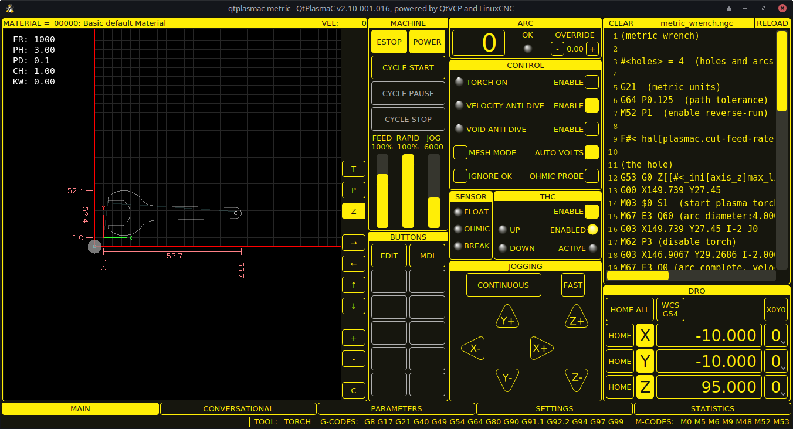
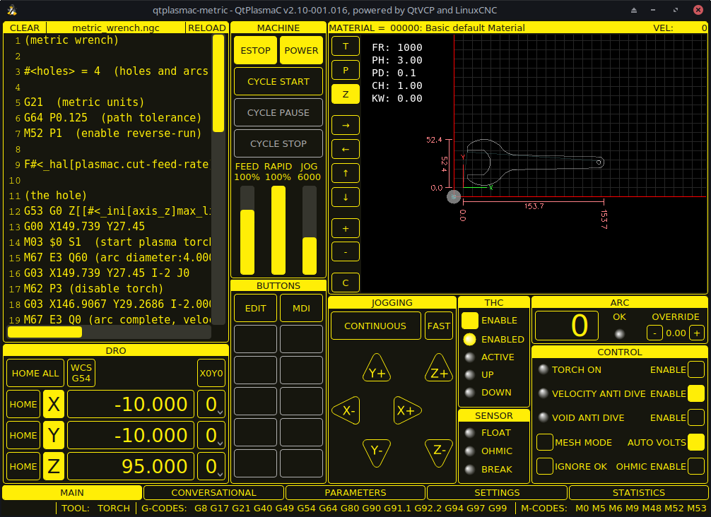
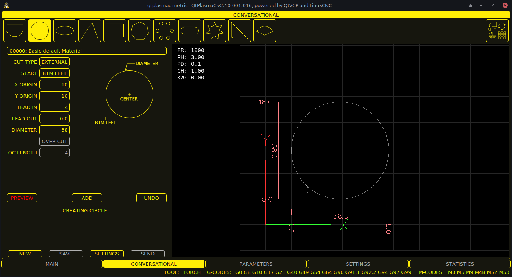
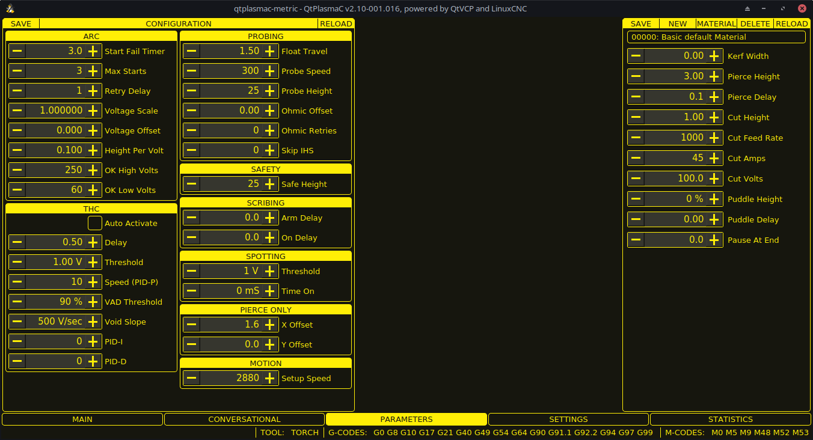
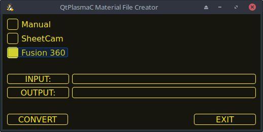
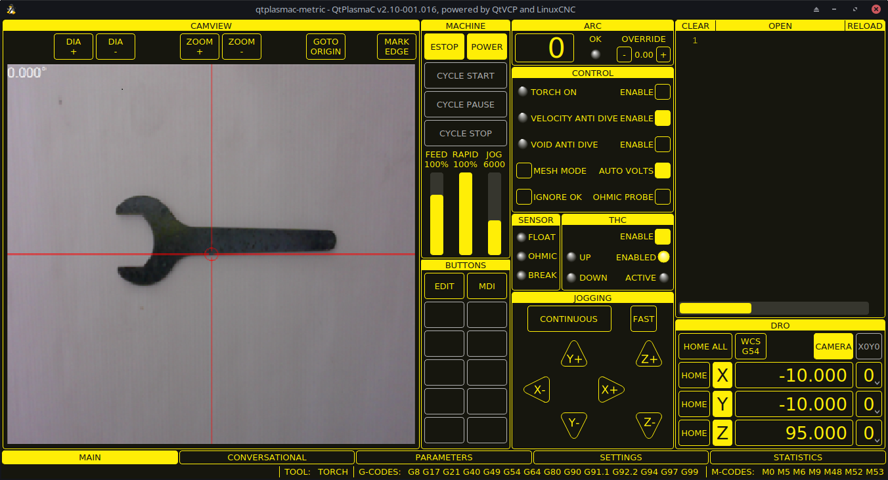

[[cha:qtplasmac]]

= QtPlasmaC
:toc:
:toclevels: 5
:figure-caption!:

== Preamble

*Except where noted, this guide assumes the user is using the latest version of QtPlasmaC. Version history can be seen by visiting this link:http://htmlpreview.github.io/?https://github.com/LinuxCNC/linuxcnc/blob/master/share/qtvcp/screens/qtplasmac/versions.html[link] which will show the latest available version. The installed QtPlasmaC version is displayed in the title bar. See <<qt_update, Update QtPlasmaC>> for information on updating QtPlasmaC.*

== License

QtPlasmaC and all of its related software are released under GPLv2.

== Introduction

QtPlasmaC is a GUI for plasma cutting which utilises the link:http://linuxcnc.org/docs/devel/html/man/man9/plasmac.9.html[plasmac component] for controlling a plasma table from LinuxCNC v2.9 or later using the Debian Buster or similar distribution.

The QtPlasmaC GUI supports up to five axes and uses the QtVCP infrastructure provided with LinuxCNC.

The standard theme is based on a design by user "pinder" on the LinuxCNC Forum and the colors are able to be changed by the user.

The QtPlasmaC GUI will run on any hardware that is supported by LinuxCNC provided there are enough hardware I/O pins to fulfill the requirements of a plasma configuration.

There are three available formats:

[[qt_formats]]

* 16:9 with a minimum resolution of 1366 x 768
* 9:16 with a minimum resolution of 768 x 1366
* 4:3 with a minimum resolution of 1024 x 768

Screenshot examples of QtPlasmaC are below:

*16:9*

*9:16*

image::images/qtplasmac_9x16.png[width=450,align="center"]

*4:3*

== Installing LinuxCNC

The preferred method for installing LinuxCNC is via an ISO image as described below.

NOTE: It is possible to install and run LinuxCNC on a variety of Linux distributions however that is beyond the scope of this User Guide. If the user wishes to install a Linux distribution other than those recommended, they will first need to install their preferred Linux distribution and then install LinuxCNC v2.9 or later along with any required dependencies.

=== If The User Does Not Have Linux Installed

Installation instructions are available at: http://linuxcnc.org/docs/devel/html/getting-started/getting-linuxcnc.html

Following these instructions will yield a machine with the current stable branch (v2.8) of LinuxCNC on Debian Buster.

=== Package Installation (Buildbot) If The User Has Linux with LinuxCNC v2.8

A package installation (Buildbot) uses prebuilt packages from the LinuxCNC Buildbot, instructions for upgrading from 2.8 to 2.9 are available at: http://buildbot.linuxcnc.org

Following these instructions by using the below stanzas will upgrade the machine to the last LinuxCNC Buildbot build master branch (v2.9) of LinuxCNC. This may not always be the latest version of master branch (v2.9) as from time to time the LinuxCNC Buildbot may stop due to errors.

----
deb     http://buildbot.linuxcnc.org/ buster master-rtpreempt
deb-src http://buildbot.linuxcnc.org/ buster master-rtpreempt
----

=== Run In Place Installation If The User Has Linux with LinuxCNC v2.8

A run in place installation runs LinuxCNC from a locally compiled version usually located at ~/linuxcnc-dev, instructions for building a run in place installation are available at: http://linuxcnc.org/docs/master/html/code/building-linuxcnc.html

Following these instructions will install the latest master branch (v2.9) of LinuxCNC.

== Creating A QtPlasmaC Configuration

Prior to creating a QtPlasmaC configuration, it is important that the user has a firm understanding of the operating modes available, as well as the I/O's that are required for successful plasma operation.

[[qt_mode]]

=== Modes

QtPlasmaC requires the selection of one of following three operating modes:

[width="100%",cols="4,16"]
|===
|*Mode*|*Description*
|0|Uses an external arc voltage input to calculate both Arc Voltage (for Torch Height Control) and Arc OK.
|1|Uses an external arc voltage input to calculate Arc Voltage (for Torch Height Control). +
   Uses an external Arc OK input for Arc OK.
|2|Uses an external Arc OK input for Arc OK. +
   Use external up/down signals for Torch Height Control.
|===

IMPORTANT: If the plasma power source has an Arc OK (Transfer) output then it is recommended to use that for Arc OK rather than the soft (calculated) Arc OK provided by mode 0. It may also be possible to use a <<qt_reed-arc-ok, reed relay>> as an alternative method to establish an Arc OK signal when the power source does not provide one.

NOTE: For fine tuning of Mode 0 Ark OK see <<mode0-arcok, Tuning Mode 0 Arc OK>> in the Advanced Topics section of the manual.

=== Available I/Os

NOTE: This section only touches on the hardware I/O's required for QtPlasmaC. Base machine requirements such as limit switches, home switches, etc. are in addition to these.

[width="100%",cols="4,2,14"]
|===
|*Name*|*Modes*|*Description*
|Arc Voltage|0, 1|Analog input; *optional.* +
                  HAL pin name plasmac.arc-voltage-in +
                  Connected to the velocity output of an encoder equipped breakout board.
                  This signal is used to read the arc voltage to determine the necessary corrections to maintain the torch distance from the work piece during cutting.
|Arc OK|1, 2|Digital input; *optional.* +
            HAL pin name plasmac.arc-ok-in +
             Connected from the Arc OK output of the plasma power source to an input on the breakout board.
             This signal is used to determine if the cutting arc has been established and it is ok for the machine to move (sometimes called arc transfer).
|Float Switch|0, 1, 2|Digital input; *optional, see info below table:* +
                      HAL pin name plasmac.float-switch +
                      Connected from a breakout board input to a switch on the floating head.
                      This signal is used to mechanically probe the work piece with the torch and set Z zero at the top of the work piece. +
                      If used and no ohmic probe is configured, this is the probing method. +
                      If used and an ohmic probe is configured, this is the fallback probing method.
|Ohmic Probe|0, 1, 2|Digital input; *optional, see info below table:* +
                     HAL pin name plasmac.ohmic-probe +
                     Connected from to the ohmic probe's output to a breakout board input.
                     This signal is used to probe electronically by completing a circuit using the work piece and the torch consumables and set Z zero at the top of the work piece. +
                     If used, this is the primary probing method.
                     If an ohmic probe fails to locate the work piece, and there is no float switch is present, probing will continue until the torch breaks away or the minimum Z limit is reached.
|Ohmic Probe Enable|0, 1, 2|Digital output; *optional, see info below table:* +
                            HAL pin name plasmac.ohmic-enable +
                            Connected from a breakout board output to an input to control the ohmic probe's power.
|Breakaway Switch|0, 1, 2|Digital input; *optional, see info below table:* +
                          HAL pin name plasmac.breakaway +
                          Connected from a breakout board input to a torch breakaway detection switch. +
                          This signal senses if the torch has broken away from its cradle.
|Torch On|0, 1, 2|Digital output; *required.* +
                  HAL pin name plasmac.torch-on +
                  Connected from a breakout board output to the torch-on input of the plasma power supply.
                  This signal is used to control the plasma power supply and start the arc.
|Move Up|2|Digital input; *optional.* +
           HAL pin name plasmac.move-up +
           Connected from the up output of the external THC control to a break out board input.
		   This signal is used to control the Z axis in an upward motion and make necessary corrections to maintain the torch distance from the work piece during cutting.
|Move Down|2|Digital input; *optional.* +
             HAL pin name plasmac.move-down +
             Connected from the down output of the external THC control to a break out board input.
             This signal is used to control the Z axis in a downward motion and make necessary corrections to maintain the torch distance from the work piece during cutting.
|Scribe Arming|0, 1, 2|Digital output; *optional.* +
                       HAL pin name plasmac.scribe-arm +
                       Connected from a breakout board output to the scribe arming circuit.
					   This signal is used to place the scribe into position on the work piece .
|Scribe On|0, 1, 2|Digital output; *optional.* +
                   HAL pin name plasmac.scribe-on +
                   Connected from a breakout board output to the scribe-on circuit.
                   This signal is used to turn the scribing device on.
|Laser On|0, 1, 2|Digital output; *optional.* +
                  HAL pin name qtplasmac.laser_on +
                  This signal is used to turn the alignment laser on.
|===

Only one of either *Float Switch* or *Ohmic Probe* is required. If both are used then *Float Switch* will be a fallback if *Ohmic Probe* is not sensed.

If *Ohmic Probe* is used then *Ohmic Probe Enable* is required to be checked on the QtPlasmaC GUI.

*Breakaway Switch* is not mandatory because the *Float Switch* is treated the same as a breakaway when not probing. If they are two separate switches, and there are not enough inputs on the breakout board, they could be combined and connected as a *Float Switch*.

NOTE: The minimum I/O requirement for a QtPlasmaC configuration to function are:  *Arc Voltage* input OR *Arc OK* input, *Float Switch* input, and *Torch On* output. To reiterate, in this case QtPlasmaC will treat the float switch as a breakaway switch when it is not probing.

[[qt_z-settings]]

=== Recommended Settings:

Refer to the <<qt_initial-setup, Heights Diagram>> diagram for a visual representation of the terms below.

* *[AXIS_Z] MIN_LIMIT* should be just below top of the slats with allowances for float_switch_travel and over travel tolerance. For example, if the user's float switch takes 4mm (0.157") to activate then set the Z minimum to 5mm (0.197") plus an allowance for overrun (either calculated using the equation below or allow 5mm (0.2") below the lowest slat.
* *[AXIS_Z] MAX_LIMIT* should be the highest the user wants the Z axis to travel (it must not be lower than Z HOME_OFFSET).
* *[AXIS_Z] HOME* should be set to be approximately 5mm-10mm (0.2"-0.4") below the maximum limit.

* *Floating Head* - it is recommended that a floating head be used and that it has enough movement to allow for overrun during probing. Overrun can be calculated using the following formula:

----
o = 0.5 × a × (v ÷ a)^2
----

where: o = overrun, a = acceleration in units/sec2 and v = velocity in units/sec.

Metric example:  given a Z axis MAX_ACCELERATION of 600mm/s^2^ and MAX_VELOCITY of 60mm/s, the overrun would be 3mm.

Imperial example: given a Z axis MAX_ACCELERATION of 24in/s^2^ and MAX_VELOCITY of 2.4in/s, the overrun would be 0.12in.

On machines that will utilize an ohmic probe as the primary method of probing, it is highly recommended to install a switch on the floating head as a backup means of stopping Z motion in the event of ohmic probe failure due to dirty surfaces.

[[configuring]]

=== Configuring

LinuxCNC provides two configuration wizards which can be used to build a machine configuration. The choice of these wizards is dependent on the hardware used to control the machine.

If the user wishes to use a Run In Place installation then prior to running one of the following commands they will need to run the following command from a terminal:

----
source ~/linuxcnc-dev/scripts/rip-environment
----

If using a Package installation then no additional action is required.

If using a parallel port, use the <<cha:stepconf-wizard, StepConf wizard>> (enter the following command into a terminal window):

----
stepconf
----

If using a Mesa Electronics board, use the <<cha:pncconf-wizard, PnCConf wizard>> (enter the following command into a terminal window):

----
pncconf
----

If using a Pico Systems board: +
https://forum.linuxcnc.org/27-driver-boards/14977-pico-systems-faq[This LinuxCNC forum thread] may be helpful.

The machine specific settings are not described here, refer to the documentation for the particular configuration wizard that is being used.

There are Linuxcnc forum sections available for these wizards:

https://forum.linuxcnc.org/16-stepconf-wizard()[StepConf Wizard]

https://forum.linuxcnc.org/39-pncconf[PnCConf Wizard]

Fill in the required entries to suit the machine wiring/breakout board configuration.

QtPlasmaC adds two pages to the LinuxCNC configuration wizards for QtPlasmaC specific parameters, the two pages are QtPlasmaC options and <<qt_custom-user-buttons, User Buttons>>. Complete each of the wizards QtPlasmaC page to suit the machine that is being configured and the user button requirements.

Note that PnCConf options allow user selection of Feed Override, Linear Velocity, and Jog Increments whereas in StepConf these are automatically calculated and set.

*PnCConf QtPlasmaC Options:*

image::images/qtplasmac_pncconf_screen.png[width=600,align="center"]

*StepConf QtPlasmaC Options:*

image::images/qtplasmac_stepconf_options.png[width=600,align="center"]

*QtPlasmaC User Buttons:*

image::images/qtplasmac_pncconf_buttons.png[width=600,align="center"]

*QtPlasmaC THCAD:*

The THCAD screen will only appear if a Plasma Encoder is selected in the card screen.

image::images/qtplasmac_pncconf_thcad.png[width=600,align="center"]

More information on <<qt_mesa-thcad, Mesa THCAD>>.

When the configuration is complete, the wizard will save a copy of the configuration that may be loaded and edited at a later time, a working QtPlasmaC configuration will be created in the following directory: ~/linuxcnc/configs/<machine_name>

The newly created QtPlasmaC configuration can be run by entering the following command into a terminal window (*change "<machine_name>" to the machine name entered into the configuration wizard*):

For a package installation (Buildbot):

----
linuxcnc ~/linuxcnc/configs/<machine_name>/<machine_name>.ini
----

For a run in place installation:

----
~/linuxcnc-dev/scripts/linuxcnc ~/linuxcnc/configs/<machine_name>/<machine_name>.ini
----

After running the above command LinuxCNC should be running with the QtPlasmaC GUI visible.

IMPORTANT: BEFORE PROCEEDING, THE USER SHOULD BE ABLE TO HOME THE MACHINE, ZERO EACH AXIS, JOG ALL AXES TO SOFT LIMITS WITHOUT CRASHING, AND RUN TEST G-CODE PROGRAMS WITHOUT ANY ERRORS.

ONLY WHEN this criteria is met should the user proceed with the QtPlasmaC initial setup.

NOTE: It is possible to create a sim configuration using StepConf but it is not possible to have tandem joints in the sim configuration.
[[qt-dependency]]

=== Qt Dependency Errors

If any Qt dependency errors are encountered while attempting to run the QtPlasmaC configuration, the user may need to run the QtVCP installation script to resolve these issues.

For a package installation (Buildbot) enter the following command in a terminal window:

----
/usr/lib/python3/dist-packages/qtvcp/designer/install_script
----

For a run in place installation enter the following command in a terminal window:

----
~/linuxcnc-dev/lib/python/qtvcp/designer/install_script
----

[[qt_initial-setup]]

=== Initial Setup

The following heights diagram will help the user visualize the different heights involved in plasma cutting and how they are measured:

image::images/qtplasmac_heights_diagram.png[width=800,align="center"]

Click on the <<qt_parameters-tab, Parameters Tab>> to view the *CONFIGURATION* section which shows the user settable parameters. It is necessary to ensure every one of these settings is tailored to the machine.

To set the Z axis DRO relative to the Z axis MINIMUM_LIMIT, the user should perform the following steps. It is important to understand that in QtPlasmaC, touching off the Z axis DRO has no effect on the Z axis position while running a G-Code program. These steps simply allow the user to more easily set the probe height as after performing the steps, the displayed Z axis DRO value will be relative to Z axis MINIMUM_LIMIT.

. The user should be familiar with the recommended <<qt_z-settings, Z Axis Settings>>.

. Home the Z axis.

. Ensure there is nothing below the torch then jog the Z axis down until it stops at the Z axis MINIMUM_LIMIT then click the 0 next to the Z axis DRO to *Touch Off* with the Z axis selected to set the Z axis at zero offset. This step only serves to allow the user to more easily visualize and adjust *Probe Height* this value is measured from the Z axis MINIMUM_LIMIT up.

. Home the Z axis again.

[[qt_probe-test]]

If the machine is equipped with a float switch then the user will need to set the offset in the *CONFIGURATION* section of the *PARAMETERS* tab. This will be done by running a "Probe Test" cycle.

. Check that the Probe Speed and the Probe Height in the *CONFIGURATION* section of the *PARAMETERS* tab are correct. QtPlasmaC can probe at the full Z axis velocity so long as the machine has enough movement in the float switch to absorb any overrun. If the machine is suitable, the user could set the Probe Height to a value near the Z axis minimum and do all probing at full speed.

. If the machine is not already homed and in the home position, home the machine.

. Place some material on the slats under the torch.

. Press the *PROBE TEST* button.

. The Z axis will probe down, find the material then move up to the specified *Pierce Height* as set by the currently selected material. The torch will wait in this position for the time set in the <machine_name>.ini file. The default probe test hold time is 10 seconds, this value may be edited in the <machine_name>.ini file. After this the torch will return to the starting height.

. Measure the distance between the material and the tip of the torch while the torch is waiting at *Pierce Height*.

. If the measurement is greater than the *Pierce Height* of the currently selected material, then reduce the "Float Travel" in the *CONFIGURATION* section of the *PARAMETERS* tab by the difference between the measured value and the specified value. If the measurement is less than *Pierce Height* of the currently selected material, then increase the "Float Travel" in the *CONFIGURATION* section of the *PARAMETERS* tab by the difference between the specified value and the measured value.

. After the adjustments to the "Float Travel" have been made, repeat the process from #4 above until the measured distance between the material and the torch tip matches the *Pierce Height* of the currently selected material.

. If the table has a laser or camera for sheet alignment, a scribe, or uses offset probing then the required offsets need to be applied by following the procedure described in <<peripheral-offsets, Peripheral Offsets>>.

. CONGRATULATIONS! The user should now have a working QtPlasmaC Configuration.

NOTE: If the amount of time between the torch contacting the material and when the torch moves up and comes to rest at the Pierce Height seems excessive, see <<qt_probing, the probing section>> for a possible solution.

IMPORTANT: IF USING A *Mesa Electronics THCAD* THEN THE *Voltage Scale* VALUE WAS OBTAINED MATHEMATICALLY. IF THE USER INTENDS TO USE CUT VOLTAGES FROM A MANUFACTURE'S CUT CHART THEN IT WOULD BE ADVISABLE TO DO MEASUREMENTS OF ACTUAL VOLTAGES AND FINE TUNE THE *Voltage Scale* AND *Voltage Offset*.

CAUTION: PLASMA CUTTING VOLTAGES CAN BE LETHAL, IF THE USER IS NOT EXPERIENCED IN DOING THESE MEASUREMENTS GET SOME QUALIFIED HELP.

[[qt_modify-config]]

== Migrating to QtPlasmac From PlasmaC (Axis or Gmoccapy)

There are two methods available to get from a working PlasmaC configuration to a new QtPlasmaC configuration. These methods assume the user is on LinuxCNC v2.9 or later, QtVCP is installed, and all dependency requirements are satisfied.

If there are Qt dependency errors, the user should run the <<qt-dependency, QtVCP install script>>.

=== Quick Method

A quick method to move to QtPlasmaC from PlasmaC (loaded on top of either Axis or Gmoccapy) is to use the plasmac2qt conversion program which will attempt to create a new QtPlasmaC configuration from an existing PlasmaC .ini file. This program will convert the user's parameters, settings, and materials from the previous PlasmaC configuration and create a new QtPlasmaC configuration folder in the ~/linuxcnc/configs folder.

This methods will keep the original PlasmaC config as a backup with _plasmac and a time stamp appended to the directory name.

To run the plasmac2qt conversion program, use the following instructions:

For a package installation (Buildbot) enter the following line in a terminal window:

----
qtplasmac-plasmac2qt
----

For a run in place installation enter the following lines in terminal window:

----
source ~/linuxcnc-dev/scripts/rip-environment
qtplasmac-plasmac2qt
----

The following screen will be displayed:

image::images/qtplasmac_plasmac2qt.png[width=500,align="center"]

*Mandatory Settings*

[width="100%",cols="4,10,6"]
|===
|*Field*|*Description*|*Examples*
|INI FILE IN EXISTING PLASMAC CONFIG|This is the .ini file of the PlasmaC config that requires migrating.|<machine_name>.ini
|MONITOR ASPECT RATIO|This is the <<qt_formats, aspect ratio format>> for the GUI.|16:9
|ESTOP|Selects the required Estop type based on the following criteria: +
      0 - Estop is an indicator only. +
      1 - Estop indicator is hidden. +
      2 - Estop is a button.|ESTOP:1
|===

*Optional Setting*

This setting is not required unless the machine has a <<qt_laser, laser>> for sheet alignment.

Leave this blank if it is not used/required.

[width="100%",cols="4,10,6"]
|===
|*Field*|*Description*|*Examples*
|Laser On Hal Pin|Power on a laser crosshair for sheet alignment.|*Parallel Port Example:* parport.0.pin-16-out +
                                                                  *Mesa 7i96 Example:* hm2_7i96.0.ssr.00.out-00
|===

After filling in the appropriate entries, press *CONVERT*.

NOTE: This method will not change any existing debounce components to the new dbounce component. If the user wishes to change to the new dbounce component then the New Base Config method should be used for migration.

=== New Base Config Method

This method to move to QtPlasmaC from PlasmaC (loaded on top of either Axis or Gmoccapy) is to use a <<configuring, configuration wizard>> to create a new configuration. This method then allows changing of the base machine configuration at a later date via the configuration wizard provided that the base ini and base hal files have not been edited.

This method requires that the user take note of all HAL pins used in the existing config so they can be entered into the configuration wizard. Any custom HAL commands will also need to be noted and added manually to either the custom.hal file or the custom_postgui.hal file which will be created by the configuration wizard.

After using the wizard, the user can then run a conversion program (cfg2prefs) to convert the parameters, settings, and materials from the previous PlasmaC configuration to the new QtPlasmaC configuration. This tool should be used immediately after the user has created a new QtPlasmaC configuration.

Prior to running this conversion program, it is mandatory that the user have both an existing PlasmaC configuration and a new QtPlasmaC configuration. This program WILL overwrite the existing QtPlasmaC preferences and materials files, and should be used with caution if it is not being run on a new QtPlasmaC configuration.

The program will create a time stamped backup of the original preferences file and the existing materials file (if it exists).

It will read the existing <machine_name>_config.cfg, <machine_name>_run.cfg, <machine_name>_wizards.cfg, and plasmac_stats.var files and write them to an existing qtplasmac.prefs file. It will also copy the <machine_name>_material.cfg file to the existing QtPlasmaC configuration.

To run the cfg2prefs conversion program, use the following instructions:

For a package installation (Buildbot) enter the following line in a terminal window:

----
qtplasmac-cfg2prefs
----

For a run in place installation enter the following lines in terminal window:

----
source ~/linuxcnc-dev/scripts/rip-environment
qtplasmac-cfg2prefs
----

image::images/qtplasmac_cfg2prefs.png[width=500,align="center"]

Select the .ini file of the old PlasmaC configuration, select the .ini file of the new QtPlasmaC configuration, then press *CONVERT*.

== Other QtPlasmaC Setup Considerations

[[qt_lowpass]]

=== Lowpass Filter

The plasmac HAL component has a built in lowpass filter that if used is applied to the *plasmac.arc-voltage-in* input pin to filter any noise that could cause erroneous voltage readings. The lowpass filter should only be used after using Halscope to determine the required frequency and whether the amplitude of the noise is large enough to cause any issues. For most plasma machines lowpass is not required and should not be used unless it is required.

The HAL pin assigned to this filter is *plasmac.lowpass-frequency* and is set to 0 (disabled) by default. To apply a lowpass filter to the arc-voltage, the user would edit the following entry in the custom.hal file in the machine's configuration directory to add the appropriate cutoff frequency as measured in Hertz (Hz).

For example:

----
setp plasmac.lowpass-frequency 100
----

The above example would give a cutoff frequency of 100Hz.

=== Contact Bounce

Contact bounce from mechanical relays, switches, or external interference may cause some inconsistent behavior of the following switches:

* Float Switch
* Ohmic Probe
* Breakaway Switch
* Arc OK (for modes 1 & 2)

Due to the fact that the software is capable of sampling rates faster than the contact bounce period, it is possible that the software may see contact bounce as several changes in input states occurring in a very small time period, and incorrectly interpret this as a very quick on-off of the input. One method of mitigating contact bounce is to "debounce" the input. To summarize debounce, it requires the input state to be stable at the opposite state of the output state for consecutive delay periods before changing the state of the output.

Debounce delay periods can be changed by editing the appropriate debounce value in the custom.hal file in the <machine_name> config folder.

Each increment of delay adds one servo thread cycle to the debounce time. For example: given a servo thread period of 1000000 (measured in nano seconds), a debounce delay of 5 would equate to 5000000ns, or 5ms.

For the Float and Ohmic switches this equates to a 0.001mm (0.00004") increase in the probed height result.

It is recommended to keep the debounce values as low as possible while still achieving consistent results. Using link:http://linuxcnc.org/docs/2.8/html/hal/tutorial.html#_halscope[Halscope] to plot the inputs is a good way to establish the correct value.

For QtPlasmaC installations, debounce is achieved by using the HAL link:http://linuxcnc.org/docs/2.8/html/man/man9/dbounce.9.html[dbounce component] which is a later alternative to the original debounce component. This new version allows for the loading and naming of individual debounce instances and is compatible with Twopass HAL file processing.

All four signals above have an individual debounce component so the debounce periods can be catered individually to each input. Any changes made to these values in the custom.hal file will not be overwritten by later updates of QtPlasmaC.

The default delay for all four inputs is five servo thread periods. In most cases this value will work quite well. If any of the inputs do not use mechanical switches, it may be possible to either reduce or remove the delay for those inputs.

If debounce is required for other equipment like home or limit switches etc. then more dbounce components may added in any of the HAL files without any regard to the signals listed here.

More information on contact bounce can be seen on page IX of link:https://www.finder-relais.net/en/Finder-general-technical-information-en.pdf[Finder Relays General Technical Information]

[[qt-contact-load]]

=== Contact Load

Mechanical relays and switches usually require a minimum current passing through the contacts for reliable operation. This current varies with the material that the contacts in the device are made from.

Depending on the specified minimum contact current and the current drawn by the input device there may be a need to provide a method to increase the current through the contacts.

Most relays using gold contacts will not require any additional current for reliable operation.

There are two different methods available to provide this minimum current if it is required:

. A 0.1μF film capacitor placed across the contacts.

. A 1200Ω 1W resistor across the load (see calculations below).

Schematics are shown at <<qt_contact-load-schematics, contact load schematics>>.

More information on contact switching load can be seen on page III of link:https://www.finder-relais.net/en/Finder-general-technical-information-en.pdf[Finder Relays General Technical Information]

[underline]*Calculations:*

If using a Mesa card, the input resistance could be 5000Ω (7i96) or 10000Ω (7i76E), giving a contact current of 4.8mA or 2.4mA assuming a supply voltage of 24V (I = V/R).

As an example, the typical relay used in a Hypertherm Powermax 65 plasma cutter (link:https://www.te.com/commerce/DocumentDelivery/DDEController?Action=showdoc&DocId=Data+Sheet%7F1308242_T77%7F1011%7Fpdf%7FEnglish%7FENG_DS_1308242_T77_1011.pdf%7F1-1393194-0[TE T77S1D10-24]) requires a minimum contact load of 100mA @ 5VDC which will dissipate 0.5W (P = I * V). If using a 24VDC power supply this would then equate to a minimum current of 20.8mA. Because there is less current drawn by the Mesa input than is required by the relay there needs to be an increase in the current.

The resistance can be calculated using R = Vs / (Im - Ii) where:

- R = calculated resistance
- Vs = supply voltage
- Im = minimum current required
- Ii = input current

Using a 7i76E with an input current of 2.4mA gives a calculated value of 1304Ω. (24 / (.0208 - .0024) This could then be rounded down to a commonly available 1200Ω resistor giving a small safety margin.

The power dissipation can by calculated using P = Vs^2^ / Rs where:

- P = power
- Vs = supply voltage
- Rs = selected resistance

This gives a value of 0.48W. This could then be rounded up to 1W, giving a good safety margin. The final selection would be a 1200Ω 1W resistor. Note that this resistor could be used on either the 7i96 or the 7i76E.

=== Desktop Launcher

If a link to the launch the configuration was not created when creating the config, the user could create a desktop launcher to the config by right clicking on the desktop and selecting Create Launcher or similar. This will bring up a dialog box to create a launcher. Give the icon a nice short name, enter anything for the command and click OK.

After the launcher appears on the desktop, right click on it and then edit it with the user's editor of choice. Edit the file so it looks similar to:

----
[Desktop Entry]
Comment=
Terminal=false
Name=LinuxCNC
Exec=sh -c "linuxcnc $HOME/linuxcnc/configs/<machine_name>/<machine_name>.ini"
Type=Application
Icon=/usr/share/pixmaps/linuxcncicon.png
----

If the user would like a terminal window to open behind the GUI window then change the Terminal line to:

----
Terminal=true
----

Displaying a terminal can be handy for error and information messages.

=== QtPlasmaC Files

After a successful QtPlasmaC installation, the following files are created in the configuration directory:
[width="100%",cols="1,2"]
|===
|*Filename*|*Function*
|<machine_name>.ini|A configuration file for the machine.
|<machine_name>.hal|A HAL for the machine.
|custom.hal|A HAL file for user customization.
|custom_postgui.hal|A HAL file for user customization which is run after the GUI has initialized.
|shutdown.hal|A HAL file which is run during the shutdown sequence.
|tool.tbl|A tool table used to store offset information for additional tools (scribe, etc.) used by the QtPlasmaC configuration.
|qtplasmac|A link to the directory containing common qtplasmac support files.
|backup|A directory for backups of config files.
|===

NOTE: <machine_name> is whatever name the user entered into the "Machine Name" field of the configuration wizard program
NOTE: Custom commands are allowed in custom.hal and the custom_postgui.hal files as they are not overwritten during updates.

After running a new configuration for the first time the following files will be created in the configuration directory:
[width="100%",cols="1,2"]
|===
|*Filename*|*Function*
|<machine_name>_material.cfg|A file for storing the material settings from the MATERIAL section of the <<qt_parameters-tab, PARAMETERS Tab>>.
|qtplasmac.prefs|A file containing the users preferences and parameters. It also stores the current color configuration.
|qtplasmac.qss|This file is used to store the stylesheet for the currently loaded session of QtPlasmaC.
|===

NOTE: The configuration files (<machine_name>.ini and <machine_name>.hal) that are created by configuration wizard are notated to explain the requirements to aid in manual manipulation of these configurations. They may be edited with any text editor.

NOTE: The .prefs file is plain text and may be edited with any text editor.

=== INI File

QtPlasmaC has some specific <machine_name>.ini file variables as follows:

[[qt_ini-mode]]

*[QTPLASMAC]* Section

These variables are optional.

----
MODE                = 0 (use external arc voltage in for Arc Voltage)
                        (use external arc voltage in for Arc OK)
                    = 1 (use external arc voltage in for Arc Voltage)
                        (use external Arc OK in for Arc OK)
                    = 2 (Use external Arc OK in for Arc OK)
                        (use external up/down for THC)
                    (0 is the default if not specified)

ESTOP_TYPE          = 0 (estop is a indicator only)
                    = 1 (estop is hidden)
                    = 2 (estop is a button)
                    (0 is the default if not specified)

LASER_TOUCHOFF      = X10.0000  Y0.0000
                      (X & Y offsets if a laser is installed for alignment)
                    (the default is none if not specified)

CAMERA_TOUCHOFF     = X-10.0000  Y0.0000
                      (X & Y offsets if a camera is installed for alignment)
                    (the default is none if not specified)

PM_PORT             = (port name for RS485 e.g. /dev/ttyUSB0)
                    (the default is none if not specified)

BUTTON_n_NAME       = <NAME> (the name of a custom user button, n = 1~20)
BUTTON_n_CODE       = <CODE> (the code run by a custom user button, n= 1~20)
                    (the default is none if not specified)

DRO_POSITION        = top (move the DRO to the top in the 16:9 and 4:3 formats)
                    (the default is bottom if not specified)

HIDE_RUN            = 1 (hide the cycle start button)
HIDE_PAUSE          = 1 (hide the cycle pause button)
HIDE_ABORT          = 1 (hide the cycle stop button)
                    (the default is don't hide if not specified)

OFFSET_PROBING      = X25.21 Y8.07 0.5
                    (X offset, Y offset, and deployment delay of probe if offset probing is required)

FLASH_ERROR         = 0 (status bar error message will not flash)
                    = 1 (status bar error message will flash)
                    (0 is the default if not specified)
----

NOTE: MODE and ESTOP_TYPE will default to 0 if not specified and all other variables are optional.

*[FILTER]* Section

These variables are mandatory.

----
PROGRAM_EXTENSION   = .ngc,.nc,.tap G-Code File (*.ngc, *.nc, *.tap)
ngc                     = ./qtplasmac/qtplasmac_gcode.py
nc                      = ./qtplasmac/qtplasmac_gcode.py
tap                     = ./qtplasmac/qtplasmac_gcode.py
----

[[qt_rs274]]

*[RS274NGC]* Section

These variables are mandatory.

----
RS274NGC_STARTUP_CODE = o<metric_startup> call (machine startup G-Code)
SUBROUTINE_PATH       = ./:./qtplasmac:../../nc_files/subroutines (./ must be in this path)
USER_M_PATH           = ./:./qtplasmac (for M190 material change)
----

IMPORTANT: SEE <<qt_path-tolerance, PATH TOLERANCE>> FOR RS274NGC_STARTUP_CODE INFORMATION RELATED TO G64.

*[HAL]* Section

These variables are mandatory.

----
HALFILE = HALUI   = halui (required)
HALFILE = <machine_name>.hal (the machine HAL file)
HALFILE = plasmac.tcl (the standard QtPlasmaC HAL file )
HALFILE = custom.hal (Users custom HAL commands)
POSTGUI_HALFILE = postgui_call_list.hal (required)
SHUTDOWN = shutdown.hal (shutdown HAL commands)
----

NOTE: The user could place custom HAL commands in the custom.hal file as this file is not overwritten by QtPlasmaC updates.

[[qt_ini-display]]

*[DISPLAY]* Section

This variable  is mandatory.

----
DISPLAY = qtvcp qtplasmac      (use 16:9 resolution)
        = qtvcp qtplasmac_9x16 (use 9:16 resolution)
        = qtvcp qtplasmac_4x3  (use 4:3 resolution)
----

*[TRAJ]* Section

This variable  is mandatory.
----
SPINDLES = 3
----

*[AXIS_X]* Section

These variables are mandatory.

----
MAX_VELOCITY     = double the value in the corresponding joint
MAX_ACCELERATION = double the value in the corresponding joint
OFFSET_AV_RATIO  = 0.5
----

*[AXIS_Y]* Section

These variables are mandatory.

----
MAX_VELOCITY     = double the value in the corresponding joint
MAX_ACCELERATION = double the value in the corresponding joint
OFFSET_AV_RATIO  = 0.5
----

*[AXIS_Z]* Section

These variables are mandatory.

----
MIN_LIMIT        = the top of the table's slats or just below
MAX_VELOCITY     = double the value in the corresponding joint
MAX_ACCELERATION = double the value in the corresponding joint
OFFSET_AV_RATIO  = 0.5
----

NOTE: QtPlasmaC uses the LinuxCNC External Offsets feature for all Z axis motion, and for moving the X and/or Y axis for a consumable change while paused. For more information on this feature, please read <<cha:external-offsets,External Axis Offsets>> in the LinuxCNC documentation.

== QtPlasmaC GUI Overview

The following sections will give a general overview of the QtPlasmaC layout.

[[qt_main-tab]]

=== MAIN Tab

Screenshot example of the QtPlasmaC <<qt_main-tab, MAIN Tab>> in *16:9* aspect ratio:

Some functions/features are only used for particular modes and are not displayed if they are not required by the chosen QtPlasmaC mode.

[underline]*PREVIEW WINDOW*

[width="100%",cols="4,16"]
|===
|*Name*|*Description*
|Material|The top header is clickable in this area to reveal a drop down menu. It is used to manually select the current material cut parameters. If there are no materials in the material file then only the default material will be displayed.
|VEL:|This displays the actual cut feed rate the table is moving at.
|FR:|If "View Material" is selected on the <<qt_parameters-tab, PARAMETERS Tab>>, this displays the currently selected material's Feed Rate.
|PH:|If "View Material" is selected on the <<qt_parameters-tab, PARAMETERS Tab>>, this displays the currently selected material's Pierce Height.
|PD:|If "View Material" is selected on the <<qt_parameters-tab, PARAMETERS Tab>>, this displays the currently selected material's Pierce Delay.
|CH:|If "View Material" is selected on the <<qt_parameters-tab, PARAMETERS Tab>>, this displays the currently selected material's Cut Height.
|CA:|If "View Material" is selected on the <<qt_parameters-tab, PARAMETERS Tab>>, and RS485 communications are enabled, this displays the currently selected material's Cut Amperage.
|P|This button changes the preview to an isometric view.
|Z|This button changes the preview to a top down view.
|→|This button pans the preview right.
|←|This button pans the preview left.
|↑|This button pans the preview up.
|↓|This button pans the preview down.
|+|This button zooms the preview.
|-|This button zooms the preview.
|C|This button clears the live plot.
|===

[underline]*MACHINE*

[width="100%",cols="4,16"]
|===
|*Name*|*Description*
|ESTOP|If ESTOP_TYPE = 0 in the <machine_name>.ini file, this button becomes an indicator of the hardware ESTOP's status only. +
If ESTOP_TYPE = 1 in the <machine_name>.ini file, this button will not be visible. +
If ESTOP_TYPE = 2 in the <machine_name>.ini file, this button will act as a GUI ESTOP. +
If ESTOP_TYPE is omitted from the <machine_name>.ini file, this button will default to being an indicator of the hardware ESTOP's status only.
|POWER|This button turns the GUI on and allows QtPlasmaC/LinuxCNC to control the hardware.
|CYCLE START|This button starts the cycle for any loaded G-Code file.
|CYCLE PAUSE|This button pauses the cycle for any loaded G-Code file. +
If a cycle is paused, this button will display *CYCLE RESUME* and flash. +
Pressing *CYCLE RESUME* will resume the cycle.
|CYCLE STOP|This button stops any actively running or paused cycle. +
This includes: +
- G-Code Programs +
- Torch pulse if the pulse was started during *CYCLE PAUSE* (this will cancel the paused G-Code program execution as well) +
- Probe Test +
- Framing +
- Manual Cut
|FEED|This slider overrides the feed rate for all feed moves. +
Any value other than 100% will cause the label to flash. +
Clicking the label will return the slider to 100%.
|RAPID|This slider overrides the rapid rate for all rapid moves. +
Any value other than 100% will cause the label to flash. +
Clicking the label will return the slider to 100%.
|JOG|This slider sets the jog rate. +
Clicking the label will return the slider to the default linear velocity as set in the <machine_name).ini file.
|===

[underline]*BUTTONS*

The Button Panel contains buttons useful for the operation of the machine.

The *EDIT* and *MDI* buttons are permanent, all other buttons are user programmable in the <machine_name>.ini file.

See <<qt_custom-user-buttons, custom user buttons>> for detailed information on custom user buttons.

[width="100%",cols="4,16"]
|===
|*Name*|*Description*
|EDIT|This button opens a G-Code editor for the currently loaded program.
|MDI|This button places QtPlasmaC into Manual Data Input mode which will display the MDI HISTORY and an entry box over top of the G-Code window. +
Once pressed, this button will display "MDI CLOSE". +
Pressing *MDI CLOSE* will close the MDI.
|OHMIC TEST|This button will enable the Ohmic Probe Enable output signal and if the Ohmic Probe input is sensed, the LED indicator in the SENSOR Panel will light. +
The main purpose of this is to allow a quick test for a shorted torch tip.
|PROBE TEST|This button will initiate a <<qt_probe-test, Probe Test>>.
|SINGLE CUT|This button will show the dialog box to start an automatic <<qt_single-cut, Single Cut>>.
|NORMAL CUT|This button will toggle between <<qt_cut-types, Cut Types>> (NORMAL CUT and PIERCE ONLY).
|TORCH PULSE|This button will initiate a <<qt_button-torch, Torch Pulse>>.
|===

[underline]*ARC*

[width="100%",cols="6,2,14"]
|===
|*Name*|*Modes*|*Description*
|Arc Voltage|0, 1|Displays the actual arc voltage.
|OK|0, 1, 2|Indicates the status of the Arc OK signal.
|+|0, 1|Each press of this button will raise the target voltage by the THC Threshold voltage (The distance changed will be Height Per Volt * THC Threshold voltage).
|-|0, 1|Each press of this button will lower the target voltage by the THC Threshold voltage (The distance changed will be Height Per Volt * THC Threshold voltage).
|OVERRIDE|0, 1|Clicking this label will return any voltage override to 0.00.
|===

[[qt_control-panel]]

[underline]*CONTROL*

[width="100%",cols="6,2,14"]
|===
|*Name*|*Modes*|*Description*
|TORCH ON|0, 1, 2|Indicates the status of the Torch On output signal.
|TORCH ON ENABLE|0, 1, 2|This box toggles between Enabling and Disabling the torch. +
This box defaults to unfilled (disabled) when QtPlasmaC is first run. +
This box must be filled to change it to "Torch Enabled" before material cutting can commence. +
If this box is not filled, then running a loaded program will cause the machine to run the cycle without firing the torch. This is sometimes referred to as a "dry run".
|VELOCITY ANTI DIVE|0, 1, 2|Indicates that the THC is locked at the current height due to the cut velocity falling below the VAD Threshold percentage set on the <<qt_parameters-tab, PARAMETERS Tab>>.
|VELOCITY ANTI DIVE ENABLE|0, 1, 2|This box toggles between Enabling and Disabling VELOCITY ANTI DIVE.
|VOID A/DIVE|0, 1|Indicates that the THC is locked due to a void being sensed.
|VOID A/DIVE ENABLE|0, 1|This box toggles between Enabling and Disabling VOID A/DIVE.
|MESH MODE|0, 1, 2|This box will enable or disable <<qt_mesh-mode, Mesh Mode>> for the cutting of expanded metal. This check box may be enabled or disabled at any time during normal cutting. +
Mesh mode: +
- Will require an Arc OK signal to start machine motion. +
- Will disable the THC. +
- Will not stop machine motion if the Arc OK signal is lost. +
- Will automatically select CPA mode if PowerMax communications are being used. +
For more information see <<qt_mesh-mode, Mesh Mode (expanded metal)>>.
|AUTO VOLTS|0, 1|This box will enable or disable <<qt_thc, Auto Volts>>.
|IGNORE OK|0, 1, 2|This box will determine if QtPlasmaC ignores the Arc OK signal. This check box may be enabled or disabled at any time during normal cutting. Additionally this mode may be enabled or disabled via proper M codes in a running program. +
Ignore Arc OK mode: +
- Will not require an Arc OK signal be received before starting machine motion after the "Torch On" signal is given. +
- Will disable the THC. +
- Will not stop machine motion if the Arc OK signal is lost. +
For more information see <<qt_ignore-ok, Ignore Arc Ok>>.
|OHMIC PROBE|0, 1, 2|This box enables or disables the ohmic probe input. +
If the Ohmic Probe input is disabled, the Ohmic Probe LED will still show the status of the probe input, but the Ohmic Probe results will be ignored.
|RS485|0, 1, 2|This box will enable or disable the communications to a PowerMax. This button is only visible if a PM_PORT is configured in the [QTPLASMAC] section of the <machine_name>.ini file.
|Status|0, 1, 2|When PowerMax communications are enabled, this will display one of the following: +
*CONNECTING*, *CONNECTED*, *COMMS ERROR*, or a *Fault Code*. +
For more information, see the <<qt_pm_comms, PowerMax Communications>> section.
|===

[underline]*SENSOR*

[width="100%",cols="4,16"]
|===
|*Name*|*Description*
|FLOAT|Indicates that the float switch is activated.
|OHMIC|Indicates that the probe has sensed the material.
|BREAK|Indicates that the torch breakaway sensor is activated.
|===

[underline]*THC*

[width="100%",cols="4,16"]
|===
|*Name*|*Description*
|ENABLE|This box determines whether the THC will be enabled or disabled during a cut.
|ENABLED|This LED indicates whether the THC is enabled or disabled.
|ACTIVE|This LED indicates that the THC is actively controlling the Z axis.
|UP|This LED indicates that the THC is commanding the Z axis to raise.
|DOWN|This LED indicates that the THC is commanding the Z axis to lower.
|===

[underline]*JOGGING*

NOTE: During Paused Motion, this section will become <<qt_cut-recovery, CUT RECOVERY>>

[width="100%",cols="4,16"]
|===
|*Name*|*Description*
|CONTINUOUS|This drop down button will change the jog increment. Options are determined by the values in the [DISPLAY] section of the <machine_name>.ini file and begin with the label "INCREMENTS =".
|FAST|This button will toggle between FAST which is the default linear velocity in the <machine_name>.ini file or SLOW which is 10% of the default value.
|Y+|This button moves the Y axis in the positive direction.
|Y-|This button moves the Y axis in the negative direction.
|X+|This button moves the X axis in the positive direction.
|X-|This button moves the X axis in the negative direction.
|Z+|This button moves the Z axis in the positive direction.
|Z-|This button moves the Z axis in the negative direction.
|===

[underline]*CUT RECOVERY*

NOTE: During Paused Motion, this section will be shown on top of the JOGGING panel. The following section will cover each button encountered in this panel. Please see <<qt_cut-recovery, CUT RECOVERY>> for a detailed description of the cut recovery functionality.

[width="100%",cols="4,16"]
|===
|*Name*|*Description*
|PAUSED MOTION FEED SLIDER|In the event of a paused program, this interface allows X/Y motion to follow the programmed path in the reverse or forward direction. +
This slider's range is from 1%-100% of the Cut Feed Rate for the currently selected material.
|FEED|This displays the paused motion feed rate.
|REV|In the event of a paused program, this button will move the machine in reverse along the programmed path until it reaches the last M3 command that was either executed or that QtPlasmaC was attempting to execute before the program became paused.
|FWD|In the event of a paused program, this button will move the machine forward along the programmed path indefinitely until the program's end, skipping over M3 commands.
|CANCEL MOVE|This button will cancel any Cut Recovery movement that was made, and return the torch to the position the Cut Recovery movement was initiated. +
Note that if FWD or REV were used to move the torch, CANCEL will not return to the position of the torch when the pause occurred.
|MOVE x.xxx|This displays the amount of travel that will be incurred with each press of an arrow key, in the direction the arrow key was pressed. +
This value displayed below MOVE represents the Kerf Width of the currently selected material.
|DIRECTIONAL ARROWS|These buttons will move the torch in the direction indicated by a distance of one Kerf Width (of the currently selected material) per press.
|===

[underline]*G-CODE WINDOW*

[width="100%",cols="4,16"]
|===
|*Name*|*Description*
|CLEAR|This button will clear the currently opened program. +
The torch (T0) will be selected if it was not the active tool.
|OPEN|This button will open a FILE OPEN panel over the PREVIEW WINDOW.
|RELOAD|This button will reload the currently loaded G-Code File.
|===

[underline]*DRO*

[width="100%",cols="4,16"]
|===
|*Name*|*Description*
|HOME ALL|This button will home all of the axes in the order set by HOME_SEQUENCE in the <machine_name>.ini file.
|WCS G54|This drop down button will change the current work offset.
|CAMERA|This button will display a CAMVIEW panel on top of the PREVIEW WINDOW and will allow the user to set an origin with or without rotation. See the <<qt_camera, CAMERA section>> for detailed instructions.
|LASER|This button will allow the user to set an origin with or without rotation. See the <<qt_laser, LASER section>> for detailed instructions.
|X0 Y0|This button will set the current position to X0 Y0.
|HOME [AXIS]|This button will home the corresponding axis.
|0 [AXIS]|This drop down button will display the following options: +
*Zero* - zeros the axis. +
*Set* - launches a dialog box to manually input the axis' coordinate. +
*Divide By 2* - divides the currently displayed coordinate in the DRO by two. +
*Set To Last* - sets the axis to the previously set coordinate.
|===

[[qt_conversational-tab]]

=== CONVERSATIONAL Tab

Screenshot example of the QtPlasmaC <<qt_conversational-tab, CONVERSATIONAL Tab>> in *16:9* aspect ratio:

The <<qt_conversational-tab, CONVERSATIONAL Tab>> enables the user to quickly program various simple shapes for quick cutting without the need for CAM software.

See <<qt_shape-library, Conversational Shape Library>> for detailed information on the Conversational feature.

It is possible to disable this tab so the conversational feature cannot be used by an operator. This may be achieved either by wiring the pin to a physical key-switch or similar or it may also be set in a HAL file using the following command:

----
setp qtplasmac.conv_disable 1
----

[[qt_parameters-tab]]

=== PARAMETERS Tab

Screenshot example of the QtPlasmaC <<qt_parameters-tab, PARAMETERS Tab>> in *16:9* aspect ratio:

Some functions/features are only used for particular modes and are not displayed if they are not required by the chosen QtPlasmaC mode.

Due to space constraints, the 4x3 GUI's <<qt_parameters-tab, PARAMETERS Tab>> will be spread across two tabs, PARAMETERS and SETTINGS.

This tab is used to display configuration parameters that are modified infrequently.

It is possible to disable this tab so machine settings cannot be modified by unauthorized personnel. This may be achieved either by wiring the pin to a physical key-switch or similar or it may also be set in a HAL file using the following command:

----
setp qtplasmac.param_disable 1
----

[underline]*CONFIGURATION - ARC*

[width="100%",cols="4,2,14"]
|===
|*Name*|*Modes*|*Description*
|Start Fail Timer|0, 1, 2|This sets the amount of time (in seconds) QtPlasmaC will wait between commanding a "Torch On" and receiving an Arc OK signal before timing out and displaying an error message.
|Max Starts|0, 1, 2|This sets the number of times QtPlasmaC will attempt to start the arc.
|Retry Delay|0, 1, 2|This sets the time (in seconds) between an arc failure and another arc start attempt.
|Voltage Scale|0, 1|This sets the arc voltage input scale and is used to display the correct arc voltage. +
					For initial setup, see <<qt_calibration-values, Calibration Values>>.
|Voltage Offset|0, 1|This sets the arc voltage offset and is used to display zero volts when there is zero arc voltage input. +
                    For initial setup, see <<qt_calibration-values, Calibration Values>>.
|Height Per Volt|0, 1, 2|This sets the distance the torch would need to move to change the arc voltage by one volt. +
                       Used for manual height manipulation only.
|OK High Volts|0|This sets the voltage threshold below which Arc OK signal is valid.
|OK Low Volts|0|This sets the voltage threshold above which the Arc OK signal is valid.
|===

NOTE: When setting the OK Low Volts and OK High Volts in Mode 0, the cut voltage of a stable arc must be greater than the OK Low Volts value but lower than the OK High Volts value for QtPlasmaC to receive a valid Arc OK signal. To further clarify, to have a valid Arc OK, the arc voltage must fall between the two limits.

[underline]*CONFIGURATION - PROBING*

[width="100%",cols="4,16"]
|===
|*Name*|*Description*
|Float Travel|This sets the amount of travel the float switch moves before completing the float switch circuit. This distance can be measured by using the Probe Test button, and the method described in <<qt_initial-setup, Initial Setup>>.
|Probe Speed|This sets the speed at which the torch will probe to find the material after it moves to the Probe Height.
|Probe Height|This sets the height above the Z axis minimum limit that Probe Speed begins. Refer to the <<qt_initial-setup, Heights Diagram>> diagram for a visual representation.
|Ohmic Offset|This sets the distance above the material the torch will should go after a successful ohmic probe. It is mainly used to compensate for high probing speeds.
|Ohmic Retries|This sets the number of times QtPlasmaC will retry a failed ohmic probe before falling back to the float switch for material detection.
|Skip IHS|This sets the distance threshold used to determine if an Initial Height Sense (probe) can be skipped for the current cut, see <<qt_ihs-skip, IHS Skip>>.
|===

NOTE: If the amount of time between the torch contacting the material and when the torch moves up and comes to rest at the Pierce Height seems excessive, see <<qt_probing, the probing section>> for a possible solution.

[underline]*CONFIGURATION - SAFETY*

[width="100%",cols="4,16"]
|===
|*Name*|*Description*
|Safe Height|This sets the height above the material that the torch will retract to before executing rapid moves. +
                   If set to Zero then Z axis maximum height will be used for the safe height. Refer to the <<qt_initial-setup, Heights Diagram>> diagram for a visual representation.
|===

[[qt_scribe-config]]

[underline]*CONFIGURATION - SCRIBING*

[width="100%",cols="4,16"]
|===
|*Name*|*Description*
|Arm Delay|This sets the delay (in seconds) from the time the scribe command is received to the activation of the scribe. This allows the scribe to reach surface of the material before activating the scribe.
|On Delay|This sets the delay (in seconds) to allow the scribe mechanism to start before beginning motion.
|===

[underline]*CONFIGURATION - SPOTTING*

[width="100%",cols="4,16"]
|===
|*Name*|*Description*
|Threshold|This sets the arc voltage at which the delay timer will begin. +
           0V starts the delay when the torch on signal is activated.
|Time On|This sets the length of time (in milliseconds) the torch is on after threshold voltage is reached.
|===

[underline]*CONFIGURATION - MOTION*

[width="100%",cols="4,16"]
|===
|*Name*|*Description*
|Max. Speed|Displays the maximum velocity the Z axis is capable of (this is controlled by the <machine_name>.ini file).
|Setup Speed|The Z axis velocity for setup moves (movements to Probe Height, Pierce Height, Cut Height, etc.).
|===

NOTE: Setup Speed has no effect on THC speed which is capable of the velocity displayed in the Max. Speed field.

[underline]*CONFIGURATION - THC*

[width="100%",cols="4,2,14"]
|===
|*Name*|*Modes*|*Description*
|Delay|0, 1, 2|This sets the delay (in seconds) measured from the time the Arc OK signal is received until Torch Height Controller (THC) activates.
|Threshold|0, 1, 2|This sets the voltage variation allowed from the target voltage before for THC makes movements to correct the torch height.
|Speed (PID-P)|0, 1|This sets the Proportional gain for the THC PID loop. This roughly equates to how quickly the THC attempts to correct changes in height.
|VAD Threshold|0, 1|(Velocity Anti Dive) This sets the percentage of the current cut feed rate the machine can slow to before locking the THC to prevent torch dive.
|Void Override|0, 1|This sets the size of the change in cut voltage necessary to lock the THC to prevent torch dive (higher values need greater voltage change to lock THC).
|PID-I|0, 1|This sets the Integral gain for the THC PID loop. Integral gain is associated with the sum of errors in the system over time and is not always needed.
|PID-D|0, 1|This sets the Derivative gain for the THC PID loop. Derivative gain works to dampen the system and reduce over correction oscillations and is not always needed.
|===

NOTE: PID loop tuning is a complicated process and is outside the scope of this User Guide. There are many sources of information available to assist with understanding and tuning PID loops. If the THC is not making corrections fast enough, it is recommended to increase the P gain in small increments until the system operates favorably. Large P gain adjustments can result in over correction and oscillations.

[underline]*SAVE & RELOAD Buttons*

The **SAVE** button will save the currently displayed parameters to the qtplasmac.prefs file.

The **RELOAD** button will reload all the parameters from the qtplasmac.prefs file.

[[qt_material]]

[underline]*MATERIAL*

This section shows the parameters which are active for the current cut.

[width="100%",cols="4,16"]
|===
|*Name*|*Description*
|Material|The top drop down menu is used to manually select the current material cut parameters. If there are no materials in the material file then only the default material will be displayed.
|Kerf Width|This sets the kerf width for the currently selected material. Refer to the <<qt_initial-setup, Heights Diagram>> diagram for a visual representation.
|Pierce Height|This sets the pierce height for the currently selected material. Refer to the <<qt_initial-setup, Heights Diagram>> diagram for a visual representation.
|Pierce Delay|This sets the pierce delay (in seconds) for the currently selected material.
|Cut Height|This sets the cut height for the currently selected material. Refer to the <<qt_initial-setup, Heights Diagram>> diagram for a visual representation.
|Cut Feed Rate|This sets the cut feed rate for the currently selected material.
|Cut Amps|This sets the cut amperage for the currently selected material. +
          This is a visual indicator to the operator only, unless PowerMax communications are being used.
|Cut Volts|This sets the cut voltage for the currently selected material.
|Puddle Height|Expressed as a percentage of Pierce Height, this sets the Puddle Jump height for the currently selected material. +
          Typically used for thicker materials, Puddle Jump allows the torch to have an intermediate step between Pierce Height and Cut Height. +
          If set, the torch will proceed from Pierce Height to P-Jump Height for a period of time (P-Jump Delay) before proceeding to Cut Height to effectively "jump" over the molten puddle. Refer to the <<qt_initial-setup, Heights Diagram>> diagram for a visual representation.
|Puddle Delay|This sets the Puddle Jump delay (in seconds) for the currently selected material. +
         This value is mandatory if P-Jump Height is set as it sets the length of time the torch will stay at the P-Jump Height before proceeding to Cut Height.
|Pause At End|This sets the amount of time (in seconds) the torch will stay on at the end of the cut before proceeding with the M5 command to turn off and raise the torch. For more information see <<qt_pause-at-end, Pause At End Of Cut>>.
|Gas Pressure|This sets the gas pressure for the currently selected material. +
              This setting is only valid if PowerMax communications are being used. +
              0 = Use the PowerMax's automatic pressure mode.
|Cut Mode|This sets the cut mode for the currently selected material. +
          This setting is only valid if PowerMax communications are being used. +
          1 = Normal +
          2 = CPA (Constant Pilot Arc) +
          3 = Gouge/Mark
|===

[underline]*SAVE, RELOAD, NEW, & DELETE Buttons*

The **SAVE** button will save the current material set to the <machine_name>_material.cfg file.

The **RELOAD** button will reload the material set from the <machine_name>_material.cfg file.

The **NEW** button will allow a new material to be added to the material file. The user will be prompted for a material number and a material name, all other parameters will be read from the currently selected material. Once entered, QtPlasmaC will reload the material file and display the new material. The Cut Parameters for the new material will then need to be adjusted and saved.

The **DELETE** this button is used to delete a material. After pressing it, the user will be prompted for a material number to be deleted, and prompted again to ensure the user is sure. After deletion, the material file will be reloaded and the drop down list will display the default material.

[underline]*GUI SETTINGS*

This section shows parameters that effect the GUI appearance and GUI behaviors.

To return any of the color changes to their default values, see the <<qt_default_styling, Returning To The Default Styling>> section.

[width="100%",cols="4,16"]
|===
|*Name*|*Description*
|Foreground|This button allows the user to change the color of the GUI Foreground.
|Highlight|This button allows the user to change the color of the GUI Highlight.
|LED|This button allows the user to change the color of the GUI LED.
|Background|This button allows the user to change the color of the GUI Background.
|Alt Background|This button allows the user to change the color of the GUI Alternate Background.
|Frames|This button allows the user to change the color of the GUI Frames.
|Estop|This button allows the user to change the color of the GUI Estop.
|Disabled|This button allows the user to change the color of the GUI's Disabled features.
|Preview|This button allows the user to change the color of the GUI Preview Window Background.
|Soft Keyboard|This radio button allows the user to enable or disable the soft touchscreen keyboard. +
               If the "onboard" virtual keyboard is installed then the <<custom_kb_layouts, custom layouts>> will be enabled .
|KB Shortcuts|This radio button allows the user to enable or disable <<qt_keyboard-shortcuts, Keyboard Shortcuts>> within the GUI (such as keyboard jogging). +
              In addition to the standard jog keys, a list of the additional shortcuts is available in the <<qt_keyboard-shortcuts, keyboard shortcuts>> section.
|View Material|This radio button allows the user to enable or disable the addition of a visual reference showing key material cut settings to the Preview Windows of the <<qt_main-tab, MAIN>> and <<qt_conversational-tab, CONVERSATIONAL>> tabs. +
               Examples are:  Feed Rate, Pierce Height, Pierce Delay, and Cut Height. Cut Amps will be shown if PowerMax communications are enabled.
|Optional Stop|This radio button allows the user to enable or disable whether or not a running program will pause at an *M1* command.
|Run From Line|This radio button allows the user to enable or disable <<qt_run-from-line, Run From Line>>. If enabled, the user can click on a line of G-Code and have the program start from that line.
|Override Limits|This radio button allows the user to temporarily Override the input from a Limit Switch in the event the limit switch becomes tripped during operation. This button will also allow jogging while jogging is inhibited due to a float or breakaway switch activation. This button can only be clicked when a limit switch is tripped or a jog is inhibited.
|Optional Block|This radio button allows the user to enable or disable whether or not lines starting with "/" will be skipped if present in a running program.
|Grid Size|This allows a user to change the size of the grid in the Preview Window on the <<qt_main-tab, MAIN Tab>>. Grid size of 0.0 will disable the grid.
|Cone Size|This allows a user to change the size of the cone (which represents the current tool) in the Preview Window on the <<qt_main-tab, MAIN Tab>>.
|===

[underline]*UTILITIES*

Some standard LinuxCNC utilities are provided as an aid in the diagnosis of issues that may arise:

- link:http://linuxcnc.org/docs/devel/html/hal/halshow.html#cha:halshow[Halshow]
- link:http://linuxcnc.org/docs/devel/html/hal/tutorial.html#sec:tutorial-halscope[Halscope]
- link:http://linuxcnc.org/docs/devel/html/hal/tutorial.html#sec:tutorial-halmeter[Halmeter]
- link:http://linuxcnc.org/docs/devel/html/getting-started/updating-linuxcnc.html#_calibration_emccalib_tcl[Calibration]
- link:https://linuxcnc.org/docs//html/man/man1/linuxcnctop.1.html[Status]

In addition the following two QtPlasmaC specific utilities are provided:

The  **SET OFFSETS** button is used if the table has a laser or camera for sheet alignment, a scribe, or uses offset probing. The required offsets for these peripherals need to be applied by following the procedure described in <<peripheral-offsets, Peripheral Offsets>>.

[[qt_backup]]

The **BACKUP CONFIG** button will create a complete machine configuration backup for archiving or to aid in fault diagnosis. A compressed backup of the machine configuration will be saved in the user's Linux home directory. The file name will be <machine_name>_<version>_<date>_<time>.tar.gz where <machine_name> is the machine name entered in the configuration wizard, <version> is the current QtPlasmaC version the user is on, <date> is the current date (YY-MM-DD), and <time> is the current time (HH-MM-SS).

Prior to the backup being made, the machine log will be saved to a file in the configuration directory named machine_log_<date>_<time>.txt where <date> and <time> are as described above. This file along with up to five previous machine logs will also be included in the backup.

These files are not required by QtPlasmaC and are safe to delete at any time.

[[qt_statistics-tab]]

=== STATISTICS Tab

The <<qt_statistics-tab, STATISTICS Tab>> provides statistics to allow for the tracking of consumable wear and job run times.

These statistics are shown for the current job as well as the running total.

Previous job statistics are reset once the next program is run.

The total values may be reset either individually by clicking the corresponding "RESET" button, or they may all be reset together by clicking "RESET ALL".

The *RS485 PMX STATISTICS* panel will be only be displayed if the user has Hypertherm PowerMax communications and a valid RS485 connection to the PowerMax is established. This panel will show the *ARC ON TIME* for the PowerMax in hh:mm:ss format.

The *MACHINE LOG* is also displayed on the <<qt_statistics-tab, STATISTICS Tab>>, this log will display any errors and/or important information that occurs during the current LinuxCNC session. If the user makes a backup of the configuration from the <<qt_parameters-tab, PARAMETERS Tab>> then the machine log is also included in the backup.

image::images/qtplasmac_stats.png[width=800,align="center"]

== Using QtPlasmaC

Once QtPlasmaC is successfully installed, no Z axis motion is required to be part of the G-Code cut program. In fact, if any Z axis references are present in the cut program, the standard QtPlasmaC configuration will remove them during the program loading process.

For reliable use of QtPlasmaC the user should *NOT* use any Z axis offsets other than the coordinate system offsets (G54-G59.3).

QtPlasmaC will automatically add a line of G-Code to move the Z axis to the correct height at the beginning of every G-Code program.

*Version Information* - QtPlasmaC will display versioning information in the title of the main window. The information will be displayed as followed "QtPlasmaC vN.XXX.YYY - powered by QtVCP on LinuxCNC vZ.Z.Z" where N is the version of QtPlasmaC, XXX is the version of the hal component (PlasmaC.comp), YYY is the GUI version, and Z.Z.Z is the version of LinuxCNC.

=== Units Systems

All settings and parameters in QtPlasmaC are required to be in the same units as specified in the ini file, being either metric or imperial.

If the user is attempting to run a G-Code file that is in the "other" units system then all parameters including the material file parameters are still required to be in the native machines units. Any further conversions necessary to run the G-Code file will be handled automatically by the G-Code filter program.

For example: if a user had a metric machine and wished to run a G-Code file that was set up to cut 1/4" thick material using imperial units (inch - G20) then the user with the metric machine would need to ensure that either the material number in the G-Code file was set to the corresponding metric material to be cut, or that a new material is created with the correct metric parameters for the metric material to be cut. If the metric user wanted to cut the G-Code file using imperial material, then the new material parameters would need to be converted from imperial units to metric when they are entered.

=== Preamble and Postamble Codes

The following stanzas are the minimum recommended codes to include in the preamble and postamble of any G-Code file to be run by QtPlasmaC:

Metric:
----
G21 G40 G49 G64p0.1 G80 G90 G92.1 G94 G97
----

Imperial:
----
G20 G40 G49 G64p0.004 G80 G90 G92.1 G94 G97
----

A detailed explanation of each G-Code can be found in the docs link:http://linuxcnc.org/docs/html/gcode/g-code.html[here].

Note that throughout this user guide there are several additional recommendations for codes that are prudent to add to both the preamble and postamble depending on the features the user wishes to utilize.

=== Mandatory Codes

Aside from the preamble code, postamble code, and X/Y motion code, the only mandatory G-Code syntax for QtPlasmaC to run a G-Code program using a torch for cutting is *M3 $0 S1* to begin a cut and *M5 $0* to end a cut.

For backwards compatibility it is permissible to use *M3 S1* in lieu of *M3 $0 S1* to begin a cutting job and *M5* in lieu of *M5 $0* to end a cutting job. Note that this applies to cutting jobs only, for scribe and spotting jobs the *$n* tool identifier is mandatory.

=== Coordinates

See <<qt_z-settings, recommended Z axis>> settings.

Each time LinuxCNC (QtPlasmaC) is started Joint homing is required. This allows LinuxCNC (QtPlasmaC) to establish the known coordinates of each axis and set the soft limits to the values specified in the <machine_name>.ini file in order to prevent the machine from crashing into a hard stop during normal use.

If the machine does not have home switches then the user needs to ensure that all axes are at the home coordinates specified in the <machine_name>.ini file before homing.

If the machine has home switches then it will move to the specified home coordinates when the Joints are homed.

Depending on the machine's configuration there will either be a *Home All* button or each axis will need to be homed individually. Use the appropriate button/buttons to home the machine.

As mentioned in the <<qt_initial-setup, Initial Setup>> section, it is recommended that the first time QtPlasmaC is used that the user ensure there is nothing below the torch then jog the Z axis down until it stops at the Z axis MINIMUM_LIMIT then click the 0 next to the Z axis DRO to *Touch Off* with the Z axis selected to set the Z axis at zero offset. This should not need to be done again.

If the user intends to place the material in the exact same place on the table every time, the user could jog the X and Y axes to the machine to the corresponding X0 Y0 position as established by the CAM software and then *Touch Off* both axes with a zero offset.

If the user intends to place the material randomly on the table then the user must *Touch Off* the X and Y axes at the appropriate position before starting the program.

=== Cut Feed Rate

QtPlasmaC is able to read a material file to load all the required cut paramaters. To enable to G-Code file to use the cut feed rate setting from the cut parameters use the following code in the G-Code file:

----
F#<_hal[plasmac.cut-feed-rate]>
----

It is possible to use the standard G-Code *F* word to set the cut feed rate as follows:

----
F 1000
----

If the *F* word is used and the *F* word value does not match the cut feed rate of the selected material then a warning dialog will indicate this during loading of the G-Code file.

[[qt_material-handling]]

=== Material File

Material handling uses a material file that was created for the machine configuration when the configuration wizard was ran and allows the user to conveniently store known material settings for easy recall either manually or automatically via G-Code. The resulting <<qt_material-file, material file>> is named *<machine_name>_material.cfg*.

QtPlasmaC does not require the use of a material file. Instead, the user could change the cut parameters manually from the MATERIAL section of the <<qt_parameters-tab, PARAMETERS Tab>>. It is also not required to use the automatic material changes. If the user does not wish to use this feature they can simply omit the material change codes from the G-Code file.

It is also possible to not use the material file and <<qt_magic-comments, automatically load materials>> from within the G-Code file.

[[qt_material-file]]

Material numbers in the materials file do not need to be consecutive nor do they need to be in numerical order.

The following variables are mandatory and an error message will appear if any are not found when the material file is loaded.

* PIERCE_HEIGHT
* PIERCE_DELAY
* CUT_HEIGHT
* CUT_SPEED

The following variables are optional. If they are not detected or have no value assigned, they will be assigned a value of 0 and no error message will appear.

* NAME
* KERF_WIDTH
* THC
* PUDDLE_JUMP_HEIGHT
* PUDDLE_JUMP_DELAY
* CUT_AMPS
* CUT_VOLTS
* PAUSE_AT_END
* GAS_PRESSURE
* CUT_MODE

NOTE: Material numbers 1000000 and above are reserved for temporary materials.

WARNING: It is the responsibility of the operator to ensure that the variables are included if they are a requirement for the G-Code to be run.

The material file uses the following format:

----
[MATERIAL_NUMBER_1]
NAME                = name
KERF_WIDTH          = value
THC                 = value (0 = off, 1 = on)
PIERCE_HEIGHT       = value
PIERCE_DELAY        = value
PUDDLE_JUMP_HEIGHT  = value
PUDDLE_JUMP_DELAY   = value
CUT_HEIGHT          = value
CUT_SPEED           = value
CUT_AMPS            = value (for info only unless PowerMax communications is enabled)
CUT_VOLTS           = value (modes 0 & 1 only, if not using auto voltage sampling)
PAUSE_AT_END        = value
GAS_PRESSURE        = value (only used for PowerMax communications)
CUT_MODE            = value (only used for PowerMax communications)
----

It is possible to add new material, delete material, or edit existing material from the <<qt_parameters-tab, PARAMETERS tab.>> It is also possible to achieve this by using <<qt_magic-comments, magic comments>> in a g-Code file.

The material file may be edited with a text editor while LinuxCNC is running. After any changes have been saved, press *Reload* in the MATERIAL section of the <<qt_parameters-tab, PARAMETERS Tab>> to reload the material file.

=== Manual Material Handling

For manual material handling, the user would manually select the material from the materials list in the MATERIAL section of the <<qt_parameters-tab, PARAMETERS Tab>> before starting the G-Code program. In addition to selecting materials with materials list in the MATERIAL section of the <<qt_parameters-tab, PARAMETERS Tab>>, the user could use the MDI to change materials with the following command:

----
M190 Pn
----

The following code is the minimum code necessary to have a successful cut using the manual material selection method:

----
F#<_hal[plasmac.cut-feed-rate]>
M3 $0 S1
.
.
M5 $0
----

NOTE: Manual material handling will restrict the user to only one material for the entire job.

=== Automatic Material Handling

For automatic material handling, the user would add commands to their G-Code file which will enable QtPlasmaC to change the material automatically.

The following codes may be used to allow QtPlasmaC to automatically change materials:

* *M190 Pn* - Changes the currently displayed material to material number n.
* *M66 P3 L3 Q1* - Adds a small delay (1 second in this example) to wait for QtPlasmaC to confirm that it successfully changed materials.
* *F#<_hal[plasmac.cut-feed-rate]>* - Sets the cut feed rate to the feed rate shown in the MATERIAL section of the <<qt_parameters-tab, PARAMETERS Tab>>.

For automatic material handling, the codes MUST be applied in the order shown. If a G-Code program is loaded which contains one or more material change commands then the first material will be displayed in the top header of the PREVIEW WINDOW on the <<qt_main-tab, MAIN Tab>> as the program is loading. The following code is the minimum code necessary to have a successful cut using the automatic material selection method:

----
M190 Pn
M66 P3 L3 Q1
F#<_hal[plasmac.cut-feed-rate]>
M3 $0 S1
.
.
M5 $0
----

[[qt_magic-comments]]

=== Material Addition Via Magic Comments In G-Code

By using "magic comments" in a G-Code file it is possible to do the following:

- Add new materials to the <machine_name>_material.cfg file.
- Edit existing materials in the <machine_name>_material.cfg file.
- Use one or more temporary materials.

Temporary materials are numbered automatically by QtPlasmaC and the material change will also be done by QtPlasmaC and should not be added to the G-Code file by CAM software or otherwise. The material numbers begin at 1000000 and are incremented for each temporary material. It is not possible to save a temporary material, however the user could create a new material while a temporary material is displayed and it will use the settings from the temporary material as the defaults.

TIP: It is possible to use temporary materials only and have an empty <machine_name>_material.cfg file. This negates the need to keep the QtPlasmaC materials file updated with the CAM tool file.

- The entire comment must be in parentheses.
- The beginning of the magic comment must be: *(o=*
- The equals sign must immediately follow each parameter with no space.
- The mandatory parameters must be in the magic comment (for option 0, *na* is optional and *nu* is not used).
- There can be any number and type of magic comments in a G-Code file.
- If option 0 is to be used in addition to option 1 and/or option 2 then all option 0 must appear after all option 1 or all option 2 in the G-Code file.

The options are:

[width="90%",cols="1,7"]
|===
|*Option*|*Description*
|0|Creates a temporary default material. +
     Material information added with this option will be discarded by a LinuxCNC restart or materials reload. They may also be overwritten by a new G-Code file that has temporary materials.
|1|Adds a new material if the number specified does not exist.
|2|Overwrites an existing material if the number specified exists. +
     Adds a new material if the number specified does not exist.
|===

Mandatory parameters are:

[width="90%",cols="1,7"]
|===
|*Name*|*Description*
|o|Selects the option to be used.
|nu|Sets the material number (not used for option 0).
|na|Sets the material name (optional for option 0).
|ph|Sets the pierce height.
|pd|Sets the pierce delay.
|ch|Sets the cut height.
|fr|Sets the feed rate.
|===

Optional parameters are:

[width="90%",cols="1,7"]
|===
|*Name*|*Description*
|kw|Sets the kerf width.
|th|Sets the THC status (0=disabled, 1=enabled).
|ca|Sets the cut amps.
|cv|Sets the cut voltage.
|pe|Sets the pause at end delay.
|gp|Sets the gas pressure (PowerMax).
|cm|Sets the cut mode (PowerMax).
|jh|Sets the puddle jump height.
|jd|Sets the puddle jump delay.
|===

A complete example:

----
(o=1, nu=2, na=5mm Mild Steel 40A, ph=3.1, pd=0.1, ch=0.75, fr=3000, kw=0.5, th=1, ca=45, cv=110, pe=0.1, gp=5, cm=1, jh=0, jd=0)
----

If a temporary material has been specified in a G-Code file then the material change line (M190...) and wait for change line (M66...) will be added by the G-Code filter and are not required in the G-Code file.

=== Material Converter

This application is used to convert existing tool tables into QtPlasmaC material files. It can also create a material file from manual user input to entry fields.

At this stage the only conversions available are for tool tables exported from either SheetCam or Fusion 360.

SheetCam tool tables are complete and the conversion is fully automatic. The SheetCam tool file must be in the SheetCam .tools format.

Fusion 360 tool tables do not have all of the required fields so the user will be prompted for missing parameters. The Fusion 360 tool file must be in the Fusion 360 .json format.

If the user has a format from a different CAM software they would like converted, create a *New Topic* in the https://forum.linuxcnc.org/plasmac[PlasmaC forum] section of the https://forum.linuxcnc.org/[LinuxCNC forum] to request this addition.

Material Converter may be run from a terminal using one of the two following methods.

For a package installation (Buildbot) enter the following command in a terminal window:

----
qtplasmac-materials
----

For a run in place installation enter the following two commands in a terminal window:

----
source ~/linuxcnc-dev/scripts/rip-environment
qtplasmac-materials
----

This will bring up the Material Converter Main dialog box with Manual selected as the default.

Select one of:

* *Manual* - to manually create a new material file.

image::images/qtplasmac_material_main_manual.png[width=350,align="center"]

* *SheetCam* - to convert a SheetCam tool file.

image::images/qtplasmac_material_main_sheetcam.png[width=350,align="center"]

For SheetCam only, select whether the user requires a metric or imperial output file.

* *Fusion 360* - to convert a Fusion 360 tool file.

To convert:

. Select the Input File to be converted, press *INPUT* to bring up a file selector or directly enter the file in the entry box.
. Select the Output File to write to, press *OUTPUT* to bring up a file selector or directly enter the file in the entry box. This would normally be ~/linuxcnc/configs/<machine_name>_material.cfg. If necessary, the user could select a different file and hand edit the <machine_name>_material.cfg file.
. Click *CREATE/CONVERT* and the new material file will be created.

For both a Manual creation or a Fusion 360 conversion, a dialog box will show with all available parameters displayed for input. Any entry marked with pass:[***] is mandatory and all other entries are optional depending on the user's configuration needs.

image::images/qtplasmac_material_manual_dialog.png[width=150,align="center"]

NOTE: If the user selects ~/linuxcnc/configs/<machine_name>_material.cfg and the file already exists, it will be overwritten.

[[qt_camera]]

=== CAMERA

QtPlasmaC has the ability to use a USB camera to set the origin with or without rotation compensation. The CAMERA button will be enabled after the machine is homed.

To use this feature, the user must set the camera's offset from the torch center by following the procedure described in <<peripheral-offsets, Peripheral Offsets>>.

To add or modify the offsets manually, the user could add or edit the following line in the [QTPLASMAC] section:

----
CAMERA_TOUCHOFF = Xoffset Yoffset
----

"offset" is distance from the center line of the torch to the camera's cross hairs. Offsets could be specified as x25.4, X25.4, or 25.4.

*To set the origin with zero rotation:*

. Jog until the cross hairs are on top of the desired origin point.
. Press *MARK EDGE*. The *MARK EDGE* button label will change to *SET ORIGIN* and the *GOTO ORIGIN* button will be disabled.
. Press *SET ORIGIN*. The *SET ORIGIN* button label will change to *MARK EDGE* and the *GOTO ORIGIN* button will be enabled.
. The torch will now move to the X0 Y0 position.
. The offset is now successful set.

*To set the origin with rotation:*

. Jog until the cross hairs are at the edge of the material a suitable distance away from the desired origin point.
. Press *MARK EDGE*. The *MARK EDGE* button label will change to *SET ORIGIN* and the *GOTO ORIGIN* button will be disabled.
. Jog until the cross hairs are at the origin point of the material.
. Press *SET ORIGIN*. The *SET ORIGIN* button label will change to *MARK EDGE* and the *GOTO ORIGIN* button will be enabled.
. The torch will now move to the X0 Y0 position.
. The offset is now successfully set.

In the CAMVIEW panel, the mouse can affect the cross hairs and the zoom level as follows:

* Mouse Wheel Scroll - Change cross hair diameter.
* Mouse Wheel Button Double Click - Restores cross hair diameter to default.
* Mouse Left Button Clicked + Wheel Scroll - Changes camera zoom level.
* Mouse Left Button Clicked + Wheel Button Double Click - Restores default camera zoom level.

[[qt_laser]]

=== LASER

QtPlasmaC has the ability to use a laser to set the origin with or without rotation compensation. The LASER button will be enabled after the machine is homed.

To use this feature, the user must set the laser's offset from the torch center by following the procedure described in <<peripheral-offsets, Peripheral Offsets>>.

To add or modify the offsets manually, the user could add or edit the following line in the [QTPLASMAC] section:

----
LASER_TOUCHOFF = Xoffset Yoffset
----

"offset" is distance from the center line of the torch to the camera's cross hairs. Offsets could be specified as x25.4, X25.4, or 25.4.

Additionally, the laser can be tied to any available output to turn the laser on and off via a HAL pin with the following name:

----
qtplasmac.laser_on
----

*To set the origin with zero rotation:*

. Click the *LASER* button.
. *LASER* button label will change to *MARK EDGE* and the HAL pin named qtplasmac.laser_on will be turned on.
. Jog until the laser cross hairs are on top of the desired origin point.
. Press *MARK EDGE*. The *MARK EDGE* button label will change to *SET ORIGIN*.
. Press *SET ORIGIN*. The *SET ORIGIN* button label will change to *MARK EDGE* and the HAL pin named qtplasmac.laser_on will be turned off.
. The torch will now move to the X0 Y0 position.
. The offset is now successful set.

*To set the origin with rotation:*

. Click the *LASER* button.
. *LASER* button label will change to *MARK EDGE* and the HAL pin named qtplasmac.laser_on will be turned on.
. Jog until the laser cross hairs are at the edge of the material a suitable distance away from the desired origin point.
. Press *MARK EDGE*. The *MARK EDGE* button label will change to *SET ORIGIN*.
. Jog until the laser cross hairs are at the origin point of the material.
. Press *SET ORIGIN*. The *SET ORIGIN* button label will change to *MARK EDGE* and the HAL pin named qtplasmac.laser_on will be turned off.
. The torch will now move to the X0 Y0 position.
. The offset is now successfully set.

*To turn the laser off and cancel an alignment:*

. Press the *LASER* button and hold for longer than 750 mSec.
. *LASER* button label will change to *LASER* and the HAL pin named qtplasmac.laser_on will be turned off.
. Release the *LASER* button.

[[qt_path-tolerance]]

=== Path Tolerance

The provided <<qt_rs274, RS274NGC_STARTUP_CODE>> files: metric_startup.ngc and imperial_startup.ngc set the motion blending path tolerance with a G64 command P value to 0.1mm and 0.004" respectively. The P value corresponds to the amount the actual cut path followed by the machine may deviated from the programmed cut path before reducing velocity. If LinuxCNC (QtPlasmaC) receives an E-stop signal at any stage, the path tolerance will be set to the default (no P value) which will maintain the best possible speed and round corners off as a result. To prevent this, it is recommended that the path tolerance is set by placing the appropriate G64 command and P value in the header of each G-Code file.

For Metric:
----
G64 P0.1
----

For Imperial:
----
G64 P0.004
----

[[qt_paused-motion]]

=== Paused Motion

QtPlasmaC has the ability to allow the repositioning of the X and Y axes along the current cut path while the G-Code program is paused.

In order to use this feature, LinuxCNC's Adaptive Feed Control (M52) must be turned on (P1).

To enable *Paused Motion* The preamble of the G-Code must contain the following line:

----
M52 P1
----

To turn off *Paused Motion* at any point, use the following command:

----
M52 P0
----

[[qt_pause-at-end]]

=== Pause At End Of Cut

This feature can be used to allow the arc to "catch up" to the torch position to fully finish the cut. It is usually required for thicker materials and is especially useful when cutting stainless steel.

Using this feature will cause all motion to pause at the end of the cut while the torch is still on. After the dwell time (in seconds) set by the *Pause At End* parameter in the MATERIAL section of the <<qt_parameters-tab, PARAMETERS Tab>> has expired, QtPlasmaC will proceed with the M5 command to turn off and raise the torch.

[[qt_multi-tool]]

=== Multiple Tools

QtPlasmaC has the ability to allow the use of more than one type of plasma tool by utilizing LinuxCNC spindles as a plasma tool when running a G-Code program.

Valid plasma tools for use are:

[width="100%",cols="3,2,10"]
|===
|*Name*|*TOOL #*|*Description*
|Plasma Torch|0|Used for normal Plasma cutting.
|Scribe|1|Used for material engraving.
|Plasma Torch|2|Used for spotting (creating dimples to aid in drilling).
|===

A LinuxCNC spindle number (designated by $n) is required to be in the starting command and also the end command to be able to start and stop the correct plasma tool. Examples:

* *M3 $0 S1* will select and start the plasma cutting tool.
* *M3 $1 S1* will select and start the scribe.
* *M3 $2 S1* will select and start the plasma spotting tool.

* *M5 $0* will stop the plasma cutting tool.
* *M5 $1* will stop the scribe.
* *M5 $2* will stop the plasma spotting tool.

It is permissible to use *M5 $-1* in lieu of the M5 $n codes above to stop all tools.

In order to use a scribe, it is necessary for the user to add the X and Y axis offsets to the LinuxCNC tool table. Tool 0 is assigned to the Plasma Torch and Tool 1 is assigned to the scribe. Tools are selected with a *Tn M6* command, and then a *G43 H0* command is required to apply the offsets for the selected tool. It is important to note that the LinuxCNC tool table and tool commands only come into play if the user is using a <<qt_scribe, scribe>> in addition to a plasma torch. For more information, see <<qt_scribe, scribe>>.

[[qt_velocity-reduction]]

=== Velocity Reduction

There is a HAL pin available named *motion.analog-out-03* that can be changed in G-Code with the *M67 (Synchronized with Motion)/M68 (Immediate)* commands. This pin will reduce the velocity to the percentage specified in the command.

It is important to thoroughly understand the difference between *Synchronized with Motion* and *Immediate*:

* *M67* (Synchronized with Motion) - The actual change of the specified output (P2 (THC) for example) will happen at the beginning of the next motion command. If there is no subsequent motion command, the output changes will not occur. It is best practice to program a motion code (G0 or G1 for example) right after a M67.
* *M68* (Immediate) - These commands happen immediately as they are received by the motion controller. Since these are not synchronized with motion, they will break blending. This means if these codes are used in the middle of active motion codes, the motion will pause to activate these commands.

Examples:

* *M67 E3 Q0* would set the velocity to 100% of *CutFeedRate*.
* *M67 E3 Q40* would set the velocity to 40% of *CutFeedRate*.
* *M67 E3 Q60* would set the velocity to 60% of *CutFeedRate*.
* *M67 E3 Q100* would set the velocity to 100% of *CutFeedRate*.

The minimum percentage allowed is 10%, values below this will be set to 10%.

The maximum percentage allowed is 100%, values above this will be set to 100%.

If the user intends to use this feature it would be prudent to add *M68 E3 Q0* to both the preamble and postamble of the G-Code program so the machine starts and ends in a known state.

IMPORTANT: *G-CODE THC* AND *VELOCITY BASED THC* ARE NOT ABLE TO BE USED IF *CUTTER COMPENSATION* IS IN EFFECT; AN ERROR MESSAGE WILL BE DISPLAYED.

WARNING: If Cut Feed Rate in the MATERIAL section of the <<qt_parameters-tab, PARAMETERS Tab>> is set to Zero then QtPlasmaC will use *motion.requested-velocity* (as set by a standard Feedrate call in the G-Code) for the THC calculations. This is not recommended as it is not a reliable way of implementing velocity based THC.

NOTE: All references to CutFeedRate refer to the *Cut Feed Rate* value displayed in the MATERIAL section of the <<qt_parameters-tab, PARAMETERS Tab>>.

[[qt_thc]]

=== THC (Torch Height Controller)

The THC can be enabled or disabled from the THC frame of the <<qt_main-tab, MAIN Tab>>.

The THC can also be enabled or disabled directly from the G-Code program.

The THC does not become active until the velocity reaches 99.9% of the *CutFeedRate* and then the THC *Delay* time if any in the THC section of the <<qt_parameters-tab, PARAMETERS Tab>> has timed out. This is to allow the arc voltage to stabilize.

QtPlasmaC uses a control voltage which is dependent on the state of the *AUTO VOLTS* checkbox on the <<qt_main-tab, MAIN Tab>>:

. If *Use Auto Volts* is checked then the actual cut voltage is sampled at the end of the THC *Delay* time and this is used as the target voltage to adjust the height of the torch.

. If *Use Auto Volts* is not checked then the voltage displayed as Cut Volts in the MATERIAL section of the <<qt_parameters-tab, PARAMETERS Tab>> is used as the target voltage to adjust the height of the torch.

[underline]*G-Code THC*

THC may be disabled and enabled directly from G-Code, provided the THC is not disabled in the THC Section of the <<qt_main-tab, MAIN Tab>>, by setting or resetting the *motion.digital-out-02* pin with the M-Codes M62-M65:

* *M62 P2* will disable THC (Synchronized with Motion)
* *M63 P2* will enable THC (Synchronized with Motion)
* *M64 P2* will disable THC (Immediately)
* *M65 P2* will enable THC (Immediately)

It is important to thoroughly understand the difference between *Synchronized with Motion* and *Immediate*:

* *M62 and M63* (Synchronized with Motion) - The actual change of the specified output (P2 (THC) for example) will happen at the beginning of the next motion command. If there is no subsequent motion command, the output changes will not occur. It is best practice to program a motion code (G0 or G1 for example) right after a M62 or M63.
* *M64 and M65* (Immediate) - These commands happen immediately as they are received by the motion controller. Since these are not synchronized with motion, they will break blending. This means if these codes are used in the middle of active motion codes, the motion will pause to activate these commands.

[[qt_velocity_thc]]

[underline]*Velocity Based THC*

If the cut velocity falls below a percentage of *CutFeedRate* (as defined by the VAD Threshold % value in the THC frame of the CONFIGURATION section of the <<qt_parameters-tab, PARAMETERS Tab>>) the THC will be locked until the cut velocity returns to at least 99.9% of *CutFeedRate*. This will be made apparent by the *VELOCITY ANTI DIVE* indicator illuminating in the <<qt_control-panel, CONTROL Panel>> on the <<qt_main-tab, MAIN Tab>>.

Velocity based THC prevents the torch height being changed when velocity is reduced for a sharp corner or a small hole.

It is important to note that <<qt_velocity-reduction, Velocity Reduction>> affects the Velocity Based THC in the following ways:

. If Velocity Reduction is invoked in the middle of the cut, the THC will be locked.
. The THC will remain locked until the velocity reduction is canceled by returning it to a value that is above the *VAD Threshold*, and the torch actually reaches 99.9% of the *CutFeedRate*.

[[qt_cutter-compensation]]

=== Cutter Compensation

LinuxCNC (QtPlasmaC) has the ability to automatically adjust the cut path of the current program by the amount specified in Kerf Width of the selected material's Cut Parameters. This is helpful if the G-Code is programmed to the nominal cut path and the user will be running the program on different thickness materials to help ensure consistently sized parts.

To use cutter compensation the user will need to use G41.1, G42.1 and G40 with the kerf width HAL pin:

* *G41.1 D#<_hal[plasmac_run.kerf-width-f]>* : offsets torch to the left of the programmed path
* *G42.1 D#<_hal[plasmac_run.kerf-width-f]>* : offsets torch to the right of the programmed path
* *G40* turns the cutter compensation off

IMPORTANT: IF *CUTTER COMPENSATION* IS IN EFFECT *G-CODE THC*, *VELOCITY BASED THC* AND *OVERCUT* ARE NOT ABLE TO BE USED; AN ERROR MESSAGE WILL BE DISPLAYED.

[[qt_ihs-skip]]

=== Initial Height Sense (IHS) Skip

IHS may be skipped in one of two different ways:

. If the THC is disabled then the IHS skip will occur if the start of the cut is less than *Skip IHS* distance from the last successful probe.

. If the THC is enabled then the IHS skip will occur if the start of the cut is less than *Skip IHS* distance from the end of the last cut.

A value of zero for *Skip IHS* will disable IHS skipping.

Any errors encountered during a cut will disable IHS skipping for the next cut if *Skip IHS* is enabled.

[[qt_probing]]

=== Probing

Probing may be done with either ohmic sensing or a float switch. It is also possible to combine the two methods, in which case the float switch will provide a fallback to ohmic probing. An alternative to ohmic probing is <<qt_offset_probing, Offset Probing>>

If the machine's torch does not support ohmic probing, the user could have a separate probe next to the torch. In this case the user would extend the probe below the torch. The probe must NOT extend more than the minimum Cut Height below the torch and the Z axis offset distance needs to be entered as the *Ohmic Offset* in the PROBING frame of the CONFIGURATION section of the <<qt_parameters-tab, PARAMETERS Tab>>.

Probing setup is done in the PROBING frame of the CONFIGURATION section of the <<qt_parameters-tab, PARAMETERS Tab>>.

QtPlasmaC can probe at the full Z axis velocity so long as the machine has enough movement in the float switch to absorb any overrun. If the machine's float switch travel is suitable, the user could set the Probe Height to near the Z axis MINIMUM_LIMIT and do all probing at full speed.

Some float switches can exhibit a large switching hysteresis which shows up in the probing sequence as an excessive time to complete the final probe up.

 * This time may be decreased by changing the speed of the final probe up.
 * This speed defaults to 0.001mm (0.000039") per servo cycle.
 * It is possible to increase this speed by up to a factor of 10 by adding the following line to the custom.hal file:

----
setp plasmac.probe-final-speed n
----

where n is a value from 1-10. It is recommended to keep this value as low as possible.

Using this feature will change the final height slightly and will require thorough probe testing to confirm the final height.

This speed value affects ALL probing so if the user uses ohmic probing and the user changes this speed value then the user will need to probe test to set the require offset to compensate for this speed change as well as the float travel.

The reliability of this feature will only be as good as the repeatability of the float switch.

NOTE: Probe Height refers to the height above the Z axis MINIMUM_LIMIT.

[[qt_offset_probing]]

=== Offset Probing

Offset Probing is the use of a probe that is offset from the torch. This method is an alternative to Ohmic Probing and uses the plasmac.ohmic-enable output pin to operate a solenoid for extending and retracting the probe. The plasmac.ohmic-probe input pin is used to detect the material and the *Ohmic Offset* in the PROBING frame of the CONFIGURATION section of the <<qt_parameters-tab, PARAMETERS Tab>> is used to set the correct measured height.

The probe could be a mechanically deployed probe, a permanently mounted proximity sensor or even simply a stiff piece of wire extending about 0.5mm below the torch tip. If the probe is mechanically deployed then it needs to extend/retract rather quickly to avoid excessive probing times and would commonly be pneumatically operated.

To use this feature, the user must set the probes's offset from the torch center by following the procedure described in <<peripheral-offsets, Peripheral Offsets>>.

To add or modify the offsets manually, the user could add or edit the following line in the [QTPLASMAC] section:

----
OFFSET_PROBING = Xn.n  Yn.n t.t
----

where n.n is the offset of the probe from the torch center in machine units for the X and Y axes and t.t is the time in seconds to allow for any mechanical deployment of the probe if required.

Each of these parameters is optional and also may appear in any order. If a parameter is not detected then the default is 0.0. There can be no space after the X or Z, lower case is permissible.

When this variable appears in the INI file with either X or Y not equal to zero then QtPlasmaC will do *all* Ohmic Probing as Offset Probing. When a probe sequence has begun, the plasmac.ohmic-enable pin will be set True causing the probe to extend. When the material is detected the plasmac.ohmic-enable pin will be reset to false causing the probe to retract.

The probe will begin moving to the offset position simultaneously with the Z axis moving down to the Probe Height, probing will not commence unless the deployment timer has completed. It is required that the *Probe Height* in the PROBING frame of the CONFIGURATION section of the <<qt_parameters-tab, PARAMETERS Tab>> is above the top of the material to ensure that the probe is fully offset to the correct X/Y position before the final vertical probe down movement.

IMPORTANT: PROBE HEIGHT NEEDS TO BE SET ABOVE THE TOP OF THE MATERIAL FOR OFFSET PROBING

[[qt_cut-types]]

=== Cut Types

QtPlasmaC allows two different cut modes:

. *NORMAL CUT* - runs the loaded G-Code program to pierce then cut.
. *PIERCE ONLY* - converts the loaded G-Code program and then runs the program to pierce the material at the *M3 S1* or *M3 $0 S1* command positions only. Scribe (*M3 $1 S1*) and Spotting (*M3 $2 S1*) commands will be ignored and no pierce will take place in those locations.

*Pierce Only* mode is useful for thick materials which may produce enough dross on the material surface from piercing to interfere with the torch while cutting. This enables the entire sheet to be pierced and cleaned off before cutting.

This also enables near-end-of-life consumables to be used for piercing and then they can be swapped out for good consumables to be used while cutting.

There are two ways of enabling this feature:

. Utilize the default <<qt_button-cut, custom user button>> to toggle between the cut types.
. Adding the following line to the G-Code program before the first cut to enable *Pierce Only* mode for the current file:

----
#<pierce-only> = 1
----

If using a custom user button is utilized then QtPlasmaC will automatically reload the file when the cut type is toggled.

=== Hole Cutting - Intro

It is recommended that any holes to be cut have a diameter no less than one and a half times the thickness of the material to be cut.

It is also recommended that holes with a diameter of less than 32mm (1.26") are cut at 60% of the feed rate used for profile cuts. This should also lock out THC due to velocity constraints.

QtPlasmaC can utilize G-Code commands usually set by a CAM Post Processor (PP) to aid in hole cutting or if the user does not have a PP or the user's PP does not support these methods then QtPlasmaC can automatically adapt the G-Code to suit. This automatic mode is disabled by default.

There are three methods available for improving the quality of small holes:

. *Velocity Reduction* - <<qt_hole-cutting-velocity-reduction, Reducing the velocity>> to approximately 60% of the *CutFeedRate*.
. *Arc Dwell (<<qt_pause-at-end, Pause At End>>)* - Keeping the torch on for a short time at the end of the hole while motion is stopped to allow the arc to catch up.
. *Overcut* - Turning the torch off at the end of the hole then continue along the path.

NOTE: If both *Arc Dwell* and *Overcut* are active at the same time then *Overcut* will take precedence.

IMPORTANT: *OVERCUT* IS NOT ABLE TO BE USED IF CUTTER COMPENSATION IS IN EFFECT; AN ERROR MESSAGE WILL BE DISPLAYED.

=== Hole Cutting

G-Code commands can be set up by either by a CAM Post Processor (PP) or by hand coding.

[[qt_hole-cutting-velocity-reduction]]

[underline]*Hole Cutting Velocity Reduction*

If cutting a hole requires a reduced velocity then the user would use the following command to set the velocity: *M67 E3 Qnn* where nn is the percentage of the velocity desired. For example, *M67 E3 Q60* would set the velocity to 60% of the current material's *CutFeedRate*.

See the <<qt_velocity_thc,Velocity Based THC>> section.

Sample code:

----
G21 (metric)
G64 P0.005
M52 P1 (allow paused motion)
F#<_hal[plasmac.cut-feed-rate]> (feed rate from cut parameters)
G0 X10 Y10
M3 $0 S1 (start cut)
G1 X0
M67 E3 Q60 (reduce feed rate to 60%)
G3 I10 (the hole)
M67 E3 Q0 (restore feed rate to 100%)
M5 $0 (end cut)
G0 X0 Y0
M2 (end job)
----

[underline]*Arc Dwell (Pause At End)*

This method can be invoked by setting the <<qt_pause-at-end, Pause At End>> parameter in the MATERIAL frame of the <<qt_parameters-tab, PARAMETERS Tab>>.

[[qt_overcut]]

[underline]*Overcut*

The torch can be turned off at the end of the hole by setting the *motion.digital-out-03* pin with the M-Codes *M62 (Synchronized with Motion)* or *M64 (Immediate)*. After turning the torch off it is necessary to allow the torch to be turned on again before beginning the next cut by resetting the *motion.digital-out-03* pin with the M-Codes *M63* or *M65*, this will be done automatically by the QtPlasmaC G-Code parser if it reaches an M5 command without seeing a *M63 P3* or *M65 P3*.

After the torch is turned off the hole path will be followed for a default length of 4mm (0.157"). This distance may be specified by adding *#<oclength> = n* to the G-Code file.

* *M62 P3* will turn the torch off (Synchronized with Motion)
* *M63 P3* will allow the torch to be turned on (Synchronized with Motion)
* *M64 P3* will turn the torch off (Immediately)
* *M65 P3* will allow the torch to be turned on (Immediately)

It is important to thoroughly understand the difference between *Synchronized with motion* and *Immediate*:

* *M62 and M63* (Synchronized with Motion) - The actual change of the specified output (P2 (THC) for example) will happen at the beginning of the next motion command. If there is no subsequent motion command, the output changes will not occur. It is best practice to program a motion code (G0 or G1 for example) right after a M62 or M63.
* *M64 and M65* (Immediate) - These commands happen immediately as they are received by the motion controller. Since these are not synchronized with motion, they will break blending. This means if these codes are used in the middle of active motion codes, the motion will pause to activate these commands.

Sample code:

----
G21 (metric)
G64 P0.005
M52 P1 (allow paused motion)
F#<_hal[plasmac.cut-feed-rate]> (feed rate from cut parameters)
G0 X10 Y10
M3 $0 S1 (start cut)
G1 X0
M67 E3 Q60 (reduce feed rate to 60%)
G3 I10 (the hole)
M62 P3 (turn torch off)
G3 X0.8 Y6.081 I10 (continue motion for 4mm)
M63 P3 (allow torch to be turned on)
M67 E3 Q0 (restore feed rate to 100%)
M5 $0 (end cut)
G0 X0 Y0
M2 (end job)
----

[[qt_hole-cutting]]

=== Hole Cutting - Automatic

QtPlasmaC has the ability to automatically modify the G-Code to reduce the velocity and/or apply *Overcut* which can be useful when cutting holes.

For valid hole sensing it is required that all values in the G2 or G3 G-Code line are explicit, an error dialog will be dispalyed if any values are mathematically calculated.

QtPlasmaC Hole Sensing is disabled by default. It can be enabled/disabled by using the following G-Code parameters to select the desired hole sensing mode:

* *#<holes> = 0* - Causes QtPlasmaC to disable hole sensing if it was previously enabled.
* *#<holes> = 1* - Causes QtPlasmaC to reduce the speed of holes less than 32mm (1.26") to 60% of *CutFeedRate*.
* *#<holes> = 2* - Causes QtPlasmaC to <<qt_overcut, Overcut>> the hole in addition to the velocity changes in setting 1.
* *#<holes> = 3* - Causes QtPlasmaC to reduce the speed of holes less than 32mm (1.26") and arcs less than 16mm (0.63") to 60% of *CutFeedRate*.
* *#<holes> = 4* - Causes QtPlasmaC to <<qt_overcut, Overcut>> the hole in addition to the velocity change in setting 3.

The default hole size for QtPlasmaC hole sensing is 32mm (1.26"). It is possible to change this value with the following command in a G-Code file:

* *#<h_diameter> = nn* - To set a diameter (nn) in the same units system as the rest of the G-Code file.

The default velocity for QtPlasmaC small holes is 60% of the current feed rate. It is possible to change this value with the following command in a G-Code file:

* *#<h_velocity> = nn* - to set the percentage (nn) of the current feed rate required.

[underline]*Overcut*

If Hole Sensing modes 2 or 4 are active, QtPlasmaC will overcut the hole in addition to the velocity changes associated with modes 1 and 3.

The default overcut length for QtPlasmaC hole sensing is 4mm (0.157"). It is possible to change this value with the following command in a G-Code file:

* *#<oclength> = nn* to specify an overcut length (nn) in the same units system as the rest of the G-Code file.

[underline]*Arc Dwell (Pause At End)*

This feature can be used in addition to setting the desired hole sensing mode via the appropriate G-Code parameter by setting the <<qt_pause-at-end, Pause At End>> parameter in the MATERIAL frame of the <<qt_parameters-tab, PARAMETERS Tab>>.

Sample code:

----
G21 (metric)
G64 P0.005
M52 P1 (allow paused motion)
F#<_hal[plasmac.cut-feed-rate]> (feed rate from cut parameters)
#<holes> = 2 (overcut for holes)
#<oclength> = 6.5 (optional, 6.5mm overcut length)
G0 X10 Y10
M3 $0 S1 (start cut)
G1 X0
G3 I10 (the hole)
M5 $0 (end cut)
G0 X0 Y0
M2 (end job)
----

NOTE: It is OK to have multiple and mixed hole commands in a single G-Code file.

=== Single Cut

A single cut is a single unidirectional cutting move often used to cut a sheet into smaller pieces prior to running a G-Code program.

The machine needs to be homed before commencing a single cut.

A single cut will commence from the machine's current X/Y position.

[[qt_single-cut]]

[underline]*Automatic Single Cut*

This is the preferred method. The parameters for this method are entered in the following dialog box that is displayed after pressing a <<qt_button-single, user button>> which has been coded to run single cut:

image::images/qtplasmac_single_cut.png[width=300,align="center"]

. Jog to the required X/Y start position. +
. Set required appropriate material, or edit the Feed Rate for the default material in the <<qt_parameters-tab, PARAMETERS Tab>>. +
. Press the assigned single cut user button. +
. Enter the length of the cut along the X and/or Y axes. +
. Press the *CUT* button and the cut will commence.

[underline]*Pendant Single Cut*

If the machine is equipped with a pendant that can start and stop the spindle plus jog the X and Y axes, the user can manually perform a single cut.

. Jog to the required X/Y start position. +
. Set the required feed rate with the Jog Speed slider. +
. Start the cut process by starting the spindle. +
. After probing the torch will fire. +
. When the Arc OK is received the machine can be jogged along the cut line using the jog buttons. +
. When the cut is complete stop the spindle. +
. The torch will turn off and the Z axis will return to the starting position.

[[qt_manual-single-cut]]

[underline]*Manual Single Cut*

Manual single cut requires that either <<qt_keyboard-shortcuts, keyboard shortcuts>> are enabled in the GUI SETTINGS section of the <<qt_parameters-tab, PARAMETERS Tab>>, or a custom user button is specified as a <<qt_button-mancut, manual cut>> button.

If the user is using a custom user button then substitute *F9* with *User Button* in the following description.

. Jog to the required X/Y start position. +
. Start the procedure by pressing *F9*. The jog speed will be automatically set to the feed rate of the currently selected material. The jog label will blink to indicate that the jog speed is temporarily being overridden (jog speed manipulation will be disabled while a manual cut is active). *CYCLE START* will change to *MANUAL CUT* and blink. +
. After probing the torch will fire. +
. When the Arc OK is received the machine can be jogged along the cut line using the jog keys. +
. The Z height will remain locked at the cut height for the duration of the manual cut, regardless of the Torch Height Controller *ENABLE* status.
. When the cut is complete press *F9* or *Esc* or the *CYCLE STOP* button. +
. The torch will turn off and the Z axis will return to the starting position. +
. The jog speed will automatically be returned to the value it was prior to initiating the manual cut process, the label will stop blinking and the jog speed manipulation will be enabled. *MANUAL CUT* will stop blinking and revert to *CYCLE START*.

NOTE: If the torch flames out during cutting, the user must still press *F9* or *Esc* or the *CYCLE STOP* button to end the cut. This clears the Z offsets and returns the torch to the starting position.

[[qt_mesh-mode]]

=== Mesh Mode (Expanded Metal Cutting)

QtPlasmaC is capable of cutting of expand (mesh) metal provided the machine has a pilot arc torch and it is capable of Constant Pilot Arc (CPA) mode.

*Mesh Mode* disables the THC and also ignores a lost Arc OK signal during a cut. It can be selected by checking the *Mesh Mode* check button in the CONTROL section of the <<qt_main-tab, MAIN Tab>>.

If the machine has <<qt_pm_comms, RS485>> communications enabled with a Hypertherm PowerMax plasma cutter, selecting *Mesh Mode* will automatically override the *Cut Mode* for the currently selected material and set it to cut mode 2 (CPA). When *Mesh Mode* is disabled, the *Cut Mode* will be return to the default cut mode for the currently selected material.

It is also possible to start a *Mesh Mode* cut without receiving an Arc OK signal by checking the *Ignore Arc OK* check button in the CONTROL section of the <<qt_main-tab, MAIN Tab>>.

Both *Mesh Mode* and *Ignore Arc OK* can be enabled/disabled at any time during a job.

[[qt_ignore-ok]]

=== Ignore Arc OK

*Ignore Arc OK* mode disables the THC, will begin a cut without requiring an Arc OK signal, and will ignore a lost Arc OK signal during a cut.

This mode can be selected by:

. Checking the *Ignore Arc OK* check button in the CONTROL section of the <<qt_main-tab, MAIN Tab>>. +
. Setting HAL pin *motion.digital-out-01* to 1 via G-Code.

* *M62 P1* will enable *Ignore Arc OK* (Synchronized with Motion)
* *M63 P1* will disable *Ignore Arc OK* (Synchronized with Motion)
* *M64 P1* will enable *Ignore Arc OK* (Immediately)
* *M65 P1* will disable *Ignore Arc OK* (Immediately)

It is important to thoroughly understand the difference between *Synchronized with motion* and *Immediate*:

* *M62 and M63* (Synchronized with Motion) - The actual change of the specified output (P2 (THC) for example) will happen at the beginning of the next motion command. If there is no subsequent motion command, the output changes will not occur. It is best practice to program a motion code (G0 or G1 for example) right after a M62 or M63.
* *M64 and M65* (Immediate) - These commands happen immediately as they are received by the motion controller. Since these are not synchronized with motion, they will break blending. This means if these codes are used in the middle of active motion codes, the motion will pause to activate these commands.

This mode may also be used in conjunction with *Mesh Mode* if the user doesn't require an Arc OK signal to begin the cut.

Both *Mesh Mode* and *Ignore Arc OK* can be enabled/disabled at any time during a job.

[[qt_cut-recovery]]

=== Cut Recovery

image::images/qtplasmac_cut_recovery.png[width=250,align="center"]

This feature will produce a CUT RECOVERY panel that will allow the torch to be moved away from the cut path during a <<qt_paused-motion, paused motion>> event in order to position the torch over a scrap portion of the material being cut so that the cut restarts with a minimized arc-divot. The CUT RECOVERY panel will display automatically over top of the JOGGING panel when motion is paused.

It is preferable to make torch position adjustments from the point at which paused motion occurred, however if moving along the cut path is necessary prior to setting the new start point, the user may use the paused motion controls (*REV*, *FWD*, and a *JOG-SPEED* slider) at the top of the CUT RECOVERY panel. Once the user is satisfied with the positioning of the torch along the cut path, moving off the cut path is achieved by pressing the *DIRECTION* buttons. Each press of the *DIRECTION* button will move the torch a distance equivalent to the *Kerf Width* parameter of the currently selected material.

The moment the torch has been moved off the cut path, the paused motion controls (*REV*, *FWD*, and a *JOG-SPEED* slider) at the top of the CUT RECOVERY panel will become disabled.

Once the torch position is satisfactory, press *CYCLE RESUME* and the cut will resume from the new position and travel the shortest distance to the original paused motion location. The CUT RECOVERY panel will close and the JOGGING panel will display when the torch returns to the original paused motion location.

Pressing *CANCEL MOVE* (or *CYCLE STOP*) will cause the torch to move back to where it was positioned when the motion became paused and the CUT RECOVERY panel overlay will return to the JOGGING panel.

NOTE: Cut recovery movements will be limited to a radius of 10mm (0.4") from either the point the program was paused, or from the last point on the cut path if paused motion was used.

[[qt_run-from-line]]

=== Run From Line

If the user has the Run From Line option enabled in the GUI SETTINGS section of the <<qt_parameters-tab, PARAMETERS Tab>> they will have the ability to start from any line in a G-Code program via the following methods:

. Clicking any line in the Preview Window
. Clicking any line in the G-Code Window

Note that the Run From Line function will run from the beginning of the selected line.

It is important to note that G-Code programs can be run from any selected line using this method, however a leadin may not be possible depending on the line selected. In this case, an error message will be displayed to let the user know the leadin calculation was not possible.

Once the user has selected the starting place, the *CYCLE START* button will blink *"SELECTED nn"* where nn is the corresponding line number selected. Clicking this button will bring up the following Run From Line dialog box:

image::images/qtplasmac_run_from_line.png[width=350,align="center"]

[width="100%",cols="4,16"]
|===
|*Name*|*Description*
|USE LEADIN|This radio button will allow the user to start the selected line with a leadin.
|LEADIN LENGTH|If USE LEADIN is selected, this will set the length of the lead in the machine units.
|LEADIN ANGLE|If USE LEADIN is selected, this will set the angle of approach for the leadin. +
            The angle is measured such that positive increases in value move the leadin counter-clockwise: +
            0 Degrees = 3 o'clock position +
            90 Degrees = 12 o'clock position +
            180 Degrees = 9 o'clock position +
            270 Degrees = 6 o'clock position
|CANCEL|This button will cancel the Run From Line dialog box and any selections.
|LOAD|This button will load a temporary "rfl.ngc" program with any selected leadin parameters applied. +
        If the leadin cannot be calculated for the selected line, the following error message will be displayed: +
        "Unable to calculate a leadin for this cut +
        Program will run from selected line with no leadin applied"
|===

After pressing *LOAD*, the blinking "SELECTED nn" button will change to *RUN FROM LINE CYCLE START* button. Click this button to start the program from the beginning of the selected line.

*Run From Line selections may be canceled in the following ways:*

. Click the background of the preview window - this method will cancel a selection of either a cut line in the preview window, or a G-Code line in the G-Code window.
. Clicking *RELOAD* in the G-Code window header - this method will cancel the Run From Line process if LOAD was clicked on the Run From Line dialog box and "rfl.ngc" is displayed as the loaded file name in the G-Code window header. This will return the user to the originally loaded file.

NOTE: It is not possible to select a new line once Run From Line is active. To select a different line, the user must press *RELOAD* and start over.

[[qt_scribe]]

=== Scribe

A scribe may be operated by QtPlasmaC in addition to the plasma torch.

Using a scribe requires the use of the LinuxCNC tool table. Tool 0 is assigned to the plasma torch and Tool 1 is assigned to the scribe. The scribe X and Y axes offsets from the plasma torch need to be entered into the LinuxCNC tool table. This is done by editing the tool table via the main GUI, or by editing the *tool.tbl* file in the *<machine_name>* configuration directory. This will be done after the scribe can move to the work piece to help determine the appropriate offset.

The plasma torch offsets for X and Y will always be zero. The tools are selected by the *Tn M6* command followed by a *G43 H0* command which is required to apply the offsets. The tool is then started with a *M3 $n S1* command. For *n*, use 0 for torch cutting or 1 for scribing.

To stop the scribe, use the G-Code command *M5 $1*.

If the user has not yet assigned the HAL pins for the scribe in the configuration wizard then they may do so by using the appropriate <<configuring, configuration wizard>> or by manually editing the hal file, see <<qt_modify-config, modifying QtPlasmaC>>.

There are two HAL output pins used to operate the scribe, the first pin is used to arm the scribe which moves the scribe to the surface of the material. After the <<qt_scribe-config, Arm Delay>> has elapsed, the second pin is used to start the scribe. After the <<qt_scribe-config, On Delay>> has elapsed, motion will begin.

Using QtPlasmaC after enabling the scribe requires the selection of either the torch or the scribe in each G-Code file as a LinuxCNC tool.

The first step is to set the offsets for the scribe by following the procedure described in <<peripheral-offsets, Peripheral Offsets>>.

The final step is to set the <<qt_scribe-config, scribe delays>> required:

. *Arm Delay* - allows time for the scribe to descend to the surface of the material.
. *On Delay* - allows time for the scribe to start before motion begins.

Save the parameters in the Config tab.

After the above directions are completed, the scribe may be tested manually by issuing a *M3 $1 S1* command in the MDI input. The user may find it helpful to use this method to scribe a small divot and then try to pulse the torch in the same location to align the offsets between the scribe and the torch.

To use the scribe from G-Code:

----
...
M52 P1 (paused motion on)
F#<_hal[plasmac.cut-feed-rate]>
T1 M6 (select scribe)
G43 H0 (apply offsets for current tool)
M3 $1 S1 (start the scribe)
.
M5 $1 (stop the scribe)
.
T0 M6 (select torch)
G43 H0 (apply offsets for current tool)
G0 X0 Y0 (parking position)
M5 $-1 (end all)
----

It is a good idea to switch back to the torch at the end of the program before the final rapid parking move so the machine is always in the same state at idle.

The user can switch between the torch and the scribe any number of times during a program by using the appropriate G-Codes.

Issuing *M3 S1* (without $n) will cause the machine to behave as if an *M3 $0 S1* had been issued and issuing *M5* (without $n) will cause the machine to behave as if an *M5 $0* had been issued. This will control the torch firing by default in order to provide backward compatibility for previous G-Code files.

WARNING: If there is an existing manual tool change parameter set in the <machine_name>.hal file then QtPlasmaC will convert it to an automatic tool change.

[[qt_spotting]]

=== Spotting

To achieve spotting to mark the material prior to drilling etc., QtPlasmaC can pulse the torch for a short duration to mark the spot to drill.

Spotting can be configured by following these steps:

. Set the arc voltage *Threshold* in the Spotting section of the <<qt_parameters-tab, PARAMETERS Tab>>. Setting the voltage threshold to zero will cause the delay timer to begin immediately upon starting the torch. Setting the voltage threshold above zero will cause the delay timer to begin when the arc voltage reaches the threshold voltage.
. Set the *Time On* in the Spotting section of the <<qt_parameters-tab, PARAMETERS Tab>>. When the *Time On* timer has elapsed, the torch will turn off. Times are adjustable from 0 to 9999 milliseconds.

The torch is then turned on in G-Code with the *M3 $2 S1* command which selects the plasma torch as a spotting tool.

To turn the torch off, use the G-Code command *M5 $2*.

For more information on multiple tools, see <<qt_multi-tool, multiple tools>>.

LinuxCNC (QtPlasmaC) requires some motion between any *M3* and *M5* commands. For this reason, a minimal movement at a high speed is required to be programmed.

An example G-Code is:

----
G21 (metric)
F99999 (high feed rate)
.
.
G0 X10 Y10
M3 $2 S1 (spotting on)
G91 (relative distance mode)
G1 X0.000001
G90 (absolute distance mode)
M5 $2 (spotting off)
.
.
G0 X0 Y0
G90
M2
----

NOTE: The *high feed rate* of 99999 is to ensure that the motion is at the machine's highest feed rate.

IMPORTANT: SOME PLASMA CUTTERS WILL NOT BE SUITABLE FOR THIS FEATURE. +
IT IS RECOMMENDED THAT THE USER CARRY OUT SOME TEST SPOTTING TO ENSURE THAT THE PLASMA CUTTER IS CAPABLE OF UTILIZING THIS FEATURE.

[[custom_kb_layouts]]

=== Virtual Keyboard Custom Layouts

Virtual keyboard support is available for only the "onboard" onscreen keyboard. If it is not already on the system it may be installed by typing the following in a terminal:

----
sudo apt install onboard
----

The following two custom layouts are used for soft key support:

image::images/qtplasmac_numpad.png[caption="", title="Number keypad - used for the CONVERSATIONAL Tab and the PARAMETERS Tab", width=240,align="center"]

image::images/qtplasmac_keypad.png[caption="", title="Alpha-numeric keypad - used for G-Code editing and file management.",width=700,align="center"]

If the virtual keyboard has been repositioned and on the next opening of a virtual keyboard it is not visible then clicking twice on the onboard icon in the system tray will reposition the virtual keyboard so the move handle is visible.

[[qt_keyboard-shortcuts]]

=== Keyboard Shortcuts

Below is a list of all available keyboard shortcuts in QtPlasmaC.

NOTE: All keyboard shortcuts are disabled by default.

In order to utilize them, *KB Shortcuts* must be enabled in the *GUI SETTINGS* section of the <<qt_parameters-tab, PARAMETERS Tab>>.

[width="100%",cols="4,16"]
|===
|*Keyboard Shortcut*|*Action*
|ESC|Aborts current automated motion (example: a running program, a probe test, etc.) as well as an active torch pulse (behaves the same as clicking CYCLE STOP).
|F1|Toggles the E-STOP button (if the GUI E-STOP button is enabled).
|F2|Toggles the GUI power button.
|F9|Toggles the "Cutting" command, used to begin or end a manual cut.
|F12|Show stylesheet editor.
|1|Changes jog speed to 10% of the value present in the DEFAULT_LINEAR_VELOCITY variable in the [DISPLAY] section of the <machine_name>.ini file.
|2|Changes jog speed to 20% of the value present in the DEFAULT_LINEAR_VELOCITY variable in the [DISPLAY] section of the <machine_name>.ini file.
|3|Changes jog speed to 30% of the value present in the DEFAULT_LINEAR_VELOCITY variable in the [DISPLAY] section of the <machine_name>.ini file.
|4|Changes jog speed to 40% of the value present in the DEFAULT_LINEAR_VELOCITY variable in the [DISPLAY] section of the <machine_name>.ini file.
|5|Changes jog speed to 50% of the value present in the DEFAULT_LINEAR_VELOCITY variable in the [DISPLAY] section of the <machine_name>.ini file.
|6|Changes jog speed to 60% of the value present in the DEFAULT_LINEAR_VELOCITY variable in the [DISPLAY] section of the <machine_name>.ini file.
|7|Changes jog speed to 70% of the value present in the DEFAULT_LINEAR_VELOCITY variable in the [DISPLAY] section of the <machine_name>.ini file.
|8|Changes jog speed to 80% of the value present in the DEFAULT_LINEAR_VELOCITY variable in the [DISPLAY] section of the <machine_name>.ini file.
|9|Changes jog speed to 90% of the value present in the DEFAULT_LINEAR_VELOCITY variable in the [DISPLAY] section of the <machine_name>.ini file.
|0|Changes jog speed to 100% of the value present in the DEFAULT_LINEAR_VELOCITY variable in the [DISPLAY] section of the <machine_name>.ini file.
|SHIFT+1|Changes rapid speed to 10%.
|SHIFT+2|Changes rapid speed to 20%.
|SHIFT+3|Changes rapid speed to 30%.
|SHIFT+4|Changes rapid speed to 40%.
|SHIFT+5|Changes rapid speed to 50%.
|SHIFT+6|Changes rapid speed to 60%.
|SHIFT+7|Changes rapid speed to 70%.
|SHIFT+8|Changes rapid speed to 80%.
|SHIFT+9|Changes rapid speed to 90%.
|SHIFT+0|Changes rapid speed to 100%.
|CTRL+1|Changes feed rate to 10%.
|CTRL+2|Changes feed rate to 20%.
|CTRL+3|Changes feed rate to 30%.
|CTRL+4|Changes feed rate to 40%.
|CTRL+5|Changes feed rate to 50%.
|CTRL+6|Changes feed rate to 60%.
|CTRL+7|Changes feed rate to 70%.
|CTRL+8|Changes feed rate to 80%.
|CTRL+9|Changes feed rate to 90%.
|CTRL+0|Changes feed rate to 100%.
|CTRL+H or HOME|Homes all axes if they are not yet homed and have a homing sequence set in the <machine_name>.ini file. If they are already homed, they will no longer be homed.
|CTRL+R|Cycle Start if the program is not already running. Cycle Resume if the program is paused.
|END|Touches off X and Y to 0.
|SPACE BAR|Pause motion.
|O|Opens a new program.
|L|Loads the previously opened program if no program is loaded. Reloads the current program if there is a program loaded.
|→|Jogs the X axis positive.
|←|Jogs the X axis negative.
|↑|Jogs the Y axis positive.
|↓|Jogs the Y axis negative.
|PAGE UP|Jogs the Z axis positive.
|PAGE DOWN|jog the Z axis negative.
|[|Jogs the A axis positive.
|]|Jogs the A axis negative.
|.|Jogs the B axis positive.
|,|Jogs the B axis negative.
|SHIFT (+ Jog Key)|The shift key is used with any jog key to invoke a rapid jog.
|+ (+ Jog Key)|The plus key can be used with any jog key to invoke a rapid jog (behaves the same as SHIFT).
|- (+ Jog Key)|The minus key can be used with any jog key to invoke a slow jog (10% of the displayed jog speed) +
   If SLOW jogging is already active, the axis will jog at the displayed jog speed.
|===

[[qt_shape-library]]

== Conversational Shape Library

The *Conversational Shape Library* consists of several basic shapes and functions to assist the user with generating quick G-Code at the machine to cut simple shapes quickly. This feature is found on the <<qt_conversational-tab, CONVERSATIONAL Tab>>.

NOTE: The Conversational Library is not meant to be a CAD/CAM replacement as there are limitations to what can be achieved.

Blank entries in the shape input boxes will use the current setting at the time the G-Code was generated. For example, if *X start* was left blank then the current X axis position would be used.

All lead-ins and lead-outs are arcs except for:

* Small holes
* Stars

*The cut order will occur in the same order as the shape was built.*

Pressing *Return* on the keyboard while editing parameters will automatically show the preview of the shape if there are enough parameters entered to create the shape. Clicking any of the available check boxes will do the same.

The general functions are as follows:

[width="100%",cols="4,16"]
|===
|*Name*|*Description*
|Material Drop Down|Allows the user to select the desired material for cutting. +
                    If "VIEW MATERIAL" is selected on the <<qt_parameters-tab, PARAMETERS Tab>>, a visual reference showing key material cut settings will be displayed on the Conversational Preview Window. +
                    Examples are:  Feed Rate, Pierce Height, Pierce Delay, Cut Height, and Kerf Width (for Conversational only). Cut Amps will be shown if PowerMax communications are enabled.
|NEW|Removes the current G-Code file and load a blank G-Code file.
|SAVE|Opens a dialog box allowing the current shape to be saved as a G-Code file.
|SETTINGS|Allows the changing of the global settings.
|SEND|Loads the current shape into LinuxCNC (QtPlasmaC). If the last edit was not added then it will be discarded.
|PREVIEW|Displays a preview of the current shape provided the required information is present.
|CONTINUE|This button is used for lines and arcs only. Allows another segment to be added to the current segment/segments.
|ADD|Stores the current shape into the current job.
|UNDO|Reverts to the previously stored state. +
|RELOAD|Reloads the original G-Code file or a blank file if none was loaded.
|===

If there is a G-Code file loaded in LinuxCNC (QtPlasmaC) when the <<qt_conversational-tab, CONVERSATIONAL Tab>> is selected, that code will be imported into the conversational as the first shape of the job. If this code is not required then it can be removed by pressing the *NEW* button.

If there is an added shape that is unsaved or unsent then it is not possible to switch tabs in the GUI. To re-enable switching tabs it is necessary to either *SAVE* the shape, *SEND* the shape, or press *NEW* to remove the shape.

If *NEW* is pressed to remove an added shape that is unsaved or unsent then a warning dialog will be displayed.

NOTE: All distances are in machine units relative to the current User Coordinate System and all angles are in degrees.

=== Conversational Settings

Global settings for the shape library can be set by pressing the *SETTINGS* button in the <<qt_conversational-tab, CONVERSATIONAL Tab>>. This will display all of the available settings parameters that are used for G-Code program creation. These include:

* *Preamble*
* *Postamble*
* *Origin (Center or Bottom Left)*
* *Lead-in length*
* *Lead-out length*
* *Small hole diameter*
* *Small hole speed*
* *Preview Window Grid Size*

Any internal circle that has a diameter less than *Small hole diameter* is classified as a small hole and will have a straight lead-in with a length that is the lesser of either the radius of the hole or the specified lead-in length. It will also have its feed rate set to *Small hole speed*.

Pressing the *RELOAD* button will discard any changed settings.

Pressing the *SAVE* button will save all the settings as displayed.

After pressing *SAVE* or *RELOAD*, the settings panel will close and the user may press click on any shape to start/resume the Conversational process.

=== Conversational Lines And Arcs

image::images/qtplasmac_conv_line.png[width=100,align="left"]

Lines and arcs have an additional option in that they may be strung together to create a complex shape.

There are two line types and three arc types available:

. *Line* given a start point and an end point.
. *Line* given a start point, length, and angle.
. *Arc* given a start point, way point, and end point.
. *Arc* given a start point, end point, and radius.
. *Arc* given a start point, length, angle, and radius.

To use lines and arcs:

. Select the *Lines and Arcs* icon.
. Select the type of line or arc to create.
. Choose the material from the MATERIAL drop down. If no material is chosen, the default material (00000) will be used.
. Enter the desired parameters.
. Press *PREVIEW* to see the shape.
. If satisfied with the shape press *CONTINUE*.
. Change the line or arc type if needed and continue this procedure until the shape is complete.
. Press *SEND* to send the G-Code file to LinuxCNC (QtPlasmaC) for cutting.

If the user wishes to create a closed shape, they will need to create any required lead-in as the first segment of the shape. If a lead-out is required it will need to be the last segment of the shape.

NOTE: At this stage there is no automatic option for a lead-in/lead-out creation if the shape is closed.

=== Conversational Single Shape

The following shapes are available for creation:

image::images/qtplasmac_conv_shapes.png[width=400,align="center"]

To create a shape:

. Select the corresponding icon for the shape to create. The available parameters will be displayed.
. Choose the material from the MATERIAL drop down. If no material is chosen, the default material (00000) will be used.
. Enter the appropriate values and press *PREVIEW* to display the shape.
. If the shape is not correct, edit the values and press *PREVIEW* and the new shape will be displayed. Repeat until satisfied with the shape.
. Press *ADD* to add the shape to the G-Code file.
. Press *SEND* to send the G-Code file to LinuxCNC (QtPlasmaC) for cutting.

For *CIRCLE*, the *OVERCUT* button will become valid when a CUT TYPE of INTERNAL is selected and the value entered in the DIAMETER field is less than the Small Hole Diameter parameter in the Conversational SETTINGS section.

For *BOLT CIRCLE* the *OVERCUT* button will become valid if the value entered in the HOLE DIA field is less than the SMALL HOLES DIAMETER parameter in the Conversational SETTINGS section.

For the following shapes, KERF OFFSET will become active once a LEAD IN is specified:

. TRIANGLE
. RECTANGLE
. POLYGON
. SLOT
. STAR
. GUSSET

=== Conversational Group Of Shapes

Multiple shapes can be added together to create a complex group.

The cut order of the group is determined by the order in which the individual shapes are added to the group.

Once a shape is added to the group it cannot be edited or removed.

Groups cannot have shapes removed, only added to.

To create a group of shapes:

. Create the first shape as in *Single Shape*.
. Press *ADD* and the shape will be added to the group.
. If the user wishes to add another version of the same shape then edit the required parameters and press *ADD* when satisfied with the shape.
. If the user wishes to add a different shape, select that shape and create it as in *Single Shape*.
. Repeat until all the required shapes to complete the group have been added.
. Press *SEND* to send the G-Code file to LinuxCNC (QtPlasmaC) for cutting.

=== Conversational Block

image::images/qtplasmac_conv_block.png[width=100,align="left"]

The Conversational Block feature allows block operations to be performed on the current shape or group of shapes displayed in the <<qt_conversational-tab, CONVERSATIONAL Tab>>. This can include a G-Code file not created using the Conversational Shape Library that has been previously loaded from the <<qt_main-tab, MAIN Tab>>.

A previously saved Block G-Code file may also be loaded from the <<qt_main-tab, MAIN Tab>> and then have any of its operations edited using the Conversational Block feature.

Block operations:

- Rotate
- Scale
- Array
- Mirror
- Flip

To create a block:

. Create a shape, a group, or use a previously loaded G-Code file.
. Click the *Block* icon to open the Block tab.
. Enter the appropriate values in the Block tab and press *PREVIEW* to display the resulting changes.
. If the result is not correct, edit the values and press *PREVIEW* and the new result will be shown. Repeat until satisfied with the result.
. Press *ADD* to complete the procedure.
. Press *SEND* to send the G-Code file to LinuxCNC (QtPlasmaC) for cutting, or *SAVE* to save the G-Code file.

COLUMNS & ROWS - specifies the number of duplicates of the original shape arranged in columns and rows as well as the offset distance from the original shape.

ORIGIN - offset the result from the origin coordinates.

ANGLE - rotate the result.

SCALE - scale the result.

ROTATION - rotate the shape within the result.

MIRROR - mirror the shape about its X coordinates within the result.

FLIP - flip the shape about its Y coordinates within the result.

If the result is an array of shapes then the cut order of the result is from the left column to the right column, starting at the bottom row and ending at the top row.

=== Conversational Saving A Job

The current job displayed in the Preview Panel may be saved at any time by using the bottom *SAVE* button. If the G-Code has been sent to LinuxCNC (QtPlasmaC) and the user has left the <<qt_conversational-tab, CONVERSATIONAL Tab>>, the user may still save the G-Code file from the GUI. Alternatively, the user could click the <<qt_conversational-tab, CONVERSATIONAL Tab>> which will reload the job, at which time they can press the *SAVE* button.

== Error Messages

=== Error Logging

All errors are logged into the machine log which is able to be viewed in the <<qt_statistics-tab, STATISTICS Tab>>. The log file is saved into the configuration directory when QtPlasmaC is shutdown. The five last logfiles are kept, after which the oldest logfile is deleted each time a new log file is created. These saved log files may be viewed with any text editor.

=== Error Message Display

By default, QtPlasmaC will display error messages via a Operator Error popup window. In addition, QtPlasmaC will alert the user that an error has been sent to the machine log by displaying the message *"ERROR SENT TO MACHINE LOG"* in the lower left portion of the status bar.

The user may opt to disable the Operator Error popup window, and view the error messages by going to the <<qt_statistics-tab, STATISTICS Tab>> by changing the following preference to *False* in the *[SCREEN_OPTIONS]* of the qtplasmac.prefs file in the <machine_name> folder:

----
desktop_notify
----

NOTE: qtplasmac.prefs must be edited with QtPlasmaC closed or any changes will be overwritten on exit.

Additionally, it is possible for *ERROR SENT TO MACHINE LOG* to flash to get the user's attention by adding or editing the following line in the [QTPLASMAC] section of the <machine_name>.ini file:

----
FLASH_ERROR = 1
----

=== Critical Errors

There are a number of error messages printed by QtPlasmaC to inform the user of faults as they occur. The messages can be split into two groups, *Critical* and *Warning*.

Critical Errors will cause the running program to pause, and the operator will need to clear the cause of the error before proceeding.

If the error was received during cutting then forward or reverse motion is allowed while the machine is paused to enable the user to reposition the machine prior to resuming the cut.

When the error is cleared the program may be resumed.

These errors indicate the corresponding sensor was activated during cutting:

* *breakaway switch activated program is paused*
* *float switch activated program is paused*
* *ohmic probe activated program is paused*

These errors indicate the corresponding sensor was activated before probing commenced:

* *ohmic probe detected before probing program is paused*
* *float switch detected before probing program is paused*
* *breakaway switch detected before probing program is paused*

The Arc OK signal was lost during cutting motion, before the *M5* command was reached:

* *valid arc lost program is paused*

The Z axis reached the bottom limit before the work piece was detected:

* *bottom limit reached while probing down program is paused*

The work piece is too high for any safe rapid removes:

* *material too high for safe traverse program is paused*

One of these values in MATERIAL section of the <<qt_parameters-tab, PARAMETERS Tab>> is invalid (For example: if they are set to zero):

* *invalid pierce height or invalid cut height or invalid cut volts program is paused*

No arc has been detected after attempting to start the number of times indicated by *Max Starts* in the ARC frame of the CONFIGURATION section of the <<qt_parameters-tab, PARAMETERS Tab>>:

* *no arc detected after <n>d start attempts program is paused*
* *no arc detected after <n>d start attempts manual cut is stopped*

THC has caused the bottom limit to be reached while cutting:

* *bottom limit reached while THC moving down program is paused*

THC has caused the top limit to be reached while cutting:

* *top limit reached while THC moving up program is paused*

These errors indicate move to pierce height would exceed the Z Axis MAX_LIMIT for the corresponding probe method:

* *pierce height would exceed Z axis maximum limit condition found while moving to probe height during float switch probing*
* *pierce height would exceed Z axis maximum limit condition found while moving to probe height during ohmic probing*

These errors indicate the move to pierce height would exceed the Z axis maximum safe height for the corresponding probe method:

* *pierce height would exceed Z axis maximum safe height condition found while float switch probing*
* *pierce height would exceed Z axis maximum safe height condition found while ohmic probing*

=== Warning Errors

Warning errors will not pause a running program and are informational only.

These errors indicate the corresponding sensor was activated before a probe test commenced:

* *ohmic probe detected before probing probe test aborted*
* *float switch detected before probing probe test aborted*
* *breakaway switch detected before probing probe test aborted*

This indicates that the corresponding sensor was activated during a consumable change:

* *breakaway, float, or ohmic activated during consumable change, motion is paused* +
*WARNING: MOTION WILL RESUME IMMEDIATELY UPON RESOLVING THIS CONDITION!*

WARNING: CONSUMABLE CHANGE MOTION WILL RESUME IMMEDIATELY UPON RESOLVING THE CORRESPONDING SENSOR ACTIVATION.

This indicates that the corresponding sensor was activated during probe testing:

* *breakaway switch detected during probe test*

This indicates that probe contact was lost before probing up to find the zero point:

* *probe trip error while probing*

This indicates that the bottom limit was reached during a probe test:

* *bottom limit reached while probe testing*

This indicates that the move to pierce height would exceed the Z Axis MAX_LIMIT during the corresponding probe method:

* *pierce height would exceed Z axis maximum limit condition found while moving to probe height during float switch probe testing*
* *pierce height would exceed Z axis maximum limit condition found while moving to probe height during ohmic probe testing*

This indicates that the safe height has been reduced due to THC raising the Z axis during cutting:

* *safe traverse height has been reduced*

This indicates that the value for the Arc Voltage was invalid (NAN or INF) when QtPlasmaC launched.

* *invalid arc-voltage-in*

[[qt_update]]

== Updating QtPlasmaC

=== Standard Update

QtPlasmaC update notices are posted at: https://forum.linuxcnc.org/plasmac/37233-plasmac-updates

*Users are strongly encouraged to create a Username and subscribe to the above thread to receive update notices.*

For a standard ISO installation, LinuxCNC will only be updated when a new minor release has been released. QtPlasmaC will then automatically update its configuration the first time it is run after a LinuxCNC update.

LinuxCNC is normally updated by entering the following commands into a terminal window (one at a time):

----
sudo apt update
sudo apt dist-upgrade
----

=== Continuous Update

Enhancements and bug fixes will not be available on a standard installation until a new minor release of LinuxCNC has been released. If the user wishes to update whenever a new QtPlasmaC version has been pushed, they could use the LinuxCNC Buildbot repository rather than the standard LinuxCNC repository by following the instructions at: http://buildbot.linuxcnc.org/

== Modify An Existing QtPlasmaC Configuration

There are two ways to modify an existing QtPlasmaC configuration:

. Running the appropriate <<configuring, configuration wizard>> and loading the conf file saved by the wizard.
. Manually edit the .ini and/or the .hal file of the configuration.

IMPORTANT: Any manual modification to the <machine_name>.ini and <machine_name>.hal files will not be registered in PnCConf or StepConf.

NOTE: If unsure of the HAL pin's full name, the user may start LinuxCNC and run *HalShow* for a full listing of all HAL pins.

== Customizing QtPlasmaC GUI

Styling of the QtPlasmaC GUI is done with Qt stylesheets and some customization may be achieved by the use of a custom stylesheet. This allows the user to change some GUI items such as color, border, size, etc. It cannot change the layout of the GUI.

Information on Qt stylesheets is available link:https://doc.qt.io/archives/qt-5.11/stylesheet.html[here].

There are two methods available to apply custom styles:

. Add A Custom Style: use this for minor style changes.

. Create A New Style use this for a complete style change.

=== Add A Custom Style

Adding style changes to the default stylesheet is achieved by creating a file in the <machine_name> configuration folder. This file MUST be named qtplasmac_custom.qss. Any required style changes are then added to this file.

For example the user may want the arc voltage display in red, a green Torch On LED of a larger size and a larger Torch Enable button. This would be done with the following code in qtplasmac_custom.qss:

----
#arc_voltage {
    color: #ff0000 }

#led_torch_on {
    qproperty-diameter: 30;
    qproperty-color: green }

#torch_enable::indicator {
    width: 30;
    height: 30}
----

=== Create A New Style

Custom stylesheets are enable by a setting in the [QTPLASMAC] section of the INI file with the filename of the stylesheet.

----
CUSTOM_STYLE = the_cool_style.qss
----

The filename may be any valid filename. The standard extension name is .qss but this is not mandatory.

There are some constraints on the custom stylesheet for QtPlasmaC, e.g. the jog buttons, cut-recovery buttons, and the conversational shape buttons are image files and are not able to be custom styled.

The custom style file requires a header in the following format:

----
/*****************************
Custom Stylesheet Header

color1 = #000000
#QtPlasmaC default = #ffee06

color2 = #e0e0e0
#QtPlasmaC default = #16160e

color3 = #c0c0c0
#QtPlasmaC default = #ffee06

color4 = #e0e0e0
#QtPlasmaC default = #26261e

color5 = #808080
#QtPlasmaC default = #b0b0b0

*****************************/
----

The colors may be expressed in any valid stylesheet format.

The above colors are used for the following widgets. So any custom styling will need to take these into account. The colors shown below are the defaults used in QtPlasmaC along with the color name from the <<qt_parameters-tab, PARAMETERS Tab>>.

[width="100%",cols="1,1,2"]
|===
|*Color*|*Parameter*|*Affects*
|color1 (#ffee06)|Foreground|foreground of jog buttons +
                  foreground of latching user buttons +
                  foreground of camera/laser buttons +
                  foreground of conversational shape buttons +
                  background of active conversational shape buttons
|color2 (#16160e)|Background|background of latching user buttons +
                  background of camera/laser buttons +
                  background of G-Code editor active line +
                  background of conversational shape buttons
|color3 (#ffee06)|Highlight|background of active latching user buttons +
                  background of active camera/laser buttons +
                  foreground of G-Code editor cursor
|color4 (#36362e)|Alt Background|background of G-Code display active line
|color5 (#b0b0b0)|foreground of disabled buttons
|===

[[qt_default_styling]]

=== Returning To The Default Styling

The user may return to the default styling at any time by following the following steps:

. Close QtPlasmaC if open.
. Delete qtplasmac.qss from the machine config folder.
. Delete qtplasmac_custom.qss from the machine config folder (if it exists).
. Comment out or delete any CUSTOM_STYLE lines from the <machine_name>.ini file.
. Open qtplasmac.prefs and delete the "[COLOR_OPTIONS]" section. Save the file.

The next time QtPlasmaC is loaded all custom styling will be removed and the default styling will return.

Below is an example of the section to be deleted from qtplasmac.prefs:

----
[COLOR_OPTIONS]
Foreground = #ffee06
Highlight = #ffee06
LED = #ffee06
Background = #16160e
Background Alt = #36362e
Frames = #ffee06
Estop = #ff0000
Disabled = #b0b0b0
Preview = #000000
----

== QtPlasmaC Advanced Topics

[[qt_custom-user-buttons]]

=== Custom User Buttons

The QtPlasmaC GUI offers user buttons that can be customized by adding commands in the <machine_name>.ini file.

The number of user buttons varies by display type and resolution as follows:

* 16:9 and 4:3 - Minimum 8, Maximum 20
* 9:16 - Minimum 15, Maximum 20

The user will need to run QtPlasmaC at the desired screen size to determine how many user buttons are available for use.

All <machine_name>.ini file settings for the buttons are found in the [QTPLASMAC] section.

.Button Names

The text that appears on the button is set the following way:

----
BUTTON_n_NAME = HAL Show
----

Where n is the button number and *HAL Show* is the text.

For text on multiple lines, split the text with a \

----
BUTTON_n_NAME = HAL\Show
----

If an ampersand is required to be displayed as text then two consecutive ampersands are required:

----
BUTTON_n_NAME = PIERCE\&&CUT
----

.Button Code

Buttons can run the following:

. <<qt_button-cmds, External commands>>
. <<qt_button-code, G-Code commands>>
. <<qt_button-toggle, Toggle a HAL pin>>
. <<qt_button-laser, Toggle the alignment laser HAL pin>>
. <<qt_button-pulse, Pulse a HAL pin>>
. <<qt_button-probe, Probe test>>
. <<qt_button-ohmic, Ohmic Test>>
. <<qt_button-cut, Cut Type>>
. <<qt_button-consumables, Change consumables>>
. <<qt_button-load, Load a G-Code program>>
. <<qt_button-torch, Pulse the torch on>>
. <<qt_button-single, Single unidirectional cut>>
. <<qt_button-framing, Framing a job>>
. <<qt_button-mancut, Begin/End a manual cut>>
. <<qt_button-offsets, Display/Hide an offsets viewer>>
. <<qt_button-latest, Load the latest modified ngc file found in a directory>>

[[qt_button-cmds]]

[underline]*External Commands*

To run an external command, the command is preceded by a % character.

----
BUTTON_n_CODE = %halshow
----

[[qt_button-code]]

[underline]*G-Code*

To run G-Code, just enter the code to be run.

----
BUTTON_n_CODE = G0 X100
----

To run an existing subroutine.

----
BUTTON_n_CODE = o<the_subroutine> call
----

<machine_name>.ini file variables can be entered by using {} (a space must be placed after the })

----
BUTTON_n_CODE = G0 X{JOINT_0 HOME} Y1
BUTTON_n_CODE = G53 G0 Z[{AXIS_Z MAX_LIMIT} - 1.001]
----

Multiple codes can be run by separating the codes with a \ symbol. The exception is the special commands which are required to be a single command per button.

----
BUTTON_n_CODE = G0 X0 Y0 \ G1 X5 \ G1 Y5
----

External commands and G-Code may be mixed on the same button.

----
BUTTON_n_CODE = %halshow \ g0x.5y.5 \ %halmeter
----

[[qt_button-toggle]]

[underline]*Toggle HAL Pin*

The following code will allow the user to use a button to invert the current state of a HAL bit pin:

----
BUTTON_n_CODE = toggle-halpin the-hal-pin-name
----

This code is required to be used as a single command and may only control one HAL bit pin per button.

The button colors will follow the state of the hal pin.

After setting the code, upon clicking, the button will invert colors and the HAL pin will invert pin state. The button will stay "latched" until the button is clicked again, which will return the button to the original colors and the HAL pin to the original pin state.

There are three <<qt_ext-hal-pin, External HAL Pins>> that are available to toggle as an output, the pin names are qtplasmac.ext_out_0, qtplasmac.ext_out_1, and qtplasmac.ext_out_2. HAL connections to these HAL pins need to be specified in a postgui HAL file as the Hal pins are not available until the QtPlasmac GUI has loaded.

It is possible for the user to mark a toggle-halpin button's associated hal pin as being required to be turned "ON" before *CYCLE START* can be pressed by adding "runcritical" after the hal pin in the button code.

----
BUTTON_n_CODE = toggle-halpin the-hal-pin-name runcritical
----

[[qt_button-laser]]

[underline]*Toggle Alignment Laser HAL Pin*

The following code will allow the user to use a button to invert the current state of the alignment laser HAL bit pin:

----
BUTTON_n_CODE = toggle-laser
----

This code is also able to be used as a multiple command with g-code or external commands but may control only the alignment laser HAL bit pin.

The button colors will follow the state of the alignment laser hal pin.

After setting the code, upon clicking, the button will invert colors and the alignment laser HAL pin will invert pin state. The button will stay "latched" until the button is clicked again, which will return the button to the original colors and the alignment laser HAL pin to the original pin state.

The following code would allow the user to use a button to invert the current state of the alignment laser HAL bit pin and then move the X and Y axes to the offset for the alignment laser as specified in the <machine_name>.ini file:

----
BUTTON_n_CODE = G0 {QTPLASMAC LASER_TOUCHOFF} \ toggle-laser
----

The position of the "toggle-laser" command is not important as it is always the first command actioned regardless of position.

[[qt_button-pulse]]

[underline]*Pulse HAL Pin*

The following code will allow the user to use a button to pulse a HAL bit pin for a duration of 0.5 seconds:

----
BUTTON_n_CODE = pulse-halpin the-hal-pin-name 0.5
----

This code is required to be used as a single command and may only control one HAL bit pin per button.

The pulse duration is specified in seconds, if the pulse duration is not specified then it will default to one second.

The button colors will follow the state of the hal pin.

After setting the code, upon clicking the button, the button will invert colors, the HAL pin will invert pin state, and the time remaining will be displayed on the button. The button color and the pin state will stay inverted until the pulse duration timer has completed, which will return the button to the original colors, the HAL pin to the original pin state, and the original button name.

An active pulse can be canceled by clicking the button again.

There are three <<qt_ext-hal-pin, External HAL Pins>> that are available to pulse as an output, the pin names are qtplasmac.ext_out_0, qtplasmac.ext_out_1, and qtplasmac.ext_out_2. HAL connections to these HAL pins need to be specified in a postgui HAL file as the Hal pins are not available until the QtPlasmac GUI has loaded.

[[qt_button-probe]]

[underline]*Probe Test*

QtPlasmaC will begin a probe and when the material is detected, the Z axis will rise to the Pierce Height currently displayed in the MATERIAL section of the <<qt_parameters-tab, PARAMETERS Tab>>. If the user has "View Material" selected in the GUI SETTINGS section of the <<qt_parameters-tab, PARAMETERS Tab>>, this value will be displayed in the top left corner of the PREVIEW Window next to *PH:*.

QtPlasmaC will then wait in this state for the time specified (rounded to no decimal places) before returning the Z axis to the starting position. An example of a 6 second delay is below. If there is no time specified then the probe time will default to 10 seconds.

----
BUTTON_n_CODE = probe-test 6
----

NOTE: Enabling a user button as a Probe Test button will add an <<qt_ext-hal-pin, external HAL pin>> that may be connected from a pendant etc. HAL connections to this HAL pin needs to be specified in a postgui HAL file as the Hal pin is not available until the QtPlasmac GUI has loaded.

[[qt_button-ohmic]]

[underline]*Ohmic Test*

QtPlasmaC will enable the Ohmic Probe Enable output signal and if the Ohmic Probe input is sensed, the LED indicator in the SENSOR Panel will light. The main purpose of this is to allow a quick test for a shorted torch tip.

----
BUTTON_n_CODE = ohmic-test
----

NOTE: Enabling a user button as an Ohmic Test button will add an <<qt_ext-hal-pin, external HAL pin>> that may be connected from a pendant etc. HAL connections to this HAL pin needs to be specified in a postgui HAL file as the Hal pin is not available until the QtPlasmac GUI has loaded.

[[qt_button-cut]]

[underline]*Cut Type*

This button if selected will toggle between the two <<qt_cut-types, cut types>>, Pierce and Cut (default cutting mode) or Pierce Only.

----
BUTTON_n_CODE = cut-type
----

[[qt_button-consumables]]

[underline]*Change Consumables*

Pressing this button moves the torch to the specified coordinates when the machine is paused to allow the user easy access to change the torch consumables.

Valid entries are Xnnn Ynnn Fnnn. Feed Rate (F) is mandatory and at least one of the X or Y coordinates are required.

The X and Y coordinates are in absolute machine coordinates. If X or Y are missing then the current coordinate for that axis will be used.

There are three methods to return to the previous coordinates:

. Press the *Change Consumables* button again - the torch will return to the original coordinates and the machine will wait in this position for the user to resume the program.
. Press *CYCLE RESUME* - the torch to return to the original coordinates and the program will resume.
. Press *CYCLE STOP* - the torch to return to the original coordinates and the program will abort.

----
BUTTON_n_CODE = change-consumables X10 Y10 F1000
----

NOTE: Enabling a user button as a Change Consumables button will add an <<qt_ext-hal-pin, external HAL pin>> that may be connected from a pendant etc. HAL connections to this HAL pin needs to be specified in a postgui HAL file as the Hal pin is not available until the QtPlasmac GUI has loaded.

[[qt_button-load]]

[underline]*Load*

Loading a G-Code program from the directory specified by the *PROGRAM_PREFIX* variable in the <machine_name>.ini file (usually ~/linuxcnc/nc_files) is possible by using the following format:

----
BUTTON_n_CODE = load G-Code.ngc
----

If the user's G-Code file is located in a sub-directory of the *PROGRAM_PREFIX* directory, it would be accessed by adding the sub-directory name to the beginning of the G-Code file name. Example for a sub-directory named *plasma*:

----
BUTTON_n_CODE = load plasma/G-Code.ngc
----

Note that the first "/" is not necessary as it will be added automatically.

[[qt_button-torch]]

[underline]*Torch Pulse*

Pulse the torch on for a predetermined time. The time must be specified in seconds using up to one decimal place. The maximum allowable time is 3 seconds, anything specified above that value will be limited to 3 seconds. An example of a 0.5 second pulse is below. It there is no time specified then it will default to 1 second. Pulse times with more than one decimal place will be rounded to one decimal place.

Pressing the button again during the countdown will cause the torch to be turned off, as will pressing Esc if keyboard shortcuts are enabled in the <<qt_parameters-tab, PARAMETERS Tab>>.

If the button is released before the countdown is complete then the torch will turn off at countdown completion, holding the button on until after the countdown has completed will cause the torch to remain on until the button has been released.

----
BUTTON_n_CODE = torch-pulse 0.5
----

NOTE: Enabling a user button as a Torch Pulse button will add an <<qt_ext-hal-pin, external HAL pin>> that may be connected from a pendant etc. HAL connections to this HAL pin needs to be specified in a postgui HAL file as the Hal pin is not available until the QtPlasmac GUI has loaded.

[[qt_button-single]]

[underline]*Single Cut*

Run a single unidirectional cut. This utilises the automatic <<qt_single-cut, Single Cut>> feature.

----
BUTTON_n_CODE = single-cut
----

[[qt_button-framing]]

[underline]*Framing*

Framing is the ability to move the torch around the perimeter of a rectangle that encompasses the bounds of the current job.

The laser enable HAL pin (qtplasmac.laser_on) will be enabled during the framing moves and any X/Y offsets for the laser pointer in the <machine_name>.ini file will also be applied to the X/Y motion.

Upon starting a Framing cycle, it is important to note that by default the Z axis will be moved to a height of [AXIS_Z]MAX_LIMIT - 5mm before X/Y motion begins.

The velocity for the XY movements of the Framing motion can be specified so that Framing motion always occurs at a set velocity. This can be achieved by adding the feed rate (F) as the as the last portion of the button code. If the feed rate is omitted from the button code, Framing motion velocity will default to the feed rate for the currently selected material.

The following GUI buttons and Keyboard Shortcuts (if enabled in the <<qt_parameters-tab, PARAMETERS Tab>>) are valid during Framing motion:

. Pressing *CYCLE STOP* or the ESC <<qt_keyboard-shortcuts, keyboard shortcut>> - Stops Framing motion.
. Pressing *CYCLE PAUSE* or the SPACE BAR <<qt_keyboard-shortcuts, keyboard shortcut>>- Pauses Framing motion.
. Pressing *CYCLE RESUME* or the CTRL+r <<qt_keyboard-shortcuts, keyboard shortcut>>- Resumes paused Framing motion.
. Changing the *FEED SLIDER* or any of the CTRL+0-9 <<qt_keyboard-shortcuts, keyboard shortcuts>> - Slows the feed rate.

NOTE: IF THE FEED RATE IS CHANGED FOR THE FRAMING MOTION, IT WILL BE NECESSARY TO RETURN THE FEED SLIDER TO 100% BEFORE PRESSING CYCLE START AND CUTTING THE LOADED JOB.

----
BUTTON_n_CODE = framing
----

It is possible for the user to omit the initial default Z movement and run the framing sequence at the current Z height by adding "usecurrentzheight" after "framing".

----
BUTTON_n_CODE = framing usecurrentzheight
----

To specify a feed rate:

----
BUTTON_n_CODE = framing F100
----

or:

----
BUTTON_n_CODE = framing usecurrentzheight F100
----

Enabling a user button as a Framing button will add an <<qt_ext-hal-pin, external HAL pin>> that may be connected from a pendant etc. HAL connections to this HAL pin needs to be specified in a postgui HAL file as the Hal pin is not available until the QtPlasmac GUI has loaded.

[[qt_button-mancut]]

[underline]*Manual Cut*

Manual Cut functions identically to the *F9* button to begin or end a <<qt_manual-single-cut, manual cut>>.

----
BUTTON_n_CODE = manual-cut
----

[[qt_button-offsets]]

[underline]*Offset Viewer*

This allows the showing/hiding of an offset viewing screen that displays all machine offsets. All relative offsets can be edited and the G54 ~ G59.3 work system coordinates are able to be given custom names.

----
BUTTON_n_CODE = offsets-view
----

[[qt_button-latest]]

[underline]*Load Latest File

this allows the loading of the last modified file in a directory. The directory name is optional and if omitted will default to the last directory a file was loaded from.

----
BUTTON_n_CODE = latest-file /home/me/linuxcnc/nc_files/qtplasmac-test
----

[[peripheral-offsets]]

=== Peripheral Offsets (Laser, Camera, Scribe, Offset Probing)

image::images/qtplasmac_peripheral_offsets.png[width=400,align="center"]

Use the following sequence to set the offsets for a laser, camera, or scribe:

. Place a piece of scrap material under the torch.
. Click the X0Y0 button to set the torch position to zero.
. Make a mark on the material by one of:
.. jog the torch down to pierce height then pulse the torch on to make a dimple in the material.
.. place marking dye on the torch shield then jog the torch down to mark the material.
. Raise the Z axis so the torch and peripheral are clear of the material
. Jog the X/Y axes so that the peripheral is centered in the mark from the torch.
. Open the <<qt_parameters-tab, PARAMETERS Tab>> (or SETTINGS tab for 4x3 GUI).
. Click the SET OFFSETS button which opens the OFFSET dialog.
. Click the appropriate peripheral button and a confirmation dialog will open.
. Click CONTINUE and the offsets will now be saved.

Cancelling may be done at any stage by pressing the CANCEL button which will close the dialog and no changes will be saved.

NOTE: By following the above procedure the offsets are available for use immediately and no restart of LinuxCNC is required.

=== Keep Z Motion

By default, QtPlasmaC will remove all Z motion from a loaded G-Code file and add an initial Z movement to bring the torch near the top of travel at the beginning of the file. If the user wishes to use their table with a marker, a drag knife, diamond scribe, etc. mounted in the torch holder, QtPlasmaC has the ability to retain the Z movements when executing a program by adding the following command in a G-Code file:

----
  #<keep-z-motion> = 1
----

Omitting this command, or setting this value to anything but 1 will cause QtPlasmaC to revert to the default behavior of stripping all Z motion from a loaded G-Code file and making an initial Z movement to bring the torch near the top of travel at the beginning of the file.

[[qt_ext-hal-pin]]

=== External HAL Pins

QtPlasmaC creates some HAL pins that may be used to connect a momentary external button or pendant etc.

HAL connections to these HAL pins need to be specified in a postgui HAL file as the Hal pins are not available until the QtPlasmac GUI has loaded.

The following HAL bit pins are always created. The HAL pin has the identical behaviour of the related QtPlasmaC GUI button.

[width="100%",cols="3,2,3"]
|===
|*User Button Function*|*HAL Pin*|*GUI Function
|Toggle machine power|qtplasmac.ext_power|POWER
|Run the loaded G-Code program|qtplasmac.ext_run|CYCLE START
|Pause/Resume the loaded G-Code program|qtplasmac.ext_pause|CYCLE PAUSE
|Abort the loaded G-Code program|qtplasmac.ext_abort|CYCLE STOP
|Touchoff X & Y axes to zero|qtplasmac.ext_touchoff|X0Y0
|Run/Pause/Resume the loaded G-Code program|qtplasmac.ext_run_pause|CYCLE START, CYCLE PAUSE, CYCLE RESUME in sequence
|Torch height override plus|qtplasmac.ext_height_ovr_plus|OVERRIDE +
|Torch height override minus|qtplasmac.ext_height_ovr_minus|OVERRIDE -
|Torch height override reset|qtplasmac.ext_height_ovr_reset|OVERRIDE RESET TO 0.00
|Torch height override scale|qtplasmac.ext_height_ovr_scale|N/A
|Toggle jogging speed between fast and slow|qtplasmac.ext_jog_slow|JOGGING FAST/SLOW
|Toggle THC enable|qtplasmac.ext_thc_enable|THC ENABLE
|Toggle torch enable|qtplasmac.ext_torch_enable|TORCH ENABLE
|Toggle corner Lock enable|qtplasmac.ext_cornerlock_enable|VELOCITY ANTI DIVE ENABLE
|Toggle kerfkross enable|qtplasmac.ext_kerfcross_enable|VOID ANTI DIVE ENABLE
|Toggle use auto volts|qtplasmac.ext_auto_volts_enable|AUTO VOLTS
|Toggle ohmic probe enable|qtplasmac.ext_ohmic_probe_enable|OHMIC ENABLE
|Toggle mesh mode |qtplasmac.ext_mesh_mode|MESH MODE
|Toggle arc ignore OK |qtplasmac.ext_ignore_arc_ok|IGNORE OK
|Forward along the programmed path |qtplasmac.ext_cutrec_fwd|CUT RECOVERY FWD
|Reverse along the programmed path |qtplasmac.ext_cutrec_rev|CUT RECOVERY REV
|Cancel any Cut Recovery movement |qtplasmac.ext_cutrec_cancel| CUT RECOVERY CANCEL MOVE
|Move up |qtplasmac.ext_cutrec_n| CUT RECOVERY arrow up
|Move down |qtplasmac.ext_cutrec_s| CUT RECOVERY arrow down
|Move right |qtplasmac.ext_cutrec_e| CUT RECOVERY arrow right
|Move left |qtplasmac.ext_cutrec_w| CUT RECOVERY arrow left
|Move up-right |qtplasmac.ext_cutrec_ne| CUT RECOVERY arrow up-right
|Move up-left |qtplasmac.ext_cutrec_nw| CUT RECOVERY arrow up-left
|Move down-right |qtplasmac.ext_cutrec_se| CUT RECOVERY arrow down-right
|Move down-left |qtplasmac.ext_cutrec_sw| CUT RECOVERY arrow down-left
|===

The following HAL pins which allow the use of an MPG to control height override are always created.

[width="100%",cols="2,3"]
|===
|*Function*|*HAL Pin*
|Enable MPG height control|qtplasmac.ext_height_ovr_count_enable
|MPG height change|qtplasmac.ext_height_ovr_counts
|===

The following HAL bit pins are only created if the function is specified in a <<qt_custom-user-buttons, custom user button>>. The HAL pin has the identical behaviour of the related custom user button.

[width="50%",cols="1,1"]
|===
|*User Button Function*|*HAL Pin*
|Probe Test|qtplasmac.ext_probe
|Torch Pulse|qtplasmac.ext_pulse
|Ohmic Test|qtplasmac.ext_ohmic
|Change Consumables|qtplasmac.ext_consumables
|Framing|qtplasmac.ext_frame_job
|===

The following HAL bit output pins are always created and can be used by either the <<qt_button-toggle, Toggle HAL Pin>> or <<qt_button-pulse, Pulse HAL Pin>> custom user buttons to change the state of an output.

[width="50%"]
|===
|*HAL Pin*
|qtplasmac.ext_out_0
|qtplasmac.ext_out_1
|qtplasmac.ext_out_2
|===

=== Hide Program Buttons

If the user has external buttons and/or a pendant that emulates any of the program buttons, CYCLE START, CYCLE PAUSE, or CYCLE STOP then it is possible to hide any or all of these GUI program buttons by adding the following code to the [QTPLASMAC] section of the <machine_name>.ini file:

----
HIDE_RUN       = 1
HIDE_PAUSE     = 1
HIDE_ABORT     = 1
----

For the 16:9 or 4:3 GUIs, the hiding of each of these GUI buttons will expose two more custom user buttons in the GUI.

=== Tuning Void Sensing

Void sensing may be further tuned by adjusting the required number of consecutive times that the threshold has been exceeded before applying the void lock to the THC.

The HAL pin for adjusting this is named plasmac.kerf-errors-max and the default value is 2. To change this value, add the pin and the required value to the custom.hal file. The following example would set the required number of consecutive times to exceed the threshold to 3:

----
setp plasmac.kerf-error-max 3
----

=== Lost Arc Delay

Some plasma power sources/machine configurations may lose the Arc OK signal either momentarily during a cut, or permanently near the end of a cut causing QtPlasmaC to pause the program and report a "valid arc lost" error. There is a HAL pin named *plasmac.arc-lost-delay* that may be used to set a delay (in seconds) that will prevent a paused program/error if the lost Arc OK signal is regained, or the *M5* command is reached before the set delay period expires. It is important to note that the THC will be disabled and locked at the cutting height at the time the Arc OK signal was lost.

The following code would set a delay of 0.1 seconds:

----
setp plasmac.arc-lost-delay 0.1
----

It is recommended that the user set this pin in the custom.hal file.

This setting should only be used if the user experiences the above symptoms. It should also be noted that the user could use the appropriate <<qt_ignore-ok, Ignore Arc OK>> G-Code commands to achieve a similar result.

[[mode0-arcok]]

=== Tuning Mode 0 Arc OK

Mode 0 Arc OK relies on the arc voltage to set the Arc OK signal. This is accomplished by sampling the arc voltage every servo thread cycle. There needs to be a specified number of consecutive samples all within a specified threshold for the Arc OK signal to be set. These voltages are also required to be within a specified range.

There are two settings in the <<qt_parameters-tab, PARAMETERS Tab>> for setting the range, these are:

- *OK HIGH VOLTS* which is the upper value of the voltage range. The default is 250V.

- *OK LOW VOLTS* which is the lower value of the voltage range. The default is 60V.

Both of these values may be changed by direct entry or by the use of the increment/decrement buttons.

There are also two HAL pins that have been provided to allow the user to tune the set point. These HAL pins are:

- *plasmac.arc-ok-counts* which is the number of consecutive readings within the threshold that are required to set the Arc OK signal. The default is 10.

- *plasmac.arc-ok-threshold* which is the maximum voltage deviation that is allowed for a valid voltage to set the Arc OK signal. The default is 10.

The following example would set the number of valid consecutive readings required to 6:

----
setp plasmac.arc-ok-counts 6
----

=== Zero Window

Small fluctuations in the arc voltage displayed while the machine is at idle are possible depending on many different variables (electrical noise, incorrect THCAD tuning, etc.). After all contributing factors have been mitigated, if a small fluctuation still exists it is possible to eliminate it by widening the voltage window for which QtPlasmaC will display 0v.

The pin for adjusting this value is named plasmac.zero-window and the default value is set to 0.1. To change this value, add the pin and the required value to the custom.hal file. The following example would set the voltage window to be displayed as 0v from -5v to +5v:

----
setp plasmac.zero-window 5
----

=== Max Offset

Max Offset is the distance (in millimeters) away from the Z MAX_LIMIT that QtPlasmaC will allow the Z axis to travel while under machine control.

The pin for adjusting this value is named plasmac.max-offset and the default value (in millimeters) is set to 5. To change this value, add the pin and the required value to the custom.hal file. It is not recommended to use values less than 5mm as offset overrun may cause unforeseen issues.

The following example would set the distance from Z MAX_LIMIT to 10mm:

----
setp plasmac.max-offset 10
----

=== QtPlasmaC State Outputs

The plasmac HAL component has a HAL pin named *plasmac.state-out* which can be used to interface with user-coded components to provide the current state of the component.

The different states QtPlasmaC could encounter are as follows:

[width="80%",cols="1,5,12"]
|===
|*State*|*Name*|*Description*
|0|IDLE|idle and waiting for a start command
|1|PROBE_HEIGHT|move down to probe height
|2|PROBE_DOWN|probe down until material sensed
|3|PROBE_UP|probe up until material not sensed, this sets the zero height
|4|ZERO_HEIGHT|not used at present
|5|PIERCE_HEIGHT|move up to pierce height
|6|TORCH_ON|turn the torch on
|7|ARC_OK|wait until arc ok detected
|8|PIERCE_DELAY|wait for pierce delay time
|9|PUDDLE_JUMP|xy motion begins, move to puddle jump height
|10|CUT_HEIGHT|move to cut height
|11|CUT_MODE_01|cutting in either mode 0 or mode 1
|12|CUT_MODE_2|cutting in mode 2
|13|PAUSE_AT_END|pause motion at end of cut
|14|SAFE_HEIGHT|move to safe height
|15|MAX_HEIGHT|move to maximum height
|16|END_CUT|end the current cut
|17|END_JOB|end the current job
|18|TORCHPULSE|a torch pulse is active
|19|PAUSED_MOTION|cut recovery motion is active while paused
|20|OHMIC_TEST|an ohmic test is active
|21|PROBE_TEST|a probe test is active
|22|SCRIBING|a scribing job is active
|23|CONSUMABLE_CHANGE_ON|move to consumable change coordinates
|24|CONSUMABLE_CHANGE_OFF|return from consumable change coordinates
|25|CUT_RECOVERY_ON|cut recovery is active
|26|CUT_RECOVERY_OFF|cut recovery is deactivated
|27|DEBUG
|===

The DEBUG state is for testing purposes only and will not normally be encountered.

=== QtPlasmaC Debug Print

The plasmac HAL component has a HAL pin named *plasmac.debug-print* which if set to 1 (true) will print to terminal every state change as a debug aid.

[[qt_pm_comms]]

=== Hypertherm PowerMax Communications

Communications can be established with a Hypertherm PowerMax plasma cutter that has a RS485 port. This feature enables the setting of *Cut Mode*, *Cutting Amperage* and *Gas Pressure* automatically from the *Cut Parameters* of the material file. In addition, the user will be able to view the PowerMax's *Arc On Time* in hh:mm:ss format on the <<qt_statistics-tab, STATISTICS Tab>>.

If *Gas Pressure* is set to Zero then the PowerMax will automatically calculate the required pressure from the *Cut Mode*, *Cut Current*, torch type, and torch length.

Changing the cutting mode will set the gas pressure to zero causing the machine to use its automatic gas pressure mode.

The maximum and minimum values of these parameters are read from the plasma cutter and the related spin-buttons in the Cut Parameters are then limited by these values. Gas pressure cannot be changed from zero until communications have been established.

This feature is enabled by setting the correct port name for the PM_PORT variable in the [QTPLASMAC] section of the <machine_name>.ini file. If the PM_PORT variable is not set in the <machine_name>.ini file then the widgets associated with this feature will not be visible.

Example showing enabling the Hypertherm PowerMax Communications on USB0:

----
[QTPLASMAC]
PM_PORT = /dev/ttyusb0
----

If the user is unsure of the name of the port, there is a python script in the configuration directory that will show all available ports and can also be used to test communications with the plasma unit prior to enabling this feature in the QtPlasmaC GUI.

To use the test script follow these instructions:

For a package installation (Buildbot) enter the following command in a terminal window:

----
pmx485-test
----

For a run in place installation enter the following two commands in a terminal window:

----
source ~/linuxcnc-dev/scripts/rip-environment
pmx485-test
----

The gas pressure units display (psi or bar) is determined by the data received during initial setup of the communication link and is then shown next to the Gas Pressure setting in the MATERIAL section of the <<qt_parameters-tab, PARAMETERS Tab>>.

The PowerMax machine will go into remote mode after communications have been established and may only be controlled remotely (via the QtPlasmaC GUI) at this point. The connection can be validated by observing the PowerMax display.

To switch the PowerMax back to local mode the user can either:

. Disable PowerMax Comms from the <<qt_main-tab, MAIN Tab>>
. Close LinuxCNC which will put the PowerMax into local mode during shutdown.
. Turn the PowerMax off for 30 seconds and then power it back on.

TIP: If PowerMax communications is active then selecting <<qt_mesh-mode, Mesh Mode>> will automatically select CPA mode on the PowerMax unit.

NOTE: To use the PowerMax communications feature it is necessary to have the python pyserial module installed. +
If pyserial is not installed an error message will be displayed.

To install pyserial, enter the following command into a terminal window:

----
sudo apt install python-serial
----

A typical <<qt_rs485_connections, connection diagram>> is shown in the appendix of this document as well as confirmed working interfaces.

== Internationalisation

It is possible to create translation files for QtPlasmaC to display in the language of the current locale.

To create and or edit a translation file requires that LinuxCNC has been installed as run in place.

The following assumes that the linuxcnc git directory is ~/linuxcnc-dev.

The *$* indicates a terminal prompt.

All language files are kept in ~/linuxcnc-dev/share/screens/qtplasmac/languages.

The qtplasmac.py file is a python version of the GUI file used for translation purposes.

The .ts files are the translation source files for the translations. These are the files that require creating/editing for each language.

The .qm files are the compiled translation files used by pyqt.

The language is determined by an underscore plus the first two letters of the locale, for example if an Italian translation was being done then it would be "\_it". It will be referred to as "_xx" in this document, so "qtplasmac_xx.ts" in this document would actually be "qtplasmac_it.ts" for an Italian translation.

The default locale for QtPlasmaC is "_en" which means that any translation files created as "qtplasmac_en.*" will not be used for translations.

If any of the required utilities (pyuic5, pylupdate5, linguist) are not installed then the user will need to install pyqt5-dev-tools:

----
$ sudo apt install pyqt5-dev-tools
----

Change to the languages directory:
----
$ cd ~/linuxcnc-dev/share/qtvcp/screens/qtplasmac/languages
----

If any text changes have been made to the GUI then run the following to update the GUI python file:
----
$ pyuic5 ../qtplasmac.ui > qtplasmac.py
----

The user can either create a new translation source file for a non-existing language translation or modify an existing translation source file due to changes being made to some text in a QtPlasmaC source file. If modifying an existing translation that has had no source file changes then this step is not required.

Create or edit a .ts file:
----
$ langfile xx
----

NOTE: this command is a script which runs the following: $ pylupdate5 *.py ../*.py ../../../../../lib/python/qtvcp/lib/qtplasmac/*.py -ts qtplasmac_xx.ts

The editing of the translation is done with the linguist application:
----
$ linguist
----

Then open the required translation file.

It is not necessary to provide a translation for every text string, if no translation is specified for a string then the original string will be used in the application.
The user needs to be careful with the length of strings that appear on widgets as space is limited. If possible try to make the translation no longer than the original.

When editing is complete save the file:
----
File > Save
----

Then create the .qm file:
----
File > Release
----

Then create links to the compiled .qm file for the other QtPlasmaC GUIs.
----
$ ln -s qtplasmac_en.qm ../../qtplasmac_4x3/languages/
$ ln -s qtplasmac_en.qm ../../qtplasmac_9x16/languages/
----

QtPlasmaC will be translated to the language of the current locale on the next start so long as a .qm file exists in that language.

== Appendix

=== Example Configurations

There are example configuration files which use the QtPlasmaC GUI to simulate plasma cutting machines.

They can be found in the LinuxCNC chooser under: Sample Configurations -> by_machine -> qtplasmac

Three versions are available in both metric and imperial units:

. qtplasmac_l - 16:9 format, minimum resolution 1366x768
. qtplasmac_p - 9:16 format, minimum resolution 786x1366
. qtplasmac_s - 4:3 format, minimum resolution 1024x768

Each sample configuration includes a popup control panel to simulate various inputs to the GUI such as:

. ARC VOLTAGE
. OHMIC SENSE
. FLOAT SWITCH
. BREAKAWAY SWITCH
. ESTOP

=== NGC Samples

There are some sample G-Code files in nc_files/plasmac.

=== Change Type Of LinuxCNC Installation

It is recommended that a <<qt_backup, backup>> copy of the existing QtPlasmaC configuration is made before proceeding.

To change the type of LinuxCNC installation from a Package installation (Buildbot) to a Run In Place or vice versa the user will need to run the qtplasmac-setup program.

Enter the following command into a terminal window do one of the following:

Switch to a Package installation (Buildbot):

----
qtplasmac-setup
----

Switch to a Run In Place installation:

----
source ~/linuxcnc-dev/scripts/rip-environment
qtplasmac-setup
----

This will load the setup program:

image::images/qtplasmac_setup.png[width=400,align="center"]

press 'SELECT' which will open a file dialog box, select the .ini file of the QtPlasmaC configuration then press 'SWITCH'. The installation type will now be changed.

=== QtPlasmaC Specific G-Codes

[width="100%",cols="1,2"]
|===
|*Description*|*Code*
|Begin <<qt_multi-tool, cut>>
   |M3 $0 S1
|End <<qt_multi-tool, cut>>|M5 $0
|Begin <<qt_scribe, scribe>>
   |M3 $1 S1
|End <<qt_scribe, scribe>>
   |M5 $1
|Begin <<qt_spotting, center spot>>
   |M3 $2 S1
|End <<qt_spotting, center spot>>
   |M5 $2
|End all the above
   |M5 $-1
|Select a <<qt_material-handling, material>>
   |M190 Pn +
    n denotes the material number
|Wait for <<qt_material-handling, material>> change confirmation
   |M66 P3 L3 Qn +
    n is delay time (in seconds)
    This value may need to be increased for very
    large material files
|Set feed rate from <<qt_material-handling, material>>
   |F#<_hal[plasmac.cut-feed-rate]>
|Enable <<qt_ignore-ok, Ignore Arc OK>>
   |M62 P1 (synchronized with motion) +
    M64 P1 (immediate)
|Disable <<qt_ignore-ok, Ignore Arc OK>>
   |M63 P1 (synchronized with motion) +
    M65 P1 (immediate)
|Disable <<qt_thc, THC>>
   |M62 P2 (synchronized with motion) +
    M64 P2 (immediate)
|Enable <<qt_thc, THC>>
   |M63 P2 (synchronized with motion) +
    M65 P2 (immediate)
|Disable <<qt_overcut, Torch>>
   |M62 P3 (synchronized with motion) +
    M64 P3 (immediate)
|Enable <<qt_overcut, Torch>>
   |M63 P3 (synchronized with motion) +
    M65 P3 (immediate)
|Set <<qt_velocity_thc, velocity>> to a percentage of feed rate
   |M67 E3 Qn (synchronized with motion) +
    M68 E3 Qn (immediate) +
    n is the percentage to set +
    10 is the minimum, below this will be set to 100% +
    100 is the maximum, above this will be set to 100%
    *It is recommended to have M68 E3 Q0 in both the preamble and postamble*
|Cutter <<qt_cutter-compensation, compensation>> - left of path
   |G41.1 D#<_hal[plasmac_run.kerf-width-f]>
|Cutter <<qt_cutter-compensation, compensation>> - right of path
   |G42.1 D#<_hal[plasmac_run.kerf-width-f]>
|Cutter <<qt_cutter-compensation, compensation>> off
   |G40 +
    *Note that M62 through M68 are invalid while cutter compensation is on*
|Cut <<qt_hole-cutting, holes>> at 60% feed rate
   |#<holes> = 1 +
    for holes less than 32mm (1.26") diameter
|Cut <<qt_hole-cutting, holes>> at 60% feed rate, +
turn torch off at hole end, +
continue hole path for overcut
   |#<holes> = 2 +
    for holes less than 32mm (1.26") diameter
    overcut length = 4mm (0.157")
|Cut <<qt_hole-cutting, holes>> and arcs at 60% feed rate
   |#<holes> = 3 +
    for holes less than 32mm (1.26") diameter +
    for arcs less than 16mm (0.63") radius
|Cut <<qt_hole-cutting, holes>> and arcs at 60% feed rate, +
turn torch off at hole end, +
continue hole path for overcut
   |#<holes> = 4 +
    for holes less than 32mm (1.26") diameter +
    for arcs less than 16mm (0.63") radius +
    overcut length = 4mm (0.157")
|Specify <<qt_hole-cutting, hole>> diameter for +
#<holes> = 1-4
   |#<h_diameter> = n (n is the diameter, use the same units system as the rest of the G-Code file)
|Specify <<qt_hole-cutting, hole>> velocity for +
#<holes> = 1-4
   |#<h_velocity> = n (n is the percentage, set the percentage of the current feed rate)
|Specify <<qt_overcut, overcut>> length
   |#<oclength> = n (n is the length, use the same units system as the rest of the G-Code file)
|Specify <<qt_cut-types, pierce-only>> mode
   |#<pierce-only> = n (n is the mode, 0=normal cut mode, 1=pierce only mode)
|Create or edit materials. +
options: +
1 - Create temporary default +
2 - Add if not existing +
3 - Overwrite if existing else add new +
   |mandatory parameters: +
    (o=<option>, nu=<nn>, na=<ll>, ph=<nn>, pd=<nn>, ch=<nn>, fr=<nn>) +
    optional parameters: +
    (kw=<nn>, th=<nn>, ca=<nn>, cv=<nn>, pe=<nn>, gp=<nn>, cm=<nn>, jh=<nn>, jd=<nn>)
|<<qt_magic-comments, Keep Z Motion>>
   |#<keep-z-motion> = 1
|===

=== QtPlasmaC G-code Examples

[width="100%",cols="1,2"]
|===
|*Description*|*Example*
|Select material and do a normal cut
   |M190 P3 +
    M66 P3 L3 Q1 +
    F#<_hal[plasmac.cut-feed-rate]> +
    M3 $0 S1 +
    . +
    . +
    M5 $0
|Set velocity to 100% of CutFeedRate
   |M67 E3 Q0 or M67 E3 Q100
|Set velocity to 60% of CutFeedRate
   |M67 E3 Q60
|Set velocity to 40% of CutFeedRate
   |M67 E3 Q40
|Cut a hole with 60% reduced speed using velocity setting
   |G21 (metric) +
    G64 P0.05 +
    M52 P1 (allow paused motion) +
    F#<_hal[plasmac.cut-feed-rate]> +
    G0 X10 Y10 +
    M3 $0 S1 (start cut) +
    G1 X0 +
    M67 E3 Q60 (reduce feed rate to 60%) +
    G3 I10 (the hole) +
    M67 E3 Q100 (restore feed rate to 100%) +
    M5 $0 (end cut) +
    G0 X0 Y0 +
    M2 (end job)
|Cut a hole with 60% reduced speed using the #<holes> command
   |G21 (metric) +
    G64 P0.05 +
    M52 P1 (allow paused motion) +
    \#<holes> = 1 (velocity reduction for holes) +
    F#<_hal[plasmac.cut-feed-rate]> +
    G0 X10 Y10 +
    M3 $0 S1 (start cut) +
    G1 X0 +
    G3 I10 (the hole) +
    M5 $0 (end cut) +
    G0 X0 Y0 +
    M2 (end job)
|Cut a hole with overcut using torch disable
   |G21 (metric) +
    G64 P0.05 +
    M52 P1 (allow paused motion) +
    F#<_hal[plasmac.cut-feed-rate]> +
    G0 X10 Y10 +
    M3 $0 S1 (start cut) +
    G1 X0 +
    M67 E3 Q60 (reduce feed rate to 60%) +
    G3 I10 (the hole) +
    M62 P3 (turn torch off) +
    G3 X0.8 Y6.081 I10 (continue motion for 4mm) +
    M63 P3 (allow torch to be turned on) +
    M67 E3 Q0 (restore feed rate to 100%) +
    M5 $0 (end cut) +
    G0 X0 Y0 +
    M2 (end job) +
|Cut a hole with overcut using the #<holes> command
   |G21 (metric) +
    G64 P0.05 +
    M52 P1 (allow paused motion) +
    \#<holes> = 2 (overcut for holes) +
    F#<_hal[plasmac.cut-feed-rate]> +
    G0 X10 Y10 +
    M3 $0 S1 (start cut) +
    G1 X0 +
    G3 I10 (the hole) +
    M5 $0 (end cut) +
    G0 X0 Y0 +
    M2 (end job) +
|Cut a hole with 6.5mm overcut using the #<holes> command
   |G21 (metric) +
    G64 P0.05 +
    M52 P1 (allow paused motion) +
    \#<holes> = 2 (overcut for holes) +
    #<oclength> = 6.5 (6.5mm overcut length) +
    F#<_hal[plasmac.cut-feed-rate]> +
    G0 X10 Y10 +
    M3 $0 S1 (start cut) +
    G1 X0 +
    G3 I10 (the hole) +
    M5 $0 (end cut) +
    G0 X0 Y0 +
    M2 (end job)
|Select scribe and select torch at end of scribing
   |. +
    . +
    M52 P1 (paused motion on) +
    F#<_hal[plasmac.cut-feed-rate]> +
    T1 M6 (select scribe) +
    G43 H0 (apply offsets) +
    M3 $1 S1 (start plasmac with scribe) +
    . +
    . +
    T0 M6 (select torch) +
    G43 H0 (apply offsets) +
    G0 X0 Y0 (parking position) +
    M5 $1 (end)
|Hole center spotting. +
  |(Requires a small motion command or nothing happens) +
    G21 (metric) +
    F99999 (high feed rate) +
    G0 X10 Y10 +
    M3 $2 S1 (spotting on) +
    G91 (relative distance mode) +
    G1 X0.000001 +
    G90 (absolute distance mode) +
    M5 $2 (spotting off) +
    G0 X0 Y0 +
    G90 +
    M2 +
|Create temporary default material
   |(o=1, nu=2, na=5mm Mild Steel 40A, ph=3.1, pd=0.1, ch=0.75, fr=3000)
|Edit material, if not existing create a new one
   |(o=3, nu=2, na=5mm Mild Steel 40A, ph=3.1, pd=0.1, ch=0.75, fr=3000, kw=1.0)
|===

[[qt_mesa-thcad]]

=== Mesa THCAD

The Mesa THCAD is a common way of obtaining the arc voltage from a plasma cutter and is also useful for ohmic sensing of the material during probing. The THCAD may be used for parallel port configurations as well as configurations using Mesa Electronics hardware. The THCAD is available in three different models, THCAD-5, THCAD-10, and THCAD-300.

There is a mode jumper on each THCAD card which should be set to *UNIPOLAR*

There is a frequency divider jumper on each THCAD card which should be set according to the hardware type:

[width="40%"]
|===
|*Parallel Port*|*Mesa Card*
|F/64|F/32
|===

This value is required to be entered into PNcConf during installation.

NOTE: If using a parallel port and the user's computer has very good latency then they may be able to use *F/32*

[[qt_calibration-values]]

Located on the rear of the THCAD is a calibration sticker showing:

----
    THCAD-nnn

 0V  121.1 kHz
 5V  925.3 kHz
----

or similar values, these values are required to be entered into PNcConf during installation.

PNcConf has entries for all required THCAD parameters and will calculate and configure any required settings. The calculations used are as follows:

[underline]*Voltage Scale*

----
vs = r / ((f - z) / d / v)
----

[underline]*Voltage Offset*

----
vo = z / d
----

_r_ = divider ratio (see below).

_f_ = full scale value from calibration sticker.

_z_ = 0V value from calibration sticker.

_d_ = value from jumper above.

_v_ = full scale voltage of THCAD

[underline]*Divider Ratio*

_THCAD-5 or THCAD-10_

If connecting to a plasma CNC port then the divider ratio is selected from the plasma machine. A common ratio used is 20:1

If connecting to the plasma machines full arc voltage then a common setup for a THCAD-10 is to use a 1 Megohm resistor from arc negative to THCAD negative and a 1 Megohm resistor from arc positive to THCAD positive.
The divider ratio is obtained by:

----
r = (total_resistance + 100000) / 100000
----

_THCAD-300_

----
r = 1
----

IMPORTANT: IF THE USER IS USING A HF START PLASMA POWER SUPPLY THEN EACH OF THESE RESISTANCES SHOULD BE MADE UP OF SEVERAL HIGH VOLTAGE RESISTORS.

CAUTION: IF THE USER IS USING A HF START PLASMA POWER SUPPLY THEN OHMIC SENSING IS NOT RECOMMENDED.

NOTE: These values can be calculated by using https://jscalc.io/calc/NTr5QDX6WgMThBVb[this online calculator].

NOTE: There is a <<qt_lowpass, lowpass filter>> available which may be useful if using a THCAD and there is a lot of noise on the returned arc voltage.

[[qt_rs485_connections]]

=== RS485 Connections

Hypertherm RS485 Wiring Diagram (wire colors inside the Hypertherm in parentheses):

[width="100%",cols="1,1"]
|===
|*Connection at Machine Pin #*|*Connection at Breakout Board*
|*1* - Tx+ (Red)|->RXD+
|*2* - Tx- (Black)|->RXD-
|*3* - Rx+ (Brown)|->T/R+
|*4* - Rx- (White)|->T/R-
|*5* - GND (Green)|->GND
|===

image::images/qtplasmac_rs485_pmx.png[width=400,align="center"]

RS485 interfaces that are known to work:

DTECH DT-5019 USB to RS485 converter adapter:

image::images/qtplasmac_rs485_dtech.png[width=400,align="center"]

The following is necessary to convert a motherboard Serial connection or Serial card (RS232) to RS485:

DTECH RS232 to RS485 converter:

image::images/qtplasmac_rs485_converter.png[width=400,align="center"]

Serial card example (Sunnix SER5037A PCI Card shown with Breakout Board):

image::images/qtplasmac_rs485_sunnix.png[width=400,align="center"]

[[qt_reed-arc-ok]]

=== Arc OK With A Reed Relay

An effective and very reliable method of obtaining an Arc OK signal from a plasma power supply without a CNC port is to mount a reed relay inside a non-conductive tube and wrap and secure three turns of the work lead around the tube.

This assembly will now act as a relay that will switch on when current is flowing through the work lead which only occurs when a cutting arc has been established.

This will require that QtPlasmaC be operated in Mode 1 rather than Mode 0. See the <<qt_ini-mode, INI File>> and <<qt_mode, QtPlasmaC Modes>> sections for more information.

image::images/qtplasmac_reed_arc_ok.png[width=600,align="center"]

[[qt_contact-load-schematics]]

=== Contact Load Schematics

image::images/qtplasmac_relay_contact.png[width=600,align="center"]

A full description is at <<qt-contact-load, Contact Load>>

== Known Issues

=== Keyboard Jogging

There is a known issue with some combinations of hardware and keyboards that may affect the autorepeat feature of the keyboard and will then affect keyboard jogging by intermittent stopping and starting during jogging. This issue can be prevented by disabling the Operating System's autorepeat feature for all keys. QtPlasmaC uses this disabling feature by default for all keys only when the <<qt_main-tab, MAIN Tab>> is visible, with the following exceptions when autorepeat is allowed with the <<qt_main-tab, MAIN Tab>> visible:  G-Code editor is active, MDI is active. When QtPlasmaC is shut down, the Operating System's autorepeat feature will be enabled for all keys.

If the user wishes to prevent QtPlasmaC from changing the Operating System's autorepeat settings, enter the following in the [QTPLASMAC] section of the <machine_name>.ini file:

----
AUTOREPEAT_ALL == ENABLE
----

This issue does not affect any jogging using the GUI jog buttons.

NOTE: Disconnecting and reconnecting a keyboard during an active QtPlasmaC session will cause the autorepeat feature to re-enable itself automatically which may cause intermittent stopping and starting during jogging. The user must restart QtPlasmaC to disable the autorepeat feature again.

== Support

Online help and support is available from the https://forum.linuxcnc.org/plasmac[PlasmaC section] of the https://forum.linuxcnc.org/[LinuxCNC Forum].

The user can create a compressed file containing the complete machine configuration to aid in fault diagnosis by pressing following the directions in the <<qt_backup, backup>> section. The resulting file is suitable for attaching to a post on the LinuxCNC Forum to help the community diagnose specific issues.
