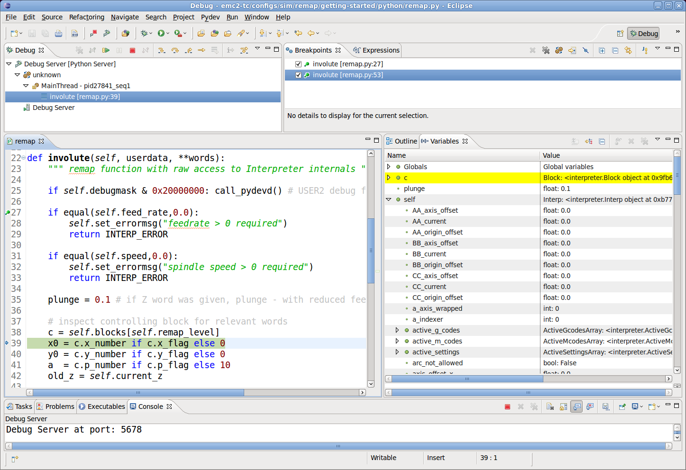

:lang: es

[[cha:remap]]

= Remap Extendiendo el código G

:ini: {basebackend@docbook:'':ini}
:hal: {basebackend@docbook:'':hal}
:ngc: {basebackend@docbook:'':ngc}

== Introducción: Extensión del intérprete RS274NGC mediante remapeado de códigos

=== Definición: Remapeado de Códigos 

Por 'Remapeado de Códigos' nos referimos a uno de los siguientes casos:

. Definir la semántica de un código M o G nuevo, es decir, actualmente sin asignar. 
. Redefinir la semántica de un conjunto actualmente limitado de códigos existentes.

=== ¿Por qué querría extender el intérprete RS274NGC?

El conjunto de códigos (M, G, T, S, F) entendido actualmente por el intérprete RS274NGC
es fijo y no puede extenderse por opciones de configuración.

En particular, algunos de estos códigos implementan una secuencia fija de pasos
para ser ejecutados. Mientras que algunos de estos, como M6, pueden ser moderadamente
configurados activando o saltando algunos de estos pasos a través de opciones del archivo .ini,
en general el comportamiento es bastante rígido. Si usted
está conforme con esta situación, entonces puede ignorar esta sección del manual.

En muchos casos, esto significa que el soporte para configuraciones o máquinas 'mas especiales'
son engorrosas o imposibles, o requiere recurrir a cambios a nivel del lenguaje 'C/C\+\+'. Esto último
es impopular por buenas razones: el cambio de las características internas requiere un análisis profundo,
comprensión de los aspectos internos del intérprete, y además trae su propio
conjunto de problemas de soporte. Si bien es posible que ciertos parches
podrían encontrar acomodo en la distribución principal de LinuxCNC, el resultado de
este enfoque es una mezcolanza de soluciones de casos especiales.

Un buen ejemplo de esta deficiencia es el soporte de cambio de herramienta en LinuxCNC:
mientras que los cambiadores de herramientas random están bien soportados, es casi imposible
definir razonablemente una configuración para una máquina de cambio de herramienta manual
con, por ejemplo, un desplazamiento automático a un interruptor de longitud de herramienta que sea
visitado después del cambio, y que los offsets se establezcan en consecuencia. Además, aun 
existiendo un parche para un cambiador de herramientas rack muy específico, no se ha encontrado
la forma de regresar al código base principal.

Sin embargo, muchas de estas cosas pueden solucionarse usando procedimientos O-word
en lugar de un código incorporado; siempre que
el código incorporado sea insuficiente, llame al procedimiento O-word
en su lugar. Si bien es posible, es engorroso; requiere edición de código fuente
de programas NGC, reemplazando todas las llamadas al código deficiente por una llamada a
un procedimiento O-words.

En su forma más simple, un código reasignado no es mucho más que una
llamada espontánea a un procedimiento O-word. Esto sucede en el transfondo.
El procedimiento es visible en el nivel de configuración, pero no en el nivel de
programa NGC.

En general, el comportamiento de un código reasignado se puede definir de las siguientes maneras:

- usted define una subrutina O-word que implementa el comportamiento deseado.
- alternativamente, puede emplear una función Python que amplíe el comportamiento del intérprete.

.Como unir las cosas
Los códigos M y G, y las llamadas de subrutinas O-words tienen una sintaxis bastante diferente.

Los procedimientos O-word, por ejemplo, toman parámetros posicionales
con una sintaxis específica tal como:

[source,{ngc}]
---------------------------------------------------------------------
o<test> call [1.234] [4.65]
---------------------------------------------------------------------

mientras que los códigos M o G normalmente toman parámetros de 'palabra', requerida u opcional.
Por ejemplo, G76 (roscado) requiere las palabras P, Z, I, J y K,
y opcionalmente toma las palabras R, Q, H, E y L.

Así que no es suficiente decir 'siempre que encuentre el código X, por favor
llamar al procedimiento Y'; se necesita al menos alguna comprobación y conversión de parámetros.
Esto requiere un cierto 'código de union' entre el nuevo código
y su correspondiente procedimiento NGC que se debera ejecutar antes de pasar el control
al procedimiento NGC.

Este código de union es imposible de escribir como un procedimiento O-word
ya que el lenguaje RS274NGC carece de capacidades introspectivas y
acceso a las estructuras internas de datos del intérprete para lograr el
efecto requerido. De nuevo, hacer el código de union en 'C/C\+\+' sería una
solución inflexible y por lo tanto insatisfactoria.

.Como Encaja Python Embebido

Para hacer solucionable una situación compleja y que una situación simple sea facil, el
problema del codigo de union se trata de la siguiente manera:

- para situaciones simples, un procedimiento de union incorporado (`argspec`) cubre la mayoría
de los requisitos comunes de paso de parámetros. 
- para el remapeado de T, M6, M61, S, F hay un algo de codigo de union Python estándar que debería
cubrir la mayoría de las situaciones, ver <<remap:standard-glue, union estándar>>
- para situaciones más complejas, puede escribir su propio codigo de union Python para implementar
un nuevo comportamiento

Las funciones Python embebidas en el intérprete comenzaron como un codigo de union,
pero resultaron muy útiles mas alla de eso. Los usuarios familiarizados con
Python probablemente encontrará más fácil escribir códigos reasignados que unir
procedimientos O-word, etc, en Python puro, sin recurrir en absoluto al
algo engorroso lenguaje RS274NGC.

.Unas Palabras sobre Python Embebido

Muchas personas están familiarizadas con 'extender' el intérprete de Python mediante
módulos 'C/C\+\+', y esto se usa mucho en LinuxCNC para acceder a Task e
interioridades de HAL y del intérprete mediante scripts de Python. 'Extender
Python' básicamente significa que su script de Python se ejecuta 'de la forma estandar',
y puede acceder a código que no es Python importando y usando
módulos de extensión escritos en 'C/C\+\+'. Ejemplos de esto son los módulos de LinuxCNC
`hal`,` gcode` y `emc`.

Python Embebido es un poco diferente y menos conocido; el
programa principal está escrito en 'C/C\+\+' y puede usar Python como una
subrutina. Este es un poderoso mecanismo de extensión y la base para las
'extensiones de scripts' encontradas en muchos programas conocidos.
El código Python Embebido puede acceder a las variables 'C/C\+\+' y
funciona a través de un método de extensión de módulo similar.

[[remap:getting-started]]

== Comenzando

La definición de un código implica los siguientes pasos:

- Elegir un código - usar un código no asignado, o redefinir un código existente
- Decidir cómo se manejan los parámetros.
- Decidir si se manipulan los resultados y cómo.
- Decidir sobre la secuencia de ejecución.

=== Escogiendo un código

Tenga en cuenta que actualmente solo se pueden redefinir algunos códigos existentes,
mientras que hay muchos códigos 'libres' que pueden estar disponibles para
remapeado. Al desarrollar un código existente redefinido, podría ser
una buena idea comenzar con un código G o M sin asignar, de modo que se pueda emplear tanto
un comportamiento existente como uno nuevo. Cuando haya terminado, redefina el
código existente para utilizar su configuración de remapeado.

- el conjunto actual de códigos M no utilizados, disponibles para definición de usuario, se puede encontrar
<<remap:unallocated-m-codes, aquí>>,
- Se enumeran los códigos G no asignados <<remap:unallocated-g-codes, aquí>>.
- Los códigos existentes que pueden ser reasignados están listados <<remap:remappable-codes, aquí>>.

[[remap:parameter-handling]]

=== Manejo de parámetros

Asumamos que el nuevo código será definido por un procedimiento NGC y necesita
algunos parámetros, unos necesarios y otros opcionales.
Tenemos las siguientes opciones para alimentar al procedimiento con sus valores:

// . <<remap:extracting-words,extraer palabras del bloque actual>>
. extraer palabras del bloque actual y pasarlas al
  procedimiento como parámetros (como `X22.34` o `P47`)
// . <<remap:referto-inifile-variables, refiriéndose a las variables del
//archivo ini>>
. refiriéndose a las <<gcode:ini-hal-params,variables del archivo ini>>
. refiriéndose a variables globales (como `#2200 = 47.11` o
   `#<_global_param> = 315.2`

El primer método se prefiere para parámetros de naturaleza dinámica, como
posiciones. Es necesario definir qué palabras en el bloque actual tienen algun
significado para su nuevo código, y especificar cómo se pasan al
procedimiento NGC. Una forma fácil es usar la
declaración argspec. Un prologo personalizado podría
proporcionar mejores mensajes de error.

Para referirse a la información de configuración de su máquina, es más útil usar las variables de archivo ini; 
por ejemplo, una posición fija como la
posición del sensor de longitud de la herramienta. La ventaja de este método es que
los parámetros son fijos en su configuración, independientemente del archivo NGC en ejecucion.

Siempre es posible hacer referencia a variables globales, pero son fáciles de
pasar por alto.

Tenga en cuenta que hay una cantidad limitada de palabras que pueden usarse como
parámetros, por lo que podría tener que recurrir al segundo y tercer
método si se necesitan muchos parámetros.

[[remap:handling-results]]

=== Manejo de resultados

Su nuevo código podría tener éxito o fallar, por ejemplo, si se pasa una combinación de parámetros inválida.
O puede elegir "ejecutar" el procedimiento y descartar los resultados, en cuyo caso no hay mucho trabajo por hacer.

Los manejadores de epilogo ayudan en el procesamiento de los resultados de los procedimientos de remapeado; consulte
la sección de referencia.

[[remap:execution-sequencing]]

=== Secuenciación de ejecución

Las palabras de código G ejecutables se clasifican en <<gcode:modal-groups,grupos modales>>,
que también definen su comportamiento relativo de ejecución.

Si un bloque de código G contiene varias palabras ejecutables en una línea, estas
palabras se ejecutan en un <<gcode:order-of-execution,orden de
ejecución>>, no en el orden en que aparecen en bloque.

Cuando define un nuevo código ejecutable, el intérprete todavía no
saber dónde encaja su código en este esquema. Por lo tanto, debe elegir un grupo modal apropiado para su código.

=== Un ejemplo mínimo de código remapeado

Para darle una idea de cómo encajan las piezas, exploremos una
definición de código bastante minimalista pero completa. Elegimos un
código M no asignado y agregamos la siguiente opción al archivo ini:

[source,{ini}]
---------------------------------------------------------------------
[RS274NGC]
REMAP=M400  modalgroup=10 argspec=Pq ngc=myprocedure
---------------------------------------------------------------------

Esto significa, en pocas palabras:

- El código `M400` toma un parámetro requerido `P` y otro opcional
  `Q`. Otras palabras en el bloque actual son ignoradas con
  respecto al código `M400`. Si la palabra `P` no está presente, 
  la ejecución falla con un error.

- cuando se encuentra un código `M400`, se ejecuta `myprocedure.ngc` junto con
otros códigos M del <<gcode:modal-groups,grupo modal>> 10 según el
<<gcode:order-of-execution, orden de ejecución>>.

- el valor de `P` y `Q` están disponibles en el procedimiento como parámetros nombrados locales.
   Pueden denominarse `#
` y `#<Q>`.
   El procedimiento puede probar si la palabra `Q` estaba presente con
   la función incorporada <<gcode:functions,`EXISTS`>>.

Se espera que el archivo `myprocedure.ngc` exista en el directorio `[DISPLAY]NC_FILES` o
en `[RS274NGC]SUBROUTINE_PATH` .

Una discusión detallada de los parámetros de REMAP se encuentra en la sección de referencia
que sigue.

== Configuración del remapeo

=== La sentencia REMAP

Para reasignar un código, defínalo usando la opción `REMAP` en la sección
`RS274NG` de su archivo ini. Use una línea `REMAP` por cada código reasignado.

La sintaxis de `REMAP` es:

`REMAP=`'<code>' '<options>'::
    donde '<code>' puede ser `T`,` M6`, `M61`,` S` o `F` (códigos existentes) o cualquiera de los
     <<remap:unallocated-m-codes, códigos M >> o <<remap:unallocated-g-codes,códigos G>> sin asignar.

Es un error omitir el parámetro '<code>'.

Las opciones de la instrucción REMAP están separadas por espacios en blanco. Las opciones son
pares de palabra clave-valor y actualmente son:

`modalgroup=`'<modal group>'::
        Códigos G;; el único grupo modal actualmente soportado es 1, que
        también es el valor predeterminado si no se da ningún grupo. Grupo 1 significa
        'ejecutar junto con otros códigos G'.

  Códigos M;; Los grupos modales soportados actualmente son:
        5,6,7,8,9,10. Si no se da ningún grupo modal, el valor predeterminado es 10
        ('ejecutar después de todas las otras palabras en el bloque').

  T, S, F; Para estos el grupo modal es fijo y cualquier
  opción `modalgroup=` se ignora.

`argspec=`'<argspec>'::
  Ver descripción de opciones de parámetros argspec. Opcional.

`ngc=`'<nombre_báse_ngc>'::
   Nombre base de un nombre de archivo de subrutina O-word. No especifique la
   extensión .ngc. Se busca en los directorios especificados en
   el directorio dado en `[DISPLAY]PROGRAM_PREFIX`, y luego en
   `[RS274NGC]SUBROUTINE_PATH`. Es mutuamente excluyente con
   `python=`. Es un error omitir tanto `ngc=` como `python=`.

`python=`'<nombre de la función de Python>'::
  En lugar de llamar a un procedimiento ngc O-word, llame a una función Python.
  Se espera que la función se defina en el módulo
  `module_basename.oword`. Mutuamente excluyente con `ngc=`.

`prolog=`'<nombre de la función de Python>'::
  Antes de ejecutar un procedimiento ngc, llame a esta función Python.
  Se espera que la función se defina en el módulo `module_basename.remap`. Opcional.

`epilog=`'<nombre de la función de Python>'::
  Después de ejecutar un procedimiento ngc, llame a esta función Python.
  Se espera que la función se defina en el módulo `module_basename.remap`. Opcional.

Las opciones `python`,` prolog` y `epilog` requieren que el plugin de intérprete Python
sea <<remap:embedded-python,configurado>>, y
las funciones apropiadas de Python se definirán allí para que puedan ser
referidas con estas opciones.

La sintaxis para definir un nuevo código y redefinir un código existente es
idéntica.

=== Combinaciones útiles de opciones de REMAP

Tenga en cuenta que si bien son posibles muchas combinaciones de opciones argspec, no
todas ellas tienen sentido. Las siguientes combinaciones son expresiones útiles:

`argspec=`'<words>' `ngc=`'<procname>' `modalgroup=`'<group>'::
    Forma recomendada de llamar a un procedimiento NGC con conversión estándar de parámetro argspec. 
    Se utiliza si argspec es suficientemente bueno para nuestro proposito. Tenga en cuenta que no es
    suficientemente bueno para volver a asignar los códigos de cambio de herramientas Tx y M6/M61.

`prolog=`'<pythonprolog>' `ngc=`'<procname>' `epilog=`'<pythonepilog>' `modalgroup=`'<group>'::
    Llama a una función de prologo de Python para realizar cualquier paso preliminar, luego llama al
    procedimiento NGC. Cuando ha terminado, llama a la función de epilogo de Python para hacer cualquier
    limpieza o trabajo de extracción de resultados que no pueda ser manejado en código G.
    Es la forma más flexible de volver a asignar un código a un procedimiento NGC,
    ya que casi todas las variables, y algunas funciones, internas del intérprete
    se pueden acceder desde los manipuladores de prologo y epilogo.
    Pero tambien es la forma mas propensa a errores propios.

`python=`'<pythonfunction>' `modalgroup=`'<group>'::
    Llama directamente a una función de Python sin ninguna conversión de argumentos.
    La forma más poderosa de reasignar un código e ir directamente a
    python. Use esto si no necesita un procedimiento NGC, o NGC se
    usa accidentalmente.

`argspec=`'<words>' `python=`'<pythonfunction>' `modalgroup=`'<group>'::
    Convierte las palabras argspec y las pása a una función Python como argumento
    diccionario de palabras clave. Úselo para no tener que
    investigar las palabras pasadas en el bloque por usted mismo.

Tenga en cuenta que si todo lo que quiere lograr es llamar a algún código Python desde
código G, hay una forma algo más fácil de
<<remap:python-o-word-procs, llamar a funciones de Python como procedimientos O-word>>.

=== El parámetro argspec

La especificación del argumento (palabra clave `argspec`) describe las palabras requeridas y
opcionales a pasar a un procedimiento ngc, así como las condiciones previas opcionales
para que ese código se ejecute.

Un argspec consta de 0 o más caracteres de la clase
 `[@A-KMNP-Za-kmnp-z^>]` . Puede estar vacío (como `argspec=`).

Un argumento argspec vacío, o ningún argumento argspec en absoluto, implica que el código
remapeado no recibe ningún parámetro del bloque. Se ignora
cualquier parámetro extra presente.

Tenga en cuenta que las reglas RS274NGC se aplican todavía; por ejemplo, puede usar palabras de eje
(por ejemplo, X, Y, Z) solo en el contexto de un código G.

`ABCDEFGHIJKMPQRSTUVWXYZ`::
  Define un parámetro de palabra requerido; una letra mayúscula especifica que
  la palabra correspondiente *debe* estar presente en el bloque actual. El valor de la palabra será
  pasado como un parámetro con nombre local con un nombre correspondiente.
  Si el caracter `@` esta
  presente en argspec, se pasará como parámetro posicional; ver más abajo.

`abcdefghijkmpqrstuvwxyz`::
  Define un parámetro de palabra opcional: una letra minúscula especifica que
  la palabra correspondiente *puede* estar presente en el bloque actual.
  Si la palabra está presente, el valor de la palabra será
  pasado como un parámetro con nombre local. Si el caracter `@` esta
  presente en argspec, se pasará como parámetro posicional; ver más abajo.

`@`::
  El `@` (signo -at-) le dice a argspec que pase palabras como parámetros posicionales,
  en el orden definido después de la opción `@`.
  Tenga en cuenta que cuando se utiliza el paso de parámetros posicionales,
  un procedimiento no puede determinar si una palabra estaba presente o no; vea un
  ejemplo a continuación.

TIP: esto ayuda a empaquetar los procedimientos existentes de NGC como códigos remapeados.
Los procedimientos existentes esperan parámetros posicionales. Con la opción
`@`, puede evitar reescribirlos para referirse a parámetros con nombre locales.

`^`::
  El carácter `^` (caret) especifica que la velocidad actual
  del husillo debe ser mayor que cero (husillo en marcha),
  de lo contrario, el código falla con un mensaje de error apropiado.

`>`::
  El carácter `>` (mayor que) especifica que la velocidad de alimentacion actual
  debe ser mayor que cero, de lo contrario el código falla con
  un mensaje de error apropiado.

`n`::
  El carácter `n`  especifica que se pase el
  número de línea actual al parámetro nombrado local `n`.

De forma predeterminada, los parámetros se pasan con nombre local a un procedimiento NGC.
Estos parámetros locales aparecen como 'ya establecidos' cuando el
procedimiento comienza a ejecutarse, lo que es diferente de la semántica existente
(las variables locales comienzan con el valor 0.0 y debe ser asignado un valor explícitamente).

Los parámetros de palabra opcionales se pueden probar para detectar su presencia mediante `EXISTS(#<word>)`.

.Ejemplo para el paso de parámetros con nombre a procedimientos NGC

Supongamos que el código se define como

`REMAP=M400  modalgroup=10 argspec=Pq ngc=m400`

y `m400.ngc` es como sigue:

[source,{ngc}]
----------------------------------------------------------------------------------
o<m400>sub
(Se requiere P ya que está en mayúsculas en argspec)
(debug, palabra P=#
)
(q es opcional ya que está en minúscula en argspec. Use de la siguiente manera: )
o100 if [EXISTS[#<q>]]
    (debug, palabra asignada Q=#<q>)
o100 endif
o<m400> endsub
M2
----------------------------------------------------------------------------------

- ejecutando `M400` fallará con el mensaje
  `M400 definido por el usuario: falta: P`
- la ejecución de `M400 P123` mostrará` palabra P=123.000000`
- la ejecución de `M400 P123 Q456` mostrará` palabra P=123.000000` y `palabra asignada Q=456.000000`

.Ejemplo para pasar parámetros posicionales a procedimientos NGC

Supongamos que el código se define como

`REMAP=M410  modalgroup=10 argspec=@PQr ngc=m410`

y `m410.ngc` es como sigue:

[source,{ngc}]
----------------------------------------------------------------------------------
o<m410> sub
(debug, [1]=#1 [2]=#2 [3]=#3)
o<m410> endsub
M2
----------------------------------------------------------------------------------

- la ejecución de `M410 P10` mostrará` m410.ngc: [1]=10.000000 [2]=0.000000`
- la ejecución de `M410 P10 Q20` mostrará` m410.ngc: [1]=10.000000 [2]=20.000000`

NB: se pierde la capacidad de distinguir más de una palabra de parámetro opcional,
y no se puede saber si un parámetro opcional estaba
presente pero tenía el valor 0, o no estaba presente en absoluto.

.Ejemplo simple para pasar un parámetro con nombre a una función de Python

Es posible definir nuevos códigos 'sin' procedimiento NGC. Esto es
un primer ejemplo simple; uno más complejo se puede encontrar en la siguiente
sección.

Supongamos que el código se define como

`REMAP=G88.6 modalgroup=1  argspec=XYZp  python=g886`

Esto le indica al intérprete que ejecute la función Python `g886`
en el modulo `module_basename.remap`, que podría ser así:

[source,python]
---------------------------------------------------------------------
from interpreter import INTERP_OK
from emccanon import MESSAGE

def g886(self, **words):
    for key in words:
        MESSAGE("word '%s' = %f" % (key, words[key]))
    if words.has_key('p'):
        MESSAGE("la palabra P estaba presente")
    MESSAGE("comentario en esta línea: '%s'" % (self.blocks[self.remap_level].comment))
    return INTERP_OK
---------------------------------------------------------------------
Pruebe esto con:
  g88.6 x1 y2 z3
  g88.6 x1 y2 z3 p33 (un comentario aquí)

Notará la introducción gradual al entorno de Python incrustado.
- vea <<remap:programming-embedded-python, esto>> para más detalles. Tenga en cuenta que
con las funciones de remapeado Python, no tiene sentido tener
funciones de prologo o epilogo ya que está ejecutando una función Python en
primer lugar.

.Ejemplo avanzado: códigos remapeados en Python puro

Los módulos `interpreter` y` emccanon` exponen la mayoría de interioridades del intérprete
y algunos de Canon; muchas cosas que hasta ahora requerían codificación en
'C/C\+\+' ahora se puede hacer en Python.

El siguiente ejemplo se basa en el script `nc_files/involute.py` -
pero enlatado como un código G con algunos parámetros de extracción y comprobación. Esto
también demuestra la llamada al intérprete de forma recursiva (consulte `self.execute()`).

Suponiendo una definición como esta (NB: esto no usa argspec):

`REMAP=G88.1 modalgroup=1  py=involute`

La función `involute` en` python/remap.py` que aparece a continuación hace toda la
extracción de palabras directamente del bloque actual. Tenga en cuenta que los errores del intérprete
pueden ser traducidos a excepciones de Python. Recuerde que esto es
'readahead time' - los errores de tiempo de ejecución no pueden ser atrapados de esta manera.

[source,python]
---------------------------------------------------------------------
import sys
import traceback
from math import sin,cos

from interpreter import *
from emccanon import MESSAGE
from util import lineno, call_pydevd
# genera InterpreterException si fallan execute() o read()
throw_exceptions = 1

def involute(self, **words):
    """ función de remapeado con acceso directo a las funciones internas del intérprete """

    if self.debugmask & 0x20000000: call_pydevd() # USER2 debug flag

    if equal(self.feed_rate,0.0):
        return "se requiere alimentacion > 0"

    if equal(self.speed,0.0):
        return "se requiere velocidad de husillo > 0"

    plunge = 0.1 #si se dio la palabra Z, descender - con alimentación reducida

    # inspeccionar bloque de control para palabras relevantes
    c = self.blocks[self.remap_level]
    x0 = c.x_number if c.x_flag else 0
    y0 = c.y_number if c.y_flag else 0
    a  = c.p_number if c.p_flag else 10
    old_z = self.current_z

    if self.debugmask & 0x10000000:
        print "x0=%f y0=%f a=%f old_z=%f" % (x0,y0,a,old_z)

    try:
        #self.execute("G3456")  # generaría una excepción InterpreterException
        self.execute("G21",lineno())
        self.execute("G64 P0.001",lineno())
        self.execute("G0 X%f Y%f" % (x0,y0),lineno())

        if c.z_flag:
            feed = self.feed_rate
            self.execute("F%f G1 Z%f" % (feed * plunge, c.z_number),lineno())
            self.execute("F%f" % (feed),lineno())

        for i in range(100):
            t = i/10.
            x = x0 + a * (cos(t) + t * sin(t))
            y = y0 + a * (sin(t) - t * cos(t))
            self.execute("G1 X%f Y%f" % (x,y),lineno())

        if c.z_flag: # retrae a la altura inicial
            self.execute("G0 Z%f" % (old_z),lineno())

    except InterpreterException,e:
        msg = "%d: '%s' - %s" % (e.line_number,e.line_text, e.error_message)
  return msg

    return INTERP_OK
---------------------------------------------------------------------

Los ejemplos descritos hasta ahora se pueden encontrar en
'configs/sim/axis/remap/getting-started' con configuraciones completas.

== Actualización de una configuración existente para remapeado

Los requisitos mínimos para usar las declaraciones `REMAP` son las siguientes:

- el plug Python debe activarse especificando `[PYTHON]TOPLEVEL=<path-to-toplevel-script>`
 en el archivo ini.
- el script de nivel superior debe importar el módulo `remap`, que puede estar
 inicialmente vacío, pero la importación debe estar en su lugar.
- El intérprete de Python necesita encontrar el módulo remap.py, por lo que
 la ruta al directorio donde residen los módulos de Python debe estar
 añadida con `[PYTHON]PATH_APPEND=<path-to-your-local-Python-directory>`
- Recomendado: importe los manejadores `stdglue` en el módulo `remap`.
 En este caso, Python también necesita encontrar `stdglue.py` - simplemente lo copiamos
 desde la distribución para que pueda realizar cambios locales como sea
 necesario. Dependiendo de su instalación, la ruta a `stdglue.py` podría
 variar.

Asumiendo que sus configuraciones residen bajo `/home/user/xxx` y
el archivo ini es `/home/user/xxx/xxx.ini`, ejecute los siguientes comandos.

[source,sh]
---------------------------------------------------------------------
$ cd /home/user/xxx
$ mkdir python
$ cd python
$ cp /usr/share/linuxcnc/ncfiles/remap_lib/python-stdglue/stdglue.py .
$ echo 'from stdglue import *' >remap.py
$ echo 'import remap' >toplevel.py
---------------------------------------------------------------------

Ahora edite `/home/user/xxx/xxx.ini` y agregue lo siguiente:

[source,{ini}]
---------------------------------------------------------------------
[PYTHON]
TOPLEVEL=/home/user/xxx/python/toplevel.py
PATH_APPEND=/home/user/xxx/python
---------------------------------------------------------------------

Ahora verifique que LinuxCNC no presenta ningún mensaje de error; desde un
ventana de terminal ejecutar:

[source,sh]
---------------------------------------------------------------------
$ cd /home/user/xxx
$ linuxcnc xxx.ini
---------------------------------------------------------------------

== Remapeo de códigos relacionados con el cambio de herramienta: T, M6, M61

=== Descripción general

Si no está familiarizado con las partes internas de LinuxCNC, primero lea la sección
<<remap:how-tool-change-currently-works, Cómo trabaja el cambio de herramienta actualmente>> (pesado, pero necesario).

Tenga en cuenta que al volver a asignar un código existente, deshabilitamos completamente
<<remap:interpreter-action-on-m6,la funcionalidad incorporada de estos códigos>>
del intérprete.

Así que nuestro código reasignado tendrá que hacer algo más
que generar algunos comandos para mover la máquina como nos gustaria;
también tendrá que replicar los pasos de esta secuencia que son
necesarios para mantener al intérprete y a Task sin problemas.

Sin embargo, esto *no* afecta el procesamiento de comandos relacionados
con el cambio de herramienta en Task e iocontrol. Esto significa que cuando
ejecutemos el <<remap:send-tool-load-msg,paso 6b>> esto aún causará que
<<remap:iocontrol-action-on-load, iocontrol haga sus cosas>>.

Decisiones, decisiones:

- ¿Queremos usar un procedimiento O-word o hacerlo todo en código Python?
- ¿Es la secuencia HAL de iocontrol (preparación de herramienta/herramienta preparada y
 pines de cambio de herramienta/herramienta cambiada) suficientemente buenos o necesitamos un tipo diferente
 de interacción HAL para nuestro cambiador de herramientas (por ejemplo: más pines HAL
 involucrados con una secuencia de interacción diferente)?

Dependiendo de la respuesta, tenemos cuatro escenarios diferentes:

- Cuando se usa un procedimiento O-word, necesitamos funciones de prologo y epilogo.
- Si usa solo código Python y ningún procedimiento O-word, una función Python
es suficiente.
- cuando se utilizan los pines de iocontrol, nuestro procedimiento O-word o el código Python
contendrá movimientos en su mayoría.
- cuando necesitamos una interacción más compleja que la ofrecida por iocontrol,
necesitamos definir completamente nuestra propia interacción, usando los pines `motion.digital*` y
`motion.analog*`, y esencialmente ignorar los pines de iocontrol puenteandolos

NOTA: Si odias los procedimientos O-word y te encanta Python, eres libre de hacerlo
todo en Python, en cuyo caso solo tendrías una especificacion `python=<function>`
en la sentencia REMAP. Pero suponiendo que la mayoría de la gente estaría interesada en
utilizar procedimientos O-word porque están más familiarizados con eso, lo haremos
asi como el primer ejemplo.

El enfoque general para nuestro primer ejemplo será:

. Por flexibilidad, nos gustaría hacer todo lo posible con el código G en un procedimiento de palabra O.
Eso incluye toda la interacción HAL que normalmente sería manejada por iocontrol, porque preferiríamos hacer
cosas inteligentes con movimientos, sondas, pines I/O HAL y demas.

. intentaremos minimizar el código de Python en la medida necesaria para mantener sin problemas al intérprete,
y hacer que task haga realmente algo. Eso entrará en las funciones de Python `prolog` y` epilog`.

=== Entender el rol de iocontrol con códigos de cambio de herramienta remapeados

iocontrol proporciona dos secuencias de interacción HAL que podemos utilizar o no:

- cuando el mensaje NML puesto en cola por un comando canonico SELECT_POCKET() es
ejecutado, se desencadena la secuencia HAL "preparar herramienta y esperar que
herramienta preparada pase a alto" en iocontrol, además de
ajustar los pines XXXX
- cuando el mensaje NML puesto en cola por el comando canonico CHANGE_TOOL() es
ejecutado, esto activa la secuencia HAL "cambiar de herramienta y esperar
que herramienta cambiada pase a alto" en iocontrol, además de
ajustar de los pines XXXX

Lo que debe decidir es si las secuencias HAL de iocontrol existentes
son suficientes para manejar su cambiador. Tal vez necesite una secuencia de interacción diferente
- por ejemplo, más pines HAL, o tal vez interacción más compleja. Dependiendo de la respuesta, podríamos seguir utilizando
las secuencias HAL de iocontrol, o definir las nuestras propias.

Para documentarlo mejor, deshabilitaremos estas secuencias de iocontrol
y ejecutaremos las nuestras - el resultado se parecera a la
interacción existente, pero ahora tenemos control completo sobre ellas
porque se ejecutan en nuestro propio procedimiento O-word.

Para ello, lo que haremos sera usar  `motion.digital-*` y `motion.analog-*`
y los comandos asociados `M62` ..` M68` para hacer nuestra propia interacción HAL
en nuestro procedimiento O-word, y aquellos que efectivamente
reemplacen las secuencias 'tool-prepare/tool-ready' y
'tool-change/tool-changed' de iocontrol. Así que vamos a definir nuestros pines,
reemplazando funcionalmente los pines iocontrol existentes, y seguir adelante y hacer
un bucle de interacciones iocontrol. Usaremos la siguiente
correspondencia en nuestro ejemplo:

Correspondencia de pines iocontrol en los ejemplos.

[format="csv",width="60%",cols="2"]
[frame="topbot",grid="none"]
[options="header"]
|======
pin iocontrol.0  ,pin motion    
tool-prepare,digital-out-00 
tool-prepared,digital-in-00  
tool-change,digital-out-01 
tool-changed,digital-in-01  
tool-prep-number,analog-out-00  
tool-prep-pocket,analog-out-01  
tool-number,analog-out-02  
|======

Supongamos que desea redefinir el comando M6 y reemplazarlo por
un procedimiento O-word pero, aparte de eso, las demas cosas deberían continuar
trabajando.

Por tanto, lo que nuestro procedimiento O-word haría es reemplazar los pasos
<<remap:interpreter-action-on-m6, descritos aquí>>. Mirando
estos pasos encontrará que el código NGC puede usarse para la mayoría de ellos,
pero no todos. Así que las cosas que NGC no puede manejar se harán en las funciones prolog
y epilog de Python.

=== Especificando el reemplazo M6

Para transmitir la idea, simplemente reemplazamos la semántica M6 incorporada con la nuestra
propia. Una vez que funcione, puede seguir adelante y colocar cualquier acción que quiera
encajar en el procedimiento O-word.

Al revisar los <<remap:interpreter-action-on-m6,pasos>>, encontramos:

. Compruebe si el comando T ya se ejecutó - *ejecutar en el prologo Python*
. verificar si la compensación del cortador está activa - *ejecutar en el prologo Python*
. detener el husillo si es necesario - *se puede hacer en NGC*
. pinola arriba - *se puede hacer en NGC*
. si se estableció TOOL_CHANGE_AT_G30:
.. mueva los indexadores A, B y C si corresponde - *se puede hacer en NGC*
.. generar movimiento rápido a la posición G30 - *se puede hacer en NGC*
. enviar un comando canonico CHANGE_TOOL a Task - *ejecutar en el epilogo Python*
. configurar los parámetros números 5400-5413 de acuerdo con la nueva herramienta - *ejecutar en el epilogo Python*
. enviar una señal a Task para que deje de llamar al intérprete para lectura antes de completar el
cambio de herramienta - *ejecutar en epilogo Python*

Así que necesitamos un prologo y un epilogo. Asumamos que, en nuestro archivo ini, el remapeo M6 tiene el 
siguiente aspecto:

 REMAP=M6   modalgroup=6  prolog=change_prolog ngc=change epilog=change_epilog

Decidimos pasar algunas variables al procedimiento de remapeado que se puede inspeccionar y
cambiar allí, o utilizarlas en un mensaje. Esos son: `tool_in_spindle`,
`selected_tool` (números de herramientas) y sus respectivas ranuras
`current_pocket` y` selected_pocket`.
Con ello, el prologo que cubre los pasos 1 y 2 se vería así:

[source,python]
---------------------------------------------------------------------
def change_prolog(self, **words):
    try:
        if self.selected_pocket < 0:
            return "M6: ninguna herramienta preparada"

        if self.cutter_comp_side:
            return "No se pueden cambiar herramienta con compensación de radio de corte activada"

        self.params["tool_in_spindle"] = self.current_tool
        self.params["selected_tool"] = self.selected_tool
        self.params["current_pocket"] = self.current_pocket
        self.params["selected_pocket"] = self.selected_pocket
        return INTERP_OK
    except Exception, e:
        return "M6/change_prolog: %s" % (e)
---------------------------------------------------------------------

Encontrará que la mayoría de las funciones de prologo son muy similares: primero probar
que todas las condiciones previas para ejecutar el código se cumplen. Luego preparar el
entorno - inyectar variables y/o hacer cualquier paso de procesamiento preparatorio
que no se pueden hacer fácilmente en código NGC; luego pasar al
procedimiento NGC devolviendo INTERP_OK.

Nuestra primera iteración de procedimiento O-word es poco interesante; solo
verifica que tengamos los parámetros correctos y señalemos el éxito devolviendo un
valor positivo; los pasos 3-5 eventualmente serían cubiertos aquí (ver
<<gcode:ini-hal-params, aquí>> para las variables referentes
a la configuración del archivo ini):

[source,{ngc}]
---------------------------------------------------------------------
O<change> sub
(debug, cambio: current_tool=#<current_tool>)
(debug, cambio: selected_pocket=#<selected_pocket>)
;
; inserte cualquier código g que vea adecuado aquí, por ejemplo:
; G0  #<_ini[setup]tc_x>  #<_ini[setup]tc_y>  #<_ini[setup]tc_z>
;
O<change> endsub [1]
m2
---------------------------------------------------------------------

Asumiendo el éxito de `change.ngc`, necesitamos limpiar los pasos 6-8:

[source,python]
---------------------------------------------------------------------
def change_epilog(self, **words):
    try:
        if self.return_value > 0.0:
            # cambio
            self.selected_pocket =  int(self.params["selected_pocket"])
            emccanon.CHANGE_TOOL(self.selected_pocket)
            # causar sync()
            self.tool_change_flag = True
            self.set_tool_parameters()
            return INTERP_OK
        else:
            return "M6 abortado (código de retorno %.1f)" % (self.return_value)

    except Exception, e:
        return "M6/change_epilog: %s" % (e)
---------------------------------------------------------------------

Este reemplazo M6 es compatible con el código incorporado,
excepto los pasos 3-5, que deben completarse con su código NGC.

Una vez más, la mayoría de los epilogos tienen un esquema común: primero, determinar si
las cosas salieron bien en el procedimiento de remapeado, luego hacer cualquier accion de confirmación y limpieza
que no se pueden hacer en código NGC.

=== Configurando iocontrol con un M6 remapeado

Tenga en cuenta que la secuencia de operaciones ha cambiado: hacemos todo lo
requerido en el procedimiento O-word - incluyendo cualquier configuración/lectura de pin HAL
para activar un cambiador, y para reconocer un cambio de herramienta
- probablemente con pines IO `motion.digital-*` y `motion-analog-*`.
Cuando finalmente ejecutamos el comando `CHANGE_TOOL()`, todos
los movimientos y las interacciones HAL ya están completos.

Normalmente, solo ahora iocontrol haría su trabajo como se describe
<<remap:iocontrol-action-on-load,aquí>>. Sin embargo, no necesitamos mover los
pines HAL más - todo lo que queda por hacer con iocontrol es aceptar que
hemos terminado con preparado y cambiado.

Esto significa que los pines iocontrol correspondientes no tienen ninguna función
más. Por lo tanto, configuramos iocontrol para reconocer inmediatamente un
cambio, de esta manera:

[source,{hal}]
---------------------------------------------------------------------
# puenteo de señales de cambio al reasignar M6
net tool-change-loop iocontrol.0.tool-change iocontrol.0.tool-changed
---------------------------------------------------------------------
Si por alguna razón desea remapear `Tx` (preparar), 
los pines de iocontrol correspondientes también deben estar puenteados.

=== Escribiendo el cambio y preparando procedimientos O-word

Los prologos y epilogos estándar encontrados en
`ncfiles/remap_lib/python-stdglue/stdglue.py` pasan algunos 'parámetros expuestos' al procedimiento de remapeado.

Un 'parámetro expuesto' es una variable local nombrada visible en un procedimiento
de remapeado que corresponde a la variable interna del intérprete que
es relevante para el remapeado actual. Los parámetros expuestos
se establecen en el prologo respectivo y se inspeccionan en el epilogo.
Se puede cambiar en el procedimiento de remapeado y se recogerá el cambio
en el epilogo. Los parámetros expuestos para códigos incorporados remapeables son:

- `T` (prepare_prolog): `#<tool>` , `#<pocket>`
- `M6` (change_prolog): `#<tool_in_spindle>`, `#<selected_tool>`, `#<current_pocket>`, `#<selected_pocket>`
- `M61` (settool_prolog): `#<tool>` , `#<pocket>`
- `S` (setspeed_prolog):  `#<speed>`
- `F` (setfeed_prolog):  `#<feed>`

Si tiene necesidad específica de hacer visibles parámetros adicionales,
simplemente agregelos al prologo; prácticamente todas
las partes internas del intérprete son visibles para Python.

=== Haciendo cambios mínimos a los códigos incorporados, incluyendo `M6`

Recuerde que, normalmente, el remapeo de un código desactiva completamente todo el
procesamiento interno para ese código.

Sin embargo, en algunas situaciones podría ser suficiente agregar algunos códigos alrededor
del `M6` existente, como una sonda de longitud de herramienta,
pero que conserve el comportamiento de `M6`.

Dado que este podría ser un escenario común, el comportamiento de
los códigos reasignados se han puesto a disposición dentro del procedimiento
de remapeado. El intérprete detecta que nos estamos refiriendo a un
código reasignado dentro del procedimiento que se supone que redefine su
comportamiento. En este caso, se utiliza el comportamiento incorporado - este
actualmente está habilitado para el conjunto: `M6`,` M61`, `T`,` S`, `F`). Note
que de lo contrario, referirse a un código dentro de su propio procedimiento de remapeado
sería un error - una `recursión remapping`.

Retorciendo un poco una incorporada se vería así (en el caso de `M6`):

 REMAP=M6 modalgroup=6 ngc=mychange

[source,{ngc}]
---------------------------------------------------------------------
o<mychange> sub
M6 (uso de comportamiento incorporado de M6)
(.. mover al interruptor de longitud de la herramienta, probar y ajustar la longitud de la herramienta ..)
o<mychange> endsub
m2
---------------------------------------------------------------------

PRECAUCIÓN: al redefinir un código incorporado, *no especifique ningún cero encabezando
los códigos G o M*; por ejemplo, diga `REMAP=M1 ..`, no
`REMAP=M01 ...`.

Vea el directorio `configs/sim/axis/remap/extend-builtins` para una 
configuración completa que es el punto de partida recomendado para su trabajo propio.

=== Especificando el reemplazo de T (preparar)

Si está a gusto con la <<remap:interpreter-action-on-t,implementación por defecto>>, no
necesitaría hacer esto. Pero el remapeado es también una forma de solucionar las
deficiencias en la implementación actual, por ejemplo,
no bloquear hasta que se establezca el pin "tool-prepared".

Lo que podría hacer, por ejemplo, es:
- en una T remapeada, simplemente establezca el equivalente del pin "tool-prepare",
pero *no* espere "tool-prepared" aquí
- en el M6 remapeado correspondiente, espere a "tool-prepared" 
al principio del procedimiento O-word.

Nuevamente, los pines de iocontrol tool-prepare/tool-ready no se utilizarían
y serian reemplazados por pines `motion.*`, por lo que esos pines deben estar puenteados:

[source,{hal}]
---------------------------------------------------------------------
# puentear señales preparar al reasignar T
net tool-prep-loop iocontrol.0.tool-prepare iocontrol.0.tool-prepared
---------------------------------------------------------------------
Aquí está la configuración para una T reasignada:

  REMAP=T  prolog=prepare_prolog epilog=prepare_epilog ngc=prepare

[source,python]
---------------------------------------------------------------------
def prepare_prolog(self,**words):
    try:
        cblock = self.blocks[self.remap_level]
        if not cblock.t_flag:
            return "T requiere un número de herramienta"

        tool  = cblock.t_number
        if tool:
            (status, pocket) = self.find_tool_pocket(tool)
            if status != INTERP_OK:
                return "T%d: ranura no encontrado" % (tool)
        else:
            pocket = -1 # esto es T0 - descarga de herramienta
            
        # estas variables serán visibles en la sub oword de ngc
        # como variables locales #<tool> y #<pocket> , y pueden ser
        # modificadas allí - el epilogo recuperará los valores
        # cambiados
        self.params["tool"] = tool
        self.params["pocket"] = pocket

        return INTERP_OK
    except Exception, e:
        return "T%d/prepare_prolog: %s" % (int(words['t']), e)

---------------------------------------------------------------------

El procedimiento mínimo de preparación de ngc de nuevo se ve así:
[source,{ngc}]
---------------------------------------------------------------------
o<prepare> sub
; Devolviendo un valor positivo:
o<prepare> endsub [1]
m2
---------------------------------------------------------------------

Y el epilogo:
[source,python]
---------------------------------------------------------------------
def prepare_epilog(self, **words):
    try:
        if self.return_value > 0:
            self.selected_tool = int(self.params["tool"])
            self.selected_pocket = int(self.params["pocket"])
            emccanon.SELECT_POCKET(self.selected_pocket, self.selected_tool)
            return INTERP_OK
        else:
            return "T%d: abortado (código de retorno% .1f)" % (int(self.params["tool"]),self.return_value)

    except Exception, e:
        return "T%d/prepare_epilog: %s" % (tool,e)

---------------------------------------------------------------------

prepare_prolog y prepare_epilog son parte del 'codigo de union estándar'
proporcionado por 'nc_files/remap_lib/python-stdglue/stdglue.py'.
Este módulo está destinado a cubrir la mayoría de situaciones estándar de remapeado de una manera común.

=== Manejo de errores: tratando con abort

El procedimiento de cambio de herramienta incorporado tiene algunas precauciones para tratar
con un aborte de programa (por ejemplo, al presionar Escape in Axis durante un
cambio). Su función reasignada no tiene nada de esto, por lo tanto, alguna
limpieza explícita podría ser necesaria si un código reasignado es abortado.
En particular, un procedimiento de remapeado podría establecer ajustes modales que son
indeseables tener activos después de un abort. Por ejemplo, si su
procedimiento de remapeado tiene códigos de movimiento (G0, G1, G38 ..) y el remapeado es
abortado, entonces el último código modal permanecerá activo. Sin embargo,
es muy probable que desee que se cancele cualquier movimiento modal cuando el remapeado es
abortado.

La forma de hacerlo es mediante el uso de la  característica `[RS274NGC]ON_ABORT_COMMAND`.
Esta opción de ini especifica una llamada de procedimiento O-word que es
ejecutada si Task, por alguna razón, aborta la ejecución del programa.

[source,{ini}]
---------------------------------------------------------------------
[RS274NGC]
ON_ABORT_COMMAND=O <on_abort> call
---------------------------------------------------------------------

El procedimiento on_abort sugerido se vería así (adaptelo a
sus necesidades):

[source,{ngc}]
---------------------------------------------------------------------
o<on_abort> sub

G54 (las compensaciones de origen se establecen en el valor predeterminado)
G17 (seleccion del plano XY)
G90 (modo absoluto)
G94 (modo de alimentación: unidades/minuto)
M48 (ajuste de velocidad de avance y husillo)
G40 (compensación de corte desactivada)
M5  (husillo apagado)
G80 (cancelar movimiento modal)
M9  (niebla y refrigerante apagado)

o<on_abort> endsub
m2
---------------------------------------------------------------------

PRECAUCION: Nunca use un `M2` dentro de una subrutina O-word, incluyendo esta.
Esto causará errores difíciles de encontrar. Por ejemplo, usando un `M2` en
una subrutina, no terminará la subrutina correctamente y dejará el archivo NGC del
subprograma abierto, no el programa principal.

Asegúrese de que `on_abort.ngc` esté en la ruta de búsqueda del intérprete
(ubicación recomendada: `SUBROUTINE_PATH` para no desordenar su
directorio `NC_FILES` con procedimientos internos). `on_abort` recibe un
un solo parámetro que indica la causa de llamada al procedimiento de abortado,
que podría ser utilizado para la limpieza condicional.

Las declaraciones en ese procedimiento típicamente aseguran que el post-aborto
ha limpiado cualquier estado, y que los pines HAL se restablecieron correctamente.
Por ejemplo, vea `configs/sim/axis/remap/rack-toolchange`.

Tenga en cuenta que terminar un código reasignado devolviendo INTERP_ERROR desde
el epilogo (ver la sección anterior) también causará llamada al procedimiento `on_abort`.

=== Manejo de errores: error en un procedimiento NGC de remapeado de código

Si determina en su procedimiento de manejo que ocurrio alguna condición de error,
no use `M2` para finalizar su manejador - vea mas arriba.

Si se muestra un mensaje de error al operador y es suficientemente aceptable detener el programa actual, 
use la característica `(abort, <message>)` para terminar el manejador con un
mensaje de error. Tenga en cuenta que puede sustituir parámetros HAL numerados, nombrados e ini
en el texto como en este ejemplo (vea también `tests/interp/abort-hot-comment/test.ngc`):

[source,{ngc}]
---------------------------------------------------------------------
o100 if [..] (alguna condición de error)
     (abort, ¡Algo va Mal! p42=#42 q=#<q> ini=#<_ini[a]x> pin=#<_hal[component.pin])
o100 endif
---------------------------------------------------------------------
NOTA: la expansión de variables ini y HAL es opcional y se pueden deshabilitar en
el <<gcode:ini-features,archivo INI>>

Si se necesita una acción de recuperación más precisa, use lo
presentado en el ejemplo anterior:

- defina una función de epilogo, incluso si es solo para señalar una
  condición de error.
- pasar un valor negativo desde el manejador para señalar
  el error
- inspeccionar el valor de retorno en la función de epilogo.
- tomar cualquier acción de recuperación necesaria
- devolver la cadena de mensaje de error desde el manejador, que establecerá el
  mensaje de error del intérprete y aborta el programa (casi como
  `abort, message=`)

Este mensaje de error se mostrará en la interfaz de usuario, y devolviendo
INTERP_ERROR provocará que este error se maneje como cualquier otro error de tiempo de ejecución.

Tenga en cuenta que tanto `(abort, msg)` como devolver INTERP_ERROR desde un
epilogo hará que también se llame a cualquier manejador ON_ABORT si está definido
(ver apartado anterior).

== Reasignando otros códigos existentes: S, M0, M1, M60

=== Selección automática de marcha reasignando S (ajuste de la velocidad del husillo)

Un uso potencial para un código S reasignado sería una 'Selección automática de marcha'
dependiendo de la velocidad. En el procedimiento de remapeado, se probaría
la velocidad deseada alcanzable dada la configuración actual de engranajes, y
cambiaria de marcha adecuadamente si no es así.

=== Ajustando el comportamiento de M0, M1, M60

Un caso de uso para el remapeado de M0/M1 sería personalizar el comportamiento del
código existente. Por ejemplo, podría ser deseable desactivar el
husillo, la niebla y la inundación durante una pausa del programa M0 o M1, y 
configurar el reencendido cuando se reanude el programa.

Para un ejemplo completo haciendo eso, vea
'configs/sim/axis/remap/extend-builtins/', que adapta M1 como se muestra arriba.

== Creando nuevos ciclos de codigo G

Un ciclo de código G, como se usa aquí, debe comportarse de la siguiente manera:

* En la primera invocación, se recogen las palabras asociadas y
se ejecuta el ciclo de codigo G
* Si en las líneas subsiguientes simplemente continúan las palabras de parámetro aplicables a este
código, pero no un nuevo código G, el código G anterior se vuelve a ejecutar con los
parámetros cambiados en consecuencia.

Un ejemplo: Supongamos que tiene un `G84.3` definido como ciclo de código G reasignado
con el siguiente segmento ini (ver <<remap:cycle-stdglue,aquí>> para
una descripción detallada de +cycle_prolog+ y +cycle_epilog+):

[source,{ini}]
---------------------------------------------------------------------
[RS274NGC]
# Un ciclo con un procedimiento oword: G84.3 <X- Y- Z- Q- P->
REMAP=G84.3 argspec=xyzabcuvwpr prolog=cycle_prolog ngc=g843 epilog=cycle_epilog modalgroup=1 
---------------------------------------------------------------------
Ejecutando las siguientes lineas:
[source,{ngc}]
---------------------------------------------------------------------
g17
(1) g84.3 x1 y2 z3 r1
(2) x3 y4 p2
(3) x6 y7 z5
(4) G80
---------------------------------------------------------------------
provoca lo siguiente ('R' es sticky y 'Z' es sticky porque el plano es 'XY'):

. `g843.ngc` se llama con las palabras x = 1, y = 2, z = 3, r = 1
. `g843.ngc` se llama con las palabras x = 3, y = 4, z = 3, p = 2, r = 1
. `g843.ngc` se llama con las palabras x = 6, y = 7, z = 3, r = 1
. El ciclo `G84.3` se cancela.

Además de crear nuevos ciclos, esto proporciona un método fácil para
reempaquetar códigos G existentes que no se comportan como ciclos.
Por ejemplo, el código de roscado rígido `G33.1` no se comporta como un
ciclo. Con tal envoltorio, se puede crear fácilmente un nuevo código que
use `G33.1` pero se comporte como un ciclo.

Vea 'configs/sim/axis/remap/cycle' para un ejemplo completo de esta
característica. Contiene dos ciclos, uno con un procedimiento NGC como el anterior,
y un ejemplo de ciclo usando solo Python.

[[remap:embedded-python]]

== Configurando Python Embebido

El complemento de Python sirve tanto al intérprete como a task, si es configurado así,
y por lo tanto tiene su propia sección `PYTHON` en el archivo ini.

=== Plugin Python : configuración de archivos ini

`[PYTHON]`

`TOPLEVEL=`'<nombre de archivo>'::
  nombre de archivo de la secuencia de comandos de Python inicial para ejecutar en la
  puesta en marcha. Este script es responsable de configurar la estructura del nombre del paquete,
  ver más abajo.

`PATH_PREPEND=`'<directorio>'::
  añade delante este directorio a `PYTHON_PATH`. Repetible.

`PATH_APPEND=`'<directorio>'::
  agrega detras este directorio a `PYTHON_PATH`. Repetible.

`LOG_LEVEL=`'<integer>'::
  Nivel de registro de las acciones relacionadas con el plugin. Aumente esto si
  sospecha problemas.  Puede ser muy detallado.

`RELOAD_ON_CHANGE`='[0 | 1]'::
  vuelve a cargar la secuencia de comandos 'TOPLEVEL' si se cambió el archivo. Práctico
  para la depuración, pero actualmente incurre en una sobrecarga de tiempo de ejecución.
  Apaguelo para configuraciones de producción.

`PYTHON_TASK`='[0 | 1]'::
  Inicia el complemento de tareas de Python. Experimental. Ver xxx.

[[remap:executing-python-statements]]

=== Ejecutando sentencias de Python desde el intérprete

Para la ejecución ad hoc de comandos, ha sido añadido el 'comentario caliente' de Python.
La salida de Python por defecto va a la salida estándar, por lo que necesita comenzar
LinuxCNC desde una ventana de terminal para ver los resultados. Ejemplo (por ejemplo, en la
ventana MDI):

  ;py,print 2*3

Tenga en cuenta que la instancia del intérprete está disponible aquí como `self`, por lo que
también podría correr:

  ;py,print self.tool_table[0].toolno

La estructura `emcStatus` también es accesible:

  ;py,from emctask import *
  ;py,print emcstat.io.aux.estop

[[remap:programming-embedded-python]]

== Programación de Python Embebido en el intérprete RS274NGC

=== El espacio de nombres del plugin Python

Se espera que el espacio de nombres se distribuya de la siguiente manera:

`oword`::
  Cualquier codigo llamable en este módulo es candidato para procedimientos Python O-word
  Tenga en cuenta que el módulo de Python `oword` se testea
  *antes* que un procedimiento NGC con el mismo nombre - en efecto,
  nombres en `oword` ocultarán los archivos NGC del mismo
  nombre base

`remap`::
  Cualquier codigo llamable Python referenciado en un argspec `prolog`, `epilog` u
  opción `python`, se espera que se encuentre aquí.

`namedparams`::
  Las funciones de Python en este módulo amplían o redefinen el espacio de nombres de
  parámetros nombrados predefinidos, ver
  <<remap:adding-predefined-named-parameters,agregar parámetros predefinidos>>.

`task`::
  Aquí se esperan codigos llamables relacionados con task.

=== El intérprete visto desde Python

El intérprete es una clase existente C++ ('Interp') definida en
'src/emc/rs274ngc'. Conceptualmente, todos las llamadas a Python `oword.<function>` y
`remap.<function>` son métodos de esta clase Interp,
aunque no hay una definición explícita de Python de esta clase (es una
instancia de envoltorio 'Boost.Python') y, por lo tanto, recibe el primer
parámetro 'self' que se puede utilizar para acceder a elementos internos.

=== Las funciones del intérprete `__init__` y `__delete__`

Si el módulo `TOPLEVEL` define una función `__init__`, será
llamada una vez que el intérprete está totalmente configurado (archivo ini leído, y
estado sincronizado con el modelo mundial).

Si el módulo `TOPLEVEL` define una función `__delete__`, será
llamada una vez antes que el intérprete se apague y después de que los parámetros persistentes
se han guardado en `PARAMETER_FILE`.

Nota_ en este momento, el manejador `__delete__` no funciona para
instancias de intérprete creadas importando el módulo `gcode`. Si
necesita una funcionalidad equivalente (lo cual es bastante improbable),
por favor considere el módulo Python `atexit`.

[source,python]
---------------------------------------------------------------------
# esto sería definido en el módulo TOPLEVEL

def __init__(self):
    # agregar cualquier inicialización unica aquí
    if self.task:
  # esta es la instancia milltask de interp
  pass
    else:
  # esta es una instancia de interp no-milltask
        pass

def __delete__(self):
    # agregar cualquier acción de limpieza/salvado de estado aquí
    if self.task: # como arriba
  pass
    else:
        pass
---------------------------------------------------------------------

Esta función se puede utilizar para inicializar cualquier atributo del lado de Python
que puede ser necesario más adelante, por ejemplo, en funciones remap u o-word,
y guardar o restaurar el estado más allá de lo que proporciona `PARAMETER_FILE`.

Si hay acciones de configuración o limpieza que van a ocurrir solo en la
instancia milltask del intérprete (a diferencia de la instancia de intérprete
que se encuentra en el módulo Python `gcode` y sirve propósitos de visualización
de vista previa/progreso pero nada más), esto puede ser probado por
<<remap:axis-preview-and-remapped-code-execution, evaluar 'self.task'>>.

Un ejemplo de uso de `__init__` y `__delete__` se puede encontrar en
'configs/sim/axis/remap/cycle/python/toplevel.py' inicializando los atributos
necesario para manejar los ciclos en 'ncfiles/remap_lib/python-stdglue/stdglue.py'
(e importado a 'configs/sim/axis/remap/cycle/python/remap.py').

=== Convenciones de llamada: NGC a Python

El código Python se llama desde NGC en las siguientes situaciones:

- durante la ejecución normal del programa:
* cuando se ejecuta una llamada O-word como `O<proc> call` y el nombre
`oword.proc` está definido y es llamable
* cuando se ejecuta un comentario como `;py,<Python statement>`
- durante la ejecución de un código reasignado: cualquier manejador `prolog =`, `python =` y
  `epilog =`.

[[remap:python-o-word-procs]]

.Llamar a subrutinas Python O-word

Argumentos:

`self`::
  la instancia del intérprete

`*args`::
    La lista de parámetros posicionales reales. Ya que el numero
    de los parámetros reales pueden variar, es mejor usar este estilo de declaración:

[source,python]
---------------------------------------------------------------------
# esto sería definido en el módulo oword
def mysub(self, *args):
    print "número de parámetros pasados:", len(args)
    for a in args:
  print a
---------------------------------------------------------------------
.Devolver los valores de las subrutinas Python de O-word
Al igual que los procedimientos NGC pueden devolver valores, también lo hacen las
subrutinas O-word Python. Se espera que sean uno de los siguientes:

- no devuelve ningún valor (no hay una declaración `return` o el valor `None`)
- un valor float o int
- una cadena, esto significa 'esto es un mensaje de error, abortar el programa'. Funciona como `(abort, msg)`.

Cualquier otro tipo de valor de retorno generará una excepción de Python.

En un entorno NGC de llamada, los siguientes parámetros nombrados predefinidos
están disponibles:

`#<_value>`::
        Valor devuelto por el último procedimiento llamado. Inicializado
        a 0.0 en el inicio. Expuesto en Interp como `self.return_value` (float).

`#<_value_returned>`::
        indica el último procedimiento llamado `devuelto` o
        `endsub` con un valor explícito. 1.0 si es cierto. Establecido a 0.0 en cada 'call'. Expuesto
        en Interp como `self.value_returned` (int).

Vea también `tests/interp/value-return` para un ejemplo.

.Convenciones de llamada para las subrutinas 'prolog=' y 'epilog='

Los argumentos son:

`self`::
  la instancia del intérprete

`words`::
  parámetro diccionario de palabras clave. Si estaba presente un argspec,
  se recogen del bloque actual en consecuencia y se pasan
  al diccionario por conveniencia (las palabras también podrían ser
  recuperadas directamente del bloque llamante, pero esto requiere
  más conocimientos internos del intérprete). Si no se pasó argspec,
  o solo se especificaron valores opcionales y ninguno de
  estos estaban presentes en el bloque llamante, este diccionario estará
  vacío. Los nombres de las palabras se convierten a minúsculas.

Ejemplo de llamada:
[source,python]
---------------------------------------------------------------------
def minimal_prolog(self, **words): # in remap module
    print len(words),"palabras pasadas"
    for w in words:
        print "%s: %s" % (w, words[w])
    if words['p'] < 78: # NB: podría provocar una excepción si p fuera opcional
       retornando "fallando miserablemente"
    return INTERP_OK
---------------------------------------------------------------------

Valores de retorno:

`INTERP_OK`:: devolver esto en éxito. Se necesita importar esto desde "interpreter".

`"un mensaje de texto"`:: devolver una cadena desde un manejador significa 'esto es
un mensaje de error, abortar el programa '. Funciona como `(abortar, msg)`.

.

.Convenciones de llamada para las subrutinas 'python='

Los argumentos son:

`self`::
  la instancia del intérprete

`words`::
  parámetro diccionario de palabras clave. el mismo diccionario kwargs que
  prolog y epilog (ver arriba).

Ejemplo mínimo de la función `python=`:
[source,python]
---------------------------------------------------------------------
def useless(self,  **words): # en el módulo de remapeado
    return INTERP_OK
---------------------------------------------------------------------
Valores de retorno:

`INTERP_OK`:: devolver esto en éxito

`"mensaje de texto"`:: devolver una cadena desde un manejador significa 'esto es
un mensaje de error, abortar el programa '. Funciona como `(abort, msg)`.

Si el manejador necesita ejecutar una operación 'queuebuster'(cambio de herramienta, sonda, lectura del pin HAL)
se supone que se suspende la ejecución con la siguiente declaración:

`yield INTERP_EXECUTE_FINISH`::
       Esto señala a task para que detenga la lectura adelantada, ejecuta todas
       las operaciones en cola, ejecutar la operación 'queue-buster',
       sincroniza el estado del intérprete con el estado de la máquina, y luego señaliza
  al intérprete que continue. En este punto la función es
  reanudada en la declaración siguiente a la declaración `yield ..`.

.Tratando con queue-buster: Sonda, Cambio de Herramienta y espera de un pin HAL

Los destructores de colas interrumpen un procedimiento en el punto en que se llama a tal
operación, por lo tanto el procedimiento debe ser reiniciado después de synch() del intérprete.
Cuando esto sucede, el procedimiento necesita saber si se reinicia, y dónde continuar. El método generador de Python
se utiliza para tratar el reinicio del procedimiento.

Esto demuestra la continuación de la llamada con un solo punto de reinicio:

[source,python]
---------------------------------------------------------------------
def read_pin(self,*args):
    # espere 5 segundos para que la entrada digital 00 sea alta
    emccanon.WAIT(0,1,2,5.0)
    # cede el control después de ejecutar el destructor de colas:
    yield INTERP_EXECUTE_FINISH
    # La ejecución de post-sync() se reanuda aquí:
    pin_status = emccanon.GET_EXTERNAL_DIGITAL_INPUT(0,0);
    print "pin status=",pin_status
---------------------------------------------------------------------

ADVERTENCIA: La característica 'yield' es frágil. Las siguientes restricciones
se aplica al uso de 'yield INTERP_EXECUTE_FINISH':

- El código Python que ejecuta un 'yield INTERP_EXECUTE_FINISH' debe ser parte
  de un procedimiento de remapeado. yield no funciona en un procedimiento Python o-word.
- Una subrutina de remapeado de Python que contiene la declaración de 'yield INTERP_EXECUTE_FINISH' puede
no devolver un valor, como ocurre con las declaraciones yield de Python normales.
- El código que sigue a un yield no puede llamar al intérprete de forma recursiva, como con
  self.execute("<comando_mdi>"). Esta es una restricción de la arquitectura
  del intérprete y no se puede reparar sin un rediseño importante.

=== Convenciones de llamada: Python a NGC

El código NGC se ejecuta desde Python cuando:

- se ejecuta el método `self.execute(<código NGC>[,<número_de_línea>])`
- durante la ejecución de un código reasignado, si está definida una función `prolog=`,
 el procedimiento NGC dado en `ngc=` se ejecuta inmediatamente.

El manejador prolog no llama al manejador, sino que prepara el entorno de llamada,
por ejemplo, mediante la configuración de parámetros locales predefinidos.

.Insertando parámetros en un prolog, y recuperándolos en un epilog

Conceptualmente un prolog y un epilog se ejecutan al mismo nivel de llamada
que un procedimiento O-word, es decir, después de que se establece la llamada de subrutina
y antes de que la subrutina finalice o regrese.

Esto significa que cualquier variable local creada en un prolog será una variable local
en un procedimiento O-word, y cualquier variable local creada en
el procedimiento O-word todavía es accesible cuando se ejecuta el epilog.

La matriz `self.params` maneja la lectura y configuración de parámetros numerados y nombrados.
Si un parámetro con nombre comienza con `_` (guión bajo),
se asume que es un parámetro global; si no, es local al procedimiento llamante.
Además, los parámetros numerados en el rango 1..30 se tratan 
como variables locales; sus valores originales son restaurados en los
return/endsub de procedimientos O-word.

Aquí hay un ejemplo de código reasignado que demuestra la inserción y
extracción de parámetros en/desde un procedimiento O-word:

  REMAP=m300 prolog=insert_param ngc=testparam epilog=retrieve_param modalgroup=10

[source,python]
---------------------------------------------------------------------
def insert_param (self, **words): # en el módulo remapeado
    print "insert_param call level=",self.call_level
    self.params["myname"] = 123
    self.params[1] = 345
    self.params[2] = 678
    return INTERP_OK

def retrieve_param(self, **words):
    print "retrieve_param call level=",self.call_level
    print "#1=", self.params[1]
    print "#2=", self.params[2]
    try:
        print "result=", self.params["result"]
    except Exception,e:
  return "testparam olvidó asignar #<result>"
    return INTERP_OK
---------------------------------------------------------------------

[source,{ngc}]
---------------------------------------------------------------------
o<testparam> sub
(debug, call_level=#<_call_level> myname=#<myname>)
; Intente descomentar la siguiente línea y corra otra vez.
#<result> = [#<myname> * 3]
#1 = [#1 * 5]
#2 = [#2 * 3]
o<testparam> endsub
m2
---------------------------------------------------------------------

`self.params()` devuelve una lista de todos los nombres de variables actualmente definidos.
Como `myname` es local, desaparece después de que finaliza el epilog.

.Llamar al intérprete desde Python

Puede llamar de forma recursiva al intérprete desde el código de Python de la siguiente manera:

  self.execute(<código NGC>[,<número de línea>])

Ejemplos:
[source,python]
---------------------------------------------------------------------
  self.execute("G1 X%f Y%f" % (x,y))
  self.execute("O <myprocedure> call", currentline)
---------------------------------------------------------------------

Es posible que desee probar si el valor de retorno es
menor que `INTERP_MIN_ERROR`. Si está usando muchas instrucciones execute(), es
probablemente sea más fácil atrapar InterpreterException como se muestra a continuación.

PRECAUCIÓN: el método de inserción/recuperación de parámetros descrito en la sección anterior no
trabaja en este caso. Es lo suficientemente bueno para comandos ejecutar simples NGC 
o una llamada de procedimiento e introspección avanzada en el
procedimiento, y el paso de los parámetros locales con nombre no es necesario. La caracteristica de
llamada recursiva es frágil.

.Excepción del intérprete durante execute()

Si `interpreter.throw_exceptions` es distinto de cero (valor predeterminado 1), y self.execute() devuelve un error, 
se genera la excepción `InterpreterException`. InterpreterException tiene los
siguientes atributos:

`line_number`:: donde ocurrió el error
`line_text`:: la sentencia NGC causando el error
`error_message`:: mensaje de error del intérprete

Los errores pueden ser atrapados de la siguiente manera:

[source,python]
---------------------------------------------------------------------
import interpreter
interpreter.throw_exceptions = 1
   ...
   try:
        self.execute("G3456")  #  raise InterpreterException

   except InterpreterException,e:
        msg = "%d: '%s' - %s" % (e.line_number,e.line_text, e.error_message)
        return msg  # reemplazar el mensaje de error incorporado
---------------------------------------------------------------------

.Canon
La capa canonica está prácticamente compuesta de funciones libres. Ejemplo:
[source,python]
---------------------------------------------------------------------
import emccanon
def example(self,*args):
    ....
    emccanon.STRAIGHT_TRAVERSE(line,x0,y0,z0,0,0,0,0,0,0)
    emccanon.STRAIGHT_FEED(line,x1,y1,z1,0,0,0,0,0,0)
    ...
    return INTERP_OK
---------------------------------------------------------------------

Las funciones canonicas reales se declaran en `src/emc/nml_intf/canon.hh` y
se implementan en `src/emc/task/emccanon.cc`. La implementación de
las funciones Python se pueden encontrar en `src/emc/rs274ncg/canonmodule.cc`.

=== Módulos Integrados

Los siguientes módulos están integrados:

`interpreter`::
  Expone la clase Interp. Ver
  `src/emc/rs274ngc/interpmodule.cc`, y el test de regresión
  `tests/remap/introspect`.

`emccanon`::
  expone la mayoría de las llamadas de `src/emc/task/emccanon.cc`.

`emctask`::
  expone la instancia de la clase `emcStatus`. Consulte `src/emc/task/taskmodule.cc`.
  No presente cuando se usa el módulo `gcode` usado para interfaces de usuario -
  solo está presente en la instancia miltask del intérprete.

[[remap:adding-predefined-named-parameters]]

== Agregando Parámetros Nombrados Predefinidos

El intérprete viene con un conjunto de parámetros nombrados predefinidos para
acceso al estado interno desde el nivel NGC. Estos parametros
son de solo lectura y globales, y por lo tanto pueden asignarse.

Se pueden agregar parámetros adicionales definiendo una función en el
módulo `namedparams`. El nombre de la función define el nombre del
nuevo parámetro nombrado predefinido, que ahora puede ser referenciado en
expresiones arbitrarias.

Para agregar o redefinir un parámetro nombrado:

* agregue un módulo `namedparams` para que el intérprete lo pueda encontrar
* Definir nuevos parámetros por funciones (ver abajo). Estas funciones
 reciben `self` (la instancia del intérprete) como parámetro y así pueden
 acceder a estados aribtrarios. Las capacidades arbitrarias de Python se pueden usar para devolver un valor.
* importar ese módulo desde el script `TOPLEVEL`

[source,python]
---------------------------------------------------------------------
# namedparams.py
# ejemplo trivial
def _pi(self):
    return 3.1415926535
---------------------------------------------------------------------

[source,{ngc}]
---------------------------------------------------------------------
#<circumference> = [2 * #<radius> * #<_pi>]
---------------------------------------------------------------------

Se espera que las funciones en `namedparams.py` devuelvan un valor float o int.
Si se devuelve una cadena, se establece el mensaje de error del intérprete
y aborta la ejecución.

Sólo se agregan funciones con un guión bajo como parámetros,
ya que esta es la convención RS274NGC para globales.

Es posible redefinir un parámetro predefinido existente agregando
una función de Python con el mismo nombre que el módulo `namedparams`.
En este caso, se genera una advertencia durante el inicio.

Si bien el ejemplo anterior no es terriblemente útil, tenga en cuenta que
todo el estado interno del intérprete es accesible desde Python, por lo que
los predicados arbitrarios se pueden definir de esta manera. Para un ejemplo algo más
avanzado, vea `tests/remap/predefined-named-params`.

[[remap:standard-glue]]

== Rutinas estándar de union 

Dado que muchas tareas de remapeado son muy similares, se comenzo a recopilar
rutinas de prolog y epilog en un solo módulo de Python. Actualmente estas
se puede encontrar en 'ncfiles/remap_lib/python-stdglue/stdglue.py', que proporciona las
siguientes rutinas:

=== T: +prepare_prolog+ y +prepare_epilog+

Estos envuelven un procedimiento NGC para Tx Tool Prepare.

.Acciones de +prepare_prolog+

Los siguientes parámetros se hacen visibles para el procedimiento NGC:

- `#<tool>` - el parámetro de la palabra `T`
- `#<pocket>` - la ranura correspondiente

Si se solicita el número cero de herramienta (lo que significa descargar la herramienta),
la ranura correspondiente se pasa como -1.

Es un error si:

- no se da ningún número de herramienta como parámetro T
- la herramienta no se puede encontrar en la tabla de herramientas.

Tenga en cuenta que a menos que establezca el parámetro `[EMCIO] RANDOM_TOOLCHANGER=1`,
la herramienta y el número de ranura son idénticos, y el número de ranura de
la tabla de herramientas se ignora. Esto es actualmente una restricción.

.Acciones de +prepare_epilog+

- Se espera que el procedimiento NGC devuelva un valor positivo, de lo contrario
  se da un mensaje de error que contiene el valor de retorno y el
  el intérprete aborta.
- En caso de que el procedimiento NGC ejecutara el comando T (que luego se refiere
  al comportamiento incorporado en T), no se toma ninguna otra acción. Esto puede ser
  utilizado por ejemplo para ajustar mínimamente el comportamiento incorporado en
  lo que precede o sigue con algunas otras declaraciones.
- De lo contrario, se extraen los parámetros `#<tool>` y `#<pocket>`
  del espacio de parámetros de la subrutina. Esto significa que el
  procedimiento NGC podría cambiar estos valores, y el epilog tiene los
  valores modificados en cuenta.
- despues, se ejecuta el comando canononico `SELECT_POCKET(#<pocket>,#<tool>)`.

=== M6: +change_prolog+ y +change_epilog+

Estos envuelven un procedimiento NGC para M6 Tool Change.

.Acciones de +change_prolog+

* Los siguientes tres pasos son aplicables solo si se utiliza el componente `iocontrol-v2`:
** Si el parámetro 5600 (indicador de fallo) es mayor que cero, esto indica un fallo del cambiador de herramientas,
que se maneja de la siguiente manera:
** Si el parámetro 5601 (código de error) es negativo, esto indica un error hard
y el prolog aborta con un mensaje de error.
** Si el parámetro 5601 (código de error) es mayor o igual a cero, esto indica un
fallo soft. Se muestra un mensaje informativo y prolog continúa.

* Si no había un comando T precedente que causára que no fue seleccionada una ranura, 
prolog aborta con un mensaje de error.
* Si la compensación del radio de corte está activada, prolog se cancela con un mensaje de error.

Luego, los siguientes parámetros se exportan al procedimiento NGC:

- `#<tool_in_spindle>` : el número de herramienta de la herramienta cargada actualmente
- `#<selected_tool>` : el número de herramienta seleccionado
- `#<selected_pocket>` : el número de ranura de la herramienta seleccionada

.Acciones de +change_epilog+

* Se espera que el procedimiento NGC devuelva un valor positivo; de lo contrario
  se da un mensaje de error que contiene el valor de retorno y
  el intérprete aborta.
* Si el parámetro 5600 (indicador de fallo) es mayor que cero, esto indica un fallo del cambiador de herramientas,
que se maneja de la siguiente manera (solo para `iocontrol-v2`):
** Si el parámetro 5601 (código de error) es negativo, esto indica un error hard
y el epilog se anula con un mensaje de error.
** Si el parámetro 5601 (código de error) es mayor o igual a cero, esto indica un fallo soft.
Se muestra un mensaje informativo y el epilog continúa.
* En caso de que el procedimiento NGC ejecutara el comando M6 (que luego se refiere
  al comportamiento M6 incorporado), no se realiza ninguna otra acción. Esto puede ser
  utilizado por ejemplo para ajustar mínimamente el comportamiento incorporado en
  lo que precede o sigue con algunas otras declaraciones.
* De lo contrario, se extrae el parámetro `#<selected_pocket>`
  del espacio de parámetros de la subrutina, y se utiliza para establecer
  la variable `current_pocket` del intérprete. De nuevo, el
  procedimiento podría cambiar este valor, y el epilog toma en cuenta el
  valor cambiado .
* entonces, el comando canonico `CHANGE_TOOL(#<selected_pocket>)` es
  ejecutado.
* Se establecen los nuevos parámetros de la herramienta (desplazamientos, diámetro, etc.).

[[remap:cycle-stdglue]]

=== Ciclos de código G: +cycle_prolog+ y +cycle_epilog+

Estos envuelven un procedimiento de NGC para que pueda actuar como un ciclo, lo que significa que
el código de movimiento se conserva después de finalizar la ejecución. Si la siguiente linea
solo contiene palabras de parámetros (por ejemplo, nuevos valores de X, Y), el código es
ejecutado de nuevo con las nuevas palabras de parámetros fusionadas en el conjunto de los
parámetros dados en la primera invocación.

Estas rutinas están diseñadas para trabajar en conjunto con un
parámetro `argspec=<words>`. Mientras esto es
fácil de usar, en un escenario realista usted evitaría argspec y haría una
investigación más a fondo del bloque de forma manual para dar mejor mensaje
de error.

El argspec sugerido es el siguiente:
[source,{ini}]
---------------------------------------------------------------------
REMAP=G<somecode> argspec=xyzabcuvwqplr prolog=cycle_prolog ngc=<ngc procedure> epilog=cycle_epilog modalgroup=1 
---------------------------------------------------------------------
Esto permitirá a +cycle_prolog+ determinar la compatibilidad de cualquier
palabra de eje dada en el bloque, ver más abajo.

.Acciones de +cycle_prolog+
* Determine si las palabras pasadas desde el bloque actual cumplen
las condiciones descritas en <<gcode:canned-cycle-errors,Errores en ciclos fijos>>.
** exportar las palabras del eje como + <x> +, + # <y> + etc; falla si las palabras del eje de
diferentes grupos (XYZ) (UVW) se utilizan juntos, o se da cualquiera de (ABC).
** exportar 'L-' como +#<l>+; por defecto a 1 si no se da.
** exportar 'P-' como +#
+; fallo si p es menor que 0.
** exportar 'R-' como +#<r>+; fallo si no se da r, o es menor o igual a 0 si se da.
** fallo si la velocidad de avance es cero, o el avance de tiempo inverso o
la compensación del cortador está activas.
* Determine si esta es la primera invocación de un código G de ciclo, en
cuyo caso:
** Agregue las palabras pasadas (según argspec) en un conjunto de
parámetros sticky, que se conservan a través de varias invocaciones.
* Si no es así (una línea de continuación con nuevos parámetros):
** fusionar las palabras pasadas en el conjunto existente de
parámetros sticky.
* exportar el conjunto de parámetros sticky al procedimiento NGC.

.Acciones de +cycle_epilog+
* Determine si el código actual era en realidad un ciclo, si es así:
** retenga el modo de movimiento actual para que una línea de continuación sin un
código de movimiento ejecute el mismo código de movimiento.

=== S (Establecer velocidad): +setspeed_prolog+ y +setspeed_epilog+

TBD

=== F (Establecer Alimentacion): +setfeed_prolog+ y +setfeed_epilog+

TBD

=== M61 Establecer el número de herramienta: +settool_prolog+ y +settool_epilog+

TBD

== Ejecución del código remapeado

=== Entorno de llamada a procedimiento NGC durante remapeados

Normalmente, un procedimiento de palabra O se llama con parámetros posicionales.
Este esquema es muy limitante, en particular en presencia de parámetros opcionales.
Por lo tanto, la convención de llamada se ha extendido para utilizar
algo remotamente similar al modelo de argumentos de palabras clave de Python.

vea LINKTO gcode/main Subrutinas: sub, endsub, return, call.

=== Códigos reasignados anidados

Los códigos reasignados se pueden anidar al igual que las llamadas de procedimiento, es decir, un
código reasignado cuyo procedimiento NGC se refiere a algún otro código reasignado se ejecutará correctamente.

El máximo nivel de anidacion de remapeados es actualmente 10.

=== Número de secuencia durante remapeos

Los números de secuencia se propagan y se restauran con las llamadas a palabra O.
Consulte `tests/remap/nested-remaps/word` para la prueba de regresión,
que muestra el seguimiento de los números de secuencia durante el anidamiento de tres niveles de remapeado.

=== Banderas de depuracion

Los siguientes indicadores son relevantes para la remapeado y ejecución relacionada con Python:

 EMC_DEBUG_OWORD             0x00002000 rastrea la ejecución de subrutinas O-word
 EMC_DEBUG_REMAP             0x00004000 rastrea la ejecución del código relacionado con la remapeado
 EMC_DEBUG_PYTHON            0x00008000 llamadas a complemento de Python
 EMC_DEBUG_NAMEDPARAM        0x00010000 rastrea acceso a parámetros nombrados
 EMC_DEBUG_PYTHON_TASK       0x00040000 rastrea el complemento de Python de task
 EMC_DEBUG_USER1             0x10000000 definido por el usuario - no interpretado por LinuxCNC
 EMC_DEBUG_USER2             0x20000000 definido por el usuario - no interpretado por LinuxCNC

combine con 'or' estas banderas en la variable `[EMC]DEBUG` según sea necesario. Para una
lista actual de indicadores de depuración, vea 'src/emc/nml_intf/debugflags.h'.

=== Depuración de código Python embebido

La depuración del código Python enbebido es más difícil que la depuración normal
de scripts Python, y solo existe un suministro limitado de depuradores. Una
solución basada en código abierto que funciona es utilizar el
http://www.eclipse.org [IDE Eclipse], Eclipse plugin http://www.pydev.org [PydDev]
y su http://pydev.org/manual_adv_remote_debugger.html[característica de depuracion remota].

Para utilizar este enfoque:

- instale Eclipse a través del 'Centro de software de Ubuntu' (elija primero
selección)
- Instale el plugin PyDev desde
http://pydev.org/updates[Pydev Update Site]
- configure el árbol fuente de LinuxCNC como un proyecto de Eclipse
- inicie el servidor de depuración Pydev en Eclipse
- asegúrese de que el código Python incrustado pueda encontrar el módulo `pydevd.py`
que viene con ese plugin - está enterrado en algún lugar profundo debajo del
directorio de instalación de Eclipse. Establezca la variable `pydevd` en `util.py`
para reflejar esta ubicación del directorio.
- `import pydevd` en su módulo Python - vea los ejemplos `util.py` y `remap.py`
- llame a `pydevd.settrace()` en su módulo en algún punto para conectarse
al servidor de depuración de Eclipse Python: aquí puede establecer puntos de interrupción en su
Código, inspeccionar variables, pasos, etc., como de costumbre.

PRECAUCIÓN: `pydevd.settrace()` bloqueará la ejecución si Eclipse y el
servidor de depuración Pydev no se ha iniciado.

Para cubrir los dos últimos pasos: el procedimiento `o<pydevd>` ayuda a entrar
en el depurador desde el modo MDI. Véase también la función `call_pydevd`
en `util.py` y su uso en` remap.involute` para establecer un punto de interrupción.

Aquí hay una captura de pantalla de Eclipse/PyDevd depurando el procedimiento `involute`:

Vea el código de Python en `configs/sim/axis/remap/getting-started/python` para más detalles.

[[remap:axis-preview-and-remapped-code-execution]]

== Vista previa de Axis y Ejecución de código remapeado 

Para obtener una vista previa completa del camino de la herramienta de un código remapeado,
necesita tomar algunas precauciones.
Para entender lo que está pasando, revisemos la
vista previa y proceso de ejecución (esto cubre el caso de Axis, pero otros casos
son similares):

Primero, tenga en cuenta que hay *dos* instancias de intérprete independientes
involucradas:

- una instancia en el programa milltask, que ejecuta un programa cuando
presiona el botón 'Inicio' y hace que la máquina se mueva
- una segunda instancia en la interfaz de usuario cuyo propósito principal es
generar la vista previa de ruta de herramienta. Éste 'ejecuta' el programa una vez que
está cargado, pero en realidad no causa movimientos de la máquina.

Ahora suponga que su procedimiento de remapeado contiene una operación de sonda G38,
por ejemplo, como parte de un cambio de herramienta con touch-off de longitud de herramienta automático.
Si la sonda falla, eso sería claramente un error, por lo que se debe
mostrar un mensaje y abortar el programa.

Ahora, ¿qué pasa con la vista previa de este procedimiento?. En tiempo de vista previa, por supuesto
no se sabe si la sonda tiene éxito o no, pero
probablemente quiera ver cuál es la profundidad máxima de la sonda y suponga
tiene éxito y continúa la ejecución hasta
previsualizar nuevos movimientos. Además, no tiene sentido mostrar un
mensaje de 'sonda fallida' y abort *durante la vista previa*.

La forma de abordar este problema es probar en su procedimiento si
se ejecuta en modo de vista previa o ejecución. Esto puede ser verificado
probando el <<gcode:predefined-named-parameters,parámetro predefinido
nombrado>> `#<_task>`- será 1 durante la ejecución real y 0 durante
la vista previa. Ver 'configs/sim/axis/remap/ manual-toolchange-with-tool-length-switch/nc_subroutines/manual_change.ngc'
para un ejemplo de uso completo.

Dentro de Python embebido, la instancia de task puede ser verificada
probando 'self.task' - será 1 en la instancia de milltask, y 0
en la(s) instancia(s) de vista previa.

[[remap:remappable-codes]]

== Códigos remapeables

[[remap:existing-codes]]

=== Códigos existentes que pueden ser remapeados

El conjunto actual de códigos *existentes* abiertos para redefinición es:

- Tx (Preparar)
- M6 (Cambiar herramienta)
- M61 (Establecer número de herramienta)
- M0 (pausa temporalmente un programa en ejecución)
- M1 (pausar un programa en ejecución temporalmente si el interruptor de parada opcional está activado)
- M60 (intercambiar transbordadores de paletas y luego pausar un programa en ejecución temporalmente)
- S (ajuste la velocidad del husillo)
- F (ajuste de alimentación)

Tenga en cuenta que el uso de M61 actualmente requiere el uso de iocontrol-v2.

[[remap:unallocated-g-codes]]

=== Códigos G actualmente sin asignar:

Los códigos G actualmente no asignados (para remapeado) deben seleccionarse de los espacios en blanco
de las siguientes tablas. Todos los códigos G listados ya están definidos en
la implementación actual de LinuxCNC y no se puede usar para reasignar nuevos
códigos G (Se recomienda a los desarrolladores que agreguen nuevos códigos G a LinuxCNC que también
agregue sus nuevos códigos G a estas tablas.)

.Tabla de códigos G asignados_00-09
[width="90%",align="center",options="header,strong,unbreakable",cols="1*2^em,10*1<m"]
|==============================================================
|#  |Gxx |Gxx.1|Gxx.2|Gxx.3|Gxx.4|Gxx.5|Gxx.6|Gxx.7|Gxx.8|Gxx.9
|00 |G00 |     |     |     |     |     |     |     |     |
|01 |G01 |     |     |     |     |     |     |     |     |
|02 |G02 |     |     |     |     |     |     |     |     |
|03 |G03 |     |     |     |     |     |     |     |     |
|04 |G04 |     |     |     |     |     |     |     |     |
|05 |G05 |G05.1|G05.2|G05.3|     |     |     |     |     |
|06 |    |     |     |     |     |     |     |     |     |
|07 |G07 |     |     |     |     |     |     |     |     |
|08 |G08 |     |     |     |     |     |     |     |     |
|09 |    |     |     |     |     |     |     |     |     |
|==============================================================

.Tabla de códigos G asignados_10-19
[width="90%",align="center",options="header,strong,unbreakable",cols="1*2^em,10*1<m"]
|==============================================================
|#  |Gxx |Gxx.1|Gxx.2|Gxx.3|Gxx.4|Gxx.5|Gxx.6|Gxx.7|Gxx.8|Gxx.9
|10 |G10 |     |     |     |     |     |     |     |     |
|11 |    |     |     |     |     |     |     |     |     |
|12 |    |     |     |     |     |     |     |     |     |
|13 |    |     |     |     |     |     |     |     |     |
|14 |    |     |     |     |     |     |     |     |     |
|15 |    |     |     |     |     |     |     |     |     |
|16 |    |     |     |     |     |     |     |     |     |
|17 |G17 |G17.1|     |     |     |     |     |     |     |
|18 |G18 |G18.1|     |     |     |     |     |     |     |
|19 |G19 |G19.1|     |     |     |     |     |     |     |
|==============================================================

.Tabla de códigos G asignados_20-29
[width="90%",align="center",options="header,strong,unbreakable",cols="1*2^em,10*1<m"]
|==============================================================
|#  |Gxx |Gxx.1|Gxx.2|Gxx.3|Gxx.4|Gxx.5|Gxx.6|Gxx.7|Gxx.8|Gxx.9
|20 |G20 |     |     |     |     |     |     |     |     |
|21 |G21 |     |     |     |     |     |     |     |     |
|22 |    |     |     |     |     |     |     |     |     |
|23 |    |     |     |     |     |     |     |     |     |
|24 |    |     |     |     |     |     |     |     |     |
|25 |    |     |     |     |     |     |     |     |     |
|26 |    |     |     |     |     |     |     |     |     |
|27 |    |     |     |     |     |     |     |     |     |
|28 |G28 |G28.1|     |     |     |     |     |     |     |
|29 |    |     |     |     |     |     |     |     |     |
|==============================================================

.Tabla de códigos G asignados_30-39
[width="90%",align="center",options="header,strong,unbreakable",cols="1*2^em,10*1<m"]
|==============================================================
|#  |Gxx |Gxx.1|Gxx.2|Gxx.3|Gxx.4|Gxx.5|Gxx.6|Gxx.7|Gxx.8|Gxx.9
|30 |G30 |G30.1|     |     |     |     |     |     |     |
|31 |    |     |     |     |     |     |     |     |     |
|32 |    |     |     |     |     |     |     |     |     |
|33 |G30 |G30.1|     |     |     |     |     |     |     |
|34 |    |     |     |     |     |     |     |     |     |
|35 |    |     |     |     |     |     |     |     |     |
|36 |    |     |     |     |     |     |     |     |     |
|37 |    |     |     |     |     |     |     |     |     |
|38 |    |     |     |     |     |     |     |     |     |
|39 |    |     |     |     |     |     |     |     |     |
|==============================================================

.Tabla de códigos G asignados_40-49
[width="90%",align="center",options="header,strong,unbreakable",cols="1*2^em,10*1<m"]
|==============================================================
|#  |Gxx |Gxx.1|Gxx.2|Gxx.3|Gxx.4|Gxx.5|Gxx.6|Gxx.7|Gxx.8|Gxx.9
|40 |G40 |     |     |     |     |     |     |     |     |
|41 |G41 |G41.1|     |     |     |     |     |     |     |
|42 |G42 |G42.1|     |     |     |     |     |     |     |
|43 |G43 |G43.1|     |     |     |     |     |     |     |
|44 |    |     |     |     |     |     |     |     |     |
|45 |    |     |     |     |     |     |     |     |     |
|46 |    |     |     |     |     |     |     |     |     |
|47 |    |     |     |     |     |     |     |     |     |
|48 |    |     |     |     |     |     |     |     |     |
|49 |G40 |     |     |     |     |     |     |     |     |
|==============================================================

.Tabla de códigos G asignados_50-59
[width="90%",align="center",options="header,strong,unbreakable",cols="1*2^em,10*1<m"]
|==============================================================
|#  |Gxx |Gxx.1|Gxx.2|Gxx.3|Gxx.4|Gxx.5|Gxx.6|Gxx.7|Gxx.8|Gxx.9
|50 |    |     |     |     |     |     |     |     |     |
|51 |    |     |     |     |     |     |     |     |     |
|52 |    |     |     |     |     |     |     |     |     |
|53 |G53 |     |     |     |     |     |     |     |     |
|54 |G54 |     |     |     |     |     |     |     |     |
|55 |G55 |     |     |     |     |     |     |     |     |
|56 |G56 |     |     |     |     |     |     |     |     |
|57 |G57 |     |     |     |     |     |     |     |     |
|58 |G58 |     |     |     |     |     |     |     |     |
|59 |G59 |G59.1|G59.2|G59.3|     |     |     |     |     |
|==============================================================

.Tabla de códigos G asignados_60-69
[width="90%",align="center",options="header,strong,unbreakable",cols="1*2^em,10*1<m"]
|==============================================================
|#  |Gxx |Gxx.1|Gxx.2|Gxx.3|Gxx.4|Gxx.5|Gxx.6|Gxx.7|Gxx.8|Gxx.9
|60 |G60 |     |     |     |     |     |     |     |     |
|61 |G61 |G61.1|     |     |     |     |     |     |     |
|62 |    |     |     |     |     |     |     |     |     |
|63 |    |     |     |     |     |     |     |     |     |
|64 |G64 |     |     |     |     |     |     |     |     |
|65 |    |     |     |     |     |     |     |     |     |
|66 |    |     |     |     |     |     |     |     |     |
|67 |    |     |     |     |     |     |     |     |     |
|68 |    |     |     |     |     |     |     |     |     |
|69 |    |     |     |     |     |     |     |     |     |
|==============================================================

.Tabla de códigos G asignados_70-79
[width="90%",align="center",options="header,strong,unbreakable",cols="1*2^em,10*1<m"]
|==============================================================
|#  |Gxx |Gxx.1|Gxx.2|Gxx.3|Gxx.4|Gxx.5|Gxx.6|Gxx.7|Gxx.8|Gxx.9
|70 |    |     |     |     |     |     |     |     |     |
|71 |    |     |     |     |     |     |     |     |     |
|72 |    |     |     |     |     |     |     |     |     |
|73 |    |     |     |     |     |     |     |     |     |
|74 |    |     |     |     |     |     |     |     |     |
|75 |    |     |     |     |     |     |     |     |     |
|76 |G76 |     |     |     |     |     |     |     |     |
|77 |    |     |     |     |     |     |     |     |     |
|78 |    |     |     |     |     |     |     |     |     |
|79 |    |     |     |     |     |     |     |     |     |
|==============================================================

.Tabla de códigos G asignados_80-89
[width="90%",align="center",options="header,strong,unbreakable",cols="1*2^em,10*1<m"]
|==============================================================
|#  |Gxx |Gxx.1|Gxx.2|Gxx.3|Gxx.4|Gxx.5|Gxx.6|Gxx.7|Gxx.8|Gxx.9
|80 |G80 |     |     |     |     |     |     |     |     |
|81 |G81 |     |     |     |     |     |     |     |     |
|82 |G82 |     |     |     |     |     |     |     |     |
|83 |G83 |     |     |     |     |     |     |     |     |
|84 |G84 |     |     |     |     |     |     |     |     |
|85 |G85 |     |     |     |     |     |     |     |     |
|86 |G86 |     |     |     |     |     |     |     |     |
|87 |G87 |     |     |     |     |     |     |     |     |
|88 |G88 |     |     |     |     |     |     |     |     |
|89 |G89 |     |     |     |     |     |     |     |     |
|==============================================================

.Tabla de códigos G asignados_90-99
[width="90%",align="center",options="header,strong,unbreakable",cols="1*2^em,10*1<m"]
|==============================================================
|#  |Gxx |Gxx.1|Gxx.2|Gxx.3|Gxx.4|Gxx.5|Gxx.6|Gxx.7|Gxx.8|Gxx.9
|90 |G90 |G90.1|     |     |     |     |     |     |     |
|91 |G91 |G91.1|     |     |     |     |     |     |     |
|92 |G92 |G92.1|G92.2|G92.3|     |     |     |     |     |
|93 |G93 |     |     |     |     |     |     |     |     |
|94 |G94 |     |     |     |     |     |     |     |     |
|95 |G95 |     |     |     |     |     |     |     |     |
|96 |G96 |     |     |     |     |     |     |     |     |
|97 |G97 |     |     |     |     |     |     |     |     |
|98 |G98 |     |     |     |     |     |     |     |     |
|99 |G99 |     |     |     |     |     |     |     |     |
|==============================================================

[[remap:unallocated-m-codes]]

=== Códigos M actualmente sin asignar:

Estos códigos M actualmente no están definidos en la implementación actual de LinuxCNC
y se puede utilizar para definir nuevos códigos M. (Desarrolladores que definan nuevos códigos M en
LinuxCNC se recomienda que los elimine de esta tabla.)

.Tabla de códigos M no asignados 00-99
[width="90%",align="center",options="header,strong,unbreakable",cols="1*2^em,10*1<m"]
|==============================================================
|#     |Mx0 |Mx1 |Mx2 |Mx3 |Mx4 |Mx5 |Mx6 |Mx7 |Mx8 |Mx9 
|00-09 |    |    |    |    |    |    |    |    |    |    
|10-19 |M10 |M11 |M12 |M13 |M14 |M15 |M16 |M17 |M18 |    
|20-29 |M20 |M21 |M22 |M23 |M24 |M25 |M26 |M27 |M28 |M29 
|30-39 |    |M31 |M32 |M33 |M34 |M35 |M36 |M37 |M38 |M39 
|40-49 |M40 |M41 |M42 |M43 |M44 |M45 |M46 |M47 |    |    
|50-59 |    |    |    |    |M54 |M55 |M56 |M57 |M58 |M59 
|60-69 |    |    |    |    |    |    |    |    |    |    
|70-79 |    |    |    |    |M74 |M75 |M76 |M77 |M78 |M79 
|80-89 |M80 |M81 |M82 |M83 |M84 |M85 |M86 |M87 |M88 |M89 
|90-99 |M90 |M91 |M92 |M93 |M94 |M95 |M96 |M97 |M98 |M99 
|==============================================================

Todos los códigos M de `M100` a` M199` ya son códigos M definidos por el usuario,
y no deben ser remapeados.

Todos los códigos M de `M200` a` M999` están disponibles para la remapeado.

=== tiempo de lectura anticipada y tiempo de ejecución

foo

=== plugin / pickle hack

foo

=== Módulo, métodos, clases, etc. referencia.

foo

== Introducción: Extender la ejecución de tareas

foo

=== ¿Por qué quieres cambiar la ejecución de tareas?

foo

=== Un diagrama: tarea, interp, iocontrol, UI (??)

foo

== Modelos de ejecución de tareas

foo

=== Ejecución tradicional de iocontrol / iocontrolv2

foo

=== Redefiniendo procedimientos de IO

foo

=== Procedimientos de Python en tiempo de ejecución

foo

// ejemplos de configuración

== Una breve inspección de la ejecución del programa LinuxCNC

Para comprender el remapeado de códigos, podría ser útil inspeccionar la
ejecución de task e intérprete en lo que se refiere al remapeado.

=== Estado del intérprete

Conceptualmente, el estado del intérprete consiste en variables que entran en
las siguientes categorias:

1. información de configuración (típicamente del archivo INI)
2. El 'modelo mundial': una representación del estado real de la máquina.
3. Estado modal y ajustes
4. estado de ejecución del intérprete

(3) se refiere al estado que se "transfiere" entre la ejecución
de códigos NGC individuales: por ejemplo, una vez que el husillo está encendido y
la velocidad establecida, permanece en este ajuste hasta que se desactiva.
Lo mismo ocurre con muchos códigos, como alimentación, unidades, modos de movimiento (alimentación o
rápido) y así sucesivamente.

(4) contiene información sobre el bloque actualmente ejecutado, ya sea que
esté en una subrutina, variables de intérprete, etc.

La mayor parte de este estado se agrega en una, bastante poco sistemática,
`structure _setup` (vea interp_internals.hh).

=== Interacción de Task e Interpreter, puesta en cola y lectura anticipada

La parte Task de LinuxCNC es responsable de coordinar los comandos de máquina real
- movimiento, interacciones HAL y así sucesivamente. No lo hace por si misma
manejando el lenguaje RS274NGC. Task apela al
intérprete para analizar y ejecutar el siguiente comando, ya sea desde MDI o
el archivo actual.

La ejecución del intérprete genera operaciones canónicas de máquina, que son las que
en realidad mueven algo. Estas, sin embargo, no se ejecutan de inmediato, sino que
se ponen en una cola. La ejecución real de estos códigos ocurre
en la parte Task de LinuxCNC: los comandos canonicos se extraen de la cola de intérprete
y se ejecutan, dando como resultado movimientos reales de la máquina.

Esto significa que normalmente el intérprete está muy por delante de la
ejecución real de comandos: el análisis del programa bien podría haber
terminado antes de que comience cualquier movimiento notable. Este comportamiento es
llamado 'lectura anticipada'.

=== Predecir la posición de la máquina

Para calcular de antemano las operaciones canónicas de la máquina durante la lectura anticipada,
el intérprete debe poder predecir la posición de la máquina después de
cada línea de Gcode, y eso no siempre es posible.

Veamos un programa de ejemplo simple que hace movimientos relativos.
(G91), y supongamos que la máquina comienza en x = 0, y = 0, z = 0. Movimientos relativos
implica que el resultado del próximo movimiento se basa en la posición del
anterior:

[source,{ngc}]
---------------------------------------------------------------------
N10 G91
N20 G0 X10 Y-5 Z20
N30 G1 Y20 Z-5
N40 G0 Z30
N50 M2
---------------------------------------------------------------------

Aquí el intérprete puede predecir claramente las posiciones de la máquina para cada línea:

Después de N20: x = 10 y = -5 z = 20; después de N30: ​​x = 10 y = 15 z = 15; después de N40: x = 10 y = 15 z = 45

y así pueden analizar todo el programa y generar operaciones canónicas
con mucha antelación

=== El destructor de colas rompe la predicción de la posición

Sin embargo, la lectura adelantada completa solo es posible cuando
el intérprete puede predecir el impacto de la posición para *cada* línea en el
programa de antemano. Veamos un ejemplo modificado:

[source,{ngc}]
---------------------------------------------------------------------
N10 G91
N20 G0 X10 Y-5 Z20
N30 G38.3 Z-10
N40 O100 if [#5070 EQ 0]
N50    G1 Y20 Z-5
N60 O100 else
N70    G0 Z30
N80 O100 endif
N90 G1 Z10
N95 M2
---------------------------------------------------------------------
Para pre-calcular el movimiento en N90, el intérprete debería saber
dónde está la máquina después de la línea N80, y eso depende de si el
comando de la sonda tuvo éxito o no, lo cual no se conoce hasta que en realidad se
ejecuta.

Por lo tanto, algunas operaciones son incompatibles con una lectura anticipada. Estas
se llaman 'busters de cola' (cazadores o destructores de colas), y son:

- leer el valor de un pin HAL con M66: el valor del pin HAL no es predecible.
- Cargar una nueva herramienta con M6: la geometría de la herramienta no es predecible.
- ejecutar un sondeo con G38.n: la posición final y el éxito/fracaso no son predecibles.

=== ¿Cómo se tratan los busters de cola?

Cada vez que el intérprete se encuentra con un destructor de colas, debe detener
la lectura anticipada y esperar hasta que el resultado relevante esté disponible. La manera
en que esto funciona es:

- cuando se encuentra dicho código, el intérprete devuelve un
código de retorno especial a la tarea ('INTERP_EXECUTE_FINISH').

- este código de retorno señala a task la detencion de lectura anticipada por ahora, ejecutar
todos los comandos canónicos en cola acumulados hasta el momento (incluido el último,
que es el destructor de la cola), y luego 'sincronizar
el estado del intérprete con el modelo universal'. Técnicamente, esto significa
actualizar variables internas para reflejar los valores de pines HAL, recargar geometrías de herramienta
después de un M6, y transmitir los resultados de una sonda.

- El método 'synch()' del intérprete es llamado por task y hace solo
eso - lee todos los valores 'reales' del modelo universal que sean relevantes para la
posterior ejecución.

- En este punto, task continúa y llama al intérprete para obtener más información por lectura
  adelantada - hasta que el programa finalice o se encuentre otro destructor de colas.

=== Orden de palabras y orden de ejecución

Una o varias 'palabras' pueden estar presentes en un 'bloque' NGC si son
compatibles (algunas se excluyen mutuamente y deben estar en diferentes
líneas). Sin embargo, el modelo de ejecución prescribe una ordenación estricta de
ejecución de códigos, independientemente de su aparición en la línea de origen.
(<<gcode:order-of-execution, Orden de ejecución de G-Code>>).

=== Análisis

Una vez que se lee una línea (en modo MDI o desde el archivo NGC actual),
se analiza y los indicadores y parámetros se configuran en una 'estructura'
(struct _setup, member block1). Esta estructura contiene toda la información
sobre la línea de origen actual, pero independiente del orden diferente
de códigos en la línea actual: siempre que varios códigos sean compatibles,
cualquier orden fuente resultará en las mismas variables establecidas en el
bloque de estructura. Inmediatamente después del análisis, se comprueba la compatibilidad de
todos los códigos en un bloque.

=== Ejecución

Después de analizar con éxito, el bloque se ejecuta mediante execute_block(), y
aquí los diferentes elementos se manejan de acuerdo al orden de ejecución.

Si se encuentra un "destructor de cola", se establece una marca correspondiente en el
estado del intérprete (toolchange_flag, input_flag, probe_flag) y el
intérprete devuelve un valor de retorno INTERP_EXECUTE_FINISH, señalizando
'Detener readahead por ahora, y volver a sincronizar' con el llamador ('task').
Si no se encuentran busters de cola después de que se ejecutan todos los elementos, se devuelve INTERP_OK, lo que 
indica que la lectura anticipada puede continuar.

Cuando la lectura anticipada continúa después de la sincronización, task comienza a ejecutar
de nuevo las operaciones read() del intérprete. Durante la siguiente operación de lectura,
se comprueban los indicadores mencionados anteriormente y las variables correspondientes son
establecidas (porque se acaba de ejecutar un synch(), los valores son ahora los actuales.
Esto significa que el siguiente comando ya se ejecuta en el contexto de variables correctamente establecidas.

=== Ejecución de procedimientos

Los procedimientos de O-word complican un poco el manejo de los generadores de colas.
Un destructor de colas puede encontrarse en algún lugar en un procedimiento anidado, lo que resulta en una
llamada a procedimiento semiacabada cuando es devuelto INTERP_EXECUTE_FINISH.
Task se asegura de sincronizar el modelo universal y continua
 el análisis y ejecución siempre que haya un procedimiento en ejecución (call_level> 0).

[[remap:how-tool-change-currently-works]]

=== Cómo funciona el cambio de herramienta actualmente

Las acciones que suceden en LinuxCNC están poco involucradas, pero son necesarias
para tener una idea general de lo que sucede actualmente antes de
adaptar esos trabajos a sus propias necesidades.

Tenga en cuenta que la remapeado de un código existente desactiva completamente todo el procesamiento
interno de ese código. Eso significa que más allá del comportamiento deseado
- probablemente descrito a través de una Oword NGC o procedimiento Python,
necesita replicar esas acciones internas con el
intérprete, que juntos resultan en un reemplazo completo del
código existente. El código prolog y epilog es el lugar para hacer esto.

.Cómo se comunica la información de la herramienta.
Varios procesos están 'interesados' en la información de la herramienta: task y su
intérprete, así como la interfaz de usuario. Además, el proceso 'halui'.

La información de la herramienta se mantiene en la estructura 'emcStatus', que es
compartida por todas las partes. Uno de sus campos es la matriz 'toolTable',
que contiene la descripción cargada desde el archivo de tabla de herramientas (numero de herramienta,
diámetro, frontangle, backangle y orientación para torno, e información de compensación de la herramienta).

La fuente autorizada y el único proceso en realidad que "configura" la información de herramienta
es esa estructura en el proceso 'iocontrol'. Todos los otros
procesos solo consultan la estructura. El intérprete mantiene en realidad
una copia local de la tabla de herramientas.

Para los curiosos, se puede acceder a la estructura actual de emcStatus mediante
<<remap:executing-python-statements, sentencias de Python>>.
La percepción del intérprete de la herramienta cargada actualmente, por ejemplo, es
accedida por:

 ;py,from interpreter import *
 ;py,print this.tool_table[0]

Para ver los campos en la estructura global de emcStatus, intente esto:

 ;py,from emctask import *
 ;py,print emcstat.io.tool.pocketPrepped
 ;py,print emcstat.io.tool.toolInSpindle
 ;py,print emcstat.io.tool.toolTable[0]

Debe tener LinuxCNC iniciado desde una ventana de terminal para ver los resultados.

=== Cómo funciona Tx (Prepare Tool)

[[remap:interpreter-action-on-t]]

.Acción de intérprete en un comando Tx

Todo lo que hace el intérprete es evaluar el parámetro toolnumber, busca
su ranura correspondiente, lo recuerda en la variable `selected_pocket`
para más tarde, y pone en cola un comando canonico
(SELECT_POCKET). Consulte 'Interp::convert_tool_select' en 'src/emc/rs274/interp_execute.cc'.

.Acción de Task en SELECT_POCKET

Cuando task maneja un SELECT_POCKET, envía un mensaje
EMC_TOOL_PREPARE al proceso iocontrol, que maneja la mayoría
de acciones relacionadas con herramientas en LinuxCNC.

En la implementación actual, task realmente espera a que iocontrol
complete la operación de posicionamiento del cambiador, (que creo que no es necesario)
- esto rechaza la idea de que la preparación del cambiador y la ejecución del código pueden
proceder en paralelo.

.Acción de iocontrol sobre EMC_TOOL_PREPARE

Cuando iocontrol ve el comando select pocket, hace el HAL relacionado
movimiento de pines - establece el pin "número de preparación de la herramienta" para indicar cuál
La herramienta es la siguiente, levanta el pin de "preparación de la herramienta" y espera a que
El pin "preparado por la herramienta" irá alto.

Cuando el cambiador responde con "herramienta preparada", se considera completa
la fase de preparación y se señala a task tarea que
continue. (de nuevo, creo que esta 'espera' no es estrictamente necesaria)

.Construyendo prolog y epilog para Tx.

Vea las funciones de Python `prepare_prolog` y` prepare_epilog` en
`configs/sim/axis/remap/toolchange/python/toolchange.py`.

=== Cómo funciona M6 (cambio de herramienta)

Necesita entender esto completamente antes de poder adaptarlo. Es muy
relevante para escribir un controlador de prolog y epilog para un M6 reasignado.
Reasignar códigos existentes significa que se deshabilita los pasos internos
que se ejecutarian normalmente, y se deben replicar hasta donde sea necesario para sus propios
fines.

Incluso si no está familiarizado con C, le sugiero que mire el
código 'Interp::convert_tool_change' en
'src/emc/rs274/interp_convert.cc'.

[[remap:interpreter-action-on-m6]]

.Acción del intérprete en un comando M6

Cuando el intérprete ve un M6, éste:

[[remap:send-tool-load-msg]]

. verifica si un comando T ya ha sido ejecutado (prueba si
'settings->selected_pocket' es >= 0). y si falla da el mensaje 'necesito
preparada -Txx- para  de cambio de herramientas'.
. verifica que la compensación del cortador está activa y si es así, falla con el mensaje 'No se puede
cambiar las herramientas con la compensación del radio de corte activa'.
. detiene el husillo, excepto si se establece la opción "TOOL_CHANGE_WITH_SPINDLE_ON" en el ini.
. genera un movimiento rápido de 'Z up' si se establece la opción "TOOL_CHANGE_QUILL_UP" en el ini.
. si se estableció TOOL_CHANGE_AT_G30:
.. mueve los indizadores A, B y C si corresponde
.. genera un movimiento rápido a la posición G30
. ejecuta un comando canonico CHANGE_TOOL, con el ranura seleccionada como
parámetro. CHANGE_TOOL puede:
.. generar un movimiento rápido a TOOL_CHANGE_POSITION si así lo establece el ini
.. encolar un mensaje EMC_TOOL_LOAD NML a task.
. Configura los parámetros numerados 5400-5413 de acuerdo con la nueva herramienta
. señala a task que deje de llamar al intérprete para leer adelantadamente
devolviendo INTERP_EXECUTE_FINISH, ya que M6 es un destructor de colas.

.Qué hace task cuando ve un comando CHANGE_TOOL
Nuevamente, no mucho más que pasar la carga a iocontrol enviándole
un mensaje EMC_TOOL_LOAD, y espera hasta que iocontrol haya realizado su
labor.

[[remap:iocontrol-action-on-load]]

.Acción de iocontrol tras EMC_TOOL_LOAD

. Establece el pin "tool-change"
. espera a que el pin "tool-changed" se active
. cuando eso ha sucedido:
.. borra "tool-change"
.. coloca los pines "tool-prep-number" y "tool-prep-pocket" a cero.
.. ejecuta la función 'load_tool()' con la ranura como parámetro.

El último paso realmente establece las entradas de herramientas en la estructura 'emcStatus'.
La acción real tomada depende de si la opción ini RANDOM_TOOLCHANGER se estableció, pero al final del proceso
'toolTable[0]' refleja la herramienta que se encuentra actualmente en el husillo.

Cuando eso ha sucedido:

. iocontrol señala a task que puede seguir adelante
. task le dice al intérprete que ejecute una operación 'synch()', para actualizar
los cambios.
. 'synch()' del intérprete extrae toda la información necesaria del modelo universal,
entre ellos la tabla de herramientas cambiada.

A partir de ahí, el intérprete tiene un conocimiento completo del modelo universal
y continúa con la lectura adelantada.

.Construyendo prolog y epilog para M6.
Ver las funciones de Python `change_prolog` y` change_epilog` en
`configs/sim/axis/remap/toolchange/python/toolchange.py`.

=== Cómo funciona M61 (Cambiar número de herramienta)

M61 requiere un parámetro `Q` no negativo (número de herramienta). Si es cero,
significa 'descargar herramienta'; si no, es 'establecer el número de la herramienta actual en Q'.

.Construyendo el reemplazo para M61
Un ejemplo de redefinición de Python para M61 se puede encontrar en la
función `set_tool_number` en
`configs/sim/axis/remap/toolchange/python/toolchange.py`.

== Cambios

- el método para devolver mensajes de error y fallo solía ser
  'self.set_errormsg(texto)' seguido de 'return INTERP_ERROR'. Esto
  ha sido reemplazado simplemente devolviendo una cadena desde un manejador de Python
  o subrutina oword. Esto establece el mensaje de error y aborta el
  programa. Anteriormente no había una forma clara de abortar una subrutina de palabra O de Python
  

== Depuración

En la sección '[EMC]' del archivo ini, el parámetro 'DEBUG' se puede cambiar para
obtener varios niveles de mensajes de depuración cuando LinuxCNC se inicia desde un terminal.

----
Nivel de depuración, 0 significa que no hay mensajes. Vea src/emc/nml_intf/debugflags.h para otros.
DEBUG = 0x00000002 # configuración
DEBUG = 0x7FFFDEFF # no interp, oword
DEBUG = 0x00008000 # solo py
DEBUG = 0x0000E000 # py + remap + Oword
DEBUG = 0x0000C002 # py + remap + config
DEBUG = 0x0000C100 # py + remap + Intérprete
DEBUG = 0x0000C140 # py + remap + Intérprete + NML msgs
DEBUG = 0x0000C040 # py + remap + NML
DEBUG = 0x0003E100 # py + remap + Intérprete + oword + señales + namedparams
DEBUG = 0x10000000 # EMC_DEBUG_USER1 - declaraciones de rastreo
DEBUG = 0x20000000 # EMC_DEBUG_USER2 - captura en el depurador de Python
DEBUG = 0x10008000 # USER1, PYTHON
DEBUG = 0x30008000 # USER1, USER2, PYTHON # USER2 hará que la involuta intente conectarse a pydev
DEBUG = 0x7FFFFFFF # Todos los mensajes de depuración
----

