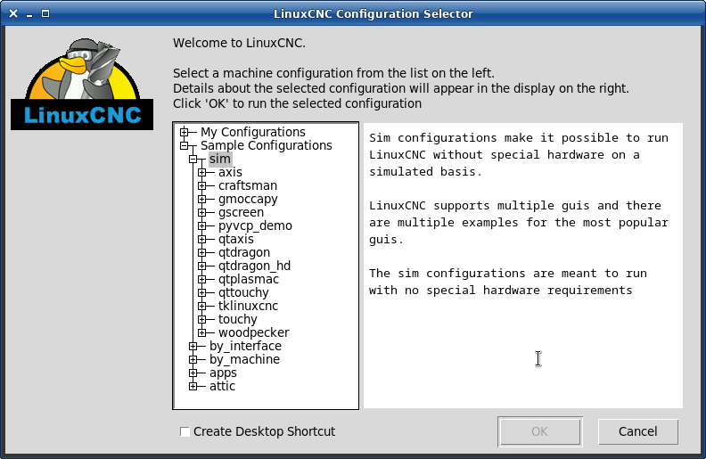

:lang: en
:toc:

[[cha:starting-linuxcnc]]
= Starting LinuxCNC(((Starting LinuxCNC)))

== Running LinuxCNC

LinuxCNC is started with the script file 'linuxcnc'.

----
linuxcnc [options] [<INI-file>]
----

.`linuxcnc` script options
----
linuxcnc: Run LinuxCNC

Usage:
  $ linuxcnc -h
    This help

  $ linuxcnc [Options]
    Choose the configuration INI file graphically

  $ linuxcnc [Options] path/to/your_ini_file
    Name the configuration INI file using its path

  $ linuxcnc [Options] -l
    Use the previously used configuration INI file

Options:
    -d: Turn on "debug" mode
    -v: Turn on "verbose" mode
    -r: Disable redirection of stdout and stderr to ~/linuxcnc_print.txt and
        ~/linuxcnc_debug.txt when stdin is not a tty.
        Used when running linuxcnc tests non-interactively.
    -l: Use the last-used INI file
    -k: Continue in the presence of errors in HAL files
    -t "tpmodulename [parameters]"
            specify custom trajectory_planning_module
            overrides optional INI setting [TRAJ]TPMOD
    -m "homemodulename [parameters]"
            specify custom homing_module
            overrides optional INI setting [EMCMOT]HOMEMOD
    -H "dirname": search dirname for HAL files before searching
                  INI directory and system library:
                  /home/git/linuxcnc-dev/lib/hallib
Note:
    The -H "dirname" option may be specified multiple times
----

If the linuxcnc script is passed an INI file it reads the INI file and starts
LinuxCNC. The INI file [HAL] section specifies the order of loading up HAL
files if more than one is used. Once the HAL=xxx.hal files are loaded then the
GUI is loaded then the POSTGUI=.xxx.hal file is loaded. If you create PyVCP or
GladeVCP objects with HAL pins you must use the postgui HAL file to make any
connections to those pins. See the <<sub:ini:sec:hal,[HAL]>> section of the
INI configuration for more information.

[[sub:configuration-selector]]
=== Configuration Selector(((Configuration Selection)))

If no INI file is passed to the linuxcnc script it loads the configuration
selector so you can choose and save a sample configuration. Once a sample
configuration has been saved it can be modified to suit your application.
The configuration files are saved in linuxcnc/configs directory.

//.Configuration Selector

// vim: set syntax=asciidoc:
