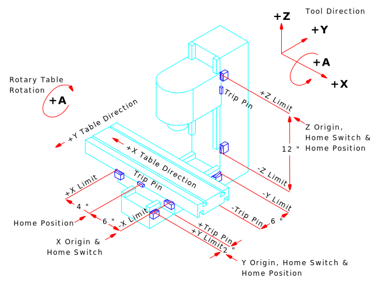

:lang: en
:toc:

[[cha:important-user-concepts]]
= Important User Concepts(((User Concepts)))

// Custom lang highlight
// must come after the doc title, to work around a bug in asciidoc 8.6.6
:ini: {basebackend@docbook:'':ini}
:hal: {basebackend@docbook:'':hal}
:ngc: {basebackend@docbook:'':ngc}

This chapter covers important user concepts that should be understood before attempting to run a CNC machine with G-code.

[[sec:trajectory-control]]
== Trajectory Control(((Trajectory Control)))

[[sub:trajectory-planning]]
=== Trajectory Planning(((Trajectory Planning,TP)))

Trajectory planning, in general, is the means by which LinuxCNC follows the path specified by your G-code program, while still operating within the limits of your machinery.

A G-code program can never be fully obeyed.
For example, imagine you specify as a single-line program the following move:

[source,{ngc}]
----
G1 X1 F10 (G1 is linear move, X1 is the destination, F10 is the speed)
----

In reality, the whole move can't be made at F10, since the machine must accelerate from a stop, move toward X=1, and then decelerate to stop again.
Sometimes part of the move is done at F10, but for many moves, especially short ones, the specified feed rate is never reached at all.
Having short moves in your G-code can cause your machine to slow down and speed up for the longer moves if the 'naive cam detector' is not employed with G64 P__n__.

The basic acceleration and deceleration described above is not complex and there is no compromise to be made.
In the INI file the specified machine constraints, such as maximum axis velocity and axis acceleration, must be obeyed by the trajectory planner.

For more information on the Trajectory Planner INI options see the <<sub:ini:sec:traj,Trajectory Section>> in the INI chapter.

[[sub:path-following]]
=== Path Following(((Trajectory Planning:Path Following)))

A less straightforward problem is that of path following.
When you program a corner in G-code, the trajectory planner can do several things,
all of which are right in some cases:

* It can decelerate to a stop exactly at the coordinates of the corner, and then accelerate in the new direction.
* It can also do what is called blending, which is to keep the feed rate up while going through the corner,
  making it necessary to round the corner off in order to obey machine constraints.

You can see that there is a trade off here: you can slow down to get better path following, or keep the speed up and have worse path following.
Depending on the particular cut, the material, the tooling, etc., the programmer may want to compromise differently.

Rapid moves also obey the current trajectory control.
With moves long enough to reach maximum velocity on a machine with low acceleration and no path tolerance specified, you can get a fairly round corner.

[[sub:programming-the-planner]]
=== Programming the Planner(((Trajectory Planning:Programming the Planner)))

The trajectory control commands are as follows:

`G61`:: (Exact Path Mode) `G61` visits the programmed point exactly,
  even though that means it might temporarily come to a complete stop in order to change direction to the next programmed point.

`G61.1`:: (Exact Stop Mode) `G61.1` tells the planner to come to an exact stop at every segment's end.
  The path will be followed exactly but complete feed stops can be destructive for the part or tool, depending on the specifics of the machining.

`G64`:: (Blend Without Tolerance Mode) `G64` is the default setting when you start LinuxCNC.
  G64 is just blending and the naive cam detector is not enabled.
  G64 and G64 P0 tell the planner to sacrifice path following accuracy in order to keep the feed rate up.
  This is necessary for some types of material or tooling where exact stops are harmful,
  and can work great as long as the programmer is careful to keep in mind
  that the tool's path will be somewhat more curvy than the program specifies.
  When using G0 (rapid) moves with G64 use caution on clearance moves and allow enough distance to clear obstacles based on the acceleration
  capabilities of your machine.

`G64 P- Q-`:: (Blend With Tolerance Mode) This enables the 'naive cam detector' and enables blending with a tolerance.
  If you program G64 P0.05, you tell the planner that you want continuous feed,
  but at programmed corners you want it to slow down enough so that the tool path can stay within 0.05 user units of the programmed path.
  The exact amount of slowdown depends on the geometry of the programmed corner and the machine constraints,
  but the only thing the programmer needs to worry about is the tolerance.
  This gives the programmer complete control over the path following compromise.
  The blend tolerance can be changed throughout the program as necessary.
  Beware that a specification of G64 P0 has the same effect as G64 alone (above),
  which is necessary for backward compatibility for old G-code programs.
  See the <<gcode:g64,G64 section>> of the G-code chapter.

Blending without tolerance:: The controlled point will touch each specified movement at at least one point.
  The machine will never move at such a speed that it cannot come to an exact stop at the end of the current movement
  (or next movement, if you pause when blending has already started).
  The distance from the end point of the move is as large as it needs to be to keep up the best contouring feed.

Naive CAM Detector:: Successive G1 moves that involve only the XYZ axes
  that deviate less than Q- from a straight line are merged into a single straight line.
  This merged movement replaces the individual G1 movements for the purposes of blending with tolerance.
  Between successive movements, the controlled point will pass no more than P- from the actual endpoints of the movements.
  The controlled point will touch at least one point on each movement.
  The machine will never move at such a speed that it cannot come to an exact stop at the end of the current movement
  (or next movement, if you pause when blending has already started).
  On G2/3 moves in the G17 (XY) plane,
  when the maximum deviation of an arc from a straight line is less than the G64 Q- tolerance,
  the arc is broken into two lines (from start of arc to midpoint, and from midpoint to end).
  Those lines are then subject to the naive cam algorithm for lines.
  Thus, line-arc, arc-arc, and arc-line cases as well as line-line benefit from the 'naive cam detector'.
  This improves contouring performance by simplifying the path.

In the following figure the blue line represents the actual machine velocity.
The red lines are the acceleration capability of the machine.
The horizontal lines below each plot is the planned move.
The upper plot shows how the trajectory planner will slow the machine down when short moves are encountered,
to stay within the limits of the machines acceleration setting to be able to come to an exact stop at the end of the next move.
The bottom plot shows the effect of the Naive Cam Detector to combine the moves and do a better job of keeping the velocity as planned.

.Naive CAM Detector
image::images/naive-cam.png["Naive CAM Detector",align="center"]

[[sub:planning-moves]]
=== Planning Moves(((Trajectory Planning:Planning Moves)))

Make sure moves are 'long enough' to suit your machine/material.
Principally because of the rule that the machine will never move at such a speed that it cannot come to a complete stop at the end of the current movement,
there is a minimum movement length that will allow the machine to keep up a requested feed rate with a given acceleration setting.

The acceleration and deceleration phase each use half the INI file MAX_ACCELERATION.
In a blend that is an exact reversal, this causes the total axis acceleration to equal the INI file MAX_ACCELERATION.
In other cases, the actual machine acceleration is somewhat less than the INI file acceleration.

//NOTE This is a duplicate paragraph to the one below without latexmath.

To keep up the feed rate, the move must be longer than the distance it takes to accelerate from 0 to the desired feed rate and then stop again.
Using A as *1/2* the INI file MAX_ACCELERATION and F as the feed rate *in units per second*, the acceleration time is *t~a~ = F/A* and the acceleration distance is *d~a~ = F*t~a~/2*.
The deceleration time and distance are the same, making the critical distance *d = d~a~ + d~d~ = 2 * d~a~ = F^2^/A*.

For example, for a feed rate of 1 inch per second and an acceleration of *10 inches/sec^2^*, the critical distance is *1^2^/10 = 1/10 = 0.1 inches*.

For a feed rate of 0.5 inch per second, the critical distance is *5^2^/100 = 25/100 = 0.025* inches.

////
This section has been commented out until latexmath is working again.

To keep up the feed rate, the move must be longer than the distance it takes to accelerate from 0 to the desired feed rate and then stop again.
Using A as latexmath:[$\frac{1}{2}$] the INI file MAX_ACCELERATION and F as the feed rate *in units per second*,
the acceleration time is latexmath:[$ ta = \frac{F}{A} $]
and the acceleration distance is latexmath:[$ da = \frac{1}{2} \times F \times ta $].
The deceleration time and distance are the same,
making the critical distance latexmath:[$ d = da + dd = 2 \times da = \frac{F^{2}}{A} $].

For example, for a feed rate of 1 inch per second and an acceleration of latexmath:[$ 10 \frac{inch}{sec^{2}} $],
the critical distance is latexmath:[$\frac{1^{2}}{10} = \frac{1}{10} = 0.1$] inch.
For a feed rate of 0.5 inch per second, the critical distance is latexmath:[$ \frac{0.5^{2}}{10} = \frac{0.25}{10} = 0.025$] inch.
////

[[sec:g-code]]
== G-code(((G-code)))

=== Defaults

When LinuxCNC first starts up many G- and M-codes are loaded by default.
The current active G- and M-codes can be viewed on the MDI tab in the 'Active G-Codes:' window in the AXIS interface.
These G- and M-codes define the behavior of LinuxCNC and
it is important that you understand what each one does before running LinuxCNC.
The defaults can be changed when running a G-Code file and left in a different state than when you started your LinuxCNC session.
The best practice is to set the defaults needed for the job in the preamble of your G-Code file
and not assume that the defaults have not changed.
Printing out the G-Code <<gcode:quick-reference-table,Quick Reference>> page can help you remember what each one is.

=== Feed Rate

How the feed rate is applied depends on if an axis involved with the move is a rotary axis.
Read and understand the <<sub:feed-rate,Feed Rate>> section if you have a rotary axis or a lathe.

=== Tool Radius Offset

Tool Radius Offset (G41/42) requires that the tool be able to touch somewhere along each programmed move
without gouging the two adjacent moves.
If that is not possible with the current tool diameter you will get an error.
A smaller diameter tool may run without an error on the same path.
This means you can program a cutter to pass down a path that is narrower than the cutter without any errors.
See the <<sec:cutter-radius-compensation,Cutter Compensation>> section for more information.

== Homing

After starting LinuxCNC each axis must be homed prior to running a program or running a MDI command.

If your machine does not have home switches a match mark on each axis can aid in homing the machine coordinates to the same place each time.

Once homed your soft limits that are set in the INI file will be used.

If you want to deviate from the default behavior, or want to use the Mini interface,
you will need to set the option NO_FORCE_HOMING = 1 in the [TRAJ] section of your INI file.
More information on homing can be found in the Integrator Manual.

== Tool Changes

There are several options when doing manual tool changes.
See the <<sub:ini:sec:emcio,[EMCIO] section>> for information on configuration of these options.
Also see the <<gcode:g28-g28.1,G28>> and <<gcode:g30-g30.1,G30>> section of the G-code chapter.

== Coordinate Systems

The Coordinate Systems can be confusing at first.
Before running a CNC machine you must understand the basics of the coordinate systems used by LinuxCNC.
In depth information on the LinuxCNC Coordinate Systems is in the <<cha:coordinate-system,Coordinate System>> section of this manual.

=== G53 Machine Coordinate

When you home LinuxCNC you set the G53 Machine Coordinate System to 0 for each axis homed.

No other coordinate systems or tool offsets are changed by homing.

The only time you move in the G53 machine coordinate system is when you program a G53 on the same line as a move.
Normally you are in the G54 coordinate system.

=== G54-59.3 User Coordinates

Normally you use the G54 Coordinate System.
When an offset is applied to a current user coordinate system a small blue ball with lines
will be at the <<sec:machine-coordinate-system, machine origin>> when your DRO is displaying 'Position: Relative Actual' in AXIS.
If your offsets are temporary use the Zero Coordinate System from the Machine menu or program 'G10 L2 P1 X0 Y0 Z0' at the end of your G-code file.
Change the 'P' number to suit the coordinate system you wish to clear the offset in.

* Offsets stored in a user coordinate system are retained when LinuxCNC is shut down.
* Using the 'Touch Off' button in AXIS sets an offset for the chosen User Coordinate System.

=== When You Are Lost

If you're having trouble getting 0,0,0 on the DRO when you think you should,
you may have some offsets programmed in and need to remove them.

* Move to the Machine origin with G53 G0 X0 Y0 Z0
* Clear any G92 offset with G92.1
* Use the G54 coordinate system with G54
* Set the G54 coordinate system to be the same as the machine coordinate system with 'G10 L2 P1 X0 Y0 Z0 R0'.
* Turn off tool offsets with G49
* Turn on the Relative Coordinate Display from the menu

Now you should be at the machine origin X0 Y0 Z0
and the relative coordinate system should be the same as the machine coordinate system.

[[sec:machine-configurations]]
== Machine Configurations

The following diagram shows a typical mill showing direction of travel of the tool and the mill table and limit switches.
Notice how the mill table moves in the opposite direction of the Cartesian coordinate system arrows shown by the 'Tool Direction' image.
This makes the 'tool' move in the correct direction in relation to the material.

Note also the position of the limit switches and the direction of activation of their cams.
Several combinations are possible, for example it is possible (contrary to the drawing)
to place a single fixed limit switch in the middle of the table and two mobile cams to activate it.
In this case the limits will be reversed, +X will be on the right of the table and -X on the left.
This inversion does not change anything from the point of view of the direction of movement of the tool.

.Typical Mill Configuration

The following diagram shows a typical lathe showing direction of travel of the tool and limit switches.

.Typical Lathe Configuration
image::images/lathe-diagram_en.svg["Typical Lathe Configuration",align="center"]

// vim: set syntax=asciidoc:
