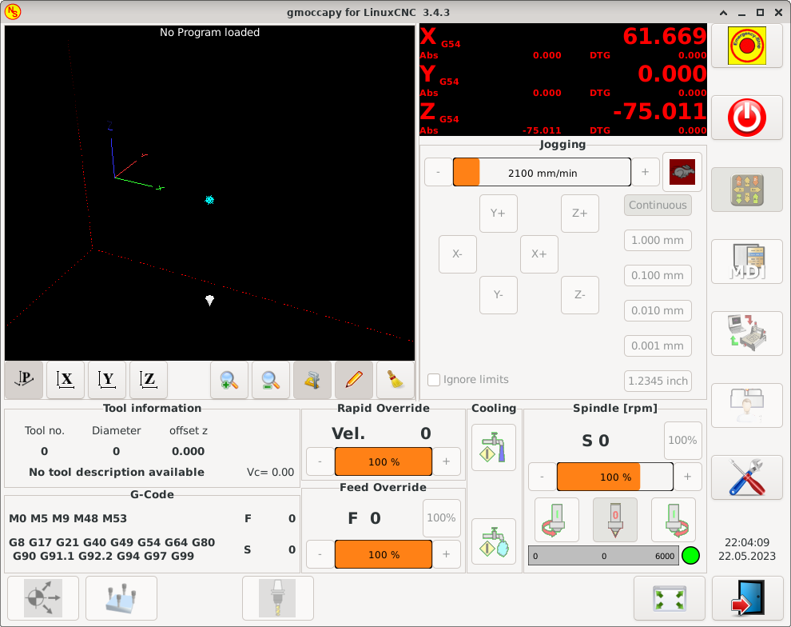

:lang: en
:toc:

[[cha:linuxcnc-user-introduction]]
= LinuxCNC User Introduction(((LinuxCNC User Introduction,User Introduction)))

== Introduction

This document is focused on the use of LinuxCNC, it is intended for readers who have already installed and configured it.
Some information on installation is given in the following chapters.
The complete documentation on installation and configuration can be found in the integrator's manual.

[[sec:how-linuxcnc-works]]
== How LinuxCNC Works

LinuxCNC is a suite of highly-customisable applications for the control of a Computer Numerically Controlled (CNC) mills and lathes,
3D printers, robots, laser cutters, plasma cutters and other automated devices.
It is capable of providing coordinated control of up to 9 axes of movement.

At its heart, LinuxCNC consists of several key components that are integrated together to form one complete system:

* a Graphical User Interface (GUI), which forms the basic interface between the operator, the software and the CNC machine itself;
* the <<cha:hal-introduction,Hardware Abstraction Layer>> (HAL),
  which provides a method of linking all the various internal virtual signals generated and received by LinuxCNC with the outside world, and
* the high level controllers that coordinate the generation and execution of motion control of the CNC machine,
  namely the motion controller (EMCMOT), the discrete input/output controller (EMCIO) and the task executor (EMCTASK).

The below illustration is a simple block diagram showing what a typical 3-axis CNC mill with stepper motors might look like:

.Simple LinuxCNC Controlled Machine
image::images/whatstep1.png["Simple LinuxCNC Controlled Machine",align="center"]

A computer running LinuxCNC sends a sequence of pulses via the parallel port to the stepper drives,
each of which has one stepper motor connected to it. Each drive receives two independent signals;
one signal to command the drive to move its associated stepper motor in a clockwise or anti-clockwise direction,
and a second signal that defines the speed at which that stepper motor rotates.

While a stepper motor system under parallel port control is illustrated,
a LinuxCNC system can also take advantage of a wide variety of dedicated hardware motion control interfaces for increased speed and I/O capabilities.
A full list of interfaces supported by LinuxCNC can be found on the https://wiki.linuxcnc.org/cgi-bin/wiki.pl?LinuxCNC_Supported_Hardware[Supported Hardware] page of the Wiki.

In most circumstances,
users will create a configuration specific to their mill setup using either the <<cha:stepconf-wizard,Stepper Configuration Wizard>>
(for CNC systems operating using the computers' parallel port)
or the <<cha:pncconf-wizard,Mesa Hardware Wizard>> (for more advanced systems utilising a Mesa Anything I/O PCI card).
Running either wizard will create several folders on the computers' hard drive
containing a number of configuration files specific to that CNC machine,
and an icon placed on the desktop to allow easy launching of LinuxCNC.

For example, if the Stepper Configuration Wizard was used to create a setup for the 3-axis CNC mill illustrated above entitled 'My_CNC',
the folders created by the wizard would typically contain the following files:

* *Folder: `My_CNC`*
** *`My_CNC.ini`* +
   The INI file contains all the basic hardware information regarding the operation of the CNC mill,
   such as the number of steps each stepper motor must turn to complete one full revolution,
   the maximum rate at which each stepper may operate at,
   the limits of travel of each axis or the configuration and behaviour of limit switches on each axis.
** *`My_CNC.hal`* +
   This HAL file contains information that tells LinuxCNC
   how to link the internal virtual signals to physical connections beyond the computer.
   For example, specifying pin 4 on the parallel port to send out the Z axis step direction signal,
   or directing LinuxCNC to cease driving the X axis motor when a limit switch is triggered on parallel port pin 13.
** *`custom.hal`* +
   Customisations to the mill configuration beyond the scope of the wizard may be performed
   by including further links to other virtual points within LinuxCNC in this HAL file.
   When starting a LinuxCNC session, this file is read and processed before the GUI is loaded.
   An example may include initiating Modbus communications to the spindle motor
   so that it is confirmed as operational before the GUI is displayed.
** *`custom_postgui.hal`* +
   The custom_postgui HAL file allows further customisation of LinuxCNC,
   but differs from custom.HAL in that it is processed after the GUI is displayed.
   For example, after establishing Modbus communications to the spindle motor in custom.hal,
   LinuxCNC can use the custom_postgui file to link the spindle speed readout from the motor drive to a bargraph displayed on the GUI.
** *`postgui_backup.hal`* +
   This is provided as a backup copy of the custom_postgui.hal file to allow the user
   to quickly restore a previously-working postgui HAL configuration.
   This is especially useful if the user wants to run the Configuration Wizard again under the same 'My_CNC' name
   in order to modify some parameters of the mill.
   Saving the mill configuration in the Wizard will overwrite the existing custom_postgui file
   while leaving the postgui_backup file untouched.
** *`tool.tbl`* +
   A tool table file contains a parameterised list of any cutting tools used by the mill.
   These parameters can include cutter diameter and length,
   and is used to provide a catalogue of data that tells LinuxCNC
   how to compensate its motion for different sized tools within a milling operation.
* *Folder: `nc_files`* +
  The nc_files folder is provided as a default location to store the G-code programs used to drive the mill.
  It also includes a number of subfolders with G-code examples.

[[sec:graphical-user-interfaces]]
== Graphical User Interfaces(((Graphical User Interfaces)))

A graphical user interface is the part of the LinuxCNC that the machine tool operator interacts with.
LinuxCNC comes with several types of user interfaces
which may be chosen from by editing certain fields contained in the <<cha:ini-configuration,INI file>>:

AXIS:: <<cha:axis-gui,AXIS>>, the standard keyboard GUI interface.
  This is also the default GUI launched when a Configuration Wizard is used to create a desktop icon launcher:

[[fig:axis-graphical-interface]]
.AXIS, the standard keyboard GUI interface
image::../gui/images/axis.png["AXIS, the standard keyboard GUI interface",align="center"]

Touchy:: <<cha:touchy-gui,Touchy>>, a touch screens GUI:

[[fig:touchy-graphical-interface]]
.Touchy, a touch screen GUI
image::../gui/images/touchy.png["Touchy, a touch screen GUI",align="center"]

Gscreen:: <<cha:gscreen,Gscreen>>, a user-configurable touch screen GUI:

[[fig:gscreen-graphical-interface]]
.Gscreen, a configurable base touch screen GUI
image::../gui/images/gscreen-mill.png["Gscreen, a configurable base touch screen GUI",align="center"]

GMOCCAPY:: <<cha:gmoccapy,GMOCCAPY>>, a touch screen GUI based on Gscreen. GMOCCAPY is also designed to work equally
  well in applications where a keyboard and mouse are the preferred methods of controlling the GUI:

[[fig:gmoccapy-graphical-interface]]
.GMOCCAPY, a touch screen GUI based on Gscreen

NGCGUI:: <<cha:ngcgui,NGCGUI>>, a subroutine GUI that provides wizard-style programming of G code.
  NGCGUI may be run as a standalone program or embedded into another GUI as a series of tabs.
  The following screenshot shows NGCGUI embedded into AXIS:

[[fig:ngcgui-graphical-interface-into-axis]]
.NGCGUI, a graphical interface integrated into AXIS
image::../gui/images/ngcgui.png["NGCGUI, a graphical interface integrated into AXIS",align="center"]

TkLinuxCNC:: <<sec:tklinuxcnc-intro,TkLinuxCNC>>, another interface based on Tcl/Tk.
  Once the most popular interface after AXIS.

[[fig:tklinuxcnc-gui]]
.TkLinuxCNC graphical interface
image::images/tkemc.png["TkLinuxCNC graphical interface",align="center"]

QtDragon:: <<cha:qtdragon-gui,QtDragon>>, a touch screen GUI based on QtVCP using the PyQt5 library.
It comes in two versions 'QtDragon' and 'QtDragon_hd'.
They are very similar in features but QtDragon_hd is made for larger monitors.

[[fig:QtDragon-graphical-interface]]
.QtDragon, a touch screen GUI based on QtVCP

QtPlasmaC:: <<cha:qtplasmac,QtPlasmaC>>, a touch screen plasma cutting GUI based on QtVCP using the PyQt5 library.
It comes in three aspect ratios, 16:9, 4:3, and 9:16.

[[fig:QtPlasmaC-graphical-interface]]
.QtPlasmaC, a touch screen plasma cutting GUI based on QtVCP
image::../plasma/images/qtplasmac_16x9.png["QtPlasmaC, a touch screen plasma cutting GUI based on QtVCP",align="center"]

== User Interfaces
These User interfaces are a way to interact with LinuxCNC outside of the graphical user interfaces.

halui:: A HAL based user interface allowing to control LinuxCNC using buttons and switches

linuxcncrsh:: A telnet based user interface allowing to send commands from remote computers.

== Virtual Control Panels

As mentioned above, many of LinuxCNC's GUIs may be customized by the user.
This may be done to add indicators, readouts,
switches or sliders to the basic appearance of one of the GUIs for increased flexibility or functionality.
Two styles of Virtual Control Panel are offered in LinuxCNC:

PyVCP:: <<cha:pyvcp,'PyVCP'>>, a Python-based virtual control panel that can be added to the AXIS GUI.
  PyVCP only utilises virtual signals contained within the Hardware Abstraction Layer,
  such as the spindle-at-speed indicator or the Emergency Stop output signal, and has a simple no-frills appearance.
  This makes it an excellent choice if the user wants to add a Virtual Control Panel with minimal fuss.

.PyVCP Example Embedded Into AXIS GUI
image::../gui/images/axis-pyvcp.png["PyVCP embedded into AXIS",align="center"]

GladeVCP:: <<cha:glade-vcp,'GladeVCP'>>, a Glade-based virtual control panel that can be added to the AXIS or Touchy GUIs.
  GladeVCP has the advantage over PyVCP in that it is not limited to the display or control of HAL virtual signals,
  but can include other external interfaces outside LinuxCNC such as window or network events.
  GladeVCP is also more flexible in how it may be configured to appear on the GUI:

.GladeVCP Example Embedded Into AXIS GUI
image::../gui/images/axis-gladevcp.png["GladeVCP embedded into AXIS",align="center"]

QtVCP:: <<cha:qtvcp,'QtVCP'>>, a PyQt5-based virtual control panel that can be added to most GUIs or run as a standalone panel.
  QtVCP has the advantage over PyVCP in that it is not limited to the display or control of HAL virtual signals,
  but can include other external interfaces outside LinuxCNC such as window or network events by extending with python code.
  QtVCP is also more flexible in how it may be configured to appear on the GUI with many special widgets:

.QtVCP Example Embedded Into QtDragon GUI
image::../gui/images/qtvcp_spindle_belts.png["QtVCP panel embedded into QtDragon",align="center"]

== Languages

LinuxCNC uses translation files to translate LinuxCNC User Interfaces into many languages including
French, German, Italian, Finnish, Russian, Romanian, Portuguese and Chinese.
Assuming a translation has been created,
LinuxCNC will automatically use whatever native language you log in with when starting the Linux operating system.
If your language has not been translated, contact a developer on IRC, the mailing list or the User Forum for assistance.

[[sec:thinking-operator]]
== Think Like a CNC Operator

This manual does not pretend to teach you how to use a lathe or a milling machine.
Becoming an experienced operator takes a lot of time and requires a lot of work.
An author once said, _We learn by experience, if one possesses it all_.
Broken tools, vices attacked and the scars are evidence of the lessons learned.
A beautiful finish, tight tolerances and caution during the work are evidence of lessons learned.
No machine nor program can replace human experience.

Now that you start working with the LinuxCNC software, you have to put yourself in the shoes of an operator.
You must be in the role of someone in charge of a machine.
It's a machine that will wait for your commands and then execute the orders that you will give it.
In these pages, we will give the explanations which will help you to become a good CNC operator with LinuxCNC.

[[sec:modes-of-operations]]
== Modes of Operation

When LinuxCNC is running, there are three different major modes used for inputting commands.
These are Manual, Auto, and Manual Data Input (MDI).
Changing from one mode to another makes a big difference in the way that the LinuxCNC control behaves.
There are specific things that can be done in one mode that cannot be done in another.
An operator can home an axis in manual mode but not in auto or MDI modes.
An operator can cause the machine to execute a whole file full of G-codes in the auto mode but not in manual or MDI.

In manual mode, each command is entered separately.
In human terms a manual command might be "turn on coolant" or "jog X at 25 inches per minute".
These are roughly equivalent to flipping a switch or turning the hand wheel for an axis.
These commands are normally handled on one of the graphical interfaces
by pressing a button with the mouse or holding down a key on the keyboard.
In auto mode, a similar button or key press might be used to load or start the running of a whole program of G-code that is stored in a file.
In the MDI mode the operator might type in a block of code and tell the machine to execute it
by pressing the <return> or <enter> key on the keyboard.

Some motion control commands are available concurrently and will cause the same changes in motion in all modes.
These include Abort, Emergency Stop, and Feed Rate Override.
Commands like these should be self explanatory.

The AXIS user interface hides some of the distinctions between Auto and the other modes
by making auto-commands available at most times.
It also blurs the distinction between Manual and MDI,
because some Manual commands like Touch Off are actually implemented by sending MDI commands.
It does this by automatically changing to the mode that is needed for the action the user has requested.

// vim: set syntax=asciidoc:
