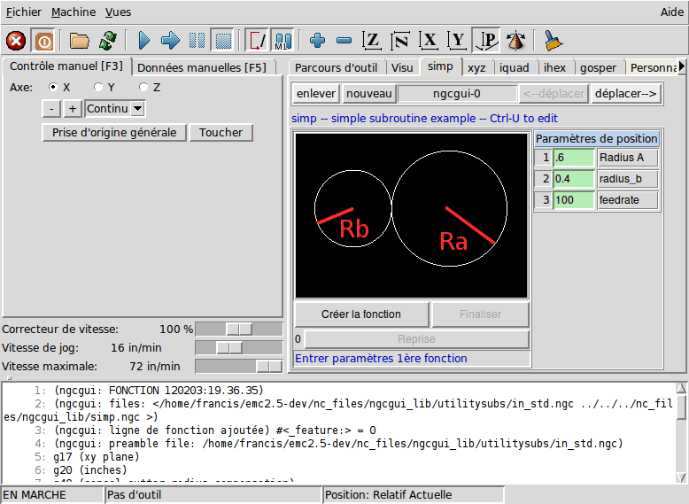

:lang: fr
:toc:

[[cha:linuxcnc-user-introduction]]
= LinuxCNC(((Introduction)))

== Introduction

This document is focused on the use of LinuxCNC, it is intended for readers who
have already installed and configured it. Some information on installation is
given in the following chapters.
The complete documentation on installation andconfiguration can be found in the integrator's manual.

[[sec:how-linuxcnc-works]]
== Comment fonctionne LinuxCNC

LinuxCNC est un peu plus que juste un autre programme de fraiseuse CNC(((CNC))). Il est capable de contrôler des machines-outils, des
robots ou d'autres automatismes. Il est capable de contrôler des
servomoteurs, des moteurs pas à pas, des relais ainsi que d'autres mécanismes relatifs aux machines-outils.

Il y a quatre principales composantes du logiciel
LinuxCNC:

* a Graphical User Interface (GUI), which forms the basic interface between the operator, the software
  and the CNC machine itself;
* the <<cha:hal-introduction,Hardware Abstraction Layer>> (HAL), which provides a method of linking all
  the various internal virtual signals generated and received by LinuxCNC with the outside world; and,
* the high level controllers that coordinate the generation and execution of motion control of the CNC
  machine, namely the motion controller (EMCMOT), the discrete input/output controller (EMCIO) and the
  task executor (EMCTASK).

La figure ci-dessus montre un diagramme bloc représentant une machine 3 axes typique comme LinuxCNC les aime. Cette
figure montre un système basé sur des moteurs pas à pas.

.Machine simple contrôlée par LinuxCNC
image::images/whatstep1.png["Machine simple contrôlée par LinuxCNC",align="center"]

A computer running LinuxCNC sends a sequence of pulses via the parallel port to the stepper drives, each of
which has one stepper motor connected to it. Each drive receives two independent signals; one signal to
command the drive to move its associated stepper motor in a clockwise or anti-clockwise direction, and a
second signal that defines the speed at which that stepper motor rotates.

While a stepper motor system under parallel port control is illustrated, a LinuxCNC system can also take
advantage of a wide variety of dedicated hardware motion control interfaces for increased speed and I/O
capabilities. A full list of interfaces supported by LinuxCNC can be found on
the http://http://wiki.linuxcnc.org/cgi-bin/wiki.pl?LinuxCNC_Supported_Hardware[Supported Hardware] page of the
Wiki.

In most circumstances, users will create a configuration specific to their mill setup using either the
<<cha:stepconf-wizard,Stepper Configuration Wizard>> (for CNC systems operating using the computers'
parallel port) or the <<cha:pncconf-wizard,Mesa Hardware Wizard>> (for more advanced systems utilising a
Mesa Anything I/O PCI card). Running either wizard will create several folders on the computers' hard drive
containing a number of configuration files specific to that CNC machine, and an icon placed on the desktop
to allow easy launching of LinuxCNC.

For example, if the Stepper Configuration Wizard was used to create a setup for the 3-axis CNC mill
illustrated above entitled 'My_CNC', the folders created by the wizard would typically contain the
following files:

* *Folder: `My_CNC`*
** *`My_CNC.ini`* +
   The INI file contains all the basic hardware information regarding the operation of the CNC mill such
   as the number of steps each stepper motor must turn to complete one full revolution, the maximum rate at
   which each stepper may operate at, the limits of travel of each axis or the configuration and behaviour of
   limit switches on each axis.
** *`My_CNC.hal`* +
   This HAL file contains information that tells LinuxCNC how to link the internal virtual signals to
   physical connections beyond the computer. For example, specifying pin 4 on the parallel port to send out
   the Z axis step direction signal, or directing LinuxCNC to cease driving the X axis motor when a limit
   switch is triggered on parallel port pin 13.
** *`custom.HAL`* +
   Customisations to the mill configuration beyond the scope of the wizard may be performed by including
   further links to other virtual points within LinuxCNC in this HAL file. When starting a LinuxCNC session,
   this file is read and processed before the GUI is loaded. An example may include initiating Modbus
   communications to the spindle motor so that it is confirmed as operational before the GUI is displayed.
** *`custom_postgui.hal`* +
   The custom_postgui HAL file allows further customisation of LinuxCNC, but differs from custom.HAL in
   that it is processed after the GUI is displayed. For example, after establishing Modbus communications to
   the spindle motor in custom.hal, LinuxCNC can use the custom_postgui file to link the spindle speed readout
   from the motor drive to a bargraph displayed on the GUI.
** *`postgui_backup.hal`* +
   This is provided as a backup copy of the custom_postgui.hal file to allow the user to quickly restore a
   previously-working postgui HAL configuration. This is especially useful if the user wants to run the
   Configuration Wizard again under the same 'My_CNC' name in order to modify some parameters of the mill.
   Saving the mill configuration in the Wizard will overwrite the existing custom_postgui file while leaving
   the postgui_backup file untouched.
** *`tool.tbl`* +
   A tool table file contains a parameterised list of any cutting tools used by the mill. These parameters
   can include cutter diameter and length, and is used to provide a catalogue of data that tells LinuxCNC how
   to compensate its motion for different sized tools within a milling operation.
* *Folder: `nc_files`* +
  The nc_files folder is provided as a default location to store the G-code programs used to drive the
  mill. It also includes a number of subfolders with G-code examples.

[[sec:interfaces-utilisateur-graphiques]]
== Interfaces utilisateur graphiques(((Interfaces utilisateur graphiques)))

L'interface graphique est la partie de LinuxCNC qui interagit avec
l'opérateur de la machine. LinuxCNC est fourni avec plusieurs
interfaces utilisateurs graphiques:

Axis:: <<cha:Axis,_Axis_>>, l'interface utilisateur standard. This is also the default GUI launched when a
  Configuration Wizard is used to create a desktop icon launcher:

[[fig:Interface-graphique-AXIS]]
.L'interface graphique AXIS
image::images/axis_25_fr.png["Axis, l'interface graphique utilisateur standard au clavier",align="center"]

Touchy:: <<cha:touchy-gui,_Touchy_>>, une interface graphique pour écrans tactiles:

[[fig:touchy-gui]]
.L'interface graphique Touchy
image::images/touchy_fr.png["Touchy, une interface graphique pour écrans tactiles",align="center"]

Gscreen:: <<cha:gscreen,Gscreen>>, a user-configurable touch screen GUI:

[[fig:gscreen-graphical-interface]]
.Gscreen graphical interface
image::../gui/images/gscreen-mill.png["Gscreen, a configurable base touch screen GUI",align="center"]

GMOCCAPY:: <<cha:gmoccapy,GMOCCAPY>>, a touch screen GUI based on Gscreen. GMOCCAPY is also designed to work equally
  well in applications where a keyboard and mouse are the preferred methods of controlling the GUI:

[[fig:gmoccapy-graphical-interface]]
.GMOCCAPY graphical interface
image::../gui/images/gmoccapy_3_axis.png["gmoccapy, a touch screen GUI based on Gscreen",align="center"]

NGCGUI:: <<cha:ngcgui,_NGCGUI_>>, une interface graphique gérant les sous-programmes.
  Elle permet très simplement de créer des programme G-code. Elle supporte
  surtout la concaténation de fichiers de sous-programmes, ce qui permet de construire des programmes G-code complets sans aucune programmation.

[[fig:interface-graphique-ngcgui-dans-axis]]
.L'interface graphique NGCGUI intégrée dans Axis

TkLinuxCNC:: <<cha:TkLinuxCNC,_TkLinuxCNC_>>, une autre interface basée sur Tcl/Tk.
  C'est l'interface la plus populaire après Axis

[[fig:interface-graphique-tklinuxcnc]]
.L'interface graphique TkLinuxCNC
image::images/tklinuxcnc_fr.png["L'interface graphique TkLinuxCNC",align="center"]

Xemc:: un programme X-Windows

halui:: une interface utilisateur basée sur HAL, qui permet de contrôler
  LinuxCNC en utilisant des boutons et des interrupteurs

linuxcncrsh:: une interface utilisateur basée sur telnet, qui permet
  d'envoyer des commandes à partir d'ordinateurs distants de celui de LinuxCNC

== Panneaux de contrôle virtuels

As mentioned above, many of LinuxCNC's GUIs may be customised by the user. This may be done to add
indicators, readouts, switches or sliders to the basic appearance of one of the GUIs for increased
flexibility or functionality. Two styles of Virtual Control Panel are offered in LinuxCNC:

PyVCP:: <<cha:pyvcp,'PyVCP'>>, un panneau de contrôle virtuel basé sur Python, il peut être intégré dans l'interface graphique Axis ou utilisé en autonome. PyVCP only
  utilises virtual signals contained within the Hardware Abstraction Layer, such as the spindle-at-speed
  indicator or the Emergency Stop output signal, and has a simple no-frills appearance. This makes it an
  excellent choice if the user wants to add a Virtual Control Panel with minimal fuss.

.PyVCP Example Embedded Into AXIS GUI
image::../gui/images/axis-pyvcp.png["PyVCP with Axis",align="center"]

GladeVCP:: <<cha:glade-vcp,'GladeVCP'>>, un panneau de contrôle virtuel basé sur Glade, il peut être
  intégré dans l'interface graphique Axis ou utilisé en autonome. GladeVCP has the advantage over PyVCP in that it is not limited to the display or control of HAL
  virtual signals, but can include other external interfaces outside LinuxCNC such as window or network
  events. GladeVCP is also more flexible in how it may be configured to appear on the GUI:

.GladeVCP Example Embedded Into AXIS GUI
image::../gui/images/axis-gladevcp.png["GladeVCP with Axis",align="center"]

== Langues

LinuxCNC utilise des fichiers traduits pour les interfaces utilisateur.
Il fonctionne dans plusieurs langues et démarre dans la langue de la
session ouverte par l'utilisateur au démarrage du PC. Si votre langue n'a pas
encore été traduite contactez un développeur sur l'IRC ou sur la mailing liste
si vous pouvez aider à la traduction.

[[sec:penser-operateur]]
== Penser comme un opérateur sur CNC

Ce manuel ne prétend pas vous apprendre à utiliser un tour ou une
fraiseuse. Devenir un opérateur expérimenté prends beaucoup de temps et
demande beaucoup de travail. Un auteur a dit un jour, _Nous apprenons
par l'expérience, si on la possède toute_. Les outils cassés, les étaux
attaqués et les cicatrices sont les preuves des leçons apprises. Une
belle finition, des tolérances serrées et la prudence pendant le
travail sont les preuves des leçons retenues. Aucune machine, aucun programme ne peut remplacer l'expérience humaine.

Maintenant que vous commencez à travailler avec le programme LinuxCNC, vous devez vous placer dans la peau d'un opérateur. Vous devez être 
dans le rôle de quelqu'un qui a la charge d'une machine. C'est une
machine qui attendra vos commandes puis qui exécutera les ordres que
vous lui donnerez. Dans ces pages, nous donnerons les explications qui
vous aideront à devenir un bon opérateur de CNC avec LinuxCNC. Vous aurez besoin
de bonnes informations ici, devant vous, c'est là que les pages suivantes prendront tout leur sens.

[[sec:modes-operatoires]]
== Modes opératoires

Quand LinuxCNC fonctionne, il existe trois différents modes majeurs pour entrer des commandes. Les modes _Manuel_(((Manuel))), _Auto_(((Auto))) et
_MDI_(((MDI))). Passer d'un mode à un autre marque une grande différence dans le comportement de LinuxCNC. Des choses spécifiques à un mode ne
peuvent pas être faites dans un autre. L'opérateur peut faire une prise
d'origine sur un axe en mode manuel mais pas en mode auto ou MDI.
L'opérateur peut lancer l'exécution complète d'un programme de G-codes en mode auto mais pas en mode manuel ni en MDI.

En mode manuel, chaque commande est entrée séparément. En termes humains, une commande manuelle pourrait être _active l'arrosage_ ou _jog
l'axe X à 250 millimètres par minute_. C'est en gros, équivalent à basculer un interrupteur ou à tourner la manivelle d'un axe. Ces
commandes sont normalement contrôlées en pressant un bouton de l'interface graphique avec la souris ou en maintenant appuyée une
touche du clavier. En mode auto, un bouton similaire ou l'appui d'une touche peut être utilisé pour charger ou lancer l'exécution
complète d'un programme de G-codes stocké dans un fichier. En mode
d'entrée de données manuelles (MDI) l'opérateur peut saisir un bloc de
codes est dire à la machine de l'exécuter en pressant la touche _Return_ ou _Entrée_ du clavier.

Certaines commandes de mouvement sont disponibles et produisent les mêmes effets dans tous les modes. Il s'agit des commandes
_Abandon_(((ABANDON))), _Arrêt d'Urgence_(((ESTOP))) et _Correcteur de vitesse
travail_ (((correcteur de vitesse))). Ces commandes se dispensent d'explications.

L'interface utilisateur graphique AXIS supprime certaines distinctions entre Auto et les autres modes en rendant automatique la disponibilité
des commandes, la plupart du temps. Il rend également floue la distinction entre Manuel et MDI parce que certaines commandes manuelles
comme _Toucher_, sont également implémentées en envoyant une commande
MDI. Il fait cela en changeant automatiquement le mode qui est nécessaire pour l'action que l'utilisateur a demandé.
